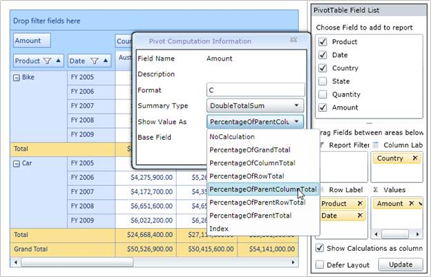

::: {style="DISPLAY: none"}
{#d2h_url_template}{#d2h_package_url style="WIDTH: 0px; DISPLAY: none; HEIGHT: 0px"}
:::

::::: {#nsbanner .d2h_main_nsbanner style="BORDER-BOTTOM: #999999 1px solid; POSITION: relative; PADDING-BOTTOM: 0px; BACKGROUND-COLOR: transparent; PADDING-LEFT: 0px; PADDING-RIGHT: 0px; DISPLAY: none; BORDER-TOP: #999999 1px solid; PADDING-TOP: 0px; LEFT: 0px"}
:::: {#TitleRow .d2h_main_titlerow style="PADDING-BOTTOM: 4px; BACKGROUND-COLOR: transparent; PADDING-LEFT: 22px; WIDTH: 100%; PADDING-RIGHT: 10px; DISPLAY: none; PADDING-TOP: 4px"}
::: {#ienav .d2h_main_ienav style="DISPLAY: none"}
{#D2HPrevious .D2HPreviousEnabled}  {#D2HNext .D2HNextEnabled}
:::
::::
:::::

::: {#nstext .d2h_main_nstext style="PADDING-BOTTOM: 10px; BACKGROUND-COLOR: transparent; PADDING-LEFT: 22px; PADDING-RIGHT: 10px; HEIGHT: 100%; OVERFLOW: auto; PADDING-TOP: 5px" hasuserbackground="true" valign="bottom"}
### Implementing Custom Calculations {#implementing-custom-calculations style="tab-stops: 0pt"}

To show the value cell as a percentage of its summary cells, use the following code snippet:

+-----------------------------------------------------------------------------------------------------------------------------------------------------------------------------------------------------------------------------------------------------------------------------------------------------------------------------------------------------------------------------------------------------------------------------------------------------------------------------------------------------------------------------------------------------------------------------------------------------------------------------------------------------------------------------------------------------------------------------------------------------------------------------------------------------------------------------------------------------------------------------------------------------------------------------------------------------------------------------------------------------------------------------------------------------------------------------------------------------------------------------------------------------------------------------------------------------------------------------------------------------------------------------------------+
| **[\[XAML\] ]{style="FONT-FAMILY: 'Courier New'"}**[\<]{style="FONT-FAMILY: 'Courier New'; COLOR: blue"}[syncPivotGrid]{style="FONT-FAMILY: 'Courier New'; COLOR: #a31515"}[:]{style="FONT-FAMILY: 'Courier New'; COLOR: blue"}[PivotGridControl.PivotCalculations]{style="FONT-FAMILY: 'Courier New'; COLOR: #a31515"}[\>\<]{style="FONT-FAMILY: 'Courier New'; COLOR: blue"}[syncPivotBase]{style="FONT-FAMILY: 'Courier New'; COLOR: #a31515"}[:]{style="FONT-FAMILY: 'Courier New'; COLOR: blue"}[PivotComputationInfo]{style="FONT-FAMILY: 'Courier New'; COLOR: #a31515"}[ FieldName]{style="FONT-FAMILY: 'Courier New'; COLOR: red"}[=\"Amount\"]{style="FONT-FAMILY: 'Courier New'; COLOR: blue"}[ Format]{style="FONT-FAMILY: 'Courier New'; COLOR: red"}[=\"C\"]{style="FONT-FAMILY: 'Courier New'; COLOR: blue"}[ CalculationName]{style="FONT-FAMILY: 'Courier New'; COLOR: red"}[=\"Amount Total\"]{style="FONT-FAMILY: 'Courier New'; COLOR: blue"}[ CalculationType]{style="FONT-FAMILY: 'Courier New'; COLOR: red"}[=\"PercentageOfParentTotal\"]{style="FONT-FAMILY: 'Courier New'; COLOR: blue"}[ BaseField]{style="FONT-FAMILY: 'Courier New'; COLOR: red"}[=\"Country\" /\>]{style="FONT-FAMILY: 'Courier New'; COLOR: blue"}[]{style="FONT-FAMILY: 'Courier New'"} |
|                                                                                                                                                                                                                                                                                                                                                                                                                                                                                                                                                                                                                                                                                                                                                                                                                                                                                                                                                                                                                                                                                                                                                                                                                                                                                         |
| [\</]{style="FONT-FAMILY: 'Courier New'; COLOR: blue"}[syncfusion]{style="FONT-FAMILY: 'Courier New'; COLOR: #a31515"}[:]{style="FONT-FAMILY: 'Courier New'; COLOR: blue"}[PivotGridControl.PivotCalculations]{style="FONT-FAMILY: 'Courier New'; COLOR: #a31515"}[\>]{style="FONT-FAMILY: 'Courier New'; COLOR: blue"}                                                                                                                                                                                                                                                                                                                                                                                                                                                                                                                                                                                                                                                                                                                                                                                                                                                                                                                                                                 |
+-----------------------------------------------------------------------------------------------------------------------------------------------------------------------------------------------------------------------------------------------------------------------------------------------------------------------------------------------------------------------------------------------------------------------------------------------------------------------------------------------------------------------------------------------------------------------------------------------------------------------------------------------------------------------------------------------------------------------------------------------------------------------------------------------------------------------------------------------------------------------------------------------------------------------------------------------------------------------------------------------------------------------------------------------------------------------------------------------------------------------------------------------------------------------------------------------------------------------------------------------------------------------------------------+

[                      ]{style="COLOR: #c00000"}

+------------------------------------------------------------------------------------------------------------------------------------------------------------------------------------------------------------------------------------------------------------------------------------------------------------------------------------------------------------------------------------------------------------------------------+
| **[\[C#\]]{style="FONT-FAMILY: 'Courier New'"}**                                                                                                                                                                                                                                                                                                                                                                             |
|                                                                                                                                                                                                                                                                                                                                                                                                                              |
| [this]{style="FONT-FAMILY: 'Courier New'; COLOR: blue"}[.pivotGrid1.PivotCalculations.Add([new]{style="COLOR: blue"} Syncfusion.PivotAnalysis.Base.Silverlight.[PivotComputationInfo]{style="COLOR: #2b91af"}]{style="FONT-FAMILY: 'Courier New'"}                                                                                                                                                                           |
|                                                                                                                                                                                                                                                                                                                                                                                                                              |
| [{ FieldName = [\"Amount\"]{style="COLOR: #a31515"}, Format = [\"C\"]{style="COLOR: #a31515"}, CalculationName = [\"Total Amount\"]{style="COLOR: #a31515"}, CalculationType = Syncfusion.PivotAnalysis.Base.Silverlight.[CalculationType]{style="COLOR: #2b91af"}.PercentageOfParentTotal, BaseField = [\"Country\"]{style="COLOR: #a31515"} });]{style="FONT-FAMILY: 'Courier New'"}[]{style="FONT-FAMILY: 'Courier New'"} |
+------------------------------------------------------------------------------------------------------------------------------------------------------------------------------------------------------------------------------------------------------------------------------------------------------------------------------------------------------------------------------------------------------------------------------+

 

+-----------------------------------------------------------------------------------------------------------------------------------------------------------------------------------------------------------------------------------------------------------------------------------------------------------------------------------------------------------------------------------------------------------------------------------------------------------------------------------------------------------------------------------------------------------------------------------------------------------------------------------+
| **[\[VB\]]{style="FONT-FAMILY: 'Courier New'"}**                                                                                                                                                                                                                                                                                                                                                                                                                                                                                                                                                                                  |
|                                                                                                                                                                                                                                                                                                                                                                                                                                                                                                                                                                                                                                   |
| [Me]{style="FONT-FAMILY: 'Courier New'; COLOR: blue"}[.pivotGrid1.PivotCalculations.Add([New]{style="COLOR: blue"} Syncfusion.PivotAnalysis.Base.Silverlight.[PivotComputationInfo]{style="COLOR: #2b91af"}() [With]{style="COLOR: blue"} {.FieldName = [\"Amount\"]{style="COLOR: #a31515"}, .Format = [\"C\"]{style="COLOR: #a31515"}, .CalculationName = [\"Total Amount\"]{style="COLOR: #a31515"}, .CalculationType = Syncfusion.PivotAnalysis.Base.Silverlight.[CalculationType]{style="COLOR: #2b91af"}.PercentageOfParentTotal, .BaseField = [\"Country\"]{style="COLOR: #a31515"}})]{style="FONT-FAMILY: 'Courier New'"} |
+-----------------------------------------------------------------------------------------------------------------------------------------------------------------------------------------------------------------------------------------------------------------------------------------------------------------------------------------------------------------------------------------------------------------------------------------------------------------------------------------------------------------------------------------------------------------------------------------------------------------------------------+

[]{style="COLOR: #c00000"} 

To change the value cell's calculation for different views dynamically, do the following procedure through Pivot Schema Designer control:

1.   Click an arrow at the respective PivotComputationInfo field at the value fields section of the Pivot Schema Designer.

2.   In the Pivot Computation Information window pop-up, change the view by selecting the 'Show Value As' combo box as shown in the below image:

[ ]{style="COLOR: #c00000"}{border="0"}

Figure 42 Showing Different Calculation Functions in Computational Window of Pivot Schema Designer[]{style="COLOR: #c00000"}

 

[]{#related-topics}
:::
