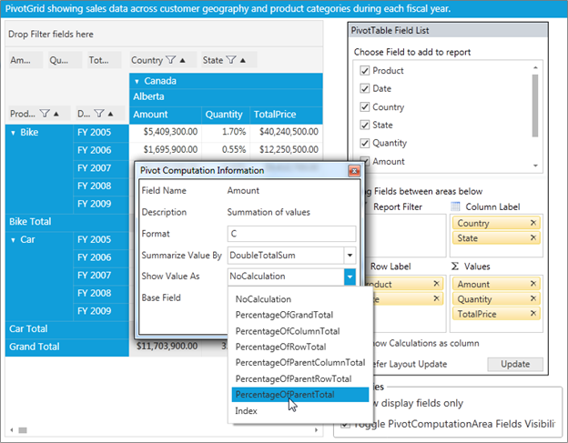

::: {style="DISPLAY: none"}
{#d2h_url_template} {#d2h_package_url style="WIDTH: 0px; DISPLAY: none; HEIGHT: 0px"}
:::

::: {.d2h_secondary_topic style="PADDING-BOTTOM: 10pt; MARGIN: 0pt; PADDING-LEFT: 0pt; PADDING-RIGHT: 0pt; PADDING-TOP: 0pt"}
##### Implementing Custom Calculations {#implementing-custom-calculations style="tab-stops: 0pt"}

To show the value cell as a percentage of its summary cells, use the following code snippet:

+------------------------------------------------------------------------------------------------------------------------------------------------------------------------------------------------------------------------------------------------------------------------------------------------------------------------------------------------------------------------------------------------------------------------------------------------------------------------------------------------------------------------------------------------------------------------------------------------------------------------------------------------------------------------------------------------------------------------------------------------------------------------------------------------------------------------------------------------------------------------------------------------------------------------------------------------------------------------------------------------------------------------------------------------------+
| **[\[XAML\]]{style="FONT-FAMILY: 'Courier New'"}**                                                                                                                                                                                                                                                                                                                                                                                                                                                                                                                                                                                                                                                                                                                                                                                                                                                                                                                                                                                                   |
|                                                                                                                                                                                                                                                                                                                                                                                                                                                                                                                                                                                                                                                                                                                                                                                                                                                                                                                                                                                                                                                      |
| [\<]{style="FONT-FAMILY: 'Courier New'; COLOR: blue"} [syncfusion]{style="FONT-FAMILY: 'Courier New'; COLOR: #a31515"} [:]{style="FONT-FAMILY: 'Courier New'; COLOR: blue"} [PivotGridControl.PivotCalculations]{style="FONT-FAMILY: 'Courier New'; COLOR: #a31515"} [\>]{style="FONT-FAMILY: 'Courier New'; COLOR: blue"} []{style="FONT-FAMILY: 'Courier New'"}                                                                                                                                                                                                                                                                                                                                                                                                                                                                                                                                                                                                                                                                                    |
|                                                                                                                                                                                                                                                                                                                                                                                                                                                                                                                                                                                                                                                                                                                                                                                                                                                                                                                                                                                                                                                      |
| [                    ]{style="FONT-FAMILY: 'Courier New'; COLOR: #a31515"} [\<]{style="FONT-FAMILY: 'Courier New'; COLOR: blue"} [syncfusion]{style="FONT-FAMILY: 'Courier New'; COLOR: #a31515"} [:]{style="FONT-FAMILY: 'Courier New'; COLOR: blue"} [PivotComputationInfo]{style="FONT-FAMILY: 'Courier New'; COLOR: #a31515"} [ FieldName]{style="FONT-FAMILY: 'Courier New'; COLOR: red"} [=\"Amount\"]{style="FONT-FAMILY: 'Courier New'; COLOR: blue"} [ Format]{style="FONT-FAMILY: 'Courier New'; COLOR: red"} [=\"C\"]{style="FONT-FAMILY: 'Courier New'; COLOR: blue"} [ CalculationName]{style="FONT-FAMILY: 'Courier New'; COLOR: red"} [=\"Amount Total\"]{style="FONT-FAMILY: 'Courier New'; COLOR: blue"} [ CalculationType]{style="FONT-FAMILY: 'Courier New'; COLOR: red"} [=\"PercentageOfParentTotal\"]{style="FONT-FAMILY: 'Courier New'; COLOR: blue"} [ BaseField]{style="FONT-FAMILY: 'Courier New'; COLOR: red"} [=\"Country\" /\>]{style="FONT-FAMILY: 'Courier New'; COLOR: blue"} []{style="FONT-FAMILY: 'Courier New'"} |
|                                                                                                                                                                                                                                                                                                                                                                                                                                                                                                                                                                                                                                                                                                                                                                                                                                                                                                                                                                                                                                                      |
| [\</]{style="FONT-FAMILY: 'Courier New'; COLOR: blue"} [syncfusion]{style="FONT-FAMILY: 'Courier New'; COLOR: #a31515"} [:]{style="FONT-FAMILY: 'Courier New'; COLOR: blue"} [PivotGridControl.PivotCalculations]{style="FONT-FAMILY: 'Courier New'; COLOR: #a31515"} [\>]{style="FONT-FAMILY: 'Courier New'; COLOR: blue"}                                                                                                                                                                                                                                                                                                                                                                                                                                                                                                                                                                                                                                                                                                                          |
+------------------------------------------------------------------------------------------------------------------------------------------------------------------------------------------------------------------------------------------------------------------------------------------------------------------------------------------------------------------------------------------------------------------------------------------------------------------------------------------------------------------------------------------------------------------------------------------------------------------------------------------------------------------------------------------------------------------------------------------------------------------------------------------------------------------------------------------------------------------------------------------------------------------------------------------------------------------------------------------------------------------------------------------------------+

[]{style="COLOR: #c00000"} 

[]{style="COLOR: #c00000"} 

+------------------------------------------------------------------------------------------------------------------------------------------------------------------------------------------------------------------------------------------------------------------------------------------------------------------------------------------------------------------------------------------------------------------------------------------------------------------------------------------------------------------------------------------------------------------------------+
| **[\[C#\]]{style="FONT-FAMILY: 'Courier New'"}**                                                                                                                                                                                                                                                                                                                                                                                                                                                                                                                             |
|                                                                                                                                                                                                                                                                                                                                                                                                                                                                                                                                                                              |
| [this]{style="FONT-FAMILY: 'Courier New'; COLOR: blue"} [.pivotGrid1.PivotCalculations.Add([new]{style="COLOR: blue"} Syncfusion.PivotAnalysis.Base.[PivotComputationInfo]{style="COLOR: #2b91af"} { FieldName = [\"Amount\"]{style="COLOR: #a31515"}, Format = [\"C\"]{style="COLOR: #a31515"}, CalculationName = [\"Total Amount\"]{style="COLOR: #a31515"}, CalculationType = Syncfusion.PivotAnalysis.Base.[CalculationType]{style="COLOR: #2b91af"}.PercentageOfParentTotal, BaseField = [\"Country\"]{style="COLOR: #a31515"} });]{style="FONT-FAMILY: 'Courier New'"} |
+------------------------------------------------------------------------------------------------------------------------------------------------------------------------------------------------------------------------------------------------------------------------------------------------------------------------------------------------------------------------------------------------------------------------------------------------------------------------------------------------------------------------------------------------------------------------------+

 

+------------------------------------------------------------------------------------------------------------------------------------------------------------------------------------------------------------------------------------------------------------------------------------------------------------------------------------------------------------------------------------------------------------------------------------------------------------------------------------------------------------------------------------------------------------------------------------------------------------+
| **[\[VB\]]{style="FONT-FAMILY: 'Courier New'"}** []{style="FONT-FAMILY: 'Courier New'; COLOR: blue"}                                                                                                                                                                                                                                                                                                                                                                                                                                                                                                       |
|                                                                                                                                                                                                                                                                                                                                                                                                                                                                                                                                                                                                            |
| [Me]{style="FONT-FAMILY: 'Courier New'; COLOR: blue"} [.pivotGrid1.PivotCalculations.Add([New]{style="COLOR: blue"} Syncfusion.PivotAnalysis.Base.[PivotComputationInfo]{style="COLOR: #2b91af"}() [With]{style="COLOR: blue"} {.FieldName = [\"Amount\"]{style="COLOR: #a31515"}, .Format = [\"C\"]{style="COLOR: #a31515"}, .CalculationName = [\"Total Amount\"]{style="COLOR: #a31515"}, .CalculationType = Syncfusion.PivotAnalysis.Base.[CalculationType]{style="COLOR: #2b91af"}.PercentageOfParentTotal, .BaseField = [\"Country\"]{style="COLOR: #a31515"}})]{style="FONT-FAMILY: 'Courier New'"} |
+------------------------------------------------------------------------------------------------------------------------------------------------------------------------------------------------------------------------------------------------------------------------------------------------------------------------------------------------------------------------------------------------------------------------------------------------------------------------------------------------------------------------------------------------------------------------------------------------------------+

[]{style="COLOR: #c00000"} 

To change the value cell's calculation for different view dynamically, do the following procedure through Pivot Schema Designer control:

1.   Double-click the respective PivotComputationInfo field at value fields section of the Pivot Schema Designer.

2.   In the Pivot Computation Information window pop-up, change the view by selecting  the 'Show Value As' combo box as shown in the below image:

{border="0"}

Figure 49 Showing Different Calculation Functions in Computational Window of Pivot Schema Designer[]{style="COLOR: #c00000"}

 

[]{#related-topics}
:::
