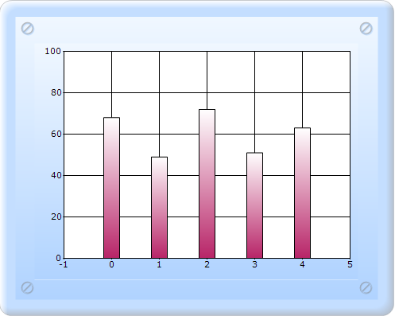

::: {style="DISPLAY: none"}
{#d2h_url_template}{#d2h_package_url style="WIDTH: 0px; DISPLAY: none; HEIGHT: 0px"}
:::

::::: {#nsbanner .d2h_main_nsbanner style="BORDER-BOTTOM: #999999 1px solid; POSITION: relative; PADDING-BOTTOM: 0px; BACKGROUND-COLOR: transparent; PADDING-LEFT: 0px; PADDING-RIGHT: 0px; DISPLAY: none; BORDER-TOP: #999999 1px solid; PADDING-TOP: 0px; LEFT: 0px"}
:::: {#TitleRow .d2h_main_titlerow style="PADDING-BOTTOM: 4px; BACKGROUND-COLOR: transparent; PADDING-LEFT: 22px; WIDTH: 100%; PADDING-RIGHT: 10px; DISPLAY: none; PADDING-TOP: 4px"}
::: {#ienav .d2h_main_ienav style="DISPLAY: none"}
{#D2HPrevious .D2HPreviousEnabled}  {#D2HNext .D2HNextEnabled}
:::
::::
:::::

:::::::: {#nstext .d2h_main_nstext style="PADDING-BOTTOM: 10px; BACKGROUND-COLOR: transparent; PADDING-LEFT: 22px; PADDING-RIGHT: 10px; HEIGHT: 100%; OVERFLOW: auto; PADDING-TOP: 5px" hasuserbackground="true" valign="bottom"}
::: {#d2h_breadcrumbs .d2h_breadcrumbs}
[Essential Studio User Guide Documentation](ms-xhelp:///?Id=12457748-09e3-4d74-a240-8e049cedf030){.d2h_breadcrumbsNormal}[ \> ]{.d2h_breadcrumbsLinkSeparator}[User Interface Edition](ms-xhelp:///?Id=c29296b7-531c-413b-a0ec-488ca1f7f669){.d2h_breadcrumbsNormal}[ \> ]{.d2h_breadcrumbsLinkSeparator}[Essential ASP.NET MVC](ms-xhelp:///?Id=4b14e7d1-65c4-4f67-b1aa-2c37709905a5){.d2h_breadcrumbsNormal}[ \> ]{.d2h_breadcrumbsLinkSeparator}[Essential Chart]{.d2h_breadcrumbsContentsOnly}[ \> ]{.d2h_breadcrumbsLinkSeparator}[Concepts and Features](ms-xhelp:///?Id=696f5666-8b81-4685-9bd9-12198f06f3ad){.d2h_breadcrumbsNormal}[ \> ]{.d2h_breadcrumbsLinkSeparator}[Chart Data](ms-xhelp:///?Id=1c4580ce-85a3-4687-a83d-1ba13cec0e65){.d2h_breadcrumbsNormal}
:::

### Implementing Custom Data Binding Interfaces {#implementing-custom-data-binding-interfaces style="tab-stops: 0pt"}

Note that the **ChartDataBindModel** type in the previous topic implements a simple interface called IChartSeriesModel. This interface requires the implementation of one property, two methods, and one optional event. So, you can easily provide a custom implementation of this interface instead of using the ChartDataBindModel.

To bind the Indexed model to the series:

1.   Create the **Indexed** model, which implements IChartSeriesIndexedModel.

[]{style="FONT-FAMILY: 'Times New Roman','serif'; FONT-SIZE: 12pt"} 

The sample code shown below implements the IChartSeriesModel interface that should be used with the chart.

[]{style="FONT-FAMILY: 'Times New Roman','serif'; FONT-SIZE: 12pt"} 

::: {style="BORDER-BOTTOM: #c8c8c8 1pt solid; BORDER-LEFT: #c8c8c8 1pt solid; PADDING-BOTTOM: 1pt; MARGIN-TOP: 0pt; PADDING-LEFT: 4pt; PADDING-RIGHT: 4pt; MARGIN-BOTTOM: 0pt; BACKGROUND: #f0f0f0; BORDER-TOP: #c8c8c8 1pt solid; BORDER-RIGHT: #c8c8c8 1pt solid; PADDING-TOP: 1pt"}
[       ]{style="FONT-FAMILY: Consolas; FONT-SIZE: 9.5pt"}[public]{style="FONT-FAMILY: 'Courier New'; COLOR: blue"}[ [class]{style="COLOR: blue"} [StringIndexedModel]{style="COLOR: #2b91af"} : [IChartSeriesIndexedModel]{style="COLOR: #2b91af"}]{style="FONT-FAMILY: 'Courier New'"}

[        {]{style="FONT-FAMILY: 'Courier New'"}

[            [private]{style="COLOR: blue"} [double]{style="COLOR: blue"}\[\] y;]{style="FONT-FAMILY: 'Courier New'"}

[            [public]{style="COLOR: blue"} StringIndexedModel([ChartSeries]{style="COLOR: #2b91af"} series, [double]{style="COLOR: blue"}\[\] y)]{style="FONT-FAMILY: 'Courier New'"}

[            {]{style="FONT-FAMILY: 'Courier New'"}

[                [this]{style="COLOR: blue"}.y = y;]{style="FONT-FAMILY: 'Courier New'"}

[            }]{style="FONT-FAMILY: 'Courier New'"}

[            [public]{style="COLOR: blue"} [int]{style="COLOR: blue"} Count]{style="FONT-FAMILY: 'Courier New'"}

[            {]{style="FONT-FAMILY: 'Courier New'"}

[                [get]{style="COLOR: blue"}]{style="FONT-FAMILY: 'Courier New'"}

[                {]{style="FONT-FAMILY: 'Courier New'"}

[                    [return]{style="COLOR: blue"} [this]{style="COLOR: blue"}.y.GetLength(0);]{style="FONT-FAMILY: 'Courier New'"}

[                }]{style="FONT-FAMILY: 'Courier New'"}

[            }]{style="FONT-FAMILY: 'Courier New'"}

[            [public]{style="COLOR: blue"} [double]{style="COLOR: blue"}\[\] GetY([int]{style="COLOR: blue"} xIndex)]{style="FONT-FAMILY: 'Courier New'"}

[            {]{style="FONT-FAMILY: 'Courier New'"}

[                [return]{style="COLOR: blue"} [new]{style="COLOR: blue"} [double]{style="COLOR: blue"}\[\] { y\[xIndex\] };]{style="FONT-FAMILY: 'Courier New'"}

[            }]{style="FONT-FAMILY: 'Courier New'"}

[            [public]{style="COLOR: blue"} [bool]{style="COLOR: blue"} GetEmpty([int]{style="COLOR: blue"} index)]{style="FONT-FAMILY: 'Courier New'"}

[            {]{style="FONT-FAMILY: 'Courier New'"}

[                [return]{style="COLOR: blue"} [false]{style="COLOR: blue"};]{style="FONT-FAMILY: 'Courier New'"}

[            }]{style="FONT-FAMILY: 'Courier New'"}

[]{style="FONT-FAMILY: 'Courier New'"} 

[            [public]{style="COLOR: blue"} [event]{style="COLOR: blue"} System.ComponentModel.[ListChangedEventHandler]{style="COLOR: #2b91af"} Changed;]{style="FONT-FAMILY: 'Courier New'"}

[        }]{style="FONT-FAMILY: 'Courier New'"}
:::

[]{style="FONT-FAMILY: Consolas; FONT-SIZE: 9.5pt"} 

2.   In Controller, create an instance for **MVCChartModel**, and set its properties.

3.   Create the **Series** instance, and set the seriestype.

4.   Bind the **chart** by using the following code snippet.

 

[       ]{style="FONT-FAMILY: Consolas; FONT-SIZE: 9.5pt"}

::: {style="BORDER-BOTTOM: #c8c8c8 1pt solid; BORDER-LEFT: #c8c8c8 1pt solid; PADDING-BOTTOM: 1pt; MARGIN-TOP: 0pt; PADDING-LEFT: 4pt; PADDING-RIGHT: 4pt; MARGIN-BOTTOM: 0pt; BACKGROUND: #f0f0f0; BORDER-TOP: #c8c8c8 1pt solid; BORDER-RIGHT: #c8c8c8 1pt solid; PADDING-TOP: 1pt"}
[public]{style="FONT-FAMILY: 'Courier New'; COLOR: blue"}[ [ActionResult]{style="COLOR: #2b91af"} SimpleChart()]{style="FONT-FAMILY: 'Courier New'"}

[        {]{style="FONT-FAMILY: 'Courier New'"}

[            [MVCChartModel]{style="COLOR: #2b91af"} chartModel = [new]{style="COLOR: blue"} [MVCChartModel]{style="COLOR: #2b91af"}();]{style="FONT-FAMILY: 'Courier New'"}

[            [// Create chart series and add data points into it.]{style="COLOR: green"}]{style="FONT-FAMILY: 'Courier New'"}

[]{style="FONT-FAMILY: 'Courier New'"} 

[            chartModel.Indexed = [true]{style="COLOR: blue"};]{style="FONT-FAMILY: 'Courier New'"}

[            [//Initializes new chart series.]{style="COLOR: green"}]{style="FONT-FAMILY: 'Courier New'"}

[            [ChartSeries]{style="COLOR: #2b91af"} series = [new]{style="COLOR: blue"} [ChartSeries]{style="COLOR: #2b91af"}();]{style="FONT-FAMILY: 'Courier New'"}

**[            series.SeriesIndexedModelImpl = [new]{style="COLOR: blue"} [StringIndexedModel]{style="COLOR: #2b91af"}(series, [new]{style="COLOR: blue"} [double]{style="COLOR: blue"}\[\] { 68, 49, 72, 51, 63 });]{style="FONT-FAMILY: 'Courier New'"}**

**[            [//Adds the series to the ChartSeriesCollection.]{style="COLOR: green"}]{style="FONT-FAMILY: 'Courier New'"}**

**[            chartModel.Series.Add(series);]{style="FONT-FAMILY: 'Courier New'"}**

[            [//Specifies the column width mode for the Column Type chart.]{style="COLOR: green"}]{style="FONT-FAMILY: 'Courier New'"}

[            chartModel.ColumnWidthMode = [ChartColumnWidthMode]{style="COLOR: #2b91af"}.FixedWidthMode;]{style="FONT-FAMILY: 'Courier New'"}

[]{style="FONT-FAMILY: 'Courier New'"} 

[            chartModel.Skins = [ChartModelSkins]{style="COLOR: #2b91af"}.Office2007Blue;]{style="FONT-FAMILY: 'Courier New'"}

[            chartModel.ChartSeriesSkins = [ChartSeriesSkins]{style="COLOR: #2b91af"}.Analog;]{style="FONT-FAMILY: 'Courier New'"}

[]{style="FONT-FAMILY: 'Courier New'"} 

[            chartModel.BorderAppearance.SkinStyle = [ChartBorderSkinStyle]{style="COLOR: #2b91af"}.Pinned;]{style="FONT-FAMILY: 'Courier New'"}

[            chartModel.Size = [new]{style="COLOR: blue"} [Size]{style="COLOR: #2b91af"}(500, 400);]{style="FONT-FAMILY: 'Courier New'"}

[]{style="FONT-FAMILY: 'Courier New'"} 

[            ViewData.Model = chartModel;]{style="FONT-FAMILY: 'Courier New'"}

[]{style="FONT-FAMILY: 'Courier New'"} 

[            [return]{style="COLOR: blue"} View();]{style="FONT-FAMILY: 'Courier New'"}

[        }]{style="FONT-FAMILY: 'Courier New'"}

[]{style="FONT-FAMILY: 'Courier New'"} 
:::

[]{style="FONT-FAMILY: Consolas; FONT-SIZE: 9.5pt"} 

5.   In the View page, invoke the ChartBuilder by using the control ID as the first argument, and convert the ViewData to MVCChartModel and set it as the second argument.

[]{style="FONT-FAMILY: Consolas; FONT-SIZE: 9.5pt"} 

::: {style="BORDER-BOTTOM: #c8c8c8 1pt solid; BORDER-LEFT: #c8c8c8 1pt solid; PADDING-BOTTOM: 1pt; MARGIN-TOP: 0pt; PADDING-LEFT: 4pt; PADDING-RIGHT: 4pt; MARGIN-BOTTOM: 0pt; BACKGROUND: #f0f0f0; BORDER-TOP: #c8c8c8 1pt solid; BORDER-RIGHT: #c8c8c8 1pt solid; PADDING-TOP: 1pt"}
View \[ASPX\]

[]{style="FONT-FAMILY: 'Calibri','sans-serif'"} 

[\<%]{style="FONT-FAMILY: 'Courier New'; BACKGROUND: yellow"}[=]{style="FONT-FAMILY: 'Courier New'; COLOR: blue"}[ Html.Chart([\"SimpleChart\"]{style="COLOR: #a31515"},([MVCChartModel]{style="COLOR: #2b91af"})ViewData.Model) [%\>]{style="BACKGROUND: yellow"}]{style="FONT-FAMILY: 'Courier New'"}

[]{style="FONT-FAMILY: 'Courier New'; BACKGROUND: yellow"} 
:::

[]{style="FONT-FAMILY: Consolas; FONT-SIZE: 9.5pt"} 

[]{style="FONT-FAMILY: Consolas; FONT-SIZE: 9.5pt"} 

::: {style="BORDER-BOTTOM: #c8c8c8 1pt solid; BORDER-LEFT: #c8c8c8 1pt solid; PADDING-BOTTOM: 1pt; MARGIN-TOP: 0pt; PADDING-LEFT: 4pt; PADDING-RIGHT: 4pt; MARGIN-BOTTOM: 0pt; BACKGROUND: #f0f0f0; BORDER-TOP: #c8c8c8 1pt solid; BORDER-RIGHT: #c8c8c8 1pt solid; PADDING-TOP: 1pt"}
View \[cshtml\]

[]{style="FONT-FAMILY: 'Calibri','sans-serif'"} 

[@(]{style="FONT-FAMILY: 'Courier New'; BACKGROUND: yellow"}[new]{style="FONT-FAMILY: Consolas; COLOR: blue; FONT-SIZE: 9.5pt"}[ [HtmlString]{style="COLOR: #2b91af"}]{style="FONT-FAMILY: Consolas; FONT-SIZE: 9.5pt"}[(Html.Chart([\"SimpleChart\"]{style="COLOR: #a31515"},([MVCChartModel]{style="COLOR: #2b91af"})ViewData.Model).ToString())[)]{style="BACKGROUND: yellow"}]{style="FONT-FAMILY: 'Courier New'"}

[]{style="FONT-FAMILY: 'Courier New'; BACKGROUND: yellow"} 
:::

[]{style="FONT-FAMILY: Consolas; BACKGROUND: yellow; FONT-SIZE: 9.5pt"} 

6.   Run the code, to get the following output:

[]{style="FONT-FAMILY: 'Times New Roman','serif'; FONT-SIZE: 12pt"} 

{border="0"}[]{style="FONT-FAMILY: 'Times New Roman','serif'; FONT-SIZE: 12pt"}

Figure 280: Custom Data Binding

Indexed data

Note that if you have indexed data, which implies that the X values are simply categories and don\'t carry any cardinal value, then you can instead implement the IChartSeriesIndexedModel interface and bind it to the ChartSeries.SeriesIndexedModelImpl. The main difference in this interface is that you don\'t have to implement the GetX method.

[]{#related-topics}
::::::::
