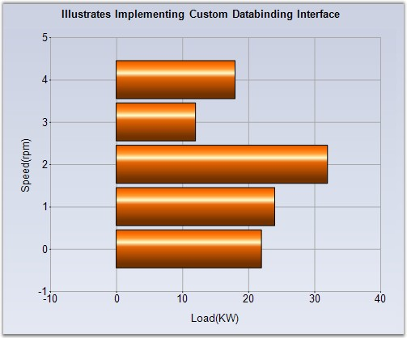

::: {style="DISPLAY: none"}
{#d2h_url_template}{#d2h_package_url style="WIDTH: 0px; DISPLAY: none; HEIGHT: 0px"}
:::

::::: {#nsbanner .d2h_main_nsbanner style="BORDER-BOTTOM: #999999 1px solid; POSITION: relative; PADDING-BOTTOM: 0px; BACKGROUND-COLOR: transparent; PADDING-LEFT: 0px; PADDING-RIGHT: 0px; DISPLAY: none; BORDER-TOP: #999999 1px solid; PADDING-TOP: 0px; LEFT: 0px"}
:::: {#TitleRow .d2h_main_titlerow style="PADDING-BOTTOM: 4px; BACKGROUND-COLOR: transparent; PADDING-LEFT: 22px; WIDTH: 100%; PADDING-RIGHT: 10px; DISPLAY: none; PADDING-TOP: 4px"}
::: {#ienav .d2h_main_ienav style="DISPLAY: none"}
{#D2HPrevious .D2HPreviousEnabled}  {#D2HNext .D2HNextEnabled}
:::
::::
:::::

:::: {#nstext .d2h_main_nstext style="PADDING-BOTTOM: 10px; BACKGROUND-COLOR: transparent; PADDING-LEFT: 22px; PADDING-RIGHT: 10px; HEIGHT: 100%; OVERFLOW: auto; PADDING-TOP: 5px" hasuserbackground="true" valign="bottom"}
::: {#d2h_breadcrumbs .d2h_breadcrumbs}
[Essential Studio User Guide Documentation](ms-xhelp:///?Id=12457748-09e3-4d74-a240-8e049cedf030){.d2h_breadcrumbsNormal}[ \> ]{.d2h_breadcrumbsLinkSeparator}[User Interface Edition](ms-xhelp:///?Id=c29296b7-531c-413b-a0ec-488ca1f7f669){.d2h_breadcrumbsNormal}[ \> ]{.d2h_breadcrumbsLinkSeparator}[Essential Windows](ms-xhelp:///?Id=e60759d8-47a4-4570-9d7a-16a68d63f2ea){.d2h_breadcrumbsNormal}[ \> ]{.d2h_breadcrumbsLinkSeparator}[Essential Chart]{.d2h_breadcrumbsContentsOnly}[ \> ]{.d2h_breadcrumbsLinkSeparator}[Concepts and Features](ms-xhelp:///?Id=71321e9c-336c-4c1c-a127-be9f135ad4bb){.d2h_breadcrumbsNormal}[ \> ]{.d2h_breadcrumbsLinkSeparator}[Chart Data](ms-xhelp:///?Id=419e4d4d-9b27-4bd7-b74d-dbc80d98fca5){.d2h_breadcrumbsNormal}
:::

### Implementing Custom Data Binding Interfaces {#implementing-custom-data-binding-interfaces style="tab-stops: 0pt"}

 

Note that the **ChartDataBindModel** type in the previous topic implements a simple interface called **IChartSeriesModel**. This interface requires the implementation of one property, two methods and one optional event. So, you can easily provide a custom implementation of this interface instead of using the ChartDataBindModel.

 

Shown below is some sample code that implements IChartSeriesModel interface for use with the chart.

 

+---------------------------------------------------------------------------------------------------------------------------------------------------------------------------------------------------------------------------------------------------------------------------------------------------------------------------------------------------+
| **[\[C#\]]{style="FONT-FAMILY: 'Courier New'; COLOR: black"}**                                                                                                                                                                                                                                                                                    |
|                                                                                                                                                                                                                                                                                                                                                   |
| **[]{style="FONT-FAMILY: 'Courier New'; COLOR: black"}**                                                                                                                                                                                                                                                                                          |
|                                                                                                                                                                                                                                                                                                                                                   |
| [// Custom Model]{style="FONT-FAMILY: 'Courier New'; COLOR: green"}                                                                                                                                                                                                                                                                               |
|                                                                                                                                                                                                                                                                                                                                                   |
| [public]{style="FONT-FAMILY: 'Courier New'; COLOR: blue"}[ ]{style="FONT-FAMILY: 'Courier New'; COLOR: black"}[class]{style="FONT-FAMILY: 'Courier New'; COLOR: blue"}[ ArrayModel : IChartSeriesModel]{style="FONT-FAMILY: 'Courier New'; COLOR: black"}                                                                                         |
|                                                                                                                                                                                                                                                                                                                                                   |
| [{]{style="FONT-FAMILY: 'Courier New'; COLOR: black"}                                                                                                                                                                                                                                                                                             |
|                                                                                                                                                                                                                                                                                                                                                   |
| [   private double\[\]]{style="FONT-FAMILY: 'Courier New'; COLOR: blue"}[ data;]{style="FONT-FAMILY: 'Courier New'; COLOR: black"}                                                                                                                                                                                                                |
|                                                                                                                                                                                                                                                                                                                                                   |
| []{style="FONT-FAMILY: 'Courier New'; COLOR: black"}                                                                                                                                                                                                                                                                                              |
|                                                                                                                                                                                                                                                                                                                                                   |
| [   public]{style="FONT-FAMILY: 'Courier New'; COLOR: blue"}[ ArrayModel(]{style="FONT-FAMILY: 'Courier New'; COLOR: black"}[double\[\]]{style="FONT-FAMILY: 'Courier New'; COLOR: blue"}[ data)]{style="FONT-FAMILY: 'Courier New'; COLOR: black"}                                                                                               |
|                                                                                                                                                                                                                                                                                                                                                   |
| [   {]{style="FONT-FAMILY: 'Courier New'; COLOR: black"}                                                                                                                                                                                                                                                                                          |
|                                                                                                                                                                                                                                                                                                                                                   |
| [      this]{style="FONT-FAMILY: 'Courier New'; COLOR: blue"}[.data = data;]{style="FONT-FAMILY: 'Courier New'; COLOR: black"}                                                                                                                                                                                                                    |
|                                                                                                                                                                                                                                                                                                                                                   |
| [   }        ]{style="FONT-FAMILY: 'Courier New'; COLOR: black"}                                                                                                                                                                                                                                                                                  |
|                                                                                                                                                                                                                                                                                                                                                   |
| []{style="FONT-FAMILY: 'Courier New'; COLOR: black"}                                                                                                                                                                                                                                                                                              |
|                                                                                                                                                                                                                                                                                                                                                   |
| [   // Returns the number of points in this series.]{style="FONT-FAMILY: 'Courier New'; COLOR: green"}                                                                                                                                                                                                                                            |
|                                                                                                                                                                                                                                                                                                                                                   |
| [   public int]{style="FONT-FAMILY: 'Courier New'; COLOR: blue"}[ Count]{style="FONT-FAMILY: 'Courier New'; COLOR: black"}                                                                                                                                                                                                                        |
|                                                                                                                                                                                                                                                                                                                                                   |
| [   { ]{style="FONT-FAMILY: 'Courier New'; COLOR: black"}                                                                                                                                                                                                                                                                                         |
|                                                                                                                                                                                                                                                                                                                                                   |
| [      get]{style="FONT-FAMILY: 'Courier New'; COLOR: black"}                                                                                                                                                                                                                                                                                     |
|                                                                                                                                                                                                                                                                                                                                                   |
| [      {]{style="FONT-FAMILY: 'Courier New'; COLOR: black"}                                                                                                                                                                                                                                                                                       |
|                                                                                                                                                                                                                                                                                                                                                   |
| [           return this]{style="FONT-FAMILY: 'Courier New'; COLOR: blue"}[.data.GetLength(0);]{style="FONT-FAMILY: 'Courier New'; COLOR: black"}                                                                                                                                                                                                  |
|                                                                                                                                                                                                                                                                                                                                                   |
| [      }]{style="FONT-FAMILY: 'Courier New'; COLOR: black"}                                                                                                                                                                                                                                                                                       |
|                                                                                                                                                                                                                                                                                                                                                   |
| [   }]{style="FONT-FAMILY: 'Courier New'; COLOR: black"}                                                                                                                                                                                                                                                                                          |
|                                                                                                                                                                                                                                                                                                                                                   |
| [       ]{style="FONT-FAMILY: 'Courier New'; COLOR: black"}                                                                                                                                                                                                                                                                                       |
|                                                                                                                                                                                                                                                                                                                                                   |
| [  ]{style="FONT-FAMILY: 'Courier New'; COLOR: black"}[ // Returns the Y value of the series at the specified point index.]{style="FONT-FAMILY: 'Courier New'; COLOR: green"}                                                                                                                                                                     |
|                                                                                                                                                                                                                                                                                                                                                   |
| [   public double\[\]]{style="FONT-FAMILY: 'Courier New'; COLOR: blue"}[ GetY(]{style="FONT-FAMILY: 'Courier New'; COLOR: black"}[int]{style="FONT-FAMILY: 'Courier New'; COLOR: blue"}[ xIndex)]{style="FONT-FAMILY: 'Courier New'; COLOR: black"}                                                                                               |
|                                                                                                                                                                                                                                                                                                                                                   |
| [   {]{style="FONT-FAMILY: 'Courier New'; COLOR: black"}                                                                                                                                                                                                                                                                                          |
|                                                                                                                                                                                                                                                                                                                                                   |
| [      return new]{style="FONT-FAMILY: 'Courier New'; COLOR: blue"}[ ]{style="FONT-FAMILY: 'Courier New'; COLOR: black"}[double\[\]]{style="FONT-FAMILY: 'Courier New'; COLOR: blue"}[{data\[xIndex\]};]{style="FONT-FAMILY: 'Courier New'; COLOR: black"}                                                                                        |
|                                                                                                                                                                                                                                                                                                                                                   |
| [   }]{style="FONT-FAMILY: 'Courier New'; COLOR: black"}                                                                                                                                                                                                                                                                                          |
|                                                                                                                                                                                                                                                                                                                                                   |
| []{style="FONT-FAMILY: 'Courier New'; COLOR: black"}                                                                                                                                                                                                                                                                                              |
|                                                                                                                                                                                                                                                                                                                                                   |
| [   // Returns the X value of the series at the specified point index.]{style="FONT-FAMILY: 'Courier New'; COLOR: green"}                                                                                                                                                                                                                         |
|                                                                                                                                                                                                                                                                                                                                                   |
| [   public double]{style="FONT-FAMILY: 'Courier New'; COLOR: blue"}[ GetX(]{style="FONT-FAMILY: 'Courier New'; COLOR: black"}[int]{style="FONT-FAMILY: 'Courier New'; COLOR: blue"}[ xIndex)]{style="FONT-FAMILY: 'Courier New'; COLOR: black"}                                                                                                   |
|                                                                                                                                                                                                                                                                                                                                                   |
| [   {]{style="FONT-FAMILY: 'Courier New'; COLOR: black"}                                                                                                                                                                                                                                                                                          |
|                                                                                                                                                                                                                                                                                                                                                   |
| [      return ]{style="FONT-FAMILY: 'Courier New'; COLOR: blue"}[xIndex;]{style="FONT-FAMILY: 'Courier New'; COLOR: black"}                                                                                                                                                                                                                       |
|                                                                                                                                                                                                                                                                                                                                                   |
| [   }]{style="FONT-FAMILY: 'Courier New'; COLOR: black"}                                                                                                                                                                                                                                                                                          |
|                                                                                                                                                                                                                                                                                                                                                   |
| []{style="FONT-FAMILY: 'Courier New'; COLOR: black"}                                                                                                                                                                                                                                                                                              |
|                                                                                                                                                                                                                                                                                                                                                   |
| [   // Indicates whether a plottable value is present at the specified point index.]{style="FONT-FAMILY: 'Courier New'; COLOR: green"}                                                                                                                                                                                                            |
|                                                                                                                                                                                                                                                                                                                                                   |
| [   public bool]{style="FONT-FAMILY: 'Courier New'; COLOR: blue"}[ GetEmpty(]{style="FONT-FAMILY: 'Courier New'; COLOR: black"}[int]{style="FONT-FAMILY: 'Courier New'; COLOR: blue"}[ index)]{style="FONT-FAMILY: 'Courier New'; COLOR: black"}                                                                                                  |
|                                                                                                                                                                                                                                                                                                                                                   |
| [   {]{style="FONT-FAMILY: 'Courier New'; COLOR: black"}                                                                                                                                                                                                                                                                                          |
|                                                                                                                                                                                                                                                                                                                                                   |
| [      return false]{style="FONT-FAMILY: 'Courier New'; COLOR: blue"}[;]{style="FONT-FAMILY: 'Courier New'; COLOR: black"}                                                                                                                                                                                                                        |
|                                                                                                                                                                                                                                                                                                                                                   |
| [   }]{style="FONT-FAMILY: 'Courier New'; COLOR: black"}                                                                                                                                                                                                                                                                                          |
|                                                                                                                                                                                                                                                                                                                                                   |
| []{style="FONT-FAMILY: 'Courier New'; COLOR: black"}                                                                                                                                                                                                                                                                                              |
|                                                                                                                                                                                                                                                                                                                                                   |
| [// Event that should be raised by any implementation of this interface if data that it holds changes. This will cause the chart to be updated accordingly. We don\'t raise this event in our implementation as our data will be static.]{style="FONT-FAMILY: 'Courier New'; COLOR: green"}[  ]{style="FONT-FAMILY: 'Courier New'; COLOR: black"} |
|                                                                                                                                                                                                                                                                                                                                                   |
| [   public event]{style="FONT-FAMILY: 'Courier New'; COLOR: blue"}[ ListChangedEventHandler Changed;]{style="FONT-FAMILY: 'Courier New'; COLOR: black"}                                                                                                                                                                                           |
|                                                                                                                                                                                                                                                                                                                                                   |
| [}]{style="FONT-FAMILY: 'Courier New'; COLOR: black"}                                                                                                                                                                                                                                                                                             |
+---------------------------------------------------------------------------------------------------------------------------------------------------------------------------------------------------------------------------------------------------------------------------------------------------------------------------------------------------+

 

+----------------------------------------------------------------------------------------------------------------------------------------------------------------------------------------------------------------------------------------------------------------------------------------------------------------------------------------------------------------------------------------------------------------------------------------+
| **[\[VB.NET\]]{style="FONT-FAMILY: 'Courier New'; COLOR: black"}**                                                                                                                                                                                                                                                                                                                                                                     |
|                                                                                                                                                                                                                                                                                                                                                                                                                                        |
| **[]{style="FONT-FAMILY: 'Courier New'; COLOR: black"}**                                                                                                                                                                                                                                                                                                                                                                               |
|                                                                                                                                                                                                                                                                                                                                                                                                                                        |
| [\' Custom Model]{style="FONT-FAMILY: 'Courier New'; COLOR: green"}                                                                                                                                                                                                                                                                                                                                                                    |
|                                                                                                                                                                                                                                                                                                                                                                                                                                        |
| [Public Class]{style="FONT-FAMILY: 'Courier New'; COLOR: blue"}[ ArrayModel Implements IChartSeriesModel]{style="FONT-FAMILY: 'Courier New'; COLOR: black"}                                                                                                                                                                                                                                                                            |
|                                                                                                                                                                                                                                                                                                                                                                                                                                        |
| [   ]{style="FONT-FAMILY: 'Courier New'; COLOR: black"}[Private]{style="FONT-FAMILY: 'Courier New'; COLOR: blue"}[ data() ]{style="FONT-FAMILY: 'Courier New'; COLOR: black"}[As]{style="FONT-FAMILY: 'Courier New'; COLOR: blue"}[ Double]{style="FONT-FAMILY: 'Courier New'; COLOR: black"}                                                                                                                                          |
|                                                                                                                                                                                                                                                                                                                                                                                                                                        |
| []{style="FONT-FAMILY: 'Courier New'; COLOR: black"}                                                                                                                                                                                                                                                                                                                                                                                   |
|                                                                                                                                                                                                                                                                                                                                                                                                                                        |
| [   Public  Sub]{style="FONT-FAMILY: 'Courier New'; COLOR: blue"}[ New(ByVal data() As Double)]{style="FONT-FAMILY: 'Courier New'; COLOR: black"}                                                                                                                                                                                                                                                                                      |
|                                                                                                                                                                                                                                                                                                                                                                                                                                        |
| [         ]{style="FONT-FAMILY: 'Courier New'; COLOR: black"}[Me]{style="FONT-FAMILY: 'Courier New'; COLOR: blue"}[.data = data]{style="FONT-FAMILY: 'Courier New'; COLOR: black"}                                                                                                                                                                                                                                                     |
|                                                                                                                                                                                                                                                                                                                                                                                                                                        |
| [   End Sub]{style="FONT-FAMILY: 'Courier New'; COLOR: blue"}                                                                                                                                                                                                                                                                                                                                                                          |
|                                                                                                                                                                                                                                                                                                                                                                                                                                        |
| []{style="FONT-FAMILY: 'Courier New'; COLOR: black"}                                                                                                                                                                                                                                                                                                                                                                                   |
|                                                                                                                                                                                                                                                                                                                                                                                                                                        |
| [  ]{style="FONT-FAMILY: 'Courier New'; COLOR: black"}[ \' Returns the number of points in this series.]{style="FONT-FAMILY: 'Courier New'; COLOR: green"}                                                                                                                                                                                                                                                                             |
|                                                                                                                                                                                                                                                                                                                                                                                                                                        |
| [   Public]{style="FONT-FAMILY: 'Courier New'; COLOR: blue"}[ ReadOnly ]{style="FONT-FAMILY: 'Courier New'; COLOR: black"}[Property]{style="FONT-FAMILY: 'Courier New'; COLOR: blue"}[ Count() ]{style="FONT-FAMILY: 'Courier New'; COLOR: black"}[As]{style="FONT-FAMILY: 'Courier New'; COLOR: blue"}[ Integer]{style="FONT-FAMILY: 'Courier New'; COLOR: black"}                                                                    |
|                                                                                                                                                                                                                                                                                                                                                                                                                                        |
| [        Get]{style="FONT-FAMILY: 'Courier New'; COLOR: black"}                                                                                                                                                                                                                                                                                                                                                                        |
|                                                                                                                                                                                                                                                                                                                                                                                                                                        |
| [           Return Me]{style="FONT-FAMILY: 'Courier New'; COLOR: blue"}[.data.GetLength(0)]{style="FONT-FAMILY: 'Courier New'; COLOR: black"}                                                                                                                                                                                                                                                                                          |
|                                                                                                                                                                                                                                                                                                                                                                                                                                        |
| [        End]{style="FONT-FAMILY: 'Courier New'; COLOR: blue"}[ Get]{style="FONT-FAMILY: 'Courier New'; COLOR: black"}                                                                                                                                                                                                                                                                                                                 |
|                                                                                                                                                                                                                                                                                                                                                                                                                                        |
| [   End Property]{style="FONT-FAMILY: 'Courier New'; COLOR: blue"}                                                                                                                                                                                                                                                                                                                                                                     |
|                                                                                                                                                                                                                                                                                                                                                                                                                                        |
| []{style="FONT-FAMILY: 'Courier New'; COLOR: green"}                                                                                                                                                                                                                                                                                                                                                                                   |
|                                                                                                                                                                                                                                                                                                                                                                                                                                        |
| [   \' Returns the Y value of the series at the specified point index.]{style="FONT-FAMILY: 'Courier New'; COLOR: green"}                                                                                                                                                                                                                                                                                                              |
|                                                                                                                                                                                                                                                                                                                                                                                                                                        |
| [   Public Double()]{style="FONT-FAMILY: 'Courier New'; COLOR: blue"}[ GetY(]{style="FONT-FAMILY: 'Courier New'; COLOR: black"}[Integer]{style="FONT-FAMILY: 'Courier New'; COLOR: blue"}[ xIndex)]{style="FONT-FAMILY: 'Courier New'; COLOR: black"}                                                                                                                                                                                  |
|                                                                                                                                                                                                                                                                                                                                                                                                                                        |
| [      Return New Double()]{style="FONT-FAMILY: 'Courier New'; COLOR: blue"}[{data(xIndex)}]{style="FONT-FAMILY: 'Courier New'; COLOR: black"}                                                                                                                                                                                                                                                                                         |
|                                                                                                                                                                                                                                                                                                                                                                                                                                        |
| [   End Function]{style="FONT-FAMILY: 'Courier New'; COLOR: blue"}                                                                                                                                                                                                                                                                                                                                                                     |
|                                                                                                                                                                                                                                                                                                                                                                                                                                        |
| [   ]{style="FONT-FAMILY: 'Courier New'; COLOR: blue"}                                                                                                                                                                                                                                                                                                                                                                                 |
|                                                                                                                                                                                                                                                                                                                                                                                                                                        |
| [ ]{style="FONT-FAMILY: 'Courier New'; COLOR: black"}[\' Returns the X value of the series at the specified point index.]{style="FONT-FAMILY: 'Courier New'; COLOR: green"}                                                                                                                                                                                                                                                            |
|                                                                                                                                                                                                                                                                                                                                                                                                                                        |
| [   Public Double]{style="FONT-FAMILY: 'Courier New'; COLOR: blue"}[ GetX(]{style="FONT-FAMILY: 'Courier New'; COLOR: black"}[Integer]{style="FONT-FAMILY: 'Courier New'; COLOR: blue"}[ xIndex)]{style="FONT-FAMILY: 'Courier New'; COLOR: black"}                                                                                                                                                                                    |
|                                                                                                                                                                                                                                                                                                                                                                                                                                        |
| [      Return ]{style="FONT-FAMILY: 'Courier New'; COLOR: blue"}[xIndex]{style="FONT-FAMILY: 'Courier New'; COLOR: black"}                                                                                                                                                                                                                                                                                                             |
|                                                                                                                                                                                                                                                                                                                                                                                                                                        |
| [   ]{style="FONT-FAMILY: 'Courier New'; COLOR: black"}[End Function]{style="FONT-FAMILY: 'Courier New'; COLOR: blue"}                                                                                                                                                                                                                                                                                                                 |
|                                                                                                                                                                                                                                                                                                                                                                                                                                        |
| []{style="FONT-FAMILY: 'Courier New'; COLOR: black"}                                                                                                                                                                                                                                                                                                                                                                                   |
|                                                                                                                                                                                                                                                                                                                                                                                                                                        |
| [ ]{style="FONT-FAMILY: 'Courier New'; COLOR: blue"}[  \' Indicates whether a plottable value is present at the specified point index.]{style="FONT-FAMILY: 'Courier New'; COLOR: green"}                                                                                                                                                                                                                                              |
|                                                                                                                                                                                                                                                                                                                                                                                                                                        |
| [   Public Function]{style="FONT-FAMILY: 'Courier New'; COLOR: blue"}[ GetEmpty(]{style="FONT-FAMILY: 'Courier New'; COLOR: black"}[ByVal]{style="FONT-FAMILY: 'Courier New'; COLOR: blue"}[ index ]{style="FONT-FAMILY: 'Courier New'; COLOR: black"}[As Integer]{style="FONT-FAMILY: 'Courier New'; COLOR: blue"}[) ]{style="FONT-FAMILY: 'Courier New'; COLOR: black"}[As Boolean]{style="FONT-FAMILY: 'Courier New'; COLOR: blue"} |
|                                                                                                                                                                                                                                                                                                                                                                                                                                        |
| [      Return False]{style="FONT-FAMILY: 'Courier New'; COLOR: blue"}                                                                                                                                                                                                                                                                                                                                                                  |
|                                                                                                                                                                                                                                                                                                                                                                                                                                        |
| [   End Function]{style="FONT-FAMILY: 'Courier New'; COLOR: blue"}                                                                                                                                                                                                                                                                                                                                                                     |
|                                                                                                                                                                                                                                                                                                                                                                                                                                        |
| []{style="FONT-FAMILY: 'Courier New'; COLOR: green"}                                                                                                                                                                                                                                                                                                                                                                                   |
|                                                                                                                                                                                                                                                                                                                                                                                                                                        |
| [   \' Event that should be raised by any implementation of this interface if data that it holds changes. This will cause the chart to be updated accordingly. We don\'t raise this event in our implementation as our data will be static.]{style="FONT-FAMILY: 'Courier New'; COLOR: green"}                                                                                                                                         |
|                                                                                                                                                                                                                                                                                                                                                                                                                                        |
| [   Public event]{style="FONT-FAMILY: 'Courier New'; COLOR: blue"}[ ListChangedEventHandler Changed]{style="FONT-FAMILY: 'Courier New'; COLOR: black"}                                                                                                                                                                                                                                                                                 |
|                                                                                                                                                                                                                                                                                                                                                                                                                                        |
| [End Class]{style="FONT-FAMILY: 'Courier New'; COLOR: blue"}                                                                                                                                                                                                                                                                                                                                                                           |
+----------------------------------------------------------------------------------------------------------------------------------------------------------------------------------------------------------------------------------------------------------------------------------------------------------------------------------------------------------------------------------------------------------------------------------------+

 

Bind the above model to the chart series.

 

+--------------------------------------------------------------------------------------------------------------------------------------------------------------------------------------------------------------------+
| **[\[C#\]]{style="FONT-FAMILY: 'Courier New'; COLOR: black"}**                                                                                                                                                     |
|                                                                                                                                                                                                                    |
| []{style="FONT-FAMILY: 'Courier New'; COLOR: green"}                                                                                                                                                               |
|                                                                                                                                                                                                                    |
| [//Creating series data and binding to the array model]{style="FONT-FAMILY: 'Courier New'; COLOR: green"}                                                                                                          |
|                                                                                                                                                                                                                    |
| [ChartSeries]{style="FONT-FAMILY: 'Courier New'; COLOR: teal"}[ series1 = [this]{style="COLOR: blue"}.chartControl1.Model.NewSeries([\"Series 1\"]{style="COLOR: maroon"});]{style="FONT-FAMILY: 'Courier New'"}   |
|                                                                                                                                                                                                                    |
| [series1.SeriesIndexedModelImpl = [new]{style="COLOR: blue"} [ArrayModel]{style="COLOR: teal"}([new]{style="COLOR: blue"} [double]{style="COLOR: blue"}\[\]{22,24,32,12,18});]{style="FONT-FAMILY: 'Courier New'"} |
|                                                                                                                                                                                                                    |
| [series1.Type = [ChartSeriesType]{style="COLOR: teal"}.Bar;]{style="FONT-FAMILY: 'Courier New'"}                                                                                                                   |
|                                                                                                                                                                                                                    |
| [this]{style="FONT-FAMILY: 'Courier New'; COLOR: blue"}[.chartControl1.Series.Add(series1);   ]{style="FONT-FAMILY: 'Courier New'"}                                                                                |
+--------------------------------------------------------------------------------------------------------------------------------------------------------------------------------------------------------------------+

 

+---------------------------------------------------------------------------------------------------------------------------------------------------------------------------------------------------------------------------------------------+
| **[\[VB.NET\]]{style="FONT-FAMILY: 'Courier New'; COLOR: black"}**                                                                                                                                                                          |
|                                                                                                                                                                                                                                             |
| []{style="COLOR: black; FONT-SIZE: 12pt"}                                                                                                                                                                                                   |
|                                                                                                                                                                                                                                             |
| [\'Creating series data and binding to the array model]{style="FONT-FAMILY: 'Courier New'; COLOR: green"}                                                                                                                                   |
|                                                                                                                                                                                                                                             |
| [Dim]{style="FONT-FAMILY: 'Courier New'; COLOR: blue"}[ series1 [As]{style="COLOR: blue"} ChartSeries = [Me]{style="COLOR: blue"}.chartControl1.Model.NewSeries([\"Series 1\"]{style="COLOR: maroon"})]{style="FONT-FAMILY: 'Courier New'"} |
|                                                                                                                                                                                                                                             |
| [series1.SeriesIndexedModelImpl = [New]{style="COLOR: blue"} ArrayModel([New]{style="COLOR: blue"} [Double]{style="COLOR: blue"}(){22,24,32,12,18})]{style="FONT-FAMILY: 'Courier New'"}                                                    |
|                                                                                                                                                                                                                                             |
| [series1.Type = ChartSeriesType.Bar]{style="FONT-FAMILY: 'Courier New'"}                                                                                                                                                                    |
|                                                                                                                                                                                                                                             |
| [Me]{style="FONT-FAMILY: 'Courier New'; COLOR: blue"}[.chartControl1.Series.Add(series1)]{style="FONT-FAMILY: 'Courier New'"}                                                                                                               |
+---------------------------------------------------------------------------------------------------------------------------------------------------------------------------------------------------------------------------------------------+

 

{border="0"}

 

Figure 26: CustomModel bound to the Chart Series

 

Indexed data

 

Note that if you have indexed data, which implies that the X values are simply categories and don\'t carry any cardinal value, then you can instead implement the **IChartSeriesIndexedModel** interface and bind it to the **ChartSeries.SeriesIndexedModelImpl**. The main difference in this interface is that you don\'t have to implement the **GetX** method.

 

[]{#p23} 

 

[]{#related-topics}
::::
