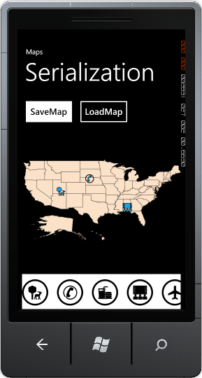
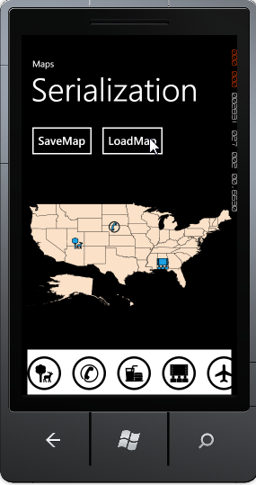

::: {style="DISPLAY: none"}
{#d2h_url_template}{#d2h_package_url style="WIDTH: 0px; DISPLAY: none; HEIGHT: 0px"}
:::

::::: {#nsbanner .d2h_main_nsbanner style="BORDER-BOTTOM: #999999 1px solid; POSITION: relative; PADDING-BOTTOM: 0px; BACKGROUND-COLOR: transparent; PADDING-LEFT: 0px; PADDING-RIGHT: 0px; DISPLAY: none; BORDER-TOP: #999999 1px solid; PADDING-TOP: 0px; LEFT: 0px"}
:::: {#TitleRow .d2h_main_titlerow style="PADDING-BOTTOM: 4px; BACKGROUND-COLOR: transparent; PADDING-LEFT: 22px; WIDTH: 100%; PADDING-RIGHT: 10px; DISPLAY: none; PADDING-TOP: 4px"}
::: {#ienav .d2h_main_ienav style="DISPLAY: none"}
{#D2HPrevious .D2HPreviousEnabled}  {#D2HNext .D2HNextEnabled}
:::
::::
:::::

:::::: {#nstext .d2h_main_nstext style="PADDING-BOTTOM: 10px; BACKGROUND-COLOR: transparent; PADDING-LEFT: 22px; PADDING-RIGHT: 10px; HEIGHT: 100%; OVERFLOW: auto; PADDING-TOP: 5px" hasuserbackground="true" valign="bottom"}
::: {#d2h_breadcrumbs .d2h_breadcrumbs}
[Essential Studio User Guide Documentation](ms-xhelp:///?Id=12457748-09e3-4d74-a240-8e049cedf030){.d2h_breadcrumbsNormal}[ \> ]{.d2h_breadcrumbsLinkSeparator}[User Interface Edition](ms-xhelp:///?Id=c29296b7-531c-413b-a0ec-488ca1f7f669){.d2h_breadcrumbsNormal}[ \> ]{.d2h_breadcrumbsLinkSeparator}[Essential Windows Phone](ms-xhelp:///?Id=5ea1999c-4eff-4775-b84e-407dc825f555){.d2h_breadcrumbsNormal}[ \> ]{.d2h_breadcrumbsLinkSeparator}[Essential Maps]{.d2h_breadcrumbsContentsOnly}[ \> ]{.d2h_breadcrumbsLinkSeparator}[Concepts and Features](ms-xhelp:///?Id=fe4335c8-1cb6-47a4-a6f3-e9bc318bba8d){.d2h_breadcrumbsNormal}
:::

## Import and Exporting Maps Elements {#import-and-exporting-maps-elements style="tab-stops: 0pt"}

 

Essential Maps now supports export and import option. You can export the maps as XML file through Isolated memory. Similarly you can also import the XML file as Maps.

 

Use Case Scenarios

Custom modification like adding label and symbols to the map will not be saved. This feature enables you to save such modification in XML file and import it again for later reference.

 

Methods

Table 14: Methods Table

::: {align="center"}
  Method   Description                       Parameters                   Type   Return Type   **[Reference links ]{style="LINE-HEIGHT: 115%; FONT-FAMILY: 'Calibri','sans-serif'; FONT-SIZE: 11pt"}**[]{style="LINE-HEIGHT: 115%; FONT-FAMILY: 'Calibri','sans-serif'; FONT-SIZE: 11pt"}
  -------- --------------------------------- ---------------------------- ------ ------------- --------------------------------------------------------------------------------------------------------------------------------------------------------------------------------------------
  Save     Export the maps as XML file.      String typed file location   NA     none          NA
  Load     Import the maps from XML files.   String typed file location   NA     none          NA
:::

[]{style="FONT-FAMILY: 'Calibri','sans-serif'; COLOR: black"} 

[]{style="COLOR: #c00000"} 

[]{style="COLOR: #c00000"} 

Export Maps as XML files[]{style="COLOR: #4e84c4"}

To export maps to XML file, set a XML file location as the parameter for the *Save* method.

The following code illustrates how to export the map as XML file:

 

+---------------------------------------------------------------------------------------------------------------------------------------------------------------------------------+
| **[\[C#\]]{style="FONT-FAMILY: Consolas; FONT-SIZE: 9.5pt"}**                                                                                                                   |
|                                                                                                                                                                                 |
| [this]{style="FONT-FAMILY: Consolas; COLOR: blue; FONT-SIZE: 9.5pt"}[.MapControl.Save([\"Map.xml\"]{style="COLOR: #a31515"});]{style="FONT-FAMILY: Consolas; FONT-SIZE: 9.5pt"} |
+---------------------------------------------------------------------------------------------------------------------------------------------------------------------------------+

 

{border="0"}

Figure 27: Export Map

 

::: {style="BORDER-BOTTOM: windowtext 1pt solid; BORDER-LEFT: medium none; PADDING-BOTTOM: 1pt; MARGIN-TOP: 9pt; PADDING-LEFT: 0pt; PADDING-RIGHT: 0pt; MARGIN-BOTTOM: 9pt; BORDER-TOP: windowtext 1pt solid; BORDER-RIGHT: medium none; PADDING-TOP: 1pt"}
Note: A XML file will be created in the specified location. If a file already exists it will overwrite the existing file.
:::

***[]{style="FONT-SIZE: 9pt"}*** 

Import Maps as XML files []{style="FONT-SIZE: 16pt"}

To import maps from XML file, set the saved file location as the parameter for the *Load* method.

The following code illustrates how to import the map from XML file:

 

+---------------------------------------------------------------------------------------------------------------------------------------------------------------------------------+
| **[\[C#\]]{style="FONT-FAMILY: Consolas; FONT-SIZE: 9.5pt"}**                                                                                                                   |
|                                                                                                                                                                                 |
| **[]{style="FONT-FAMILY: Consolas; FONT-SIZE: 9.5pt"}**                                                                                                                         |
|                                                                                                                                                                                 |
| [this]{style="FONT-FAMILY: Consolas; COLOR: blue; FONT-SIZE: 9.5pt"}[.MapControl.Load([\"Map.xml\"]{style="COLOR: #a31515"});]{style="FONT-FAMILY: Consolas; FONT-SIZE: 9.5pt"} |
+---------------------------------------------------------------------------------------------------------------------------------------------------------------------------------+

 

{border="0"}

Figure 28: Import Map

 

[]{#related-topics}
::::::
