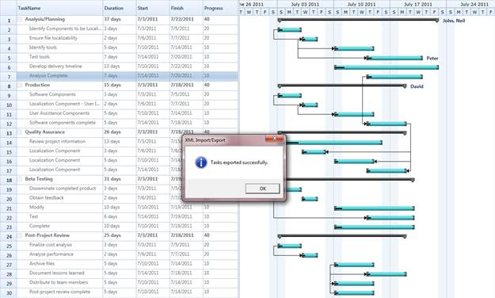
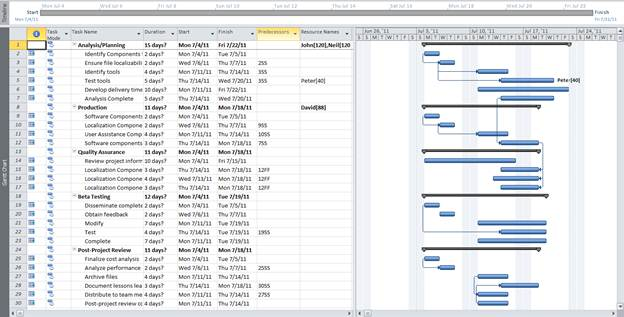

::: {style="DISPLAY: none"}
{#d2h_url_template}{#d2h_package_url style="WIDTH: 0px; DISPLAY: none; HEIGHT: 0px"}
:::

::::: {#nsbanner .d2h_main_nsbanner style="BORDER-BOTTOM: #999999 1px solid; POSITION: relative; PADDING-BOTTOM: 0px; BACKGROUND-COLOR: transparent; PADDING-LEFT: 0px; PADDING-RIGHT: 0px; DISPLAY: none; BORDER-TOP: #999999 1px solid; PADDING-TOP: 0px; LEFT: 0px"}
:::: {#TitleRow .d2h_main_titlerow style="PADDING-BOTTOM: 4px; BACKGROUND-COLOR: transparent; PADDING-LEFT: 22px; WIDTH: 100%; PADDING-RIGHT: 10px; DISPLAY: none; PADDING-TOP: 4px"}
::: {#ienav .d2h_main_ienav style="DISPLAY: none"}
{#D2HPrevious .D2HPreviousEnabled}  {#D2HNext .D2HNextEnabled}
:::
::::
:::::

:::::: {#nstext .d2h_main_nstext style="PADDING-BOTTOM: 10px; BACKGROUND-COLOR: transparent; PADDING-LEFT: 22px; PADDING-RIGHT: 10px; HEIGHT: 100%; OVERFLOW: auto; PADDING-TOP: 5px" hasuserbackground="true" valign="bottom"}
::: {#d2h_breadcrumbs .d2h_breadcrumbs}
[Essential Studio User Guide Documentation](ms-xhelp:///?Id=12457748-09e3-4d74-a240-8e049cedf030){.d2h_breadcrumbsNormal}[ \> ]{.d2h_breadcrumbsLinkSeparator}[User Interface Edition](ms-xhelp:///?Id=c29296b7-531c-413b-a0ec-488ca1f7f669){.d2h_breadcrumbsNormal}[ \> ]{.d2h_breadcrumbsLinkSeparator}[Essential Silverlight](ms-xhelp:///?Id=66221bd1-ba2e-43c2-94a7-618f50e01d24){.d2h_breadcrumbsNormal}[ \> ]{.d2h_breadcrumbsLinkSeparator}[Essential Gantt]{.d2h_breadcrumbsContentsOnly}[ \> ]{.d2h_breadcrumbsLinkSeparator}[Concepts and Features](ms-xhelp:///?Id=00182e64-b79e-45a4-817a-bc3646aff2c1){.d2h_breadcrumbsNormal}
:::

## Import and Export Support {#import-and-export-support style="tab-stops: 0pt"}

Essential Gantt allows you to export and import the task details. You can export the task detail as XML files and import them again when needed. You can open the exported XML files in MS Project too. The XML file, exported from MS Project can also be opened  in Gantt control. You can import and export the details using the provided APIs.

[[]{style="FONT-SIZE: 14pt"}]{.Heading4Char} 

Properties

 

::: {align="center"}
  ---------------------- ------------------------------------------------------------------------------------------------------------ --------- ----------------- -----------------
  Property               Description                                                                                                  Type      Data Type         Reference links
  ImportFromXMLCommand   Command binding used to import the XML file generated from MS Project to populate data's in Gantt control.   Command   DelegateCommand   
  ExportToXMLCommand     Command binding used to export the XML file generated from Gantt control to populate data's in MS Project.   Command   DelegateCommand    
  ---------------------- ------------------------------------------------------------------------------------------------------------ --------- ----------------- -----------------
:::

[]{style="FONT-FAMILY: 'Calibri','sans-serif'; COLOR: black"} 

Methods

 

::: {align="center"}
  Method                                    Description                                                                                   Parameters   Type                           Return Type                      Reference links
  ----------------------------------------- --------------------------------------------------------------------------------------------- ------------ ------------------------------ -------------------------------- ------------------------------
  ExportToXML()[]{style="COLOR: #c00000"}   Responsible for exporting the GanttControl to MSProject XML File.[]{style="COLOR: #c00000"}   \-           \-[]{style="COLOR: #c00000"}   bool[]{style="COLOR: #c00000"}   NA[]{style="COLOR: #c00000"}
  ImportFromXML()                           Reponsible for importing the data from MS Project XML file to GanttControl.                   \-           \-                             bool                             NA[]{style="COLOR: #c00000"}
:::

[]{style="FONT-SIZE: 11pt"} 

[]{style="FONT-SIZE: 11pt"} 

Import/Export Task Details from/to XML

[]{style="COLOR: #c00000"} 

The following code illustrates how to Import and Export  Task Details from or to XML

 

+------------------------------------------------------------------------------------------------------------------------------------------------------------------------------------------------------------------------------------------------------------------------------------------------------------------------------------------------------------------------------------------------------------------------------------------------------------------------+
| **[\[XAML\]]{style="FONT-FAMILY: 'Courier New'"}**                                                                                                                                                                                                                                                                                                                                                                                                                     |
|                                                                                                                                                                                                                                                                                                                                                                                                                                                                        |
| [\<]{style="FONT-FAMILY: 'Courier New'; COLOR: blue"}[Sync]{style="FONT-FAMILY: 'Courier New'; COLOR: #a31515"}[:]{style="FONT-FAMILY: 'Courier New'; COLOR: blue"}[GanttControl]{style="FONT-FAMILY: 'Courier New'; COLOR: #a31515"}[ x]{style="FONT-FAMILY: 'Courier New'; COLOR: red"}[:]{style="FONT-FAMILY: 'Courier New'; COLOR: blue"}[Name]{style="FONT-FAMILY: 'Courier New'; COLOR: red"}[=\"Gantt\" /\>]{style="FONT-FAMILY: 'Courier New'; COLOR: blue"}[\ |
| \                                                                                                                                                                                                                                                                                                                                                                                                                                                                      |
| []{style="COLOR: blue"}]{style="FONT-FAMILY: 'Courier New'"}                                                                                                                                                                                                                                                                                                                                                                                                           |
|                                                                                                                                                                                                                                                                                                                                                                                                                                                                        |
| [\<]{style="FONT-FAMILY: 'Courier New'; COLOR: blue"}[StackPanel]{style="FONT-FAMILY: 'Courier New'; COLOR: #a31515"}[ Orientation]{style="FONT-FAMILY: 'Courier New'; COLOR: red"}[=\"Horizontal\"]{style="FONT-FAMILY: 'Courier New'; COLOR: blue"}[ HorizontalAlignment]{style="FONT-FAMILY: 'Courier New'; COLOR: red"}[=\"Center\"\>]{style="FONT-FAMILY: 'Courier New'; COLOR: blue"}[\                                                                          |
| [      ]{style="COLOR: #a31515"}[\<]{style="COLOR: blue"}[Button]{style="COLOR: #a31515"}[ Height]{style="COLOR: red"}[=\"25\"]{style="COLOR: blue"}[ HorizontalAlignment]{style="COLOR: red"}[=\"Center\"]{style="COLOR: blue"}[ VerticalAlignment]{style="COLOR: red"}[=\"Center\"]{style="COLOR: blue"}[ ]{style="COLOR: red"}]{style="FONT-FAMILY: 'Courier New'"}                                                                                                 |
|                                                                                                                                                                                                                                                                                                                                                                                                                                                                        |
| [              Margin]{style="FONT-FAMILY: 'Courier New'; COLOR: red"}[=\"0,10,0,0\"]{style="FONT-FAMILY: 'Courier New'; COLOR: blue"}[ Width]{style="FONT-FAMILY: 'Courier New'; COLOR: red"}[=\"200\"]{style="FONT-FAMILY: 'Courier New'; COLOR: blue"}[                    \                                                                                                                                                                                        |
|               [Command]{style="COLOR: red"}[=\"{]{style="COLOR: blue"}[Binding]{style="COLOR: #a31515"}[ ExportToXMLCommand]{style="COLOR: red"}[,]{style="COLOR: blue"}[ ElementName]{style="COLOR: red"}[=gantt}\"]{style="COLOR: blue"}                    [Content]{style="COLOR: red"}[=\"Export To XML\" /\>]{style="COLOR: blue"}\                                                                                                                              |
| [      ]{style="COLOR: #a31515"}[\<]{style="COLOR: blue"}[Button]{style="COLOR: #a31515"}[ Height]{style="COLOR: red"}[=\"25\"]{style="COLOR: blue"}[ HorizontalAlignment]{style="COLOR: red"}[=\"Center\"]{style="COLOR: blue"}[ VerticalAlignment]{style="COLOR: red"}[=\"Center\"]{style="COLOR: blue"}[ ]{style="COLOR: red"}]{style="FONT-FAMILY: 'Courier New'"}                                                                                                 |
|                                                                                                                                                                                                                                                                                                                                                                                                                                                                        |
| [              Margin]{style="FONT-FAMILY: 'Courier New'; COLOR: red"}[=\"0,10,0,0\"]{style="FONT-FAMILY: 'Courier New'; COLOR: blue"}[ Width]{style="FONT-FAMILY: 'Courier New'; COLOR: red"}[=\"200\"]{style="FONT-FAMILY: 'Courier New'; COLOR: blue"}[\                                                                                                                                                                                                            |
|               [Command]{style="COLOR: red"}[=\"{]{style="COLOR: blue"}[Binding]{style="COLOR: #a31515"}[ ImportFromXMLCommand]{style="COLOR: red"}[,]{style="COLOR: blue"}[ ElementName]{style="COLOR: red"}[=gantt}\"]{style="COLOR: blue"}\                                                                                                                                                                                                                          |
|               [Content]{style="COLOR: red"}[=\"Import From XML\" /\>]{style="COLOR: blue"}\                                                                                                                                                                                                                                                                                                                                                                            |
| [\</]{style="COLOR: blue"}[StackPanel]{style="COLOR: #a31515"}[\>]{style="COLOR: blue"}]{style="FONT-FAMILY: 'Courier New'"}                                                                                                                                                                                                                                                                                                                                           |
|                                                                                                                                                                                                                                                                                                                                                                                                                                                                        |
| []{style="FONT-FAMILY: 'Courier New'; FONT-SIZE: 9.5pt"}                                                                                                                                                                                                                                                                                                                                                                                                               |
+------------------------------------------------------------------------------------------------------------------------------------------------------------------------------------------------------------------------------------------------------------------------------------------------------------------------------------------------------------------------------------------------------------------------------------------------------------------------+

 

+----------------------------------------------------------------------------------------------------------------------------------------------------------------------------------------+
| **[\[C#\]]{style="FONT-FAMILY: 'Courier New'"}**                                                                                                                                       |
|                                                                                                                                                                                        |
| [       [private]{style="COLOR: blue"} [void]{style="COLOR: blue"} SaveButton_Click([object]{style="COLOR: blue"} sender, System.Windows.[RoutedEventArgs]{style="COLOR: #2b91af"} e)\ |
|         {\                                                                                                                                                                             |
|             [if]{style="COLOR: blue"} ([this]{style="COLOR: blue"}.Gantt.ExportToXML())\                                                                                               |
|             {\                                                                                                                                                                         |
|                 [MessageBox]{style="COLOR: #2b91af"}.Show([\"Tasks exported successfully.\"]{style="COLOR: #a31515"}, \                                                                |
|                                 [\"XML Import/Export\"]{style="COLOR: #a31515"}, \                                                                                                     |
|                                  [MessageBoxButton]{style="COLOR: #2b91af"}.OK, \                                                                                                      |
|                                  [MessageBoxImage]{style="COLOR: #2b91af"}.Information);\                                                                                              |
|             }\                                                                                                                                                                         |
|         }\                                                                                                                                                                             |
|  \                                                                                                                                                                                     |
|         [private]{style="COLOR: blue"} [void]{style="COLOR: blue"} Open_Click([object]{style="COLOR: blue"} sender, System.Windows.[RoutedEventArgs]{style="COLOR: #2b91af"} e)\       |
|         {\                                                                                                                                                                             |
|             [if]{style="COLOR: blue"} ([this]{style="COLOR: blue"}.Gantt.ImportFromXML())\                                                                                             |
|             {\                                                                                                                                                                         |
|                 [MessageBox]{style="COLOR: #2b91af"}.Show([\"Tasks imported successfully.\"]{style="COLOR: #a31515"}, \                                                                |
|                                 [\"XML Import/Export\"]{style="COLOR: #a31515"}, \                                                                                                     |
|                                 [MessageBoxButton]{style="COLOR: #2b91af"}.OK, \                                                                                                       |
|                                 [MessageBoxImage]{style="COLOR: #2b91af"}.Information);\                                                                                               |
|             }\                                                                                                                                                                         |
|         }]{style="FONT-FAMILY: 'Courier New'"}                                                                                                                                         |
|                                                                                                                                                                                        |
| []{style="FONT-FAMILY: 'Courier New'; FONT-SIZE: 9.5pt"}                                                                                                                               |
+----------------------------------------------------------------------------------------------------------------------------------------------------------------------------------------+

[]{style="COLOR: #c00000"} 

[]{style="COLOR: #c00000"} 

{border="0"}

Figure 36: XML Export Import

 

Importing the exported document in MS Project,

 

[{border="0"}]{style="COLOR: #c00000"}

Figure 37:  Exported document opened in MS Project.

[]{style="COLOR: #c00000"} 

[]{style="COLOR: #c00000"} 

Samples Link

To view samples:

1.   Select Start -\> Programs -\> Syncfusion -\> Essential Studio x.x.xx -\> Dashboard.

2.   Click **Run Samples** for Silverlight under User Interface Edition panel .

3.   Select **Gantt**.

4.   Expand the Import Export Features item in the Sample Browser.

5.   Choose the Import Export Demo samples to launch.

 

[]{#related-topics}
::::::
