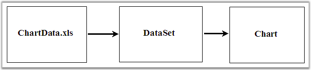

::: {style="DISPLAY: none"}
{#d2h_url_template}{#d2h_package_url style="WIDTH: 0px; DISPLAY: none; HEIGHT: 0px"}
:::

::: {.d2h_secondary_topic style="PADDING-BOTTOM: 10pt; MARGIN: 0pt; PADDING-LEFT: 0pt; PADDING-RIGHT: 0pt; PADDING-TOP: 0pt"}
#### Import Data from Excel to a Chart {#import-data-from-excel-to-a-chart style="tab-stops: 0pt"}

There is no built-in support in chart for importing data from MS Excel (XLS) files. But this can be easily accomplished by using the \"Microsoft.Jet.OLEDB.4.0\" by first converting it into a DataSet and then binding it to the chart. This is illustrated in the following sample that is distributed with the installation:

[]{style="FONT-FAMILY: 'Times New Roman','serif'; FONT-SIZE: 12pt"} 

{border="0"}

Figure 284: Importing data from Excel to Chart

[]{#related-topics}
:::
