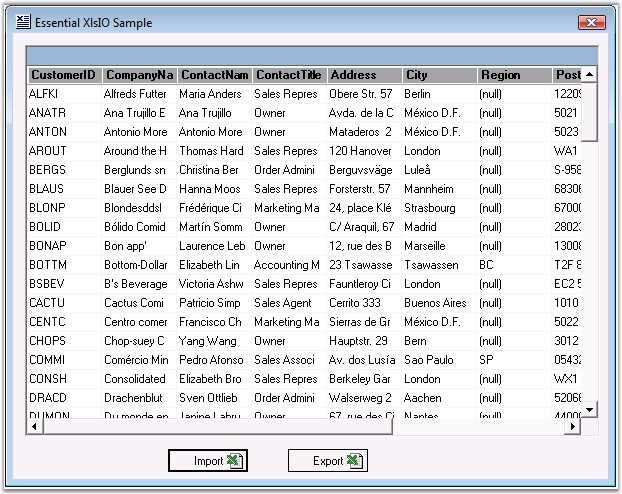
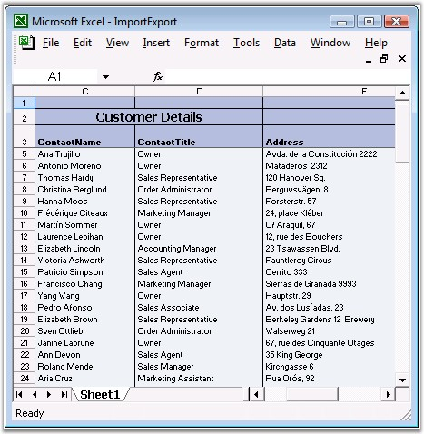

::: {style="DISPLAY: none"}
{#d2h_url_template}{#d2h_package_url style="WIDTH: 0px; DISPLAY: none; HEIGHT: 0px"}
:::

::::: {#nsbanner .d2h_main_nsbanner style="BORDER-BOTTOM: #999999 1px solid; POSITION: relative; PADDING-BOTTOM: 0px; BACKGROUND-COLOR: transparent; PADDING-LEFT: 0px; PADDING-RIGHT: 0px; DISPLAY: none; BORDER-TOP: #999999 1px solid; PADDING-TOP: 0px; LEFT: 0px"}
:::: {#TitleRow .d2h_main_titlerow style="PADDING-BOTTOM: 4px; BACKGROUND-COLOR: transparent; PADDING-LEFT: 22px; WIDTH: 100%; PADDING-RIGHT: 10px; DISPLAY: none; PADDING-TOP: 4px"}
::: {#ienav .d2h_main_ienav style="DISPLAY: none"}
{#D2HPrevious .D2HPreviousEnabled}  {#D2HNext .D2HNextEnabled}
:::
::::
:::::

:::::::: {#nstext .d2h_main_nstext style="PADDING-BOTTOM: 10px; BACKGROUND-COLOR: transparent; PADDING-LEFT: 22px; PADDING-RIGHT: 10px; HEIGHT: 100%; OVERFLOW: auto; PADDING-TOP: 5px" hasuserbackground="true" valign="bottom"}
::: {#d2h_breadcrumbs .d2h_breadcrumbs}
[Essential Studio User Guide Documentation](ms-xhelp:///?Id=12457748-09e3-4d74-a240-8e049cedf030){.d2h_breadcrumbsNormal}[ \> ]{.d2h_breadcrumbsLinkSeparator}[Reporting Edition](ms-xhelp:///?Id=027aa5b6-6676-4f93-ad23-c20e8c45792e){.d2h_breadcrumbsNormal}[ \> ]{.d2h_breadcrumbsLinkSeparator}[Essential XlsIO](ms-xhelp:///?Id=b01a1b50-1d7d-40c0-bc83-af67e57c9005){.d2h_breadcrumbsNormal}[ \> ]{.d2h_breadcrumbsLinkSeparator}[Concepts and Features](ms-xhelp:///?Id=21b26556-5905-4ad9-90b4-40320db25faf){.d2h_breadcrumbsNormal}[ \> ]{.d2h_breadcrumbsLinkSeparator}[Data](ms-xhelp:///?Id=09eb021a-c01a-47a5-bf60-fb7c3ed89c78){.d2h_breadcrumbsNormal}
:::

### Import/Export {#importexport style="tab-stops: 0pt"}

**[]{style="FONT-FAMILY: 'Segoe UI','sans-serif'; COLOR: black"}** 

XlsIO has some helper methods that enable working with the ADO.NET data sources very easily.

[]{style="FONT-FAMILY: 'Trebuchet MS','sans-serif'; COLOR: #15428b; FONT-SIZE: 9pt"} 

Importing

[]{style="FONT-FAMILY: 'Trebuchet MS','sans-serif'; COLOR: #15428b; FONT-SIZE: 9pt"} 

It only takes one line of code to import an ADO.NET data table into a worksheet. There are similar methods for working with other data sources like **Data View**, **Data Column**, **Arrays**, and so on. A data table from another source can be imported inside a worksheet by using the **ImportDataTable** method. It has an option to select the record range (row start, row end, col start and col end). It also allows preserving the data type in the data source.

[]{style="FONT-FAMILY: 'Trebuchet MS','sans-serif'; COLOR: #15428b; FONT-SIZE: 9pt"} 

Exporting

[]{style="FONT-FAMILY: 'Trebuchet MS','sans-serif'; COLOR: #15428b; FONT-SIZE: 9pt"} 

Similarly, it is simple to export the sheet data to a data table by using the **ExportDataTable** method of IWorksheet. This method allows to select the various data table options such as include column names, export formula calculated values, styles and types, through the **ExcelExportDataTableOption** enumeration. It has the following values.

[]{style="FONT-FAMILY: 'Trebuchet MS','sans-serif'; COLOR: #15428b; FONT-SIZE: 9pt"} 

::: {align="center"}
  ------------------------- -------------------------------------------------------------------------------------------------------------------------------------------------------------------------------------------------------------------------------------------------------------------------------------------------------------------------------------------------------------------------------
  Member Name               Description
  None                      No datatable exports flags.
  ColumnNames               Represents the ColumnNames datatable export flag.
  ComputedFormulaValues     Represents the ComputedFormulaValues datatable export flag.
  DetectColumnTypes         Indicates that XlsIO should try to detect column types.
  DefaultStyleColumnTypes   When DetectColumnTypes is set and this flag is set too, it means that [[default column style]{style="FONT-FAMILY: 'Trebuchet MS','sans-serif'; FONT-SIZE: 9pt"}](ms-xhelp:///?Id=e3e17bbe-6827-4671-baed-5aa5f4620ffb) must be used to detect style, if this flag is not set, but DetectColumnTypes is set, then first cell in the column will be used to detect column type.
  ------------------------- -------------------------------------------------------------------------------------------------------------------------------------------------------------------------------------------------------------------------------------------------------------------------------------------------------------------------------------------------------------------------------
:::

[]{style="FONT-FAMILY: 'Trebuchet MS','sans-serif'; COLOR: #15428b; FONT-SIZE: 9pt"} 

***[]{style="FONT-FAMILY: 'Trebuchet MS','sans-serif'; COLOR: #15428b; FONT-SIZE: 9pt"}*** 

***[{border="0"}]{style="COLOR: #15428b"}[ ]{style="COLOR: #15428b"}***For more information on this feature, see:[ ]{style="COLOR: #15428b"}<http://www.syncfusion.com/products/reporting-edition/xlsio/features#export-options> []{style="COLOR: #15428b"}

 

The following image illustrates the import and export of the data from/to a grid or database.

 

{border="0"}

Figure 133: Import/Export Data[]{style="FONT-FAMILY: 'Trebuchet MS','sans-serif'; COLOR: #15428b"}

 

Following code example illustrates how to export a data table from a sheet to a grid, and then import a data table from a data grid to a sheet.

 

+------------------------------------------------------------------------------------------------------------------------------------------------------------------------------------------------------------------------------------------------------------------------------------------------------------------------------------------------------------+
| **[\[C#\]]{style="FONT-FAMILY: 'Courier New'"}**                                                                                                                                                                                                                                                                                                           |
|                                                                                                                                                                                                                                                                                                                                                            |
| **[]{style="FONT-FAMILY: 'Courier New'"}**                                                                                                                                                                                                                                                                                                                 |
|                                                                                                                                                                                                                                                                                                                                                            |
| [// Read data from the spreadsheet.]{style="FONT-FAMILY: 'Courier New'; COLOR: green"}                                                                                                                                                                                                                                                                     |
|                                                                                                                                                                                                                                                                                                                                                            |
| [DataTable customersTable = sheet.ExportDataTable(sheet.UsedRange,ExcelExportDataTableOptions.ColumnNames);]{style="FONT-FAMILY: 'Courier New'; COLOR: black"}                                                                                                                                                                                             |
|                                                                                                                                                                                                                                                                                                                                                            |
| [this]{style="FONT-FAMILY: 'Courier New'; COLOR: blue"}[.dataGrid1.DataSource = customersTable;]{style="FONT-FAMILY: 'Courier New'; COLOR: black"}                                                                                                                                                                                                         |
|                                                                                                                                                                                                                                                                                                                                                            |
| []{style="FONT-FAMILY: 'Courier New'"}                                                                                                                                                                                                                                                                                                                     |
|                                                                                                                                                                                                                                                                                                                                                            |
| [// Export DataTable.]{style="FONT-FAMILY: 'Courier New'; COLOR: green"}                                                                                                                                                                                                                                                                                   |
|                                                                                                                                                                                                                                                                                                                                                            |
| [if]{style="FONT-FAMILY: 'Courier New'; COLOR: blue"}[(]{style="FONT-FAMILY: 'Courier New'; COLOR: black"}[this]{style="FONT-FAMILY: 'Courier New'; COLOR: blue"}[.dataGrid1.DataSource != ]{style="FONT-FAMILY: 'Courier New'; COLOR: black"}[null]{style="FONT-FAMILY: 'Courier New'; COLOR: blue"}[)]{style="FONT-FAMILY: 'Courier New'; COLOR: black"} |
|                                                                                                                                                                                                                                                                                                                                                            |
| [{]{style="FONT-FAMILY: 'Courier New'; COLOR: black"}                                                                                                                                                                                                                                                                                                      |
|                                                                                                                                                                                                                                                                                                                                                            |
| [        sheet.ImportDataTable((DataTable)]{style="FONT-FAMILY: 'Courier New'; COLOR: black"}[this]{style="FONT-FAMILY: 'Courier New'; COLOR: blue"}[.dataGrid1.DataSource,]{style="FONT-FAMILY: 'Courier New'; COLOR: black"}[true]{style="FONT-FAMILY: 'Courier New'; COLOR: blue"}[,1,1,-1,-1);]{style="FONT-FAMILY: 'Courier New'; COLOR: black"}      |
|                                                                                                                                                                                                                                                                                                                                                            |
| [}]{style="FONT-FAMILY: 'Courier New'; COLOR: black"}                                                                                                                                                                                                                                                                                                      |
|                                                                                                                                                                                                                                                                                                                                                            |
| [else]{style="FONT-FAMILY: 'Courier New'; COLOR: blue"}                                                                                                                                                                                                                                                                                                    |
|                                                                                                                                                                                                                                                                                                                                                            |
| [{]{style="FONT-FAMILY: 'Courier New'"}                                                                                                                                                                                                                                                                                                                    |
|                                                                                                                                                                                                                                                                                                                                                            |
| [        [MessageBox.Show(\"There is no datatable to export, Please import a datatable first\",\"Error\");]{style="COLOR: black"}]{style="FONT-FAMILY: 'Courier New'"}                                                                                                                                                                                     |
|                                                                                                                                                                                                                                                                                                                                                            |
| [        ]{style="FONT-FAMILY: 'Courier New'; COLOR: black"}[return]{style="FONT-FAMILY: 'Courier New'; COLOR: blue"}[;]{style="FONT-FAMILY: 'Courier New'; COLOR: black"}                                                                                                                                                                                 |
|                                                                                                                                                                                                                                                                                                                                                            |
| [} ]{style="FONT-FAMILY: 'Courier New'; COLOR: black"}                                                                                                                                                                                                                                                                                                     |
+------------------------------------------------------------------------------------------------------------------------------------------------------------------------------------------------------------------------------------------------------------------------------------------------------------------------------------------------------------+

[]{style="FONT-FAMILY: 'Trebuchet MS','sans-serif'; COLOR: #15428b; FONT-SIZE: 9pt"} 

+--------------------------------------------------------------------------------------------------------------------------------------------------------------------------------------------------------------------------------------------------------------------------------------------------------------------------------+
| **[\[VB.NET\]]{style="FONT-FAMILY: 'Courier New'"}**                                                                                                                                                                                                                                                                           |
|                                                                                                                                                                                                                                                                                                                                |
| **[]{style="FONT-FAMILY: 'Courier New'"}**                                                                                                                                                                                                                                                                                     |
|                                                                                                                                                                                                                                                                                                                                |
| [\' Read data from the spreadsheet.]{style="FONT-FAMILY: 'Courier New'; COLOR: green"}                                                                                                                                                                                                                                         |
|                                                                                                                                                                                                                                                                                                                                |
| [Dim]{style="FONT-FAMILY: 'Courier New'; COLOR: blue"}[ customersTable ]{style="FONT-FAMILY: 'Courier New'; COLOR: black"}[As]{style="FONT-FAMILY: 'Courier New'; COLOR: blue"}[ DataTable = sheet.ExportDataTable(sheet.UsedRange,ExcelExportDataTableOptions.ColumnNames)]{style="FONT-FAMILY: 'Courier New'; COLOR: black"} |
|                                                                                                                                                                                                                                                                                                                                |
| [Me]{style="FONT-FAMILY: 'Courier New'; COLOR: blue"}[.dataGrid1.DataSource = customersTable]{style="FONT-FAMILY: 'Courier New'; COLOR: black"}                                                                                                                                                                                |
|                                                                                                                                                                                                                                                                                                                                |
| []{style="FONT-FAMILY: 'Courier New'"}                                                                                                                                                                                                                                                                                         |
|                                                                                                                                                                                                                                                                                                                                |
| [\' Export DataTable.]{style="FONT-FAMILY: 'Courier New'; COLOR: green"}                                                                                                                                                                                                                                                       |
|                                                                                                                                                                                                                                                                                                                                |
| [If Not Me]{style="FONT-FAMILY: 'Courier New'; COLOR: blue"}[.dataGrid1.DataSource]{style="FONT-FAMILY: 'Courier New'; COLOR: black"}[ [Is Nothing Then]{style="COLOR: blue"}]{style="FONT-FAMILY: 'Courier New'"}                                                                                                             |
|                                                                                                                                                                                                                                                                                                                                |
| [      [  sheet.ImportDataTable(]{style="COLOR: black"}[CType]{style="COLOR: blue"}[(]{style="COLOR: black"}[Me]{style="COLOR: blue"}[.dataGrid1.DataSource, DataTable),]{style="COLOR: black"}[True]{style="COLOR: blue"}[,1,1,-1,-1)]{style="COLOR: black"}]{style="FONT-FAMILY: 'Courier New'"}                             |
|                                                                                                                                                                                                                                                                                                                                |
| [Else]{style="FONT-FAMILY: 'Courier New'; COLOR: blue"}                                                                                                                                                                                                                                                                        |
|                                                                                                                                                                                                                                                                                                                                |
| [        [MessageBox.Show(\"There is no datatable to export, Please import a datatable first\",\"Error\")]{style="COLOR: black"}]{style="FONT-FAMILY: 'Courier New'"}                                                                                                                                                          |
|                                                                                                                                                                                                                                                                                                                                |
| [        ]{style="FONT-FAMILY: 'Courier New'; COLOR: black"}[Return]{style="FONT-FAMILY: 'Courier New'; COLOR: blue"}                                                                                                                                                                                                          |
|                                                                                                                                                                                                                                                                                                                                |
| [End If ]{style="FONT-FAMILY: 'Courier New'; COLOR: blue"}                                                                                                                                                                                                                                                                     |
+--------------------------------------------------------------------------------------------------------------------------------------------------------------------------------------------------------------------------------------------------------------------------------------------------------------------------------+

 

ImportDataTable has few overloads which can be used to enable some of the customization options. For more details, see XlsIO class reference in [[Online documentation]{.UGHyperlink}](http://help.syncfusion.com).

 

It enables importing data from named ranges, allows to show/hide field names in the columns, import only a particular range of records in a data table, and allows to preserve the data types in a data table.

  

{border="0"}

Figure 134: MS Excel file generated from the Grid data by using XlsIO[]{style="FONT-FAMILY: 'Trebuchet MS','sans-serif'; COLOR: #15428b"}

***[]{style="FONT-FAMILY: 'Trebuchet MS','sans-serif'; COLOR: #15428b; FONT-SIZE: 9pt"}*** 

**[]{style="FONT-FAMILY: 'Trebuchet MS','sans-serif'; COLOR: #15428b"}** 

 Exporting Excel to PDF

**[]{style="FONT-FAMILY: 'Trebuchet MS','sans-serif'; COLOR: #15428b"}** 

Essential XlsIO allows exporting an Excel document into PDF format. Use the Convert method of the ExcelToPdfConverter class to convert the Excel spreadsheet and save the PDF output.

::: {style="BORDER-BOTTOM: windowtext 1pt solid; BORDER-LEFT: medium none; PADDING-BOTTOM: 1pt; MARGIN-TOP: 9pt; PADDING-LEFT: 0pt; PADDING-RIGHT: 0pt; MARGIN-BOTTOM: 9pt; BORDER-TOP: windowtext 1pt solid; BORDER-RIGHT: medium none; PADDING-TOP: 1pt"}
{border="0"}Note:[ ]{style="FONT-FAMILY: 'Calibri','sans-serif'"}You need to have both Essential PDF and Essential XlsIO installed in your system since Syncfusion.ExceltoPDFConverter.Base.dll is conditionally shipped when both XlsIO.Base and Pdf.Base is installed.
:::

[]{style="FONT-FAMILY: 'Trebuchet MS','sans-serif'; COLOR: #15428b; FONT-SIZE: 9pt"} 

[]{style="FONT-FAMILY: 'Trebuchet MS','sans-serif'; COLOR: #15428b; FONT-SIZE: 9pt"} 

+--------------------------------------------------------------------------------------------------------------------------------------------------------------------------------------------------------------------------------------------------+
| **[\[C#\]]{style="FONT-FAMILY: 'Courier New'"}**                                                                                                                                                                                                 |
|                                                                                                                                                                                                                                                  |
| **[]{style="FONT-FAMILY: 'Courier New'"}**                                                                                                                                                                                                       |
|                                                                                                                                                                                                                                                  |
| [//Open the Excel document you want to convert]{style="FONT-FAMILY: 'Courier New'; COLOR: green"}                                                                                                                                                |
|                                                                                                                                                                                                                                                  |
| [ExcelToPdfConverter]{style="FONT-FAMILY: 'Courier New'; COLOR: #2b91af"}[ converter = [new]{style="COLOR: blue"} [ExcelToPdfConverter]{style="COLOR: #2b91af"}([\"Sample.xlsx\"]{style="COLOR: #a31515"});]{style="FONT-FAMILY: 'Courier New'"} |
|                                                                                                                                                                                                                                                  |
| [                        ]{style="FONT-FAMILY: 'Courier New'"}                                                                                                                                                                                   |
|                                                                                                                                                                                                                                                  |
| [//Initialize the PDF document]{style="FONT-FAMILY: 'Courier New'; COLOR: green"}                                                                                                                                                                |
|                                                                                                                                                                                                                                                  |
| [PdfDocument]{style="FONT-FAMILY: 'Courier New'; COLOR: #2b91af"}[ pdfDoc = [new]{style="COLOR: blue"} [PdfDocument]{style="COLOR: #2b91af"}();               ]{style="FONT-FAMILY: 'Courier New'"}                                              |
|                                                                                                                                                                                                                                                  |
| [                              ]{style="FONT-FAMILY: 'Courier New'"}                                                                                                                                                                             |
|                                                                                                                                                                                                                                                  |
| [//Initialize the ExcelToPdfconverterSettings]{style="FONT-FAMILY: 'Courier New'; COLOR: green"}                                                                                                                                                 |
|                                                                                                                                                                                                                                                  |
| [ExcelToPdfConverterSettings]{style="FONT-FAMILY: 'Courier New'; COLOR: #2b91af"}[ settings = [new]{style="COLOR: blue"} [ExcelToPdfConverterSettings]{style="COLOR: #2b91af"}();]{style="FONT-FAMILY: 'Courier New'"}                           |
|                                                                                                                                                                                                                                                  |
| [              ]{style="FONT-FAMILY: 'Courier New'"}                                                                                                                                                                                             |
|                                                                                                                                                                                                                                                  |
| [// Set the Layout Options for the output Pdf page.]{style="FONT-FAMILY: 'Courier New'; COLOR: green"}                                                                                                                                           |
|                                                                                                                                                                                                                                                  |
| [settings.LayoutOptions = [LayoutOptions]{style="COLOR: #2b91af"}.FitSheetOnOnePage;]{style="FONT-FAMILY: 'Courier New'"}                                                                                                                        |
|                                                                                                                                                                                                                                                  |
| []{style="FONT-FAMILY: 'Courier New'"}                                                                                                                                                                                                           |
|                                                                                                                                                                                                                                                  |
| [//Assign the PDF document to the TemplateDocument property of ExcelToPdfConverterSettings]{style="FONT-FAMILY: 'Courier New'; COLOR: green"}                                                                                                    |
|                                                                                                                                                                                                                                                  |
| [settings.TemplateDocument = pdfDoc;]{style="FONT-FAMILY: 'Courier New'"}                                                                                                                                                                        |
|                                                                                                                                                                                                                                                  |
| [settings.DisplayGridLines = [GridLinesDisplayStyle]{style="COLOR: #2b91af"}.Invisible;]{style="FONT-FAMILY: 'Courier New'"}                                                                                                                     |
|                                                                                                                                                                                                                                                  |
| [                ]{style="FONT-FAMILY: 'Courier New'"}                                                                                                                                                                                           |
|                                                                                                                                                                                                                                                  |
| [//Convert the Excel document to PDF document]{style="FONT-FAMILY: 'Courier New'; COLOR: green"}                                                                                                                                                 |
|                                                                                                                                                                                                                                                  |
| [pdfDoc = converter.Convert(settings);]{style="FONT-FAMILY: 'Courier New'"}                                                                                                                                                                      |
|                                                                                                                                                                                                                                                  |
| [                        ]{style="FONT-FAMILY: 'Courier New'"}                                                                                                                                                                                   |
|                                                                                                                                                                                                                                                  |
| [//Save the PDF file]{style="FONT-FAMILY: 'Courier New'; COLOR: green"}                                                                                                                                                                          |
|                                                                                                                                                                                                                                                  |
| [pdfDoc.Save([\"ExceltoPdf.pdf\"]{style="COLOR: #a31515"});]{style="FONT-FAMILY: 'Courier New'"}[]{style="FONT-FAMILY: 'Courier New'"}                                                                                                           |
+--------------------------------------------------------------------------------------------------------------------------------------------------------------------------------------------------------------------------------------------------+

[]{style="FONT-FAMILY: 'Trebuchet MS','sans-serif'; COLOR: #15428b; FONT-SIZE: 9pt"} 

+----------------------------------------------------------------------------------------------------------------------------------------------------------------------------------------------------------------------------+
| **[\[VB.NET\]]{style="FONT-FAMILY: 'Courier New'"}**                                                                                                                                                                       |
|                                                                                                                                                                                                                            |
| **[]{style="FONT-FAMILY: 'Courier New'"}**                                                                                                                                                                                 |
|                                                                                                                                                                                                                            |
| [\'Open the Excel document you want to convert]{style="FONT-FAMILY: 'Courier New'; COLOR: green"}[]{style="FONT-FAMILY: 'Courier New'"}                                                                                    |
|                                                                                                                                                                                                                            |
| [Dim]{style="FONT-FAMILY: 'Courier New'; COLOR: blue"}[ converter [As]{style="COLOR: blue"} [New]{style="COLOR: blue"} ExcelToPdfConverter([\"Sample.xlsx\"]{style="COLOR: darkred"})]{style="FONT-FAMILY: 'Courier New'"} |
|                                                                                                                                                                                                                            |
| []{style="FONT-FAMILY: 'Courier New'"}                                                                                                                                                                                     |
|                                                                                                                                                                                                                            |
| [\'Initialize the PDF document]{style="FONT-FAMILY: 'Courier New'; COLOR: green"}[]{style="FONT-FAMILY: 'Courier New'"}                                                                                                    |
|                                                                                                                                                                                                                            |
| [Dim]{style="FONT-FAMILY: 'Courier New'; COLOR: blue"}[ pdfDoc [As]{style="COLOR: blue"} [New]{style="COLOR: blue"} PdfDocument()]{style="FONT-FAMILY: 'Courier New'"}                                                     |
|                                                                                                                                                                                                                            |
| []{style="FONT-FAMILY: 'Courier New'"}                                                                                                                                                                                     |
|                                                                                                                                                                                                                            |
| [\'Initialize the ExcelToPdfconverterSettings]{style="FONT-FAMILY: 'Courier New'; COLOR: green"}[]{style="FONT-FAMILY: 'Courier New'"}                                                                                     |
|                                                                                                                                                                                                                            |
| [Dim]{style="FONT-FAMILY: 'Courier New'; COLOR: blue"}[ settings [As]{style="COLOR: blue"} [New]{style="COLOR: blue"} ExcelToPdfConverterSettings()]{style="FONT-FAMILY: 'Courier New'"}                                   |
|                                                                                                                                                                                                                            |
| []{style="FONT-FAMILY: 'Courier New'"}                                                                                                                                                                                     |
|                                                                                                                                                                                                                            |
| [\'Set the Layout Options for the output PDF page.]{style="FONT-FAMILY: 'Courier New'; COLOR: green"}[]{style="FONT-FAMILY: 'Courier New'"}                                                                                |
|                                                                                                                                                                                                                            |
| [settings.LayoutOptions = LayoutOptions.FitSheetOnOnePage]{style="FONT-FAMILY: 'Courier New'"}                                                                                                                             |
|                                                                                                                                                                                                                            |
| []{style="FONT-FAMILY: 'Courier New'"}                                                                                                                                                                                     |
|                                                                                                                                                                                                                            |
| [\'Assign the PDF document to the TemplateDocument property of ExcelToPdfConverterSettings]{style="FONT-FAMILY: 'Courier New'; COLOR: green"}[]{style="FONT-FAMILY: 'Courier New'"}                                        |
|                                                                                                                                                                                                                            |
| [settings.TemplateDocument = pdfDoc]{style="FONT-FAMILY: 'Courier New'"}                                                                                                                                                   |
|                                                                                                                                                                                                                            |
| [settings.DisplayGridLines = GridLinesDisplayStyle.Invisible]{style="FONT-FAMILY: 'Courier New'"}                                                                                                                          |
|                                                                                                                                                                                                                            |
| []{style="FONT-FAMILY: 'Courier New'"}                                                                                                                                                                                     |
|                                                                                                                                                                                                                            |
| [\'Convert the Excel document to PDF document]{style="FONT-FAMILY: 'Courier New'; COLOR: green"}[]{style="FONT-FAMILY: 'Courier New'"}                                                                                     |
|                                                                                                                                                                                                                            |
| [pdfDoc = converter.Convert(settings)]{style="FONT-FAMILY: 'Courier New'"}                                                                                                                                                 |
|                                                                                                                                                                                                                            |
| []{style="FONT-FAMILY: 'Courier New'"}                                                                                                                                                                                     |
|                                                                                                                                                                                                                            |
| [\'Save the PDF file]{style="FONT-FAMILY: 'Courier New'; COLOR: green"}[]{style="FONT-FAMILY: 'Courier New'"}                                                                                                              |
|                                                                                                                                                                                                                            |
| [pdfDoc.Save([\"ExceltoPdf.pdf\"]{style="COLOR: darkred"})]{style="FONT-FAMILY: 'Courier New'"}                                                                                                                            |
|                                                                                                                                                                                                                            |
| []{style="FONT-FAMILY: 'Courier New'"}                                                                                                                                                                                     |
+----------------------------------------------------------------------------------------------------------------------------------------------------------------------------------------------------------------------------+

[]{style="FONT-FAMILY: 'Trebuchet MS','sans-serif'; COLOR: #15428b; FONT-SIZE: 9pt"} 

Supported Elements

**[]{style="FONT-FAMILY: 'Trebuchet MS','sans-serif'; COLOR: #15428b; FONT-SIZE: 9pt"}** 

This feature provides support for the following elements:

 

[·      ]{style="FONT-FAMILY: Symbol"}Styles

[·      ]{style="FONT-FAMILY: Symbol"}Character formatting

[·      ]{style="FONT-FAMILY: Symbol"}Headers  and footers

[·      ]{style="FONT-FAMILY: Symbol"}Images

[·      ]{style="FONT-FAMILY: Symbol"}Text boxes

[·      ]{style="FONT-FAMILY: Symbol"}Hyperlinks

[·      ]{style="FONT-FAMILY: Symbol"}Document properties

[·      ]{style="FONT-FAMILY: Symbol"}Comments

[·      ]{style="FONT-FAMILY: Symbol"}Encryption

[·      ]{style="FONT-FAMILY: Symbol"}TableStyle Support

[·      ]{style="FONT-FAMILY: Symbol"}Text Rotations

[·      ]{style="FONT-FAMILY: Symbol"}Excel Page Setup Options

[·      ]{style="FONT-FAMILY: Symbol"}Unicode Support

[·      ]{style="FONT-FAMILY: Symbol"}Background Images

[·      ]{style="FONT-FAMILY: Symbol"}Printing Titles when Converting the Excel to PDF

[·      ]{style="FONT-FAMILY: Symbol"}Page Break Support

[·      ]{style="FONT-FAMILY: Symbol"}Print Area Support

[·      ]{style="FONT-FAMILY: Symbol"}Print Order Support

[·      ]{style="FONT-FAMILY: Symbol"}Unicode in Headers and Footers

​[]{style="FONT-FAMILY: 'Trebuchet MS','sans-serif'; COLOR: #15428b; FONT-SIZE: 9pt"}

Styles

This feature supports almost all the styles supported by Excel 2007.

 

Character formatting

This feature supports almost all character formatting. The supported character formatting features are:

[·      ]{style="FONT-FAMILY: Symbol"}Character fonts

[·      ]{style="FONT-FAMILY: Symbol"}Font size

[·      ]{style="FONT-FAMILY: Symbol"}Font styles (bold, italic, underline, and strikethrough)

[·      ]{style="FONT-FAMILY: Symbol"}Subscript and superscript

[·      ]{style="FONT-FAMILY: Symbol"}Text highlighting

[·      ]{style="FONT-FAMILY: Symbol"}Indents, tabs, and spaces

[·      ]{style="FONT-FAMILY: Symbol"}Line spacing

[·      ]{style="FONT-FAMILY: Symbol"}Left, right, and center justification

[·      ]{style="FONT-FAMILY: Symbol"}Line breaks within the cell

 

Headers and Footers

Page headers and footers are supported and can contain images, text, and page number fields.

 

Images

The images present in the document are supported along with their corresponding positions and sizes.[ ]{style="FONT-FAMILY: 'Times New Roman','serif'; FONT-SIZE: 12pt"}

**Known Limitations** - Images placed inside a shape will not be preserved in the generated PDF document.

 

[]{style="FONT-FAMILY: 'Times New Roman','serif'; FONT-SIZE: 12pt"} 

Text Box

The text value present in the text box will be rendered as text at its actual position in the generated PDF document.

[]{style="FONT-FAMILY: 'Times New Roman','serif'; FONT-SIZE: 12pt"} 

Hyperlinks

The hyperlinks present in the Excel documents will also be preserved in the generated PDF document.

[]{style="FONT-FAMILY: 'Times New Roman','serif'; FONT-SIZE: 12pt"} 

Document Properties

Document properties present in the Excel documents will also be preserved in the generated PDF document.

 

Table Styles Support

Built-In Table styles present in the Excel documents will also be preserved in the generated PDF document.

 

Text Rotations

Rotated text present in the Excel sheet cell will be preserved in the generated PDF document.

 

Excel sheet Page Setup options

The Page setup option of the input Excel sheet will be preserved in the generated PDF document. The following are the Excel page setup options that are preserved.

[·      ]{style="FONT-FAMILY: Symbol"}Orientation

[·      ]{style="FONT-FAMILY: Symbol"}Center On Page

 

Unicode Support

The other language and unicode present in the input Excel document will be preserved in the generated PDF document.

 

Background Images

The Background image present in the Excel document will be preserved in the generated PDF document.

::: {style="BORDER-BOTTOM: windowtext 1pt solid; BORDER-LEFT: medium none; PADDING-BOTTOM: 1pt; MARGIN-TOP: 9pt; PADDING-LEFT: 0pt; PADDING-RIGHT: 0pt; MARGIN-BOTTOM: 9pt; BORDER-TOP: windowtext 1pt solid; BORDER-RIGHT: medium none; PADDING-TOP: 1pt"}
Note: The image will be get tiled based on the size of the output pdf document.
:::

[]{style="FONT-FAMILY: 'Times New Roman','serif'; FONT-SIZE: 12pt"} 

Comments

Comments present in the Excel document cells will also be preserved in the generated PDF document.

[]{style="FONT-FAMILY: 'Times New Roman','serif'"} 

Encryption

[]{style="FONT-FAMILY: 'Times New Roman','serif'"} 

An encrypted Excel document will also be preserved and generated as an encrypted PDF document by passing the password for the encrypted Excel document.

[]{style="FONT-FAMILY: 'Trebuchet MS','sans-serif'; COLOR: #15428b; FONT-SIZE: 9pt"} 

Unsupported Elements

[]{style="FONT-FAMILY: 'Times New Roman','serif'; FONT-SIZE: 12pt"} 

The following list contains unsupported elements that presently will not be preserved in the generated PDF document.

[·      ]{style="FONT-FAMILY: Symbol"}Shapes and auto-shapes

[·      ]{style="FONT-FAMILY: Symbol"}Charts

[·      ]{style="FONT-FAMILY: Symbol"}Grouping columns

[·      ]{style="FONT-FAMILY: Symbol"}OLE Objects

[·      ]{style="FONT-FAMILY: Symbol"}Text rotations

[·      ]{style="FONT-FAMILY: Symbol"}Background images

 

Printing Titles when Converting the Excel to PDF

Title rows and columns in the Excel sheet can be printed on the PDF page, using this feature. By setting the print titles for rows and columns in the Excel sheet, the same will get reflected in the PDF when converting the Excel to PDF.

 

Page Break Support

Manually inserted page breaks that are available in the Excel document, will be included while laying out the PDF document.nPrint Order Support.

 

Print Order Support

The Print order enabled in the Excel document will be considered while laying out the PDF page. The following are the page order options that are supported:

[·      ]{style="FONT-FAMILY: Symbol"}Down Then Over

[·      ]{style="FONT-FAMILY: Symbol"}Over Then Down

::: {style="BORDER-BOTTOM: windowtext 1pt solid; BORDER-LEFT: medium none; PADDING-BOTTOM: 1pt; MARGIN-TOP: 9pt; PADDING-LEFT: 0pt; PADDING-RIGHT: 0pt; MARGIN-BOTTOM: 9pt; BORDER-TOP: windowtext 1pt solid; BORDER-RIGHT: medium none; PADDING-TOP: 1pt"}
Note: It considers the Print Area and Page breaks while laying out, based on Print Order.
:::

 

Print Area Support

Print Area available in the Excel document will be considered while laying out the PDF document. Both, Row Index Only\[1: 20\] and Column Index Only\[A:D\] support have also been included in Unicode in Headers and Footers.

 

Unicode in Headers and Footers

The other language and unicode present in the headers and footers will be preserved in the generated PDF document.

 

For More Information Refer:

**[]{style="FONT-FAMILY: 'Trebuchet MS','sans-serif'; COLOR: #15428b"}** 

[[AutoFilters]{.UGHyperlink}](ms-xhelp:///?Id=6831e662-45f8-4d4f-9fd6-fca02f6cfe2a)[, ]{style="FONT-FAMILY: 'Trebuchet MS','sans-serif'; COLOR: #15428b; FONT-SIZE: 9pt"}[[Validating Data]{.UGHyperlink}](ms-xhelp:///?Id=79a8ea83-f02e-466c-93a2-9733dac5cea0)[, ]{style="FONT-FAMILY: 'Trebuchet MS','sans-serif'; COLOR: #15428b; FONT-SIZE: 9pt"}[[Template Markers]{.UGHyperlink}](ms-xhelp:///?Id=b3c1fed0-82cd-40a6-934e-99766bcef5b9)[, ]{style="FONT-FAMILY: 'Trebuchet MS','sans-serif'; COLOR: #15428b; FONT-SIZE: 9pt"}[[Grouping and Ungrouping]{.UGHyperlink}](ms-xhelp:///?Id=48ff5e92-b207-4c14-8803-7eccc41aad22)[, ]{.UGHyperlink}[[Print Settings]{.UGHyperlink}](ms-xhelp:///?Id=6c233f91-a7b5-49e0-9e7c-83e1fe127e7b).[]{style="FONT-FAMILY: 'Trebuchet MS','sans-serif'; COLOR: black; FONT-SIZE: 9pt"}

 

More:

[ ]{#related-topics}

[{border="0" align="absMiddle"}Binding Data Objects to Template Markers](ms-xhelp:///?Id=171f5756-652d-4f38-8e9f-18ebc25dfc3b){style="TEXT-DECORATION: none"}
::::::::
