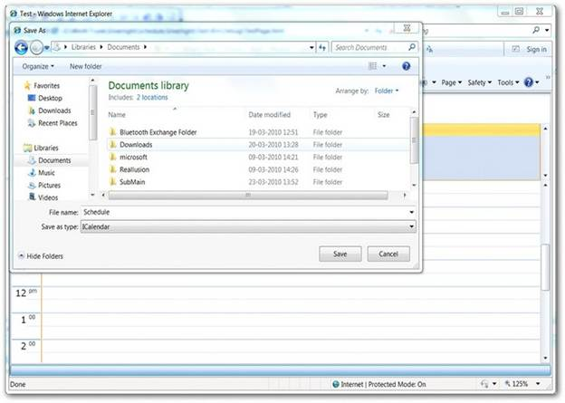
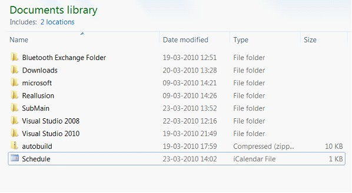
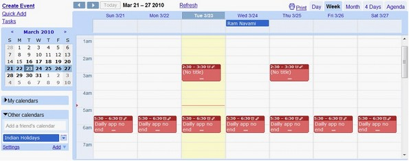
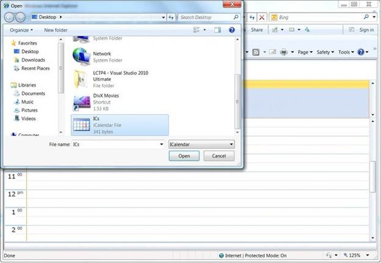
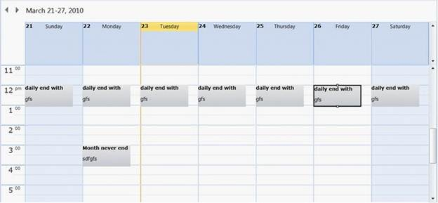

::: {style="DISPLAY: none"}
{#d2h_url_template}{#d2h_package_url style="WIDTH: 0px; DISPLAY: none; HEIGHT: 0px"}
:::

::::: {#nsbanner .d2h_main_nsbanner style="BORDER-BOTTOM: #999999 1px solid; POSITION: relative; PADDING-BOTTOM: 0px; BACKGROUND-COLOR: transparent; PADDING-LEFT: 0px; PADDING-RIGHT: 0px; DISPLAY: none; BORDER-TOP: #999999 1px solid; PADDING-TOP: 0px; LEFT: 0px"}
:::: {#TitleRow .d2h_main_titlerow style="PADDING-BOTTOM: 4px; BACKGROUND-COLOR: transparent; PADDING-LEFT: 22px; WIDTH: 100%; PADDING-RIGHT: 10px; DISPLAY: none; PADDING-TOP: 4px"}
::: {#ienav .d2h_main_ienav style="DISPLAY: none"}
{#D2HPrevious .D2HPreviousEnabled}  {#D2HNext .D2HNextEnabled}
:::
::::
:::::

:::: {#nstext .d2h_main_nstext style="PADDING-BOTTOM: 10px; BACKGROUND-COLOR: transparent; PADDING-LEFT: 22px; PADDING-RIGHT: 10px; HEIGHT: 100%; OVERFLOW: auto; PADDING-TOP: 5px" hasuserbackground="true" valign="bottom"}
::: {#d2h_breadcrumbs .d2h_breadcrumbs}
[Essential Studio User Guide Documentation](ms-xhelp:///?Id=12457748-09e3-4d74-a240-8e049cedf030){.d2h_breadcrumbsNormal}[ \> ]{.d2h_breadcrumbsLinkSeparator}[User Interface Edition](ms-xhelp:///?Id=c29296b7-531c-413b-a0ec-488ca1f7f669){.d2h_breadcrumbsNormal}[ \> ]{.d2h_breadcrumbsLinkSeparator}[Essential WPF](ms-xhelp:///?Id=7f4f82c5-151c-4262-94d0-75c4626c77bc){.d2h_breadcrumbsNormal}[ \> ]{.d2h_breadcrumbsLinkSeparator}[Essential Schedule]{.d2h_breadcrumbsContentsOnly}[ \> ]{.d2h_breadcrumbsLinkSeparator}[Concepts and Features](ms-xhelp:///?Id=7a8d4b17-d8b0-4ff4-a562-1b876329b0f4){.d2h_breadcrumbsNormal}[ \> ]{.d2h_breadcrumbsLinkSeparator}[Advanced Features](ms-xhelp:///?Id=090a8908-6461-4b90-8c67-12347fdd673c){.d2h_breadcrumbsNormal}
:::

### Importing and Exporting {#importing-and-exporting style="tab-stops: 0pt"}

The schedule control allows users to export or import appointments and events as an **.ics** files.  Appointments and events scheduled with the control can be exported as an **.ics** file and opened or imported in other schedulers such as Microsoft Outlook , Google Calendar, or any other scheduler supporting **. ics** files. 

Similarly, files exported from other schedulers can also be imported into Essential Schedule.

The code given below demonstrates how to import and export **.ics** files.

 

Code for implementing importing and exporting

 

+-----------------------------------------------------------------------+
| [ScheduleControl.ImportICS();]{style="FONT-FAMILY: 'Courier New'"}    |
|                                                                       |
| [ScheduleControl.ExportICS();]{style="FONT-FAMILY: 'Courier New'"}    |
|                                                                       |
| **[]{style="FONT-FAMILY: 'Calibri','sans-serif'"}**                   |
|                                                                       |
| [\[Path = img/Reminder\]]{style="FONT-FAMILY: 'Courier New'"}         |
+-----------------------------------------------------------------------+

[]{style="FONT-FAMILY: 'Courier New'"} 

Exporting in the schedule control

When the export function is called, a dialog box opens for selecting the location where the file has to be exported.

[]{style="FONT-FAMILY: 'Trebuchet MS','sans-serif'; COLOR: #15428b; FONT-SIZE: 9pt"} 

{border="0"}

Figure 26: Export Dialog Box

***[]{style="FONT-FAMILY: 'Trebuchet MS','sans-serif'; COLOR: #15428b; FONT-SIZE: 9pt"}*** 

The imported **.ics** file will be saved in specified location.

[]{style="FONT-FAMILY: 'Trebuchet MS','sans-serif'; COLOR: #15428b; FONT-SIZE: 9pt"} 

{border="0"}

Figure 27: Imported Files Saved

***[]{style="FONT-FAMILY: 'Trebuchet MS','sans-serif'; COLOR: #15428b; FONT-SIZE: 9pt"}*** 

These exported files can then be imported in any other scheduler, such as Microsoft Outlook. Silmilarly, you can import **.ical** files from other schedulers.

[]{style="FONT-FAMILY: 'Trebuchet MS','sans-serif'; COLOR: #15428b; FONT-SIZE: 9pt"} 

{border="0"}

Figure 28: Import Exported Files in Any Other Scheduler

***[]{style="FONT-FAMILY: 'Trebuchet MS','sans-serif'; COLOR: #15428b; FONT-SIZE: 9pt"}*** 

If the imported calendar has already been given a name, it can be imported into the schedule control by using the method **ImportICS**, which will open a dialog for browsing to the location, as seen below.

[]{style="FONT-FAMILY: 'Times New Roman','serif'; BACKGROUND: black; COLOR: black; FONT-SIZE: 1pt"} 

[{border="0"}]{style="BACKGROUND: black"}

Figure 29: ImportICS Dialog Box[]{style="BACKGROUND: black"}

[]{style="FONT-FAMILY: 'Trebuchet MS','sans-serif'; COLOR: #15428b; FONT-SIZE: 9pt"} 

Selecting the **.ics** file will result in adding appointments from the file to the schedule control, as shown below.

 

{border="0"}

Figure 30: .ics file Added as Appointments

 

Exporting to CSV Format

Apart from exporting **.ics** files, the schedule control supports exporting to **CSV** format as well; this process is similar to that of **.ics** file exporting, except the code for exporting is different.

 

Code for Exporting to CSV

 

+-----------------------------------------------------------------------+
| **[\[C#\]]{style="FONT-FAMILY: 'Calibri','sans-serif'"}**             |
|                                                                       |
| [ScheduleControl.ExportCSV();]{style="FONT-FAMILY: 'Courier New'"}    |
+-----------------------------------------------------------------------+

[]{style="FONT-FAMILY: 'Trebuchet MS','sans-serif'; COLOR: #15428b; FONT-SIZE: 9pt"} 

Once the exported **CSV** file is opened in a spreadsheet application like Microsoft Excel or **OpenOfficeCalc**, appointments can be entered in tabular format.

 

[]{#related-topics}
::::
