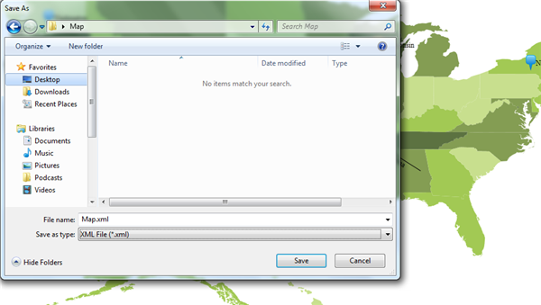
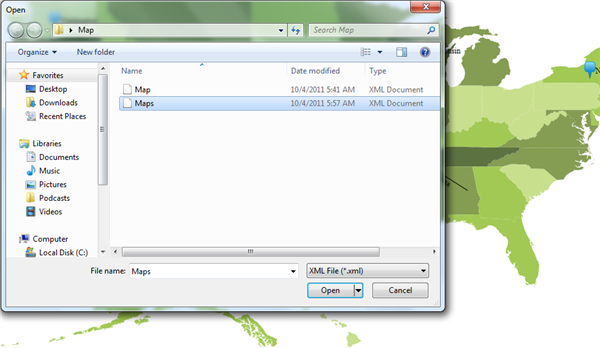
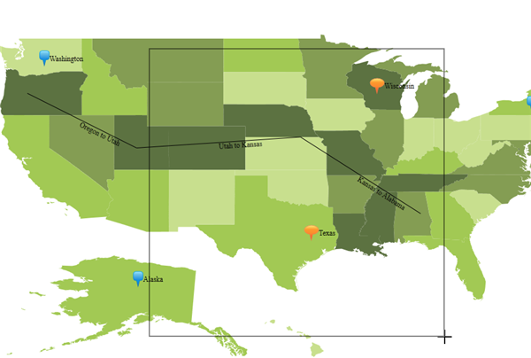

::: {style="DISPLAY: none"}
{#d2h_url_template}{#d2h_package_url style="WIDTH: 0px; DISPLAY: none; HEIGHT: 0px"}
:::

::::: {#nsbanner .d2h_main_nsbanner style="BORDER-BOTTOM: #999999 1px solid; POSITION: relative; PADDING-BOTTOM: 0px; BACKGROUND-COLOR: transparent; PADDING-LEFT: 0px; PADDING-RIGHT: 0px; DISPLAY: none; BORDER-TOP: #999999 1px solid; PADDING-TOP: 0px; LEFT: 0px"}
:::: {#TitleRow .d2h_main_titlerow style="PADDING-BOTTOM: 4px; BACKGROUND-COLOR: transparent; PADDING-LEFT: 22px; WIDTH: 100%; PADDING-RIGHT: 10px; DISPLAY: none; PADDING-TOP: 4px"}
::: {#ienav .d2h_main_ienav style="DISPLAY: none"}
{#D2HPrevious .D2HPreviousEnabled}  {#D2HNext .D2HNextEnabled}
:::
::::
:::::

:::::: {#nstext .d2h_main_nstext style="PADDING-BOTTOM: 10px; BACKGROUND-COLOR: transparent; PADDING-LEFT: 22px; PADDING-RIGHT: 10px; HEIGHT: 100%; OVERFLOW: auto; PADDING-TOP: 5px" hasuserbackground="true" valign="bottom"}
::: {#d2h_breadcrumbs .d2h_breadcrumbs}
[Essential Studio User Guide Documentation](ms-xhelp:///?Id=12457748-09e3-4d74-a240-8e049cedf030){.d2h_breadcrumbsNormal}[ \> ]{.d2h_breadcrumbsLinkSeparator}[User Interface Edition](ms-xhelp:///?Id=c29296b7-531c-413b-a0ec-488ca1f7f669){.d2h_breadcrumbsNormal}[ \> ]{.d2h_breadcrumbsLinkSeparator}[Essential Silverlight](ms-xhelp:///?Id=66221bd1-ba2e-43c2-94a7-618f50e01d24){.d2h_breadcrumbsNormal}[ \> ]{.d2h_breadcrumbsLinkSeparator}[Essential Maps]{.d2h_breadcrumbsContentsOnly}[ \> ]{.d2h_breadcrumbsLinkSeparator}[Concepts and Features](ms-xhelp:///?Id=ab523ca4-cfb2-4736-9bef-ec20b3268450){.d2h_breadcrumbsNormal}
:::

## Importing and Exporting Maps Elements {#importing-and-exporting-maps-elements style="tab-stops: 0pt"}

Map Elements -- Symbols, Labels, Shapes and Paths can be saved in a XML and Image file. Only the XML file can be imported and if changes are needed it can be done and the Map Elements can be exported.

Properties, Methods and Events tables

Property

 

::: {align="center"}
  ------------------------ ----------------------------------------------------------- ------------ ----------- -----------------
  Property                 Description                                                 Type         Data Type   Reference links
  **EnableImageCapture**   Enables to save the portion of the map in an image format   Dependency   Boolean     NA
  ------------------------ ----------------------------------------------------------- ------------ ----------- -----------------
:::

 

Methods

 

::: {align="center"}
  ---------- ------------------------------------------------------------------------ ----------------- ------------- -----------------
  Methods    Description                                                              Parameters        Return Type   Reference links
  **Save**   Save the Map Elements in a XML and Image format with save file dialog.   NA                NA            NA
  **Save**   Save as per the Parameter Filename                                       String Filename   NA            NA
  **Load**   Loads the Map Elements from a XML file with Open file dialog.            NA                NA            NA
  **Load**   Loads the Map Elements from the given XML file.                          String FileName   NA            NA
  ---------- ------------------------------------------------------------------------ ----------------- ------------- -----------------
:::

 

Saving through the Save dialog box

Save the Map Elements in a XML and Image format. When calling the Save method, a save file dialog will open. In this dialog you can specify the file name and format (Xml / Image) of the map. Then the map will be saved with a given file format with a given name. For image file following formats are supported:

[·      ]{style="FONT-FAMILY: Symbol"}Tiff

[·      ]{style="FONT-FAMILY: Symbol"}Gif

[·      ]{style="FONT-FAMILY: Symbol"}Jpg

[·      ]{style="FONT-FAMILY: Symbol"}Bmp

[·      ]{style="FONT-FAMILY: Symbol"}Png

 

+-------------------------------------------------------------------------------------------------------------------------------------------------+
| [\[C#\]]{style="FONT-FAMILY: 'Courier New'; COLOR: #a31515"}                                                                                    |
|                                                                                                                                                 |
| [this]{style="FONT-FAMILY: 'Courier New'; COLOR: blue"}[.Map.Save();]{style="FONT-FAMILY: 'Courier New'"}[]{style="FONT-FAMILY: 'Courier New'"} |
+-------------------------------------------------------------------------------------------------------------------------------------------------+

 

Save through the File name

Save as per the Parameter Filename. When you call the Save method with filename as the parameter as given in code snippet, the map will be saved in the appropriate file name. Format will be determined based on the extension of the file name. For example if we give file name as "Maps.xml" then map will be saved as xml file.  If we give the file name as "Maps.tiff" then map will be saved as tiff image file. For image file the following formats are supported:

[·      ]{style="FONT-FAMILY: Symbol"}Tiff

[·      ]{style="FONT-FAMILY: Symbol"}Gif

[·      ]{style="FONT-FAMILY: Symbol"}Jpg

[·      ]{style="FONT-FAMILY: Symbol"}Bmp

[·      ]{style="FONT-FAMILY: Symbol"}Png

 

+--------------------------------------------------------------------------------------------------------------------------------------------------------------+
| [\[C#\]]{style="FONT-FAMILY: 'Courier New'; COLOR: #a31515"}                                                                                                 |
|                                                                                                                                                              |
| [this]{style="FONT-FAMILY: 'Courier New'; COLOR: blue"}[.Map.Save("D:\\Map.xml");]{style="FONT-FAMILY: 'Courier New'"}[]{style="FONT-FAMILY: 'Courier New'"} |
+--------------------------------------------------------------------------------------------------------------------------------------------------------------+

 

{border="0"}**[]{style="COLOR: #e36c0a"}**

**[]{style="COLOR: #e36c0a"}** 

Loading through the Open dialog box

Loads the Map Elements from a XML file. When calling the Load method without any parameter in it, an open file dialog box will be opened. The open dialog showed the list of Xml file which will be available in the current directory. We can choose the Xml file which already saved by the Map control.

+-------------------------------------------------------------------------------------------------------------------------------------------------+
| [\[C#\]]{style="FONT-FAMILY: 'Courier New'; COLOR: #a31515"}                                                                                    |
|                                                                                                                                                 |
| [this]{style="FONT-FAMILY: 'Courier New'; COLOR: blue"}[.Map.Load();]{style="FONT-FAMILY: 'Courier New'"}[]{style="FONT-FAMILY: 'Courier New'"} |
+-------------------------------------------------------------------------------------------------------------------------------------------------+

 

**Loads through the File name**

Loads the Map Elements from the given XML file.  For example if the location iss given as "D:\\Maps.xml" then the map will be loaded onto the given location. Xml file can be desterilized. Image files cannot be desterilized.

 

+--------------------------------------------------------------------------------------------------------------------------------------------------------------+
| [\[C#\]]{style="FONT-FAMILY: 'Courier New'; COLOR: #a31515"}                                                                                                 |
|                                                                                                                                                              |
| [this]{style="FONT-FAMILY: 'Courier New'; COLOR: blue"}[.Map.Load("D:\\Map.xml");]{style="FONT-FAMILY: 'Courier New'"}[]{style="FONT-FAMILY: 'Courier New'"} |
+--------------------------------------------------------------------------------------------------------------------------------------------------------------+

**[]{style="COLOR: #e36c0a"}** 

**[]{style="COLOR: #e36c0a"}** 

{border="0"}**[]{style="COLOR: #e36c0a"}**

Saving the Portion of Map as Image

To save the portion of maps as an image, set the EnableMouseCapture Property as true for the Map Control  as shown in the following code snippet and select the portion from the map.

 

+------------------------------------------------------------------------------------------------------------------+
| [\[C#\]]{style="FONT-FAMILY: Consolas; COLOR: #a31515; FONT-SIZE: 9.5pt"}                                        |
|                                                                                                                  |
| [  mapControl.EnableImageCapture = [true]{style="COLOR: blue"}]{style="FONT-FAMILY: Consolas; FONT-SIZE: 9.5pt"} |
+------------------------------------------------------------------------------------------------------------------+

{border="0"}

[]{#related-topics}
::::::
