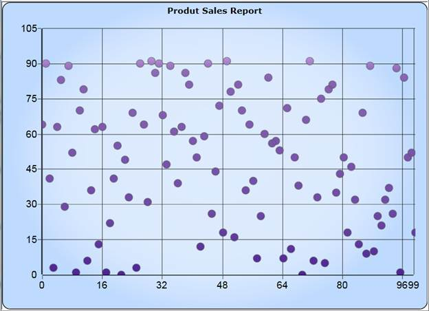
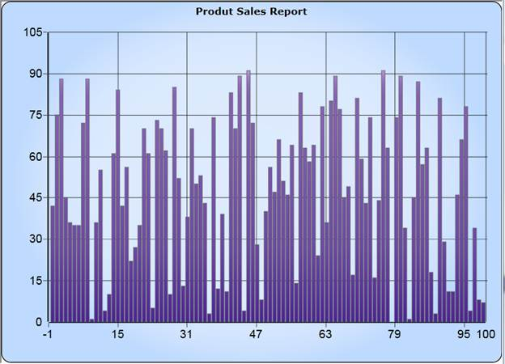

::: {style="DISPLAY: none"}
{#d2h_url_template}{#d2h_package_url style="WIDTH: 0px; DISPLAY: none; HEIGHT: 0px"}
:::

::: {.d2h_secondary_topic style="PADDING-BOTTOM: 10pt; MARGIN: 0pt; PADDING-LEFT: 0pt; PADDING-RIGHT: 0pt; PADDING-TOP: 0pt"}
#### Improvements Performance and New fast chart types  {#improvements-performance-and-new-fast-chart-types style="tab-stops: 0pt"}

**[]{style="FONT-FAMILY: 'Courier New'; COLOR: black"}** 

Fast Column and Fast Scatter Charts are similar to Column and Scatter charts respectively. It uses vertical bars (called columns) and scattered circles (called ellipse) to display different values of one or more items.

The advantages of Fast Charts:

[·      ]{style="FONT-FAMILY: Symbol"}Loads faster than other charts

[·      ]{style="FONT-FAMILY: Symbol"}Ensures high performance for displaying data.

[·      ]{style="FONT-FAMILY: Symbol"}They can be used as real time charts to render huge number of data points.

Use Case Scenarios

It can be used for rendering large number of points like Stock Market Analysis.

[]{style="COLOR: #15428b"} 

Adding FastScatter to an Application

FastScatter and FastColumn Chart types can be added using the property Type in ChartSeries.

**[]{style="COLOR: #15428b"}** 

+-------------------------------------------------------------------------------------------------------------------+
| [\[XAML\]]{style="FONT-FAMILY: 'Courier New'; COLOR: black"}[ ]{style="FONT-FAMILY: 'Courier New'; COLOR: black"} |
|                                                                                                                   |
| **[]{style="FONT-FAMILY: 'Courier New'; COLOR: black"}**                                                          |
|                                                                                                                   |
| [//Add FastScatter chart type to the series.]{style="FONT-FAMILY: 'Courier New'; COLOR: green"}                   |
|                                                                                                                   |
| [  \<sync:ChartSeries  Type=\"FastScatter\" /\>]{style="FONT-FAMILY: 'Courier New'; COLOR: black"}                |
|                                                                                                                   |
| **[]{style="FONT-FAMILY: 'Courier New'; COLOR: black"}**                                                          |
+-------------------------------------------------------------------------------------------------------------------+

**[]{style="FONT-FAMILY: 'Courier New'; COLOR: black"}** 

+------------------------------------------------------------------------------------------------------------------+
| [\[C#\]]{style="FONT-FAMILY: 'Courier New'; COLOR: black"}                                                       |
|                                                                                                                  |
| []{style="FONT-FAMILY: 'Courier New'; COLOR: black"}                                                             |
|                                                                                                                  |
| [//Add FastScatter chart type to the series.]{style="FONT-FAMILY: 'Courier New'; COLOR: green"}                  |
|                                                                                                                  |
| []{style="FONT-FAMILY: 'Courier New'; COLOR: black"}                                                             |
|                                                                                                                  |
| [Chart1.Areas\[0\].Series\[0\].Type = ChartTypes.FastScatter;]{style="FONT-FAMILY: 'Courier New'; COLOR: black"} |
|                                                                                                                  |
| **[]{style="FONT-FAMILY: 'Courier New'; COLOR: black"}**                                                         |
+------------------------------------------------------------------------------------------------------------------+

 

 

{border="0"}

Figure 52: FastScatter

**[]{style="FONT-FAMILY: 'Courier New'; COLOR: #c00000"}** 

+----------------------------------------------------------------------------------------------------------------------------------------------------------------------------------------------------------------------------------------------------------------------------------------------------------------------------------------------------------------------------------------------------------+
| [\[[XAML]{style="COLOR: black"}\]]{style="FONT-FAMILY: 'Courier New'"}[ ]{style="FONT-FAMILY: 'Courier New'; COLOR: #a31515"}                                                                                                                                                                                                                                                                            |
|                                                                                                                                                                                                                                                                                                                                                                                                          |
| **[]{style="FONT-FAMILY: 'Courier New'; COLOR: #a31515"}**                                                                                                                                                                                                                                                                                                                                               |
|                                                                                                                                                                                                                                                                                                                                                                                                          |
| [//Add FastColumn chart type to the series.]{style="FONT-FAMILY: 'Courier New'; COLOR: green"}                                                                                                                                                                                                                                                                                                           |
|                                                                                                                                                                                                                                                                                                                                                                                                          |
| **[]{style="FONT-FAMILY: 'Courier New'; COLOR: #a31515"}**                                                                                                                                                                                                                                                                                                                                               |
|                                                                                                                                                                                                                                                                                                                                                                                                          |
| [  ]{style="FONT-FAMILY: 'Courier New'; COLOR: #a31515"}[\<]{style="FONT-FAMILY: 'Courier New'; COLOR: blue"}[sync]{style="FONT-FAMILY: 'Courier New'; COLOR: #a31515"}[:]{style="FONT-FAMILY: 'Courier New'; COLOR: blue"}[ChartSeries]{style="FONT-FAMILY: 'Courier New'; COLOR: #a31515"}[ [ Type]{style="COLOR: red"}[=\"FastColumn\" /\>]{style="COLOR: blue"}]{style="FONT-FAMILY: 'Courier New'"} |
|                                                                                                                                                                                                                                                                                                                                                                                                          |
| **[]{style="FONT-FAMILY: 'Courier New'"}**                                                                                                                                                                                                                                                                                                                                                               |
+----------------------------------------------------------------------------------------------------------------------------------------------------------------------------------------------------------------------------------------------------------------------------------------------------------------------------------------------------------------------------------------------------------+

**[]{style="FONT-FAMILY: 'Courier New'; COLOR: #c00000"}** 

+-----------------------------------------------------------------------------------------------------------------------------+
| [\[C#\]]{style="FONT-FAMILY: 'Courier New'"}                                                                                |
|                                                                                                                             |
| []{style="FONT-FAMILY: 'Courier New'"}                                                                                      |
|                                                                                                                             |
| [//Add FastColumn chart type to the series.]{style="FONT-FAMILY: 'Courier New'; COLOR: green"}                              |
|                                                                                                                             |
| []{style="FONT-FAMILY: 'Courier New'"}                                                                                      |
|                                                                                                                             |
| [Chart1.Areas\[0\].Series\[0\].Type = [ChartTypes]{style="COLOR: #2b91af"}.FastColumn;]{style="FONT-FAMILY: 'Courier New'"} |
|                                                                                                                             |
| **[]{style="FONT-FAMILY: 'Courier New'"}**                                                                                  |
+-----------------------------------------------------------------------------------------------------------------------------+

 

{border="0"}

Figure 53: FastColumn

 

Sample Link

A sample application that illustrates FastChart is distributed along with the Essential Chart Silverlight installation and can be found at:

\<sample installation location\>\\Syncfusion\\EssentialStudio\\8.3.0.22\\Silverlight\\Syncfusion.Chart.Silverlight.Samples\\Samples\\Chart Gallery\\FastChartTypes.xaml

[]{#related-topics}
:::
