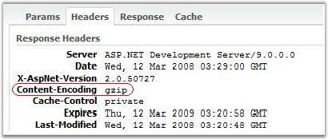

::: {style="DISPLAY: none"}
{#d2h_url_template}{#d2h_package_url style="WIDTH: 0px; DISPLAY: none; HEIGHT: 0px"}
:::

::::: {#nsbanner .d2h_main_nsbanner style="BORDER-BOTTOM: #999999 1px solid; POSITION: relative; PADDING-BOTTOM: 0px; BACKGROUND-COLOR: transparent; PADDING-LEFT: 0px; PADDING-RIGHT: 0px; DISPLAY: none; BORDER-TOP: #999999 1px solid; PADDING-TOP: 0px; LEFT: 0px"}
:::: {#TitleRow .d2h_main_titlerow style="PADDING-BOTTOM: 4px; BACKGROUND-COLOR: transparent; PADDING-LEFT: 22px; WIDTH: 100%; PADDING-RIGHT: 10px; DISPLAY: none; PADDING-TOP: 4px"}
::: {#ienav .d2h_main_ienav style="DISPLAY: none"}
{#D2HPrevious .D2HPreviousEnabled}  {#D2HNext .D2HNextEnabled}
:::
::::
:::::

::::: {#nstext .d2h_main_nstext style="PADDING-BOTTOM: 10px; BACKGROUND-COLOR: transparent; PADDING-LEFT: 22px; PADDING-RIGHT: 10px; HEIGHT: 100%; OVERFLOW: auto; PADDING-TOP: 5px" hasuserbackground="true" valign="bottom"}
::: {#d2h_breadcrumbs .d2h_breadcrumbs}
[Essential Studio User Guide Documentation](ms-xhelp:///?Id=12457748-09e3-4d74-a240-8e049cedf030){.d2h_breadcrumbsNormal}[ \> ]{.d2h_breadcrumbsLinkSeparator}[User Interface Edition](ms-xhelp:///?Id=c29296b7-531c-413b-a0ec-488ca1f7f669){.d2h_breadcrumbsNormal}[ \> ]{.d2h_breadcrumbsLinkSeparator}[Essential ASP.NET](ms-xhelp:///?Id=25c35330-c127-4dad-9a92-ed79dc7261a6){.d2h_breadcrumbsNormal}[ \> ]{.d2h_breadcrumbsLinkSeparator}[Essential Chart]{.d2h_breadcrumbsContentsOnly}[ \> ]{.d2h_breadcrumbsLinkSeparator}[Concepts and Features](ms-xhelp:///?Id=100687ce-82f2-4424-9d16-0949ea76cf15){.d2h_breadcrumbsNormal}
:::

## Improving Performance {#improving-performance style="tab-stops: 0pt"}

[]{style="FONT-FAMILY: 'Trebuchet MS','sans-serif'; FONT-SIZE: 9pt"} 

The Syncfusion Essential studio makes use of class named ScriptResourceAttribute, which can be used to define a resource in an assembly to be used from a client script file.

 

Then the resource files which are all used in the Syncfusion controls will be gzipped and served over the network. The following screen shot shows this.

[]{style="FONT-FAMILY: 'Trebuchet MS','sans-serif'; FONT-SIZE: 9pt"} 

{border="0"}

**[]{style="FONT-FAMILY: 'Trebuchet MS','sans-serif'; FONT-SIZE: 9pt"}** 

Figure 39: Resource files Gzipped

[]{style="FONT-FAMILY: 'Trebuchet MS','sans-serif'; FONT-SIZE: 9pt"} 

In order to achieve this, we need to set the following attributes in the project\'s web.config file.

[]{style="FONT-FAMILY: 'Trebuchet MS','sans-serif'; FONT-SIZE: 9pt"} 

+-----------------------------------------------------------------------------------------------------------------------------------------------------------------------------------------------------------------------------------------------------------------------------------------------------------------------------------------------------------------------------------------------------------------------------------------------------------------------------------------------------------------------------------------------------------------------------------------------------------------------------------------------------------------------------------------------------------------------------------------------------------------------------------------+
| [\<]{style="FONT-FAMILY: 'Courier New'; COLOR: blue"}[configuration system.web.extensions]{style="FONT-FAMILY: 'Courier New'; COLOR: maroon"}[/\>\                                                                                                                                                                                                                                                                                                                                                                                                                                                                                                                                                                                                                                      |
| ]{style="FONT-FAMILY: 'Courier New'; COLOR: blue"}[. . .\                                                                                                                                                                                                                                                                                                                                                                                                                                                                                                                                                                                                                                                                                                                               |
|       ]{style="FONT-FAMILY: 'Courier New'; COLOR: black"}[\<]{style="FONT-FAMILY: 'Courier New'; COLOR: blue"}[scripting]{style="FONT-FAMILY: 'Courier New'; COLOR: maroon"}[\>\                                                                                                                                                                                                                                                                                                                                                                                                                                                                                                                                                                                                        |
| ]{style="FONT-FAMILY: 'Courier New'; COLOR: blue"}[            ]{style="FONT-FAMILY: 'Courier New'; COLOR: black"}[\<]{style="FONT-FAMILY: 'Courier New'; COLOR: blue"}[ScriptResourceHandler]{style="FONT-FAMILY: 'Courier New'; COLOR: maroon"}[ ]{style="FONT-FAMILY: 'Courier New'; COLOR: black"}[enableCompression]{style="FONT-FAMILY: 'Courier New'; COLOR: red"}[=\"]{style="FONT-FAMILY: 'Courier New'; COLOR: black"}[true]{style="FONT-FAMILY: 'Courier New'; COLOR: blue"}[\" ]{style="FONT-FAMILY: 'Courier New'; COLOR: black"}[enableCaching]{style="FONT-FAMILY: 'Courier New'; COLOR: red"}[=\"]{style="FONT-FAMILY: 'Courier New'; COLOR: black"}[true\"]{style="FONT-FAMILY: 'Courier New'; COLOR: blue"}[ ]{style="FONT-FAMILY: 'Courier New'; COLOR: black"}[/\>\ |
| ]{style="FONT-FAMILY: 'Courier New'; COLOR: blue"}[      ]{style="FONT-FAMILY: 'Courier New'; COLOR: black"}[\<]{style="FONT-FAMILY: 'Courier New'; COLOR: blue"}[/]{style="FONT-FAMILY: 'Courier New'; COLOR: black"}[scripting]{style="FONT-FAMILY: 'Courier New'; COLOR: maroon"}[\>\                                                                                                                                                                                                                                                                                                                                                                                                                                                                                                |
| ]{style="FONT-FAMILY: 'Courier New'; COLOR: blue"}[. . .\                                                                                                                                                                                                                                                                                                                                                                                                                                                                                                                                                                                                                                                                                                                               |
| ]{style="FONT-FAMILY: 'Courier New'; COLOR: black"}[\</]{style="FONT-FAMILY: 'Courier New'; COLOR: blue"}[system.web.extensions]{style="FONT-FAMILY: 'Courier New'; COLOR: maroon"}[\>]{style="FONT-FAMILY: 'Courier New'; COLOR: blue"}                                                                                                                                                                                                                                                                                                                                                                                                                                                                                                                                                |
+-----------------------------------------------------------------------------------------------------------------------------------------------------------------------------------------------------------------------------------------------------------------------------------------------------------------------------------------------------------------------------------------------------------------------------------------------------------------------------------------------------------------------------------------------------------------------------------------------------------------------------------------------------------------------------------------------------------------------------------------------------------------------------------------+

[]{style="FONT-FAMILY: 'Trebuchet MS','sans-serif'; FONT-SIZE: 9pt"} 

As the resource files gets gzipped:

[]{style="FONT-FAMILY: 'Trebuchet MS','sans-serif'; FONT-SIZE: 9pt"} 

[·      ]{style="FONT-FAMILY: Symbol"}It saves the precious network band-width.

[·      ]{style="FONT-FAMILY: Symbol"}It reduces the load-time. As a result, the webform which consists of the Syncfusion controls, will get loaded more faster on the client browser.

[·      ]{style="FONT-FAMILY: Symbol"}It also reduces the network traffic.

[]{style="FONT-FAMILY: 'Trebuchet MS','sans-serif'; FONT-SIZE: 9pt"} 

Properties and Methods used to improve chart performance

[]{style="FONT-FAMILY: 'Trebuchet MS','sans-serif'; FONT-SIZE: 9pt"} 

::: {align="center"}
+-------------------------------------+------------------------------------------------------------------------------------------------------------------------------------------------------------------------------------------------------------------------+
| Chart Control                       | Description                                                                                                                                                                                                            |
+-------------------------------------+------------------------------------------------------------------------------------------------------------------------------------------------------------------------------------------------------------------------+
| Properties                                                                                                                                                                                                                                                   |
+-------------------------------------+------------------------------------------------------------------------------------------------------------------------------------------------------------------------------------------------------------------------+
| CalcRegions                         | This property by default is true. This controls the Tooltips, Autohighlighting properties and RegionHit events. If these properties and events are not used, this property can be set to false for better performance. |
+-------------------------------------+------------------------------------------------------------------------------------------------------------------------------------------------------------------------------------------------------------------------+
| ChartSeries.EnableStyles            | Disabling this property will in turn disable the point symbols and point text which speeds up the chart.                                                                                                               |
+-------------------------------------+------------------------------------------------------------------------------------------------------------------------------------------------------------------------------------------------------------------------+
| ChartSeries.Style.DisplayShadow     | Setting this property to false will not render the series with shadow, which will increase the speed of the chart.                                                                                                     |
|                                     |                                                                                                                                                                                                                        |
|                                     |                                                                                                                                                                                                                        |
|                                     |                                                                                                                                                                                                                        |
|                                     | By default this property is set to false.                                                                                                                                                                              |
+-------------------------------------+------------------------------------------------------------------------------------------------------------------------------------------------------------------------------------------------------------------------+
| Indexed                             | The chart renders faster if the series is not indexed. This of course, may or may not be possible in all cases.                                                                                                        |
|                                     |                                                                                                                                                                                                                        |
|                                     |                                                                                                                                                                                                                        |
|                                     |                                                                                                                                                                                                                        |
|                                     | By default this property is false.                                                                                                                                                                                     |
+-------------------------------------+------------------------------------------------------------------------------------------------------------------------------------------------------------------------------------------------------------------------+
| BackInterior                        | The background style for the Chart control is specified using this property and if this property is not set with gradient or pattern style, will help improve the performance of the chart.                            |
+-------------------------------------+------------------------------------------------------------------------------------------------------------------------------------------------------------------------------------------------------------------------+
| ChartArea.BackInterior              | This property sets the back color for the chart area. If not set with gradient or pattern style, will help improve the performance of the chart.                                                                       |
+-------------------------------------+------------------------------------------------------------------------------------------------------------------------------------------------------------------------------------------------------------------------+
| ChartInterior                       | If this property which fills the chart interior, not set with gradient or pattern style, will improve the performance of the chart.                                                                                    |
+-------------------------------------+------------------------------------------------------------------------------------------------------------------------------------------------------------------------------------------------------------------------+
| Methods                                                                                                                                                                                                                                                      |
+-------------------------------------+------------------------------------------------------------------------------------------------------------------------------------------------------------------------------------------------------------------------+
| BeginUpdate and EndUpdate           | Encapsulate your \"data points adding code\" within **BeginUpdate** and **EndUpdate** to improve Chart initialization speed. See the example below.                                                                    |
+-------------------------------------+------------------------------------------------------------------------------------------------------------------------------------------------------------------------------------------------------------------------+
:::

[]{style="FONT-FAMILY: 'Courier New'; FONT-SIZE: 9pt"} 

+---------------------------------------------------------------------------------------------------------------------------------------------------------------------------------------------------------------------------------------------------------------+
| **[\[C#\]]{style="FONT-FAMILY: 'Courier New'; COLOR: black"}**                                                                                                                                                                                                |
|                                                                                                                                                                                                                                                               |
| []{style="FONT-FAMILY: 'Courier New'; COLOR: black"}                                                                                                                                                                                                          |
|                                                                                                                                                                                                                                                               |
| [// Improves the performance of the chart ]{style="FONT-FAMILY: 'Courier New'; COLOR: green"}                                                                                                                                                                 |
|                                                                                                                                                                                                                                                               |
| []{style="FONT-FAMILY: 'Courier New'; COLOR: black"}                                                                                                                                                                                                          |
|                                                                                                                                                                                                                                                               |
| [this]{style="FONT-FAMILY: 'Courier New'; COLOR: blue"}[.ChartWebControl1.CalcRegions = [false]{style="COLOR: blue"};]{style="FONT-FAMILY: 'Courier New'"}                                                                                                    |
|                                                                                                                                                                                                                                                               |
| []{style="FONT-FAMILY: 'Courier New'"}                                                                                                                                                                                                                        |
|                                                                                                                                                                                                                                                               |
| [this]{style="FONT-FAMILY: 'Courier New'; COLOR: blue"}[.ChartWebControl1.Series\[0\].EnableStyles = [false]{style="COLOR: blue"};]{style="FONT-FAMILY: 'Courier New'"}                                                                                       |
|                                                                                                                                                                                                                                                               |
| []{style="FONT-FAMILY: 'Courier New'"}                                                                                                                                                                                                                        |
|                                                                                                                                                                                                                                                               |
| [this]{style="FONT-FAMILY: 'Courier New'; COLOR: blue"}[.ChartWebControl1.Series\[0\].Style.DisplayShadow = [false]{style="COLOR: blue"};]{style="FONT-FAMILY: 'Courier New'"}                                                                                |
|                                                                                                                                                                                                                                                               |
| []{style="FONT-FAMILY: 'Courier New'"}                                                                                                                                                                                                                        |
|                                                                                                                                                                                                                                                               |
| [this]{style="FONT-FAMILY: 'Courier New'; COLOR: blue"}[.ChartWebControl1.Indexed = [true]{style="COLOR: blue"};]{style="FONT-FAMILY: 'Courier New'"}                                                                                                         |
|                                                                                                                                                                                                                                                               |
| []{style="FONT-FAMILY: 'Courier New'"}                                                                                                                                                                                                                        |
|                                                                                                                                                                                                                                                               |
| [//BeginUpdate and EndUpdate methods]{style="FONT-FAMILY: 'Courier New'; COLOR: green"}                                                                                                                                                                       |
|                                                                                                                                                                                                                                                               |
| [private]{style="FONT-FAMILY: 'Courier New'; COLOR: blue"}[ [DataModel]{style="COLOR: teal"} datamodel1;]{style="FONT-FAMILY: 'Courier New'"}                                                                                                                 |
|                                                                                                                                                                                                                                                               |
| [ChartSeries]{style="FONT-FAMILY: 'Courier New'; COLOR: teal"}[ series = [this]{style="COLOR: blue"}.ChartWebControl1.Model.NewSeries([\"Line 1\"]{style="COLOR: maroon"}, [ChartSeriesType]{style="COLOR: teal"}.Line);]{style="FONT-FAMILY: 'Courier New'"} |
|                                                                                                                                                                                                                                                               |
| []{style="FONT-FAMILY: 'Courier New'"}                                                                                                                                                                                                                        |
|                                                                                                                                                                                                                                                               |
| [this]{style="FONT-FAMILY: 'Courier New'; COLOR: blue"}[.ChartWebControl1.BeginUpdate();]{style="FONT-FAMILY: 'Courier New'"}                                                                                                                                 |
|                                                                                                                                                                                                                                                               |
| []{style="FONT-FAMILY: 'Courier New'; COLOR: blue"}                                                                                                                                                                                                           |
|                                                                                                                                                                                                                                                               |
| [// Add a whole bunch of points to the series like this: series.Points.Add(1, 10), etc.]{style="FONT-FAMILY: 'Courier New'; COLOR: green"}                                                                                                                    |
|                                                                                                                                                                                                                                                               |
| []{style="FONT-FAMILY: 'Courier New'; COLOR: blue"}                                                                                                                                                                                                           |
|                                                                                                                                                                                                                                                               |
| [this]{style="FONT-FAMILY: 'Courier New'; COLOR: blue"}[.ChartWebControl1.EndUpdate();]{style="FONT-FAMILY: 'Courier New'"}                                                                                                                                   |
+---------------------------------------------------------------------------------------------------------------------------------------------------------------------------------------------------------------------------------------------------------------+

[]{style="FONT-FAMILY: 'Trebuchet MS','sans-serif'; FONT-SIZE: 9pt"} 

+-----------------------------------------------------------------------------------------------------------------------------------------------------------------------------------------------------------------------------------------------------------------------+
| **[\[VB.NET\]]{style="FONT-FAMILY: 'Courier New'; COLOR: black"}**                                                                                                                                                                                                    |
|                                                                                                                                                                                                                                                                       |
| []{style="FONT-FAMILY: 'Courier New'; COLOR: black"}                                                                                                                                                                                                                  |
|                                                                                                                                                                                                                                                                       |
| [\' Improves the performance of the chart ]{style="FONT-FAMILY: 'Courier New'; COLOR: green"}                                                                                                                                                                         |
|                                                                                                                                                                                                                                                                       |
| []{style="FONT-FAMILY: 'Courier New'; COLOR: green"}                                                                                                                                                                                                                  |
|                                                                                                                                                                                                                                                                       |
| [Me]{style="FONT-FAMILY: 'Courier New'; COLOR: blue"}[.]{style="FONT-FAMILY: 'Courier New'; COLOR: black"}[ChartWebControl1.CalcRegions = [False]{style="COLOR: blue"}]{style="FONT-FAMILY: 'Courier New'"}                                                           |
|                                                                                                                                                                                                                                                                       |
| []{style="FONT-FAMILY: 'Courier New'; COLOR: blue"}                                                                                                                                                                                                                   |
|                                                                                                                                                                                                                                                                       |
| [Me]{style="FONT-FAMILY: 'Courier New'; COLOR: blue"}[.ChartWebControl1.Series\[0\].EnableStyles = [False]{style="COLOR: blue"}]{style="FONT-FAMILY: 'Courier New'"}                                                                                                  |
|                                                                                                                                                                                                                                                                       |
| []{style="FONT-FAMILY: 'Courier New'; COLOR: blue"}                                                                                                                                                                                                                   |
|                                                                                                                                                                                                                                                                       |
| [Me]{style="FONT-FAMILY: 'Courier New'; COLOR: blue"}[.ChartWebControl1.Series\[0\].Style.DisplayShadow = [False]{style="COLOR: blue"}]{style="FONT-FAMILY: 'Courier New'"}                                                                                           |
|                                                                                                                                                                                                                                                                       |
| []{style="FONT-FAMILY: 'Courier New'; COLOR: blue"}                                                                                                                                                                                                                   |
|                                                                                                                                                                                                                                                                       |
| [Me]{style="FONT-FAMILY: 'Courier New'; COLOR: blue"}[.ChartWebControl1.Indexed = [True]{style="COLOR: blue"}]{style="FONT-FAMILY: 'Courier New'"}                                                                                                                    |
|                                                                                                                                                                                                                                                                       |
| []{style="FONT-FAMILY: 'Courier New'; COLOR: blue"}                                                                                                                                                                                                                   |
|                                                                                                                                                                                                                                                                       |
| [\'BeginUpdate and EndUpdate methods]{style="FONT-FAMILY: 'Courier New'; COLOR: green"}                                                                                                                                                                               |
|                                                                                                                                                                                                                                                                       |
| [Private]{style="FONT-FAMILY: 'Courier New'; COLOR: blue"}[ datamodel1 [As]{style="COLOR: blue"} DataModel]{style="FONT-FAMILY: 'Courier New'"}                                                                                                                       |
|                                                                                                                                                                                                                                                                       |
| [Private]{style="FONT-FAMILY: 'Courier New'; COLOR: blue"}[ series [As]{style="COLOR: blue"} ChartSeries = [Me]{style="COLOR: blue"}.ChartWebControl1.Model.NewSeries([\"Line 1\"]{style="COLOR: maroon"}, ChartSeriesType.Line)]{style="FONT-FAMILY: 'Courier New'"} |
|                                                                                                                                                                                                                                                                       |
| []{style="FONT-FAMILY: 'Courier New'; COLOR: green"}                                                                                                                                                                                                                  |
|                                                                                                                                                                                                                                                                       |
| [Me]{style="FONT-FAMILY: 'Courier New'; COLOR: blue"}[.ChartWebControl1.BeginUpdate()]{style="FONT-FAMILY: 'Courier New'"}                                                                                                                                            |
|                                                                                                                                                                                                                                                                       |
| []{style="FONT-FAMILY: 'Courier New'"}                                                                                                                                                                                                                                |
|                                                                                                                                                                                                                                                                       |
| [\'Add a whole bunch of points to the series like this: series.Points.Add(1, 10), etc.]{style="FONT-FAMILY: 'Courier New'; COLOR: green"}                                                                                                                             |
|                                                                                                                                                                                                                                                                       |
| []{style="FONT-FAMILY: 'Courier New'; COLOR: blue"}                                                                                                                                                                                                                   |
|                                                                                                                                                                                                                                                                       |
| [Me]{style="FONT-FAMILY: 'Courier New'; COLOR: blue"}[.ChartWebControl1.EndUpdate()]{style="FONT-FAMILY: 'Courier New'"}                                                                                                                                              |
+-----------------------------------------------------------------------------------------------------------------------------------------------------------------------------------------------------------------------------------------------------------------------+

[]{#p28} 

[]{#related-topics}
:::::
