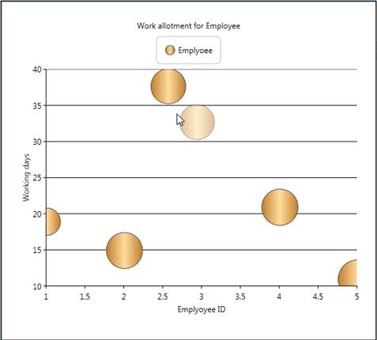

::: {style="DISPLAY: none"}
{#d2h_url_template}{#d2h_package_url style="WIDTH: 0px; DISPLAY: none; HEIGHT: 0px"}
:::

::: {.d2h_secondary_topic style="PADDING-BOTTOM: 10pt; MARGIN: 0pt; PADDING-LEFT: 0pt; PADDING-RIGHT: 0pt; PADDING-TOP: 0pt"}
##### Inbuilt Drag and Drop Support for Chart Series {#inbuilt-drag-and-drop-support-for-chart-series style="tab-stops: 0pt"}

Features

This feature helps the user to drag the Chart point from one location to another location within the Chart area and improves the user interaction by editing the under bound model's object at run time. This feature also maps the mouse coordinates to the coordinates of the ChartAxis and positions the data point. Hence, all the relevant properties like tooltip, series annotation, will be changed according to the new position.[]{style="COLOR: #c00000"}

[  ]{style="COLOR: #c00000"}

Use Case Scenarios

[·      ]{style="FONT-FAMILY: Symbol"}Inbuilt Drag and Drop support for the Chart Series can be used in rescheduling the number of working days for any task assigned to employee.

[·      ]{style="FONT-FAMILY: Symbol"}Reschedule the task start and end time using typical Gantt Chart type.

[·      ]{style="FONT-FAMILY: Symbol"}It allows the user to modify the under bound data of segment dynamically by clicking and dragging the segment to the new position inside the Chart Area.

{border="0"}

 

Figure 250: Inbuilt Drag and Drop support[]{style="COLOR: #c00000"}

 

 

Tables for Properties, Methods, and Events

Properties

Table 160: Propert Table

  ---------------------- --------------------------------------------------------------------------------- --------------------- ----------- -----------------
  Property               Description                                                                       Type                  Data Type   Reference links
  AllowSegmentDragDrop   To set the Drag and Drop Support for the Chart Series[]{style="COLOR: #c00000"}   Dependency Property   Boolean     NA
  ---------------------- --------------------------------------------------------------------------------- --------------------- ----------- -----------------

[]{style="FONT-FAMILY: 'Calibri','sans-serif'; COLOR: black"} 

Events

Table 161: ChartSegmentDragging Table

  Event                                            Description                                                      Arguments                                 Type                                      Reference links
  ------------------------------------------------ ---------------------------------------------------------------- ----------------------------------------- ----------------------------------------- ------------------------------
  ChartSegmentDragging[]{style="COLOR: #c00000"}   Triggered before dragging is started[]{style="COLOR: #c00000"}   ChartSegment[ ]{style="COLOR: #c00000"}   Routed Event[ ]{style="COLOR: #c00000"}   NA[]{style="COLOR: #c00000"}

[]{style="FONT-FAMILY: 'Calibri','sans-serif'; COLOR: black"} 

[ ]{style="FONT-FAMILY: 'Calibri','sans-serif'; COLOR: black"}Table 162: ChartSegmentDragged Table

  Event                                           Description                                                                           Arguments                                 Type                                      Reference links
  ----------------------------------------------- ------------------------------------------------------------------------------------- ----------------------------------------- ----------------------------------------- ------------------------------
  ChartSegmentDragged[]{style="COLOR: #c00000"}   Event is triggered immediately after dragging is started[ ]{style="COLOR: #c00000"}   ChartSegment[ ]{style="COLOR: #c00000"}   Routed Event[ ]{style="COLOR: #c00000"}   NA[]{style="COLOR: #c00000"}

[]{style="FONT-FAMILY: 'Calibri','sans-serif'; COLOR: black"}[]{style="COLOR: #c00000"} 

Table 163: ChartSegmentDropping Table

  Event                                            Description                                                         Arguments                                 Type                                      Reference links
  ------------------------------------------------ ------------------------------------------------------------------- ----------------------------------------- ----------------------------------------- ------------------------------
  ChartSegmentDropping[]{style="COLOR: #c00000"}   Triggered before dropping the segment[  ]{style="COLOR: #c00000"}   ChartSegment[ ]{style="COLOR: #c00000"}   Routed Event[ ]{style="COLOR: #c00000"}   NA[]{style="COLOR: #c00000"}

[]{style="FONT-FAMILY: 'Calibri','sans-serif'; COLOR: black"} 

[ ]{style="FONT-FAMILY: 'Calibri','sans-serif'; COLOR: black"}Table 164: ChartSegmentDropped Table

  Event                                           Description                                                                               Arguments                                 Type                                      Reference links
  ----------------------------------------------- ----------------------------------------------------------------------------------------- ----------------------------------------- ----------------------------------------- ------------------------------
  ChartSegmentDropped[]{style="COLOR: #c00000"}   Event is triggered immediately after the segment is dropped[. ]{style="COLOR: #c00000"}   ChartSegment[ ]{style="COLOR: #c00000"}   Routed Event[ ]{style="COLOR: #c00000"}   NA[]{style="COLOR: #c00000"}

[]{style="FONT-FAMILY: 'Calibri','sans-serif'; COLOR: black"}[]{style="COLOR: #c00000"} 

[]{style="FONT-FAMILY: 'Calibri','sans-serif'; COLOR: black"}[]{style="COLOR: #c00000"} 

Sample Link

To view sample:

1.   Open the WPF sample browser from the dashboard.

2.   Navigate to WPF Chart -\> User Interaction-\>Drag and Drop support demo[]{style="COLOR: #c00000"}

[]{style="COLOR: #c00000"} 

Adding Inbuilt Drag and Drop Support for Chart Series[ ]{style="COLOR: #c00000"}to an Application

**Inbuilt** Drag and Drop Support can be added to an Application using the following code snippet:

+---------------------------------------------------------------------------------------------------------------------------------------------------+
| **[\[C#\]]{style="FONT-FAMILY: 'Courier New'"}**                                                                                                  |
|                                                                                                                                                   |
| **[]{style="FONT-FAMILY: 'Courier New'"}**                                                                                                        |
|                                                                                                                                                   |
| [Chart1.Areas\[0\].AllowSegmentDragDrop = [true]{style="COLOR: blue"};]{style="FONT-FAMILY: 'Courier New'"}[]{style="FONT-FAMILY: 'Courier New'"} |
+---------------------------------------------------------------------------------------------------------------------------------------------------+

 

 

+-------------------------------------------------------------------------------------------------------------------------------------------------------------------------------------------------------------------------------------------------------------------------------------------------------------------------------------------------------------------------------------------------------------------------------------------------------------------------------------------------------------------------------------------------------------------------------------------------------------------------------------------------------------------------------------------------------------------------------------------------------------------------------------------+
| **[\[xaml\]]{style="FONT-FAMILY: 'Courier New'"}**                                                                                                                                                                                                                                                                                                                                                                                                                                                                                                                                                                                                                                                                                                                                        |
|                                                                                                                                                                                                                                                                                                                                                                                                                                                                                                                                                                                                                                                                                                                                                                                           |
| [        \<]{style="FONT-FAMILY: 'Courier New'; COLOR: blue"}[sync]{style="FONT-FAMILY: 'Courier New'; COLOR: #a31515"}[:]{style="FONT-FAMILY: 'Courier New'; COLOR: blue"}[Chart]{style="FONT-FAMILY: 'Courier New'; COLOR: #a31515"}[ x]{style="FONT-FAMILY: 'Courier New'; COLOR: red"}[:]{style="FONT-FAMILY: 'Courier New'; COLOR: blue"}[Name]{style="FONT-FAMILY: 'Courier New'; COLOR: red"}[=\"Chart1\"\>]{style="FONT-FAMILY: 'Courier New'; COLOR: blue"}[]{style="FONT-FAMILY: 'Courier New'"}                                                                                                                                                                                                                                                                                |
|                                                                                                                                                                                                                                                                                                                                                                                                                                                                                                                                                                                                                                                                                                                                                                                           |
| [            ]{style="FONT-FAMILY: 'Courier New'; COLOR: #a31515"}[\<]{style="FONT-FAMILY: 'Courier New'; COLOR: blue"}[sync]{style="FONT-FAMILY: 'Courier New'; COLOR: #a31515"}[:]{style="FONT-FAMILY: 'Courier New'; COLOR: blue"}[ChartArea]{style="FONT-FAMILY: 'Courier New'; COLOR: #a31515"}[ AllowSegmentDragDrop]{style="FONT-FAMILY: 'Courier New'; COLOR: red"}[=\"True\"\>]{style="FONT-FAMILY: 'Courier New'; COLOR: blue"}[                ]{style="FONT-FAMILY: 'Courier New'; COLOR: #a31515"}[]{style="FONT-FAMILY: 'Courier New'"}                                                                                                                                                                                                                                     |
|                                                                                                                                                                                                                                                                                                                                                                                                                                                                                                                                                                                                                                                                                                                                                                                           |
| [                ]{style="FONT-FAMILY: 'Courier New'; COLOR: #a31515"}[\<]{style="FONT-FAMILY: 'Courier New'; COLOR: blue"}[sync]{style="FONT-FAMILY: 'Courier New'; COLOR: #a31515"}[:]{style="FONT-FAMILY: 'Courier New'; COLOR: blue"}[ChartSeries]{style="FONT-FAMILY: 'Courier New'; COLOR: #a31515"}[ x]{style="FONT-FAMILY: 'Courier New'; COLOR: red"}[:]{style="FONT-FAMILY: 'Courier New'; COLOR: blue"}[Name]{style="FONT-FAMILY: 'Courier New'; COLOR: red"}[=\"series1\"]{style="FONT-FAMILY: 'Courier New'; COLOR: blue"}[ Type]{style="FONT-FAMILY: 'Courier New'; COLOR: red"}[=\"Bubble\"/\>]{style="FONT-FAMILY: 'Courier New'; COLOR: blue"}[                              ]{style="FONT-FAMILY: 'Courier New'; COLOR: #a31515"}[]{style="FONT-FAMILY: 'Courier New'"} |
|                                                                                                                                                                                                                                                                                                                                                                                                                                                                                                                                                                                                                                                                                                                                                                                           |
| [            ]{style="FONT-FAMILY: 'Courier New'; COLOR: #a31515"}[\</]{style="FONT-FAMILY: 'Courier New'; COLOR: blue"}[sync]{style="FONT-FAMILY: 'Courier New'; COLOR: #a31515"}[:]{style="FONT-FAMILY: 'Courier New'; COLOR: blue"}[ChartArea]{style="FONT-FAMILY: 'Courier New'; COLOR: #a31515"}[\>]{style="FONT-FAMILY: 'Courier New'; COLOR: blue"}[]{style="FONT-FAMILY: 'Courier New'"}                                                                                                                                                                                                                                                                                                                                                                                          |
|                                                                                                                                                                                                                                                                                                                                                                                                                                                                                                                                                                                                                                                                                                                                                                                           |
| [        ]{style="FONT-FAMILY: 'Courier New'; COLOR: #a31515"}[\</]{style="FONT-FAMILY: 'Courier New'; COLOR: blue"}[sync]{style="FONT-FAMILY: 'Courier New'; COLOR: #a31515"}[:]{style="FONT-FAMILY: 'Courier New'; COLOR: blue"}[Chart]{style="FONT-FAMILY: 'Courier New'; COLOR: #a31515"}[\>]{style="FONT-FAMILY: 'Courier New'; COLOR: blue"}[                              ]{style="FONT-FAMILY: 'Courier New'"}                                                                                                                                                                                                                                                                                                                                                                    |
+-------------------------------------------------------------------------------------------------------------------------------------------------------------------------------------------------------------------------------------------------------------------------------------------------------------------------------------------------------------------------------------------------------------------------------------------------------------------------------------------------------------------------------------------------------------------------------------------------------------------------------------------------------------------------------------------------------------------------------------------------------------------------------------------+

 

[]{style="COLOR: #c00000"} 

[]{style="COLOR: #c00000"} 

[]{#related-topics}
:::
