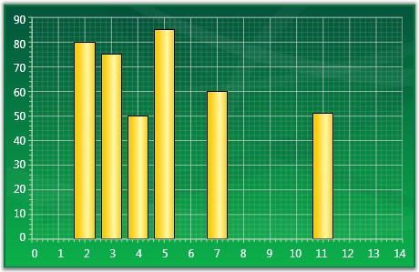
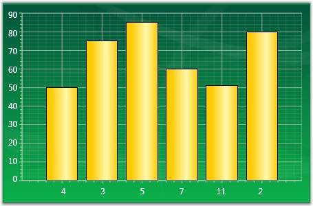

::: {style="DISPLAY: none"}
{#d2h_url_template}{#d2h_package_url style="WIDTH: 0px; DISPLAY: none; HEIGHT: 0px"}
:::

::: {.d2h_secondary_topic style="PADDING-BOTTOM: 10pt; MARGIN: 0pt; PADDING-LEFT: 0pt; PADDING-RIGHT: 0pt; PADDING-TOP: 0pt"}
##### Indexed X Values {#indexed-x-values style="tab-stops: 0pt"}

By default points in a series are plotted against their X and Y values. However in some cases the X values are meaningless, they simply represent categories, and you do not want to plot the points against such X values. Such an X axis that ignores the X-values and simply uses the positional value of a point in a series is said to be indexed.

 

The below given code snippet could be used to make a series as Indexed.

 

+---------------------------------------------------------------------------------------------------------------------------------------------------------------------------------------------------------------------------------------------------------------------------------------------------------------------------------------------------------------------+
| **[\[XAML\]]{style="FONT-FAMILY: 'Courier New'"}**                                                                                                                                                                                                                                                                                                                  |
|                                                                                                                                                                                                                                                                                                                                                                     |
| []{style="FONT-FAMILY: 'Courier New'"}                                                                                                                                                                                                                                                                                                                              |
|                                                                                                                                                                                                                                                                                                                                                                     |
| [\<]{style="FONT-FAMILY: 'Courier New'; COLOR: blue"}[sfchart]{style="FONT-FAMILY: 'Courier New'; COLOR: #a31515"}[:]{style="FONT-FAMILY: 'Courier New'; COLOR: blue"}[ChartSeries]{style="FONT-FAMILY: 'Courier New'; COLOR: #a31515"}[ IsIndexed]{style="FONT-FAMILY: 'Courier New'; COLOR: red"}[=\"True\" /\>]{style="FONT-FAMILY: 'Courier New'; COLOR: blue"} |
+---------------------------------------------------------------------------------------------------------------------------------------------------------------------------------------------------------------------------------------------------------------------------------------------------------------------------------------------------------------------+

[]{style="FONT-FAMILY: 'Trebuchet MS','sans-serif'; COLOR: #15428b"} 

+---------------------------------------------------------------------------------------------------+
| **[\[C#\]]{style="FONT-FAMILY: 'Courier New'"}**                                                  |
|                                                                                                   |
| []{style="FONT-FAMILY: 'Courier New'"}                                                            |
|                                                                                                   |
| [//Sets the series as indexed]{style="FONT-FAMILY: 'Courier New'; COLOR: green"}                  |
|                                                                                                   |
| [series.IsIndexed = [true]{style="COLOR: blue"};            ]{style="FONT-FAMILY: 'Courier New'"} |
+---------------------------------------------------------------------------------------------------+

[]{style="FONT-FAMILY: 'Trebuchet MS','sans-serif'; COLOR: #15428b; FONT-SIZE: 9pt"} 

In the figure below, the first chart shows a column chart that is not-indexed while the second chart shows a column chart whose x-axis is indexed.

[]{style="FONT-FAMILY: 'Trebuchet MS','sans-serif'; COLOR: #15428b; FONT-SIZE: 9pt"} 

{border="0"}

Figure 170: Column Chart with IsIndexed property set to False

[]{style="FONT-FAMILY: 'Trebuchet MS','sans-serif'; COLOR: #15428b"} 

{border="0"}

Figure 171: Column Chart with IsIndexed property set to True

 

[]{#p124} 

 

[]{#related-topics}
:::
