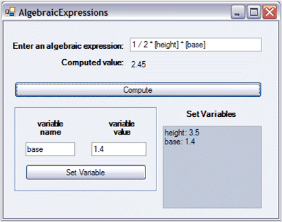

::: {style="DISPLAY: none"}
{#d2h_url_template}{#d2h_package_url style="WIDTH: 0px; DISPLAY: none; HEIGHT: 0px"}
:::

::: {.d2h_secondary_topic style="PADDING-BOTTOM: 10pt; MARGIN: 0pt; PADDING-LEFT: 0pt; PADDING-RIGHT: 0pt; PADDING-TOP: 0pt"}
##### Indexer Method using Variables {#indexer-method-using-variables style="tab-stops: 0pt"}

[]{#p31} 

In this section, you will learn how to use variable names within formulas to represent particular values. A variable name must begin with an alphabetical character and can contain only letters and digits. It is not case-sensitive. To register a string as a variable name and set its value is a single step operation, you must simply index the **CalcQuickBase** object with the name and assign the value to it.

[]{style="FONT-FAMILY: 'Trebuchet MS','sans-serif'; COLOR: #15428b; FONT-SIZE: 9pt"} 

+-----------------------------------------------------------------------------------------------------------------------------------------------------------------------------+
| **[\[C#\]]{style="FONT-FAMILY: 'Courier New'; COLOR: black"}**                                                                                                              |
|                                                                                                                                                                             |
| []{style="FONT-FAMILY: 'Courier New'; COLOR: black; FONT-SIZE: 9pt"}                                                                                                        |
|                                                                                                                                                                             |
| [this]{style="FONT-FAMILY: 'Courier New'; COLOR: blue; FONT-SIZE: 9pt"}[.calculator\[\"base\"\] = 3;]{style="FONT-FAMILY: 'Courier New'; COLOR: black; FONT-SIZE: 9pt"}     |
|                                                                                                                                                                             |
| [this]{style="FONT-FAMILY: 'Courier New'; COLOR: blue; FONT-SIZE: 9pt"}[.calculator\[\"height\"\] = 2.5;]{style="FONT-FAMILY: 'Courier New'; COLOR: black; FONT-SIZE: 9pt"} |
+-----------------------------------------------------------------------------------------------------------------------------------------------------------------------------+

[]{style="FONT-FAMILY: 'Trebuchet MS','sans-serif'; COLOR: #15428b; FONT-SIZE: 9pt"} 

+------------------------------------------------------------------------------------------------------------------------------------------------------------------------+
| **[\[VB\]]{style="FONT-FAMILY: 'Courier New'; COLOR: black"}**                                                                                                         |
|                                                                                                                                                                        |
| []{style="FONT-FAMILY: 'Courier New'; COLOR: black; FONT-SIZE: 9pt"}                                                                                                   |
|                                                                                                                                                                        |
| [Me]{style="FONT-FAMILY: 'Courier New'; COLOR: blue; FONT-SIZE: 9pt"}[.calculator(\"base\") = 3]{style="FONT-FAMILY: 'Courier New'; COLOR: black; FONT-SIZE: 9pt"}     |
|                                                                                                                                                                        |
| [Me]{style="FONT-FAMILY: 'Courier New'; COLOR: blue; FONT-SIZE: 9pt"}[.calculator(\"height\") = 2.5]{style="FONT-FAMILY: 'Courier New'; COLOR: black; FONT-SIZE: 9pt"} |
+------------------------------------------------------------------------------------------------------------------------------------------------------------------------+

 

{border="0"}

Figure 30: Simple Variables

[]{style="FONT-FAMILY: 'Trebuchet MS','sans-serif'; COLOR: #15428b; FONT-SIZE: 9pt"} 

When a name is used as an indexer on the CalcQuickBase object, the object checks a collection of variables that it maintains.

[]{style="FONT-FAMILY: 'Trebuchet MS','sans-serif'; COLOR: #15428b; FONT-SIZE: 9pt"} 

[·      ]{style="FONT-FAMILY: Symbol"}If the name is not in the collection, it is added to the collection as a new item with the assigned value.

[·      ]{style="FONT-FAMILY: Symbol"}If the name is already in the collection, its assigned value is changed to the new value.

 

Then when a formula is **parsed**, the CalcQuickBase object replaces all occurrences of variable names with their current values. To use a named variable in a formula, you must enclose it within brackets, as shown in the following formula:

 

\[base\]\*\[height\]/2

 

The preceding formula takes the value represented by the base and multiplies it by the height of the value divided by two.

 

As a convention, if you want a variable to actually hold a string that is a formula and be treated as a formula, so that it is parsed and computed through the indexing code, then begin that string with a special character, the **CalcQuickBase.FormulaCharacter** (CalcEngine.FormulaCharacter). The default value of this character is \"=\". If you invoke the **ParseAndCompute** directly, any string you pass will be treated as a formula, whether or not it begins with FormulaCharacter.

###### 4.1.1.1.2.1 The FormulaInfo Class {#the-formulainfo-class style="tab-stops: 0pt"}

 

The collection that **CalcQuickBase** maintains in order to hold information on variables, is a collection of FormulaInfo objects. The **FormulaInfo[ ]{style="COLOR: red"}**class has the following public properties.

 

[·      ]{style="FONT-FAMILY: Symbol"}**FormulaText**-String holding the formula as originally entered

[·      ]{style="FONT-FAMILY: Symbol"}**ParsedFormula**-String holding the **parsed** version of the formula1

[·      ]{style="FONT-FAMILY: Symbol"}**FormulaValue**-String holding the last computed value for the formula

 

**Indexing** is an instance of the CalcQuickBase class, which sets the **FormulaText** property and gets the **FormulaValue** property for the FormulaInfo object that is associated with the variable name and used as the indexer. A FormulaInfo object is dynamically created, if you use a variable name that is not in the **CalcQuickBase FormulaInfo** collection. To retrieve FormulaText, you must use the **CalcQuickBase.GetFormula** method and pass it in the variable name.

 

While using an indexer to get a value from a CalcQuickBase object, the FormulaValue property is returned. So, the question arises, as to exactly \"when\" this FormulaValue is computed from the FormulaText that has been set into this FormulaInfo object. When a new value for FormulaValue is computed, it is controlled by an internal member of FormulaInfo, the calcID. The CalcQuickBase object maintains a calcID value as well. Whenever the FormulaInfo.FormulaValue is requested, the CalcQuickBase.calcID is compared to the FormulaInfo.calcID, and if they do not match, the FormulaInfo.FormulaValue is recomputed and its FormulaInfo.calcID is set to match the CalcQuickBase.calcID. So, FormulaValue is only computed when the calcID value does not match the CalQuick.calcID value. Also, you can force new computations by calling the **SetDirty** method on your CalcQuickBase instance.

 

The actual collection of FormulaInfo objects (and some related collections) are protected members of the CalcQuickBase class. In order to access the objects of these collections directly, you must derive the CalcQuickBase class of Essential Calculate. The Calculate class reference has more information on these protected collections.

 

You can access the underlying Calculate.Engine object through the public read-only **Engine** property of the CalcQuickBase class. You can then use this Engine property to add custom functions to the Function Library that is available for the CalcQuickBase object.

 

[]{#related-topics}
:::
