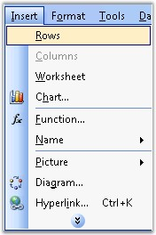

::: {style="DISPLAY: none"}
{#d2h_url_template}{#d2h_package_url style="WIDTH: 0px; DISPLAY: none; HEIGHT: 0px"}
:::

::::: {.d2h_secondary_topic style="PADDING-BOTTOM: 10pt; MARGIN: 0pt; PADDING-LEFT: 0pt; PADDING-RIGHT: 0pt; PADDING-TOP: 0pt"}
#### Insert {#insert style="tab-stops: 0pt"}

 

XlsIO has support for dynamically inserting rows and columns into a new/existing worksheet. Inserting rows/columns will allow the other rows/columns to move down/right by one step, and accomodate the new rows/columns.

 

MS Excel allows to insert rows/columns through the **Insert** menu option.

 

{border="0"}

Figure 58: Insert Menu in Excel[]{style="FONT-FAMILY: 'Trebuchet MS','sans-serif'; COLOR: #15428b"}

 

Following code example illustrates inserting rows/columns.

 

+---------------------------------------------------------------------------+
| **[\[C#\]]{style="FONT-FAMILY: 'Courier New'"}**                          |
|                                                                           |
| **[]{style="FONT-FAMILY: 'Courier New'"}**                                |
|                                                                           |
| [// Inserting Rows.]{style="FONT-FAMILY: 'Courier New'; COLOR: green"}    |
|                                                                           |
| [sheet.InsertRow(3);]{style="FONT-FAMILY: 'Courier New'"}                 |
|                                                                           |
| []{style="FONT-FAMILY: 'Courier New'"}                                    |
|                                                                           |
| [// Inserting Columns.]{style="FONT-FAMILY: 'Courier New'; COLOR: green"} |
|                                                                           |
| [sheet.InsertColumn(2);]{style="FONT-FAMILY: 'Courier New'"}              |
+---------------------------------------------------------------------------+

[]{style="FONT-FAMILY: 'Trebuchet MS','sans-serif'; COLOR: #15428b; FONT-SIZE: 9pt"} 

+---------------------------------------------------------------------------+
| **[\[VB.NET\]]{style="FONT-FAMILY: 'Courier New'"}**                      |
|                                                                           |
| **[]{style="FONT-FAMILY: 'Courier New'"}**                                |
|                                                                           |
| [\' Inserting Rows.]{style="FONT-FAMILY: 'Courier New'; COLOR: green"}    |
|                                                                           |
| [sheet.InsertRow(3)]{style="FONT-FAMILY: 'Courier New'"}                  |
|                                                                           |
| []{style="FONT-FAMILY: 'Courier New'"}                                    |
|                                                                           |
| [\' Inserting Columns.]{style="FONT-FAMILY: 'Courier New'; COLOR: green"} |
|                                                                           |
| [sheet.InsertColumn(2)]{style="FONT-FAMILY: 'Courier New'"}               |
+---------------------------------------------------------------------------+

 

XlsIO also allows you to insert multiple rows and columns. The following code example illustrates this.

 

+------------------------------------------------------------------------------------+
| **[\[C#\]]{style="FONT-FAMILY: 'Courier New'"}**                                   |
|                                                                                    |
| **[]{style="FONT-FAMILY: 'Courier New'"}**                                         |
|                                                                                    |
| [// Inserting multiple columns.]{style="FONT-FAMILY: 'Courier New'; COLOR: green"} |
|                                                                                    |
| [sheet.InsertColumn(colIndex,colCount);]{style="FONT-FAMILY: 'Courier New'"}       |
|                                                                                    |
| []{style="FONT-FAMILY: 'Courier New'"}                                             |
|                                                                                    |
| [\' Inserting multiple rows.]{style="FONT-FAMILY: 'Courier New'; COLOR: green"}    |
|                                                                                    |
| [sheet.InsertRow(rowIndex,rowCount);]{style="FONT-FAMILY: 'Courier New'"}          |
+------------------------------------------------------------------------------------+

[]{style="FONT-FAMILY: 'Trebuchet MS','sans-serif'; COLOR: #15428b; FONT-SIZE: 9pt"} 

+------------------------------------------------------------------------------------+
| **[\[VB.NET\]]{style="FONT-FAMILY: 'Courier New'"}**                               |
|                                                                                    |
| **[]{style="FONT-FAMILY: 'Courier New'"}**                                         |
|                                                                                    |
| [\' Inserting multiple columns.]{style="FONT-FAMILY: 'Courier New'; COLOR: green"} |
|                                                                                    |
| [sheet.InsertColumn(colIndex,colCount)]{style="FONT-FAMILY: 'Courier New'"}        |
|                                                                                    |
| []{style="FONT-FAMILY: 'Courier New'"}                                             |
|                                                                                    |
| [\' Inserting multiple rows.]{style="FONT-FAMILY: 'Courier New'; COLOR: green"}    |
|                                                                                    |
| [sheet.InsertRow(rowIndex,rowCount)]{style="FONT-FAMILY: 'Courier New'"}           |
+------------------------------------------------------------------------------------+

 

You can also preserve the previous or next row/column formats by using XlsIO. Following code example illustrates this.

 

+-----------------------------------------------------------------------------------------------------------------------------------+
| **[\[C#\]]{style="FONT-FAMILY: 'Courier New'"}**                                                                                  |
|                                                                                                                                   |
| []{style="FONT-FAMILY: 'Courier New'"}                                                                                            |
|                                                                                                                                   |
| [sheet.InsertRow(rowIndex, count, [ExcelInsertOptions]{style="COLOR: teal"}.FormatAsBefore);]{style="FONT-FAMILY: 'Courier New'"} |
+-----------------------------------------------------------------------------------------------------------------------------------+

[]{style="FONT-FAMILY: 'Trebuchet MS','sans-serif'; COLOR: #15428b; FONT-SIZE: 9pt"} 

+----------------------------------------------------------------------------------------------------------------------------------+
| **[\[VB.NET\]]{style="FONT-FAMILY: 'Courier New'"}**                                                                             |
|                                                                                                                                  |
| []{style="FONT-FAMILY: 'Courier New'"}                                                                                           |
|                                                                                                                                  |
| [sheet.InsertRow(rowIndex, count, [ExcelInsertOptions]{style="COLOR: teal"}.FormatAsBefore)]{style="FONT-FAMILY: 'Courier New'"} |
+----------------------------------------------------------------------------------------------------------------------------------+

[]{style="FONT-FAMILY: 'Trebuchet MS','sans-serif'; COLOR: #15428b; FONT-SIZE: 9pt"} 

::: {style="BORDER-BOTTOM: windowtext 1pt solid; BORDER-LEFT: medium none; PADDING-BOTTOM: 1pt; MARGIN-TOP: 9pt; PADDING-LEFT: 0pt; PADDING-RIGHT: 0pt; MARGIN-BOTTOM: 9pt; BORDER-TOP: windowtext 1pt solid; BORDER-RIGHT: medium none; PADDING-TOP: 1pt"}
{border="0"}Note: Here row and column index of Insert methods are \"one based\".
:::

 

Following table lists the options provided by the **ExcelInsertOptions** enumerator.

 

::: {align="center"}
  ---------------- --------------------------------------------------------------------------------------------------------------
  Member name      Description
  FormatAsBefore   Indicates that after insert operation, inserted rows/columns must be formatted as row above or column left.
  FormatAsAfter    Indicates that after insert operation, inserted rows/columns must be formatted as row below or column right.
  FormatDefault    Indicates that after insert operation, inserted rows/columns must have default format.
  ---------------- --------------------------------------------------------------------------------------------------------------
:::

 

[]{#related-topics}
:::::
