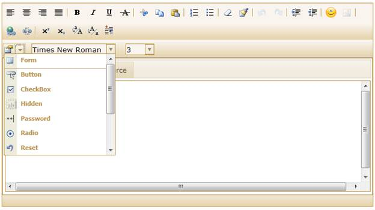
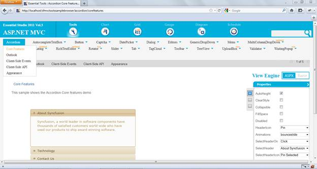

::: {style="DISPLAY: none"}
{#d2h_url_template}{#d2h_package_url style="WIDTH: 0px; DISPLAY: none; HEIGHT: 0px"}
:::

::: {.d2h_secondary_topic style="PADDING-BOTTOM: 10pt; MARGIN: 0pt; PADDING-LEFT: 0pt; PADDING-RIGHT: 0pt; PADDING-TOP: 0pt"}
#### Insert Form Elements in RTE {#insert-form-elements-in-rte style="tab-stops: 0pt"}

Rich Text Editor helps you to insert input elements (also known as form elements).

If you enable the "ShowInsertFormElements" option in the View page, you will be able to view the form elements that are available for use in the RTE.

 

Use Case Scenario

You can insert the following elements in the RTE using this feature:

[·      ]{style="FONT-FAMILY: Symbol"}Form

[·      ]{style="FONT-FAMILY: Symbol"}Button

[·      ]{style="FONT-FAMILY: Symbol"}Checkbox

[·      ]{style="FONT-FAMILY: Symbol"}Hidden

[·      ]{style="FONT-FAMILY: Symbol"}Password

[·      ]{style="FONT-FAMILY: Symbol"}Radio Button

[·      ]{style="FONT-FAMILY: Symbol"}Reset

[·      ]{style="FONT-FAMILY: Symbol"}Submit

[·      ]{style="FONT-FAMILY: Symbol"}Textbox

[·      ]{style="FONT-FAMILY: Symbol"}Text Area

[·      ]{style="FONT-FAMILY: Symbol"}Select (dropdown box)

 

Appearance and Structure

This figure gives you an idea of the appearance and structure of the Insert Form Element tab in the RTE:

 

{border="0"}

Figure 215: Insert Form Elements Drop-down list in RTE

 

 

 

**Viewing Samples**

To view the samples:

1.   Click Dashboard. Click the drop-down button of MVC platform.

2.   Click the **Run Locally Installed Samples** link. The Essential Studio MVC Edition sample browser is displayed.

3.   Select the **Tools** tab.

 {border="0"}

Figure 216: MVC Tools Sample browser

 

4.   Select any sample from the Core features under the Rich Text Editor tab and browse through the features.

 

**Source Code Location**

The full source code of the RTE will be available on the purchase of the product.

The default location of the Essential Tools MVC source code is:

***\[System Drive\]:\\Program Files\\Syncfusion\\Essential Studio\\\[Version Number\]\\MVC\\Tools.MVC\\Src***

 

Properties

There is only one property that allows you to insert form elements in the RTE:

+---------------------------------------------------+-----------------------------------------------------------------------------------------+-------------------------------------------------+--------------------------------------------------+---------------------------------------------+
| **Property[]{style="FONT-SIZE: 11pt"}**           | **Description[]{style="FONT-SIZE: 11pt"}**                                              | **Type of Property[]{style="FONT-SIZE: 11pt"}** | **Value it accepts[]{style="FONT-SIZE: 11pt"}**  | **Dependencies[]{style="FONT-SIZE: 11pt"}** |
+---------------------------------------------------+-----------------------------------------------------------------------------------------+-------------------------------------------------+--------------------------------------------------+---------------------------------------------+
| ShowInsertFormElements[]{style="FONT-SIZE: 11pt"} | Allows you to show the Insert Form Element option in the RTE[]{style="FONT-SIZE: 11pt"} | bool                                            | 1.  True                                         | NA[]{style="FONT-SIZE: 11pt"}               |
|                                                   |                                                                                         |                                                 |                                                  |                                             |
|                                                   |                                                                                         |                                                 | 2.  False                                        |                                             |
|                                                   |                                                                                         |                                                 |                                                  |                                             |
|                                                   |                                                                                         |                                                 | Default value is True[]{style="FONT-SIZE: 11pt"} |                                             |
+---------------------------------------------------+-----------------------------------------------------------------------------------------+-------------------------------------------------+--------------------------------------------------+---------------------------------------------+

More:

[ ]{#related-topics}

[{border="0" align="absMiddle"}Enabling form elements in your RTE](ms-xhelp:///?Id=14a25fbe-0a4e-4924-aee6-45b51d4d03b4){style="TEXT-DECORATION: none"}
:::
