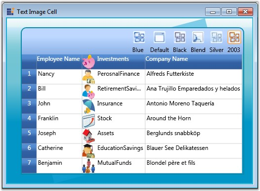

::: {style="DISPLAY: none"}
{#d2h_url_template}{#d2h_package_url style="WIDTH: 0px; DISPLAY: none; HEIGHT: 0px"}
:::

:::: {.d2h_secondary_topic style="PADDING-BOTTOM: 10pt; MARGIN: 0pt; PADDING-LEFT: 0pt; PADDING-RIGHT: 0pt; PADDING-TOP: 0pt"}
#### Inserting Images into Grid Cells {#inserting-images-into-grid-cells style="tab-stops: 0pt"}

Grid provides inherent support to add images into grid cells. There are two possible ways to achieve this.

 

[·      ]{style="FONT-FAMILY: Symbol"}Style.Image property---Used to insert an image alongside the text in the grid cells.

[·      ]{style="FONT-FAMILY: Symbol"}Style.ImageList property---It serves the same purpose as the Image property, points to a collection of images and lets you share the same ImageSource for a group of cells. Once you have selected the images by using the ImageList property, you must set the ImageIndex property for individual cells, to indicate the specific image (from the ImageList) to be inserted into the cell.

**[]{style="COLOR: #15428b"}** 

::: {style="BORDER-BOTTOM: windowtext 1pt solid; BORDER-LEFT: medium none; PADDING-BOTTOM: 1pt; MARGIN-TOP: 9pt; PADDING-LEFT: 0pt; PADDING-RIGHT: 0pt; MARGIN-BOTTOM: 9pt; BORDER-TOP: windowtext 1pt solid; BORDER-RIGHT: medium none; PADDING-TOP: 1pt"}
{border="0"}Note: If you use both Image and ImageList properties, then the most recent property applied will be considered.
:::

 

The following code example illustrates how to use these properties.

 

+-------------------------------------------------------------------------------------------------------------------------------------------------------------------------------------------------------------------------------------------------------------------------------+
| [\[C#\]]{style="FONT-FAMILY: 'Courier New'; COLOR: black"}                                                                                                                                                                                                                    |
|                                                                                                                                                                                                                                                                               |
| []{style="FONT-FAMILY: 'Courier New'; COLOR: blue"}                                                                                                                                                                                                                           |
|                                                                                                                                                                                                                                                                               |
| [// Using Vector Images.]{style="FONT-FAMILY: 'Courier New'; COLOR: green"}                                                                                                                                                                                                   |
|                                                                                                                                                                                                                                                                               |
| [ResourceDictionary]{style="FONT-FAMILY: 'Courier New'; COLOR: #2b91af"}[ dictionary = [new]{style="COLOR: blue"} [ResourceDictionary]{style="COLOR: #2b91af"}();]{style="FONT-FAMILY: 'Courier New'"}                                                                        |
|                                                                                                                                                                                                                                                                               |
| [dictionary.Source = [new]{style="COLOR: blue"} [Uri]{style="COLOR: #2b91af"}(vectorImgSrcUri, [UriKind]{style="COLOR: #2b91af"}.RelativeOrAbsolute);]{style="FONT-FAMILY: 'Courier New'"}                                                                                    |
|                                                                                                                                                                                                                                                                               |
| []{style="FONT-FAMILY: 'Courier New'"}                                                                                                                                                                                                                                        |
|                                                                                                                                                                                                                                                                               |
| [ObservableCollection]{style="FONT-FAMILY: 'Courier New'; COLOR: #2b91af"}[\<[Image]{style="COLOR: #2b91af"}\> imgList = [new]{style="COLOR: blue"} [ObservableCollection]{style="COLOR: #2b91af"}\<[Image]{style="COLOR: #2b91af"}\>();]{style="FONT-FAMILY: 'Courier New'"} |
|                                                                                                                                                                                                                                                                               |
| []{style="FONT-FAMILY: 'Courier New'; COLOR: green"}                                                                                                                                                                                                                          |
|                                                                                                                                                                                                                                                                               |
| [// Loading ImageList.]{style="FONT-FAMILY: 'Courier New'; COLOR: green"}                                                                                                                                                                                                     |
|                                                                                                                                                                                                                                                                               |
| [foreach]{style="FONT-FAMILY: 'Courier New'; COLOR: blue"}[ ([string]{style="COLOR: blue"} key [in]{style="COLOR: blue"} dictionary.Keys)]{style="FONT-FAMILY: 'Courier New'"}                                                                                                |
|                                                                                                                                                                                                                                                                               |
| [{]{style="FONT-FAMILY: 'Courier New'"}                                                                                                                                                                                                                                       |
|                                                                                                                                                                                                                                                                               |
| [   [Image]{style="COLOR: #2b91af"} img = [new]{style="COLOR: blue"} [Image]{style="COLOR: #2b91af"}();]{style="FONT-FAMILY: 'Courier New'"}                                                                                                                                  |
|                                                                                                                                                                                                                                                                               |
| [   img.Source = ([DrawingImage]{style="COLOR: #2b91af"})dictionary\[[\"Technology\"]{style="COLOR: #a31515"}\];]{style="FONT-FAMILY: 'Courier New'"}                                                                                                                         |
|                                                                                                                                                                                                                                                                               |
| [   imgList.Add(img);   ]{style="FONT-FAMILY: 'Courier New'"}                                                                                                                                                                                                                 |
|                                                                                                                                                                                                                                                                               |
| [}]{style="FONT-FAMILY: 'Courier New'"}                                                                                                                                                                                                                                       |
|                                                                                                                                                                                                                                                                               |
| [// Setting ImageList.]{style="FONT-FAMILY: 'Courier New'; COLOR: green"}                                                                                                                                                                                                     |
|                                                                                                                                                                                                                                                                               |
| [grid.Model.TableStyle.ImageList = imgList;]{style="FONT-FAMILY: 'Courier New'"}                                                                                                                                                                                              |
|                                                                                                                                                                                                                                                                               |
| [// Image property setting.]{style="FONT-FAMILY: 'Courier New'; COLOR: green"}                                                                                                                                                                                                |
|                                                                                                                                                                                                                                                                               |
| [grid.Model\[0, 2\].Text = [\"Technology\"]{style="COLOR: #a31515"};]{style="FONT-FAMILY: 'Courier New'"}                                                                                                                                                                     |
|                                                                                                                                                                                                                                                                               |
| [Image]{style="FONT-FAMILY: 'Courier New'; COLOR: #2b91af"}[ img = [new]{style="COLOR: blue"} [Image]{style="COLOR: #2b91af"}();]{style="FONT-FAMILY: 'Courier New'"}                                                                                                         |
|                                                                                                                                                                                                                                                                               |
| [img.Source = [new]{style="COLOR: blue"} [BitmapImage]{style="COLOR: #2b91af"}([new]{style="COLOR: blue"} [Uri]{style="COLOR: #2b91af"}([\"Technology.png\"]{style="COLOR: #a31515"}, [UriKind]{style="COLOR: #2b91af"}.Absolute));]{style="FONT-FAMILY: 'Courier New'"}      |
|                                                                                                                                                                                                                                                                               |
| [grid.Model\[0, 2\].Image = img;]{style="FONT-FAMILY: 'Courier New'"}                                                                                                                                                                                                         |
|                                                                                                                                                                                                                                                                               |
| []{style="FONT-FAMILY: 'Courier New'"}                                                                                                                                                                                                                                        |
|                                                                                                                                                                                                                                                                               |
| [// Setting ImageIndex.]{style="FONT-FAMILY: 'Courier New'; COLOR: green"}                                                                                                                                                                                                    |
|                                                                                                                                                                                                                                                                               |
| [grid.Model\[1, 2\].Text = [\"Business\"]{style="COLOR: #a31515"};]{style="FONT-FAMILY: 'Courier New'"}                                                                                                                                                                       |
|                                                                                                                                                                                                                                                                               |
| [grid.Model\[1, 2\].ImageIndex = 0;]{style="FONT-FAMILY: 'Courier New'"}                                                                                                                                                                                                      |
|                                                                                                                                                                                                                                                                               |
| [grid.Model\[2, 2\].Text = [\"Software\"]{style="COLOR: #a31515"};]{style="FONT-FAMILY: 'Courier New'"}                                                                                                                                                                       |
|                                                                                                                                                                                                                                                                               |
| [grid.Model\[2, 2\].ImageIndex = 1;]{style="FONT-FAMILY: 'Courier New'"}                                                                                                                                                                                                      |
+-------------------------------------------------------------------------------------------------------------------------------------------------------------------------------------------------------------------------------------------------------------------------------+

 

The following output is generated using the code above.

 

{border="0"}

Figure 44: Text Image Cell

 

 

[]{#related-topics}
::::
