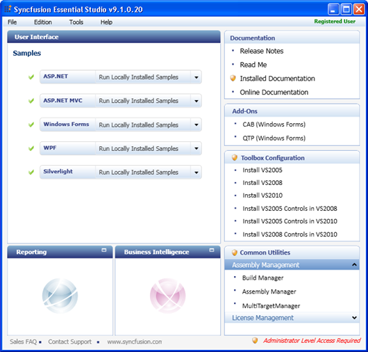
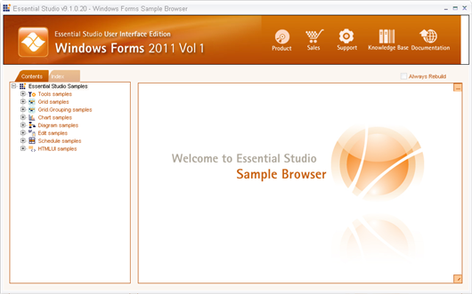
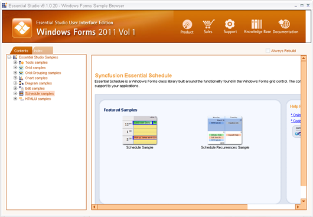

::: {style="DISPLAY: none"}
{#d2h_url_template}{#d2h_package_url style="WIDTH: 0px; DISPLAY: none; HEIGHT: 0px"}
:::

::::: {#nsbanner .d2h_main_nsbanner style="BORDER-BOTTOM: #999999 1px solid; POSITION: relative; PADDING-BOTTOM: 0px; BACKGROUND-COLOR: transparent; PADDING-LEFT: 0px; PADDING-RIGHT: 0px; DISPLAY: none; BORDER-TOP: #999999 1px solid; PADDING-TOP: 0px; LEFT: 0px"}
:::: {#TitleRow .d2h_main_titlerow style="PADDING-BOTTOM: 4px; BACKGROUND-COLOR: transparent; PADDING-LEFT: 22px; WIDTH: 100%; PADDING-RIGHT: 10px; DISPLAY: none; PADDING-TOP: 4px"}
::: {#ienav .d2h_main_ienav style="DISPLAY: none"}
{#D2HPrevious .D2HPreviousEnabled}  {#D2HNext .D2HNextEnabled}
:::
::::
:::::

:::: {#nstext .d2h_main_nstext style="PADDING-BOTTOM: 10px; BACKGROUND-COLOR: transparent; PADDING-LEFT: 22px; PADDING-RIGHT: 10px; HEIGHT: 100%; OVERFLOW: auto; PADDING-TOP: 5px" hasuserbackground="true" valign="bottom"}
::: {#d2h_breadcrumbs .d2h_breadcrumbs}
[Essential Studio User Guide Documentation](ms-xhelp:///?Id=12457748-09e3-4d74-a240-8e049cedf030){.d2h_breadcrumbsNormal}[ \> ]{.d2h_breadcrumbsLinkSeparator}[User Interface Edition](ms-xhelp:///?Id=c29296b7-531c-413b-a0ec-488ca1f7f669){.d2h_breadcrumbsNormal}[ \> ]{.d2h_breadcrumbsLinkSeparator}[Essential Windows](ms-xhelp:///?Id=e60759d8-47a4-4570-9d7a-16a68d63f2ea){.d2h_breadcrumbsNormal}[ \> ]{.d2h_breadcrumbsLinkSeparator}[Essential Schedule]{.d2h_breadcrumbsContentsOnly}[ \> ]{.d2h_breadcrumbsLinkSeparator}[Installation and Deployment](ms-xhelp:///?Id=7fba69a1-3f93-4be3-8b71-73488d89cb9c){.d2h_breadcrumbsNormal}
:::

## Installation {#installation style="tab-stops: 0pt"}

[]{style="FONT-FAMILY: 'Trebuchet MS','sans-serif'; COLOR: #15428b; FONT-SIZE: 9pt"} 

For step-by-step installation procedure for the installation of Essential Studio, refer to the **Installation** topic under **Installation and Deployment** in the **Common UG**.

[]{style="FONT-FAMILY: 'Trebuchet MS','sans-serif'; COLOR: #15428b; FONT-SIZE: 9pt"} 

See Also

[]{style="FONT-FAMILY: 'Trebuchet MS','sans-serif'; COLOR: #15428b; FONT-SIZE: 9pt"} 

For licensing, patches and information on adding or removing selective components refer the following topics in Common UG under **Installation and Deployment**.

[]{style="FONT-FAMILY: 'Trebuchet MS','sans-serif'; COLOR: #15428b; FONT-SIZE: 9pt"} 

[·      ]{style="FONT-FAMILY: Symbol"}Licensing

[·      ]{style="FONT-FAMILY: Symbol"}Patches

[·      ]{style="FONT-FAMILY: Symbol"}Add / Remove Components

 

 

Sample Installation Location

The Schedule Windows Forms samples are installed in the following location, locally on the disk:

***\[Local Drive\]:\\\... \\Syncfusion\\Essential Studio\\ \[VersionNumber\]\\ Windows\\Schedule.Windows\\ Samples\\2.0***

 

**[]{style="FONT-FAMILY: 'Trebuchet MS','sans-serif'; COLOR: #15428b; FONT-SIZE: 9pt"}** 

Viewing Samples

To view the samples, follow the steps below:

**Click Start** **[à]{style="FONT-FAMILY: Wingdings"}All Programs** **[à]{style="FONT-FAMILY: Wingdings"} Syncfusion** **[à]{style="FONT-FAMILY: Wingdings"} Essential Studio \<version number\>** **[à]{style="FONT-FAMILY: Wingdings"} Dashboard.**

Essential Studio Enterprise Edition window is displayed.

{border="0"}

 

Figure 2: Syncfusion Essential Studio Dashboard

*[]{style="FONT-FAMILY: 'Trebuchet MS','sans-serif'; COLOR: #15428b; FONT-SIZE: 9pt"}* 

 

**User Interface Edition** panel is displayed by default.

 

Click the drop-down button of the Windows platform.  The following options are displayed.

[·      ]{style="FONT-FAMILY: Symbol"}**Run Locally Installed Samples** -- View the locally installed Schedule samples for windows using the sample browser

[·      ]{style="FONT-FAMILY: Symbol"}**Run Online Samples** -- View the online Schedule samples for windows

[·      ]{style="FONT-FAMILY: Symbol"}**Explore Samples** -- Locate the Schedule samples on the disk

 

You can view the samples in the preceding three ways.

[]{style="FONT-FAMILY: 'Trebuchet MS','sans-serif'; COLOR: #15428b; FONT-SIZE: 9pt"} 

1.   Click **Run**, **Locally Installed Samples** link. Essential Studio User Interface Edition Windows Forms sample browser is displayed.

[]{style="FONT-FAMILY: 'Trebuchet MS','sans-serif'; COLOR: #15428b; FONT-SIZE: 9pt"} 

{border="0"}

 

Figure 3: User Interface Edition Windows Forms Sample Browser

[]{style="FONT-FAMILY: 'Trebuchet MS','sans-serif'; COLOR: #15428b; FONT-SIZE: 9pt"} 

[]{style="FONT-FAMILY: 'Trebuchet MS','sans-serif'; COLOR: #15428b; FONT-SIZE: 9pt"} 

2.   Under **Contents** tab, expand the **Schedule samples** to view the samples of the control.

[]{style="FONT-FAMILY: 'Trebuchet MS','sans-serif'; COLOR: #15428b; FONT-SIZE: 9pt"} 

[{border="0"}]{style="FONT-FAMILY: 'Trebuchet MS','sans-serif'; COLOR: #15428b; FONT-SIZE: 9pt"}

 

Figure 4: Schedule Samples for Windows

[]{style="FONT-FAMILY: 'Trebuchet MS','sans-serif'; COLOR: #15428b"} 

3.   A list of samples will be displayed on the left hand side of the page.  Select any sample and browse through the features.

[]{style="FONT-FAMILY: 'Trebuchet MS','sans-serif'; COLOR: #15428b; FONT-SIZE: 9pt"} 

4.   In the right pane, click **Run Sample** icon to run the selected sample.

**[]{style="FONT-FAMILY: 'Trebuchet MS','sans-serif'; COLOR: #15428b; FONT-SIZE: 9pt"}** 

**[]{style="FONT-FAMILY: 'Trebuchet MS','sans-serif'; COLOR: #15428b; FONT-SIZE: 9pt"}** 

Source Code Location

 

The source code for Essential Schedule Windows is available at the following default location:

***\[System Drive\]:\\Program Files\\Syncfusion\\Essential Studio\\\[Version Number\]\\ Windows\\ Schedule.Windows\\Src***

 

 

[]{#related-topics}
::::
