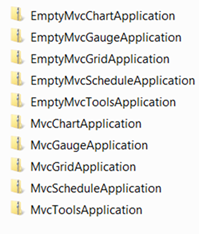
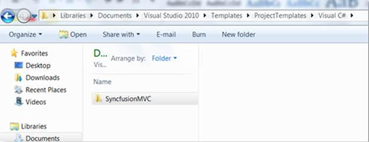
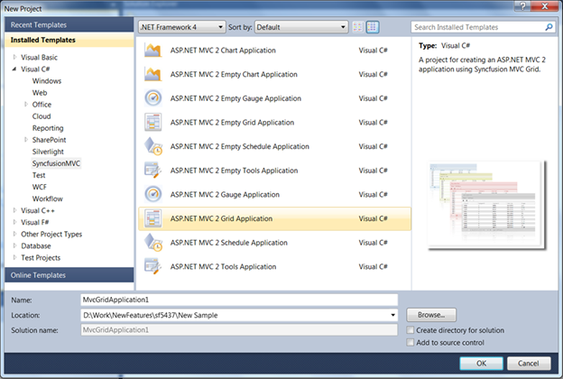

::: {style="DISPLAY: none"}
{#d2h_url_template}{#d2h_package_url style="WIDTH: 0px; DISPLAY: none; HEIGHT: 0px"}
:::

::::: {.d2h_secondary_topic style="PADDING-BOTTOM: 10pt; MARGIN: 0pt; PADDING-LEFT: 0pt; PADDING-RIGHT: 0pt; PADDING-TOP: 0pt"}
#### Installation Details {#installation-details style="tab-stops: 0pt"}

From version 8.4, the project templates will automatically get installed along with the Syncfusion MVC setup. The project templates are placed in the following location:

 

**%UserProfile%\\Documents\\Visual Studio 2010\\Templates\\ProjectTemplates\\Visual C#**

::: {style="BORDER-BOTTOM: windowtext 1pt solid; BORDER-LEFT: medium none; PADDING-BOTTOM: 1pt; MARGIN-TOP: 9pt; PADDING-LEFT: 0pt; PADDING-RIGHT: 0pt; MARGIN-BOTTOM: 9pt; BORDER-TOP: windowtext 1pt solid; BORDER-RIGHT: medium none; PADDING-TOP: 1pt"}
 

{border="0"}Note: These project templates are only for VS2010 and can be used in  C# alone (as of yet).
:::

However, to make use of the project templates for older versions, perform the following steps:

 

1.   [[Download the project templates for VS2010]{.UGHyperlink}](http://www.syncfusion.com/uploads/redirect.aspx?&team=support&file=SyncfusionMVC-6371708931544808514.zip)[[ ]{style="FONT-FAMILY: 'Calibri','sans-serif'; COLOR: blue"}]{.underline}[ ]{style="FONT-FAMILY: 'Myriad Pro','sans-serif'"}

2.   [Unzip the folder 'SyncfusionMVC'. This folder contains the project templates for all Syncfusion MVC products, namely Grid, Tools, Schedule, Chart and Gauge.]{style="FONT-FAMILY: 'Myriad Pro','sans-serif'"}

 

{border="0"}

Figure 9: List of Project Templates

[]{style="BACKGROUND: #dfe9f5; COLOR: #333333"} 

By default, the project templates in VS2010 are stored in the following location:

**%UserProfile%\\Documents\\Visual Studio 2010\\Templates\\ProjectTemplates**

It will be more meaningful to place the templates under the folder Visual C# as they have been created for C# alone. 

::: {style="BORDER-BOTTOM: windowtext 1pt solid; BORDER-LEFT: medium none; PADDING-BOTTOM: 1pt; MARGIN-TOP: 9pt; PADDING-LEFT: 0pt; PADDING-RIGHT: 0pt; MARGIN-BOTTOM: 9pt; BORDER-TOP: windowtext 1pt solid; BORDER-RIGHT: medium none; PADDING-TOP: 1pt"}
{border="0"}Note: Do not unzip the inner folders, which are shown in the  above image.
:::

 

{border="0"}

Figure 10: SyncfusionMVC Folder Location

**[]{style="BACKGROUND: #dfe9f5; COLOR: #333333"}** 

Now, restart your **Visual Studio 2010** and click **New Project**. Expand the Visual C# node and you will find the **SyncfusionMVC** node as a child node.

{border="0"}

Figure 11: Syncfusion MVC Project Templates

**[]{style="BACKGROUND: #dfe9f5; COLOR: #333333"}** 

[]{#related-topics}
:::::
