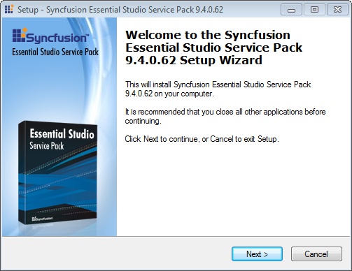
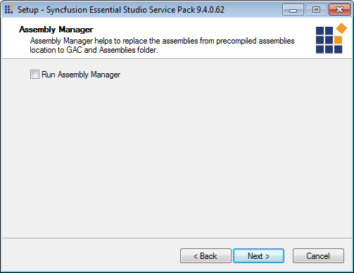
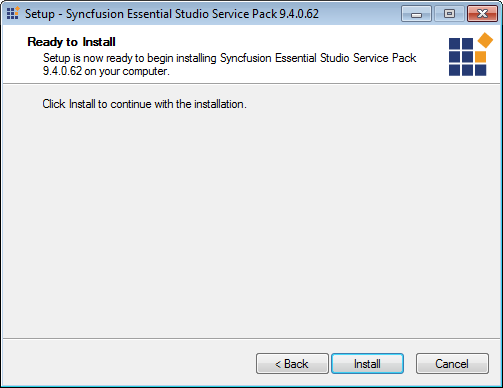
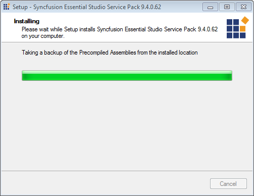
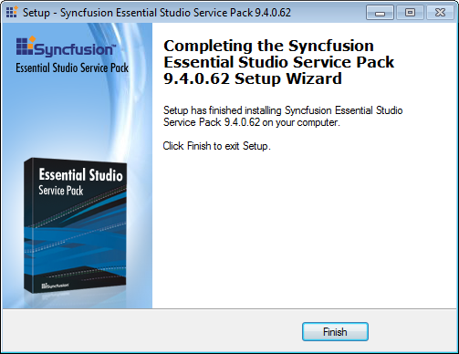

::: {style="DISPLAY: none"}
{#d2h_url_template}{#d2h_package_url style="WIDTH: 0px; DISPLAY: none; HEIGHT: 0px"}
:::

::::: {#nsbanner .d2h_main_nsbanner style="BORDER-BOTTOM: #999999 1px solid; POSITION: relative; PADDING-BOTTOM: 0px; BACKGROUND-COLOR: transparent; PADDING-LEFT: 0px; PADDING-RIGHT: 0px; DISPLAY: none; BORDER-TOP: #999999 1px solid; PADDING-TOP: 0px; LEFT: 0px"}
:::: {#TitleRow .d2h_main_titlerow style="PADDING-BOTTOM: 4px; BACKGROUND-COLOR: transparent; PADDING-LEFT: 22px; WIDTH: 100%; PADDING-RIGHT: 10px; DISPLAY: none; PADDING-TOP: 4px"}
::: {#ienav .d2h_main_ienav style="DISPLAY: none"}
{#D2HPrevious .D2HPreviousEnabled}  {#D2HNext .D2HNextEnabled}
:::
::::
:::::

:::::: {#nstext .d2h_main_nstext style="PADDING-BOTTOM: 10px; BACKGROUND-COLOR: transparent; PADDING-LEFT: 22px; PADDING-RIGHT: 10px; HEIGHT: 100%; OVERFLOW: auto; PADDING-TOP: 5px" hasuserbackground="true" valign="bottom"}
::: {#d2h_breadcrumbs .d2h_breadcrumbs}
[Essential Studio User Guide Documentation](ms-xhelp:///?Id=12457748-09e3-4d74-a240-8e049cedf030){.d2h_breadcrumbsNormal}[ \> ]{.d2h_breadcrumbsLinkSeparator}[Essential Common](ms-xhelp:///?Id=2bfe10b6-fac1-4f91-a173-04db314f10c3){.d2h_breadcrumbsNormal}[ \> ]{.d2h_breadcrumbsLinkSeparator}[Installation and Deployment](ms-xhelp:///?Id=edacfc75-68a5-4518-870d-ce716c583177){.d2h_breadcrumbsNormal}[ \> ]{.d2h_breadcrumbsLinkSeparator}[Patches](ms-xhelp:///?Id=c25f7147-28f2-46c2-bedf-511bdbabe8b3){.d2h_breadcrumbsNormal}
:::

### Installing a Patch Setup {#installing-a-patch-setup style="tab-stops: 0pt"}

 

The following procedure illustrates how to install a patch:

::: {style="BORDER-BOTTOM: windowtext 1pt solid; BORDER-LEFT: medium none; PADDING-BOTTOM: 1pt; MARGIN-TOP: 9pt; PADDING-LEFT: 0pt; PADDING-RIGHT: 0pt; MARGIN-BOTTOM: 9pt; BORDER-TOP: windowtext 1pt solid; BORDER-RIGHT: medium none; PADDING-TOP: 1pt"}
{border="0"}Note: Before installing the patch ensure that the Essential Studio version corresponding to the patch is installed on your machine.
:::

 

1.   Double-click the **Syncfusion Essential Studio patch setup** file. The **Syncfusion Essential Studio Service Pack** opens.

                        

 {border="0"} 

Figure 37: Unified  Installer

 

2.   Click **Next**. The **Assembly Manager** opens.

 

{border="0"} 

Figure 38: Assemble Manager Screen

 

 

3.   Select the **Run Assembly Manager** check box, to install the assemblies in GAC.

4.   Click **Next**. **Ready To Install** dialog will open.

 

{border="0"} 

Figure 39: Ready to Install

 

5.   Click **Install,** to continue installing.

 

{border="0"} 

Figure 40: Installing

::: {style="BORDER-BOTTOM: windowtext 1pt solid; BORDER-LEFT: medium none; PADDING-BOTTOM: 1pt; MARGIN-TOP: 9pt; PADDING-LEFT: 0pt; PADDING-RIGHT: 0pt; MARGIN-BOTTOM: 9pt; BORDER-TOP: windowtext 1pt solid; BORDER-RIGHT: medium none; PADDING-TOP: 1pt"}
{border="0"}Note: The patch will be installed on your computer, and you will be informed with a dialog box when the installation is completed.
:::

 

{border="0"}

Figure 41: Installation Completed

 

6.   Click **Finish.**

 

The new assemblies will be places in the **Pre-Compiled Assemblies** folder. These new assemblies can be referenced in your project.

 

[]{#related-topics}
::::::
