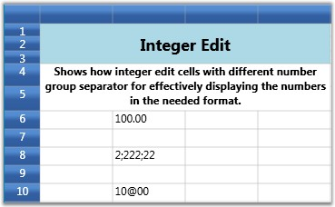

::: {style="DISPLAY: none"}
{#d2h_url_template}{#d2h_package_url style="WIDTH: 0px; DISPLAY: none; HEIGHT: 0px"}
:::

::::: {.d2h_secondary_topic style="PADDING-BOTTOM: 10pt; MARGIN: 0pt; PADDING-LEFT: 0pt; PADDING-RIGHT: 0pt; PADDING-TOP: 0pt"}
##### Integer Edit Cells {#integer-edit-cells style="tab-stops: 0pt"}

IntegerEdit is a specialized cell type that restricts the data entry to integers. The table below lists the style properties specific to this cell type.

 

Table 10: GridStyleInfo Property

::: {align="center"}
  ------------------------ ----------------------------------------
  GridStyleInfo Property   Description
  Cell Type                Set to "IntegerEdit"
  NumberGroupSeparator     String that separates groups of digits
  NumberGroupSizes         Number of digits in each group
  ------------------------ ----------------------------------------
:::

**[]{style="COLOR: #15428b"}** 

Example

Setting up Three Different Integer Edit Cells.

[]{style="COLOR: #15428b"} 

+---------------------------------------------------------------------------------------------------------------------------------------------------------------------------------+
| [\[C#\]]{style="FONT-FAMILY: 'Courier New'; COLOR: black"}                                                                                                                      |
|                                                                                                                                                                                 |
| []{style="FONT-FAMILY: 'Courier New'; COLOR: blue"}                                                                                                                             |
|                                                                                                                                                                                 |
| [int]{style="FONT-FAMILY: 'Courier New'; COLOR: blue"}[\[\] sizes = { 2, 3, 4 };]{style="FONT-FAMILY: 'Courier New'"}                                                           |
|                                                                                                                                                                                 |
| [grid.Model\[12, 2\].CellType = [\"IntegerEdit\"]{style="COLOR: #a31515"};]{style="FONT-FAMILY: 'Courier New'"}                                                                 |
|                                                                                                                                                                                 |
| [grid.Model\[12, 2\].IsEditable = [true]{style="COLOR: blue"};]{style="FONT-FAMILY: 'Courier New'"}                                                                             |
|                                                                                                                                                                                 |
| [grid.Model\[12, 2\].NumberFormat = [new]{style="COLOR: blue"} NumberFormatInfo { NumberGroupSeparator = [\",\"]{style="COLOR: #a31515"}};]{style="FONT-FAMILY: 'Courier New'"} |
|                                                                                                                                                                                 |
| [grid.Model\[12, 2\].NumberFormat.NumberGroupSizes = sizes;]{style="FONT-FAMILY: 'Courier New'"}                                                                                |
|                                                                                                                                                                                 |
| [grid.Model\[12, 2\].CellValue = 1;]{style="FONT-FAMILY: 'Courier New'"}                                                                                                        |
|                                                                                                                                                                                 |
| []{style="FONT-FAMILY: 'Courier New'"}                                                                                                                                          |
|                                                                                                                                                                                 |
| [grid.Model\[8, 2\].CellType = [\"IntegerEdit\"]{style="COLOR: #a31515"};]{style="FONT-FAMILY: 'Courier New'"}                                                                  |
|                                                                                                                                                                                 |
| [grid.Model\[8, 2\].IsEditable = [true]{style="COLOR: blue"};]{style="FONT-FAMILY: 'Courier New'"}                                                                              |
|                                                                                                                                                                                 |
| [grid.Model\[8, 2\].NumberFormat = [new]{style="COLOR: blue"} NumberFormatInfo { NumberGroupSeparator = [\";\"]{style="COLOR: #a31515"}};]{style="FONT-FAMILY: 'Courier New'"}  |
|                                                                                                                                                                                 |
| [grid.Model\[8, 2\].NumberFormat.NumberGroupSizes = sizes;]{style="FONT-FAMILY: 'Courier New'"}                                                                                 |
|                                                                                                                                                                                 |
| [grid.Model\[8, 2\].CellValue = 222222;]{style="FONT-FAMILY: 'Courier New'"}                                                                                                    |
|                                                                                                                                                                                 |
| []{style="FONT-FAMILY: 'Courier New'"}                                                                                                                                          |
|                                                                                                                                                                                 |
| [grid.Model\[10, 2\].CellType = [\"IntegerEdit\"]{style="COLOR: #a31515"};]{style="FONT-FAMILY: 'Courier New'"}                                                                 |
|                                                                                                                                                                                 |
| [grid.Model\[10, 2\].IsEditable = [true]{style="COLOR: blue"};]{style="FONT-FAMILY: 'Courier New'"}                                                                             |
|                                                                                                                                                                                 |
| [grid.Model\[10, 2\].NumberFormat = [new]{style="COLOR: blue"} NumberFormatInfo { NumberGroupSeparator = [\"@\"]{style="COLOR: #a31515"}};]{style="FONT-FAMILY: 'Courier New'"} |
|                                                                                                                                                                                 |
| [grid.Model\[10, 2\].NumberFormat.NumberGroupSizes = sizes;]{style="FONT-FAMILY: 'Courier New'"}                                                                                |
|                                                                                                                                                                                 |
| [grid.Model\[10, 2\].CellValue = 1000;]{style="FONT-FAMILY: 'Courier New'"}                                                                                                     |
+---------------------------------------------------------------------------------------------------------------------------------------------------------------------------------+

 

Output

 

The following output is generated using the code above.

 

{border="0"}

Figure 30: Integer Edit

::: {style="BORDER-BOTTOM: windowtext 1pt solid; BORDER-LEFT: medium none; PADDING-BOTTOM: 1pt; MARGIN-TOP: 9pt; PADDING-LEFT: 0pt; PADDING-RIGHT: 0pt; MARGIN-BOTTOM: 9pt; BORDER-TOP: windowtext 1pt solid; BORDER-RIGHT: medium none; PADDING-TOP: 1pt"}
{border="0"}Note: For complete code, please refer to the following browser sample.
:::

 

***\...\\My Documents\\Syncfusion\\EssentialStudio\\\<Version Number\>\\WPF\\Grid.WPF\\Samples\\3.5\\WindowsSamples\\Cell Types\\Interger Edit Cell Demo***

**** 

**** 

**** 

[]{#related-topics}
:::::
