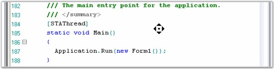

::: {style="DISPLAY: none"}
{#d2h_url_template}{#d2h_package_url style="WIDTH: 0px; DISPLAY: none; HEIGHT: 0px"}
:::

::: {.d2h_secondary_topic style="PADDING-BOTTOM: 10pt; MARGIN: 0pt; PADDING-LEFT: 0pt; PADDING-RIGHT: 0pt; PADDING-TOP: 0pt"}
##### Intellimouse Scrolling {#intellimouse-scrolling style="tab-stops: 0pt"}

[]{style="FONT-FAMILY: 'Trebuchet MS','sans-serif'; COLOR: #15428b; FONT-SIZE: 9pt"} 

Essential Edit provides excellent support for viewport navigation including intellimouse scrolling. Commonly used keyboard navigation functions like PAGE UP/PAGE DOWN keys, ARROW keys, and CTRL+ARROW keys are fully supported by Essential Edit.

[]{style="FONT-FAMILY: 'Trebuchet MS','sans-serif'; COLOR: #15428b; FONT-SIZE: 9pt"} 

{border="0"}

Figure 60: Preview of Intellimouse in Edit Control

[]{style="FONT-FAMILY: 'Trebuchet MS','sans-serif'; COLOR: #15428b; FONT-SIZE: 9pt"} 

See Also

[]{style="COLOR: #4a5c8c; FONT-SIZE: 9pt"} 

[Some of the intellisense features.]{style="FONT-SIZE: 9pt"}

[]{style="FONT-SIZE: 9pt"} 

[Code Snippets]{.UGHyperlink}[, ]{style="FONT-FAMILY: 'Trebuchet MS','sans-serif'; COLOR: #15428b; FONT-SIZE: 9pt"}[Context Choice]{.UGHyperlink}[, ]{style="FONT-FAMILY: 'Trebuchet MS','sans-serif'; COLOR: #15428b; FONT-SIZE: 9pt"}[Context Prompt]{.UGHyperlink}[, ]{style="FONT-FAMILY: 'Trebuchet MS','sans-serif'; COLOR: #15428b; FONT-SIZE: 9pt"}[Context Tooltip]{.UGHyperlink}[]{style="FONT-FAMILY: 'Trebuchet MS','sans-serif'; COLOR: black; FONT-SIZE: 9pt"}

 

[]{#related-topics}
:::
