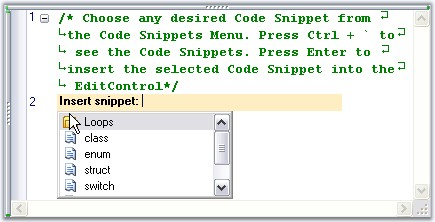
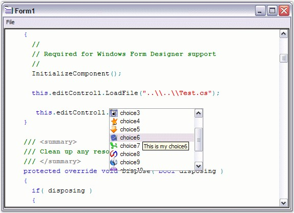
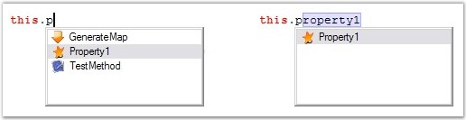
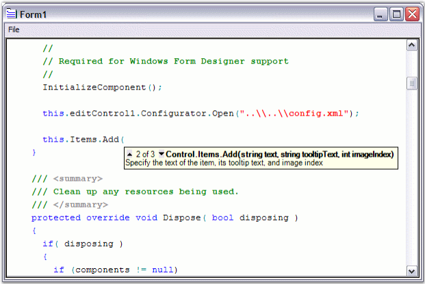
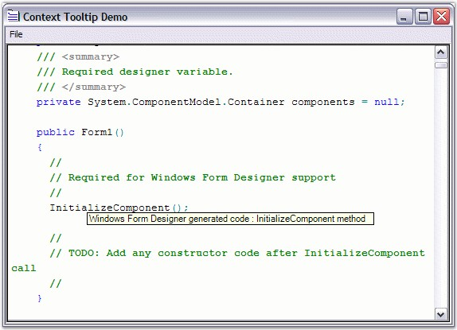

::: {style="DISPLAY: none"}
{#d2h_url_template}{#d2h_package_url style="WIDTH: 0px; DISPLAY: none; HEIGHT: 0px"}
:::

::::::::::::::: {.d2h_secondary_topic style="PADDING-BOTTOM: 10pt; MARGIN: 0pt; PADDING-LEFT: 0pt; PADDING-RIGHT: 0pt; PADDING-TOP: 0pt"}
##### IntelliPrompt Features {#intelliprompt-features style="tab-stops: 0pt"}

 

This section covers the following topics:

 

[]{style="FONT-SIZE: 3pt"} 

###### []{#_Code_Snippets}4.6.6.2.2.1 Code Snippets {#code-snippets style="tab-stops: 0pt"}

 

Essential Edit supports an advanced feature of VS 2005 like Code Snippets. It is also used to load / save VS.NET 2005-compatible XML snippets.

 

Code Snippets are inserted into the Edit Control by following the procedure given below:

 

1.   Type the snippet name. For example \"do\".

2.   Pressing the TAB key, or CTRL + \' combination.

3.   Select an item from the list as shown in the image below.

[]{style="FONT-FAMILY: 'Trebuchet MS','sans-serif'; COLOR: #15428b; FONT-SIZE: 9pt"} 

{border="0"}

Figure 55: Inserting Code Snippets into the Edit Control

 

The code snippets allow you to input data to the highlighted fields.

 

Code Snippets can also be inserted into the Edit Control by using the static **Extract** method of the **CodeSnippetsExtractor** class. The Extract method takes the following two parameters:

 

1.   Path of the folder containing the code snippets.

2.   Instance of the Edit Control into which the extracted code snippet should be inserted.

 

This is illustrated in the code given below.

 

+----------------------------------------------------------------------------------------------------------------------+
| **[\[C#\]]{style="FONT-FAMILY: 'Courier New'; COLOR: black"}**                                                       |
|                                                                                                                      |
| []{style="FONT-FAMILY: 'Courier New'; COLOR: black"}                                                                 |
|                                                                                                                      |
| [CodeSnippetsExtractor.Extract(csharpsnippetsPath, editControl1);]{style="FONT-FAMILY: 'Courier New'; COLOR: black"} |
+----------------------------------------------------------------------------------------------------------------------+

[]{style="FONT-FAMILY: 'Trebuchet MS','sans-serif'; COLOR: #15428b; FONT-SIZE: 9pt"} 

+-----------------------------------------------------------------------------------------------------------------+
| **[\[VB.NET\]]{style="FONT-FAMILY: 'Courier New'; COLOR: black"}**                                              |
|                                                                                                                 |
| []{style="FONT-FAMILY: 'Courier New'; COLOR: black"}                                                            |
|                                                                                                                 |
| [CodeSnippetsExtractor.Extract(vbsnippetsPath, editControl1)]{style="FONT-FAMILY: 'Courier New'; COLOR: black"} |
+-----------------------------------------------------------------------------------------------------------------+

 

Code Snippets are added to the current language of the Edit Control by using the below given method.

 

::: {align="center"}
  --------------------- --------------------------------------------
  Edit Control Method   Description
  AddCodeSnippet        Adds new code snippet to current language.
  --------------------- --------------------------------------------
:::

[]{style="FONT-FAMILY: 'Trebuchet MS','sans-serif'; COLOR: #15428b; FONT-SIZE: 9pt"} 

+-------------------------------------------------------------------------------------------------------------------------------------------------------------------------------------------------------------------------+
| **[\[C#\]]{style="FONT-FAMILY: 'Courier New'; COLOR: black"}**                                                                                                                                                          |
|                                                                                                                                                                                                                         |
| []{style="FONT-FAMILY: 'Courier New'; COLOR: black"}                                                                                                                                                                    |
|                                                                                                                                                                                                                         |
| [this]{style="FONT-FAMILY: 'Courier New'; COLOR: blue"}[.editControl1.AddCodeSnippet([string]{style="COLOR: blue"} title, ArrayList literals, [string]{style="COLOR: blue"} code);]{style="FONT-FAMILY: 'Courier New'"} |
+-------------------------------------------------------------------------------------------------------------------------------------------------------------------------------------------------------------------------+

[]{style="FONT-FAMILY: 'Trebuchet MS','sans-serif'; COLOR: #15428b; FONT-SIZE: 9pt"} 

+----------------------------------------------------------------------------------------------------------------------------------------------------------------------------------------------------------------------+
| **[\[VB.NET\]]{style="FONT-FAMILY: 'Courier New'; COLOR: black"}**                                                                                                                                                   |
|                                                                                                                                                                                                                      |
| []{style="FONT-FAMILY: 'Courier New'; COLOR: black"}                                                                                                                                                                 |
|                                                                                                                                                                                                                      |
| [Me]{style="FONT-FAMILY: 'Courier New'; COLOR: blue"}[.editControl1.AddCodeSnippet([String]{style="COLOR: blue"} title, ArrayList literals, [String]{style="COLOR: blue"} code)]{style="FONT-FAMILY: 'Courier New'"} |
+----------------------------------------------------------------------------------------------------------------------------------------------------------------------------------------------------------------------+

[]{style="FONT-FAMILY: 'Trebuchet MS','sans-serif'; COLOR: #15428b; FONT-SIZE: 9pt"} 

The code snippets can also be contained in containers and displayed in the pop-up of the snippets. The static Extract method of the CodeSnippetsExtractor class is used to extract and fill the container object. The container object can be added to the SnippetsContainer of the Edit Control by using the **AddContainer** method. This is illustrated in the code given below.

[]{style="FONT-FAMILY: 'Trebuchet MS','sans-serif'; COLOR: #15428b; FONT-SIZE: 9pt"} 

+-----------------------------------------------------------------------------------------------------------------------------------------------------------------------------------------------------------------------------------------------------------------+
| **[\[C#\]]{style="FONT-FAMILY: 'Courier New'; COLOR: black"}**                                                                                                                                                                                                  |
|                                                                                                                                                                                                                                                                 |
| []{style="FONT-FAMILY: 'Courier New'; COLOR: black"}                                                                                                                                                                                                            |
|                                                                                                                                                                                                                                                                 |
| [private]{style="FONT-FAMILY: 'Courier New'; COLOR: blue"}[ CodeSnippetsContainer container = [new]{style="COLOR: blue"} Syncfusion.Windows.Forms.Edit.Utils.CodeSnippets.[CodeSnippetsContainer]{style="COLOR: teal"}(); ]{style="FONT-FAMILY: 'Courier New'"} |
|                                                                                                                                                                                                                                                                 |
| [container = CodeSnippetsExtractor.Extract(csharpsnippetsPath[@\"\\Loops\"]{style="COLOR: maroon"});]{style="FONT-FAMILY: 'Courier New'"}                                                                                                                       |
|                                                                                                                                                                                                                                                                 |
| [container.Name = [\"Loops\"]{style="COLOR: maroon"};]{style="FONT-FAMILY: 'Courier New'"}                                                                                                                                                                      |
|                                                                                                                                                                                                                                                                 |
| [this]{style="FONT-FAMILY: 'Courier New'; COLOR: blue"}[.editControl1.Language.SnippetsContainer.AddContainer(container);]{style="FONT-FAMILY: 'Courier New'"}                                                                                                  |
+-----------------------------------------------------------------------------------------------------------------------------------------------------------------------------------------------------------------------------------------------------------------+

[]{style="FONT-FAMILY: 'Trebuchet MS','sans-serif'; COLOR: #15428b; FONT-SIZE: 9pt"} 

+-------------------------------------------------------------------------------------------------------------------------------------------------------------------------------------------------------+
| **[\[VB.NET\]]{style="FONT-FAMILY: 'Courier New'; COLOR: black"}**                                                                                                                                    |
|                                                                                                                                                                                                       |
| []{style="FONT-FAMILY: 'Courier New'; COLOR: black"}                                                                                                                                                  |
|                                                                                                                                                                                                       |
| [container [As]{style="COLOR: blue"} CodeSnippetsContainer = [New]{style="COLOR: blue"} Syncfusion.Windows.Forms.Edit.Utils.CodeSnippets.CodeSnippetsContainer()]{style="FONT-FAMILY: 'Courier New'"} |
|                                                                                                                                                                                                       |
| [container = CodeSnippetsExtractor.Extract(vbsnippetsPath [\"\\Loops\"]{style="COLOR: maroon"})]{style="FONT-FAMILY: 'Courier New'"}                                                                  |
|                                                                                                                                                                                                       |
| [container.Name = [\"Loops\"]{style="COLOR: maroon"}]{style="FONT-FAMILY: 'Courier New'"}                                                                                                             |
|                                                                                                                                                                                                       |
| [Me]{style="FONT-FAMILY: 'Courier New'; COLOR: blue"}[.editControl1.Language.SnippetsContainer.AddContainer(container)]{style="FONT-FAMILY: 'Courier New'"}                                           |
+-------------------------------------------------------------------------------------------------------------------------------------------------------------------------------------------------------+

[]{style="FONT-FAMILY: 'Trebuchet MS','sans-serif'; COLOR: #15428b; FONT-SIZE: 9pt"} 

Code snippets can also be created by using the configuration file. For example, the code snippet for a structure in C# can be created as shown below.

[]{style="FONT-FAMILY: 'Trebuchet MS','sans-serif'; COLOR: #15428b; FONT-SIZE: 9pt"} 

+-------------------------------------------------------------------------------------------------------------------------------------------------------+
| [\<CodeSnippetsContainer Name =[\"Container 2\"]{style="COLOR: maroon"}\>]{style="FONT-FAMILY: 'Courier New'"}                                        |
|                                                                                                                                                       |
| [\<CodeSnippet Format =[\"1.0.0\"]{style="COLOR: maroon"}\>]{style="FONT-FAMILY: 'Courier New'"}                                                      |
|                                                                                                                                                       |
| [       \<Header\>]{style="FONT-FAMILY: 'Courier New'"}                                                                                               |
|                                                                                                                                                       |
| [        \<Title\>[struct]{style="COLOR: blue"}\</Title\>]{style="FONT-FAMILY: 'Courier New'"}                                                        |
|                                                                                                                                                       |
| [         \<Shortcut\>[struct]{style="COLOR: blue"}\</Shortcut\>]{style="FONT-FAMILY: 'Courier New'"}                                                 |
|                                                                                                                                                       |
| [ \<Description\>Code snippet [for]{style="COLOR: blue"} [struct]{style="COLOR: blue"}\</Description\>]{style="FONT-FAMILY: 'Courier New'"}           |
|                                                                                                                                                       |
| [     \</Header\>]{style="FONT-FAMILY: 'Courier New'"}                                                                                                |
|                                                                                                                                                       |
| [     \<Snippet\>]{style="FONT-FAMILY: 'Courier New'"}                                                                                                |
|                                                                                                                                                       |
| [          \<Declarations\>]{style="FONT-FAMILY: 'Courier New'"}                                                                                      |
|                                                                                                                                                       |
| [        \<Literal\>]{style="FONT-FAMILY: 'Courier New'"}                                                                                             |
|                                                                                                                                                       |
| [         \<ID\>name\</ID\>]{style="FONT-FAMILY: 'Courier New'"}                                                                                      |
|                                                                                                                                                       |
| [         \<ToolTip\>Struct name\</ToolTip\>]{style="FONT-FAMILY: 'Courier New'"}                                                                     |
|                                                                                                                                                       |
| [        \<Default\>MyStruct\</Default\>]{style="FONT-FAMILY: 'Courier New'"}                                                                         |
|                                                                                                                                                       |
| [      \</Literal\>]{style="FONT-FAMILY: 'Courier New'"}                                                                                              |
|                                                                                                                                                       |
| [         \</Declarations\>]{style="FONT-FAMILY: 'Courier New'"}                                                                                      |
|                                                                                                                                                       |
| [       \<Code Language =[\"csharp\"]{style="COLOR: maroon"}\>\<\![CDATA\[[struct]{style="COLOR: blue"} \$name\$]{style="FONT-FAMILY: 'Courier New'"} |
|                                                                                                                                                       |
| [       {]{style="FONT-FAMILY: 'Courier New'"}                                                                                                        |
|                                                                                                                                                       |
| []{style="FONT-FAMILY: 'Courier New'"}                                                                                                                |
|                                                                                                                                                       |
| [       }\]\]\>]{style="FONT-FAMILY: 'Courier New'"}                                                                                                  |
|                                                                                                                                                       |
| [       \</Code\>]{style="FONT-FAMILY: 'Courier New'"}                                                                                                |
|                                                                                                                                                       |
| [\</Snippet\>]{style="FONT-FAMILY: 'Courier New'"}                                                                                                    |
|                                                                                                                                                       |
| [\</CodeSnippet\>]{style="FONT-FAMILY: 'Courier New'"}                                                                                                |
|                                                                                                                                                       |
| [\</CodeSnippetsContainer\>]{style="FONT-FAMILY: 'Courier New'"}                                                                                      |
+-------------------------------------------------------------------------------------------------------------------------------------------------------+

[]{style="FONT-FAMILY: 'Trebuchet MS','sans-serif'; COLOR: #15428b; FONT-SIZE: 9pt"} 

The Literal element is used to identify a replacement for a piece of code that is entirely contained within the snippet, but one that will likely be customized after it is inserted into the code. For example, literal strings, numeric values, and some variable names should be declared as literals. The symbol \$ is placed at the beginning and end of the literal ID element value. For example, if a literal has an ID element that contains the value MyID, you must reference that literal in the code element as \$MyID\$. All code snippets must be placed between \<\![CDATA\[ and \]\]\> brackets.

[]{style="FONT-FAMILY: 'Trebuchet MS','sans-serif'; COLOR: #15428b; FONT-SIZE: 9pt"} 

Showing Code Snippets

[]{style="FONT-SIZE: 9pt"} 

[You can programmatically show the choice list of code snippets by calling ShowCodeSnippets method given below.]{style="FONT-SIZE: 9pt"}

[]{style="FONT-FAMILY: 'Trebuchet MS','sans-serif'; COLOR: #15428b; FONT-SIZE: 9pt"} 

+-----------------------------------------------------------------------------------------------------------------------------------------------------------------------------------+
| **[\[C#\]]{style="FONT-FAMILY: 'Courier New'; COLOR: black"}**                                                                                                                    |
|                                                                                                                                                                                   |
| []{style="FONT-FAMILY: 'Courier New'; COLOR: black"}                                                                                                                              |
|                                                                                                                                                                                   |
| [// Shows the code snippets\' choice list.\                                                                                                                                       |
| ]{style="FONT-FAMILY: 'Courier New'; COLOR: green"}[this]{style="FONT-FAMILY: 'Courier New'; COLOR: blue"}[.editControl1.ShowCodeSnippets();]{style="FONT-FAMILY: 'Courier New'"} |
+-----------------------------------------------------------------------------------------------------------------------------------------------------------------------------------+

[]{style="FONT-FAMILY: 'Trebuchet MS','sans-serif'; COLOR: #15428b; FONT-SIZE: 9pt"} 

+--------------------------------------------------------------------------------------------------------------------------------------------------------------------------------+
| **[\[VB.NET\]]{style="FONT-FAMILY: 'Courier New'; COLOR: black"}**                                                                                                             |
|                                                                                                                                                                                |
| []{style="FONT-FAMILY: 'Courier New'; COLOR: black"}                                                                                                                           |
|                                                                                                                                                                                |
| [\' Shows the code snippets\' choice list.\                                                                                                                                    |
| ]{style="FONT-FAMILY: 'Courier New'; COLOR: green"}[Me]{style="FONT-FAMILY: 'Courier New'; COLOR: blue"}[.editControl1.ShowCodeSnippets()]{style="FONT-FAMILY: 'Courier New'"} |
+--------------------------------------------------------------------------------------------------------------------------------------------------------------------------------+

[]{style="FONT-FAMILY: 'Trebuchet MS','sans-serif'; COLOR: #15428b; FONT-SIZE: 9pt"} 

Border Settings

[]{style="FONT-FAMILY: 'Trebuchet MS','sans-serif'; COLOR: #4a5c8c; FONT-SIZE: 9pt"} 

Border can be set for the active code snippets by using the **DrawCodeSnippetBorder** property of the Edit Control.

[]{style="FONT-FAMILY: 'Trebuchet MS','sans-serif'; COLOR: #4a5c8c; FONT-SIZE: 9pt"} 

+-----------------------------------------------------------------------------------------------------------------------------------------------------------------+
| **[\[C#\]]{style="FONT-FAMILY: 'Courier New'; COLOR: black"}**                                                                                                  |
|                                                                                                                                                                 |
| []{style="FONT-FAMILY: 'Courier New'; COLOR: black"}                                                                                                            |
|                                                                                                                                                                 |
| [this]{style="FONT-FAMILY: 'Courier New'; COLOR: blue"}[.editControl1.DrawCodeSnippetBorder = [true]{style="COLOR: blue"};]{style="FONT-FAMILY: 'Courier New'"} |
+-----------------------------------------------------------------------------------------------------------------------------------------------------------------+

[]{style="FONT-FAMILY: 'Trebuchet MS','sans-serif'; COLOR: #15428b; FONT-SIZE: 9pt"} 

+--------------------------------------------------------------------------------------------------------------------------------------------------------------+
| **[\[VB.NET\]]{style="FONT-FAMILY: 'Courier New'; COLOR: black"}**                                                                                           |
|                                                                                                                                                              |
| []{style="FONT-FAMILY: 'Courier New'; COLOR: black"}                                                                                                         |
|                                                                                                                                                              |
| [Me]{style="FONT-FAMILY: 'Courier New'; COLOR: blue"}[.editControl1.DrawCodeSnippetBorder = [True]{style="COLOR: blue"}]{style="FONT-FAMILY: 'Courier New'"} |
+--------------------------------------------------------------------------------------------------------------------------------------------------------------+

 

A sample demonstrating the above feature is available in the following sample installation path.

 

***..\\My Documents\\Syncfusion\\EssentialStudio\\Version Number\\Windows\\Edit.Windows\\Samples\\2.0\\Intellisense Functions\\ContextSnippetsDemo***

[]{#p76} 

 

###### []{#_Context_Choice}4.6.6.2.2.2 Context Choice {#context-choice style="tab-stops: 0pt"}

[]{style="FONT-FAMILY: 'Trebuchet MS','sans-serif'; COLOR: #15428b; FONT-SIZE: 9pt"} 

The Context Choice support allows you to create pop-ups for displaying a list of options that are used to complete what the user is typing. This feature is modeled on the **List Members** intellisense feature of Visual Studio, and is very convenient when editing programming languages. For example, in C# or VB.NET, when the . (period) character is typed after a class instance, a pop-up containing all the members of the class gets displayed. As you type in the editor, the list automatically changes selection to synchronize with the text that has been entered. You can also autocomplete the word by using the UP/DOWN ARROW keys to choose the Context Choice item and pressing the TAB key. The Context Choice pop-up can be dismissed by pressing the ESC key.

[]{style="FONT-FAMILY: 'Trebuchet MS','sans-serif'; COLOR: #15428b; FONT-SIZE: 9pt"} 

{border="0"}

Figure 56: Context Choice List

[]{style="FONT-FAMILY: 'Trebuchet MS','sans-serif'; COLOR: #15428b; FONT-SIZE: 9pt"} 

The Context Choice displaying characters are specified in the configuration file by using the **DropContextChoiceList** field in the lexem for the corresponding character. If you wish to display the Context Choice dropdown in response to the period (\".\") or comma (\",\") being typed, use the following XML code.

[]{style="FONT-FAMILY: 'Trebuchet MS','sans-serif'; COLOR: #15428b; FONT-SIZE: 9pt"} 

+-----------------------------------------------------------------------------------------------------------------------------------------------------------------------------------------------------------------------------------------------------------------------------------------------------------------------------------------------------------------------------------------------------------------------------------------------------------------------------------------------------------------------------------------------------------------------------------------------------------------------------------------------------------------------+
| **[\[XML\]]{style="FONT-FAMILY: 'Courier New'; COLOR: black"}**                                                                                                                                                                                                                                                                                                                                                                                                                                                                                                                                                                                                       |
|                                                                                                                                                                                                                                                                                                                                                                                                                                                                                                                                                                                                                                                                       |
| []{style="FONT-FAMILY: 'Courier New'; COLOR: black"}                                                                                                                                                                                                                                                                                                                                                                                                                                                                                                                                                                                                                  |
|                                                                                                                                                                                                                                                                                                                                                                                                                                                                                                                                                                                                                                                                       |
| [\<]{style="FONT-FAMILY: 'Courier New'; COLOR: blue"}[lexem]{style="FONT-FAMILY: 'Courier New'; COLOR: maroon"}[ ]{style="FONT-FAMILY: 'Courier New'; COLOR: fuchsia"}[BeginBlock]{style="FONT-FAMILY: 'Courier New'; COLOR: red"}[=\".\"]{style="FONT-FAMILY: 'Courier New'; COLOR: blue"}[ ]{style="FONT-FAMILY: 'Courier New'; COLOR: fuchsia"}[Type]{style="FONT-FAMILY: 'Courier New'; COLOR: red"}[=\"Operator\"]{style="FONT-FAMILY: 'Courier New'; COLOR: blue"}[ ]{style="FONT-FAMILY: 'Courier New'; COLOR: fuchsia"}[DropContextChoiceList]{style="FONT-FAMILY: 'Courier New'; COLOR: red"}[=\"true\"/\>]{style="FONT-FAMILY: 'Courier New'; COLOR: blue"} |
|                                                                                                                                                                                                                                                                                                                                                                                                                                                                                                                                                                                                                                                                       |
| [\<]{style="FONT-FAMILY: 'Courier New'; COLOR: blue"}[lexem]{style="FONT-FAMILY: 'Courier New'; COLOR: maroon"}[ ]{style="FONT-FAMILY: 'Courier New'; COLOR: fuchsia"}[BeginBlock]{style="FONT-FAMILY: 'Courier New'; COLOR: red"}[=\",\"]{style="FONT-FAMILY: 'Courier New'; COLOR: blue"}[ ]{style="FONT-FAMILY: 'Courier New'; COLOR: fuchsia"}[Type]{style="FONT-FAMILY: 'Courier New'; COLOR: red"}[=\"Operator\"]{style="FONT-FAMILY: 'Courier New'; COLOR: blue"}[ ]{style="FONT-FAMILY: 'Courier New'; COLOR: fuchsia"}[DropContextChoiceList]{style="FONT-FAMILY: 'Courier New'; COLOR: red"}[=\"true\"/\>]{style="FONT-FAMILY: 'Courier New'; COLOR: blue"} |
+-----------------------------------------------------------------------------------------------------------------------------------------------------------------------------------------------------------------------------------------------------------------------------------------------------------------------------------------------------------------------------------------------------------------------------------------------------------------------------------------------------------------------------------------------------------------------------------------------------------------------------------------------------------------------+

[]{style="FONT-FAMILY: 'Trebuchet MS','sans-serif'; COLOR: #15428b; FONT-SIZE: 9pt"} 

The preceding code has to be placed within the [\<]{style="COLOR: blue"}[lexems]{style="COLOR: maroon"}[\>]{style="COLOR: blue"} section of the configuration file.

[]{style="FONT-FAMILY: 'Trebuchet MS','sans-serif'; COLOR: #15428b; FONT-SIZE: 9pt"} 

AutoCompleteSingleLexem

[]{style="FONT-FAMILY: 'Trebuchet MS','sans-serif'; COLOR: #4a5c8c; FONT-SIZE: 9pt"} 

The **AutoCompleteSingleLexem** property indicates whether the Context Choice list gets autocompleted when a single lexem remains in the list.

[]{style="FONT-FAMILY: 'Trebuchet MS','sans-serif'; COLOR: #15428b; FONT-SIZE: 9pt"} 

+-------------------------------------------------------------------------------------------------------------------------------------------------------------------+
| **[\[C#\]]{style="FONT-FAMILY: 'Courier New'; COLOR: black"}**                                                                                                    |
|                                                                                                                                                                   |
| []{style="FONT-FAMILY: 'Courier New'; COLOR: black"}                                                                                                              |
|                                                                                                                                                                   |
| [this]{style="FONT-FAMILY: 'Courier New'; COLOR: blue"}[.editControl1.AutoCompleteSingleLexem = [true]{style="COLOR: blue"};]{style="FONT-FAMILY: 'Courier New'"} |
+-------------------------------------------------------------------------------------------------------------------------------------------------------------------+

[]{style="FONT-FAMILY: 'Trebuchet MS','sans-serif'; COLOR: #15428b; FONT-SIZE: 9pt"} 

+----------------------------------------------------------------------------------------------------------------------------------------------------------------+
| **[\[VB.NET\]]{style="FONT-FAMILY: 'Courier New'; COLOR: black"}**                                                                                             |
|                                                                                                                                                                |
| []{style="FONT-FAMILY: 'Courier New'; COLOR: black"}                                                                                                           |
|                                                                                                                                                                |
| [Me]{style="FONT-FAMILY: 'Courier New'; COLOR: blue"}[.editControl1.AutoCompleteSingleLexem = [True]{style="COLOR: blue"}]{style="FONT-FAMILY: 'Courier New'"} |
+----------------------------------------------------------------------------------------------------------------------------------------------------------------+

[]{style="FONT-FAMILY: 'Trebuchet MS','sans-serif'; COLOR: #15428b; FONT-SIZE: 9pt"} 

Populating the Context Choice List Items

[]{style="FONT-FAMILY: 'Trebuchet MS','sans-serif'; COLOR: #15428b; FONT-SIZE: 9pt"} 

The Context Choice list is populated by handling the **ContextChoiceOpen** event of the Edit Control, and adding items to the **Items** collection associated with the **IContextChoiceController** object.

[]{style="FONT-FAMILY: 'Trebuchet MS','sans-serif'; COLOR: #15428b; FONT-SIZE: 9pt"} 

::: {align="center"}
  -------------------- -------------------------------------------------------------------
  Edit Control Event   Description
  ContextChoiceOpen    This event occurs when the Context Choice window has been opened.
  -------------------- -------------------------------------------------------------------
:::

[]{style="FONT-FAMILY: 'Trebuchet MS','sans-serif'; COLOR: #15428b; FONT-SIZE: 9pt"} 

+---------------------------------------------------------------------------------------------------------------------------------------------------------------------------------------------------------------------------------------------------------------------------+
| **[\[C#\]]{style="FONT-FAMILY: 'Courier New'; COLOR: black"}**                                                                                                                                                                                                            |
|                                                                                                                                                                                                                                                                           |
| []{style="FONT-FAMILY: 'Courier New'; COLOR: black"}                                                                                                                                                                                                                      |
|                                                                                                                                                                                                                                                                           |
| [private]{style="FONT-FAMILY: 'Courier New'; COLOR: blue"}[ [void]{style="COLOR: blue"} editControl1_ContextChoiceOpen(Syncfusion.Windows.Forms.Edit.Interfaces.[IContextChoiceController]{style="COLOR: teal"} controller)]{style="FONT-FAMILY: 'Courier New'"}          |
|                                                                                                                                                                                                                                                                           |
| [{]{style="FONT-FAMILY: 'Courier New'"}                                                                                                                                                                                                                                   |
|                                                                                                                                                                                                                                                                           |
| [// Add items to the Items collection associated with the IContextChoiceController object.]{style="FONT-FAMILY: 'Courier New'; COLOR: green"}                                                                                                                             |
|                                                                                                                                                                                                                                                                           |
| [controller.Items.Add([\"Method\"]{style="COLOR: maroon"}, [\"Method\"]{style="COLOR: maroon"}, [this]{style="COLOR: blue"}.editControl1.ContextChoiceController.Images\[[\"Image0\"]{style="COLOR: maroon"}\]);]{style="FONT-FAMILY: 'Courier New'"}                     |
|                                                                                                                                                                                                                                                                           |
| [controller.Items.Add([\"FindText\"]{style="COLOR: maroon"}, [\"FindText\"]{style="COLOR: maroon"}, [this]{style="COLOR: blue"}.editControl1.ContextChoiceController.Images\[[\"Image1\"]{style="COLOR: maroon"}\]);    ]{style="FONT-FAMILY: 'Courier New'"}             |
|                                                                                                                                                                                                                                                                           |
| [controller.Items.Add([\"GetTextAsHTML\"]{style="COLOR: maroon"}, [\"GetTextAsHTML\"]{style="COLOR: maroon"}, [this]{style="COLOR: blue"}.editControl1.ContextChoiceController.Images\[[\"Image2\"]{style="COLOR: maroon"}\]);]{style="FONT-FAMILY: 'Courier New'"}       |
|                                                                                                                                                                                                                                                                           |
| [controller.Items.Add([\"LoadFile\"]{style="COLOR: maroon"}, [\"LoadFile\"]{style="COLOR: maroon"}, [this]{style="COLOR: blue"}.editControl1.ContextChoiceController.Images\[[\"Image3\"]{style="COLOR: maroon"}\]);]{style="FONT-FAMILY: 'Courier New'"}                 |
|                                                                                                                                                                                                                                                                           |
| [controller.Items.Add([\"ToString\"]{style="COLOR: maroon"}, [\"ToString\"]{style="COLOR: maroon"}, [this]{style="COLOR: blue"}.editControl1.ContextChoiceController.Images\[[\"Image4\"]{style="COLOR: maroon"}\]);]{style="FONT-FAMILY: 'Courier New'"}                 |
|                                                                                                                                                                                                                                                                           |
| [controller.Items.Add([\"Event\"]{style="COLOR: maroon"}, [\"Event\"]{style="COLOR: maroon"}, [this]{style="COLOR: blue"}.editControl1.ContextChoiceController.Images\[[\"Image5\"]{style="COLOR: maroon"}\]);                      ]{style="FONT-FAMILY: 'Courier New'"} |
|                                                                                                                                                                                                                                                                           |
| [}]{style="FONT-FAMILY: 'Courier New'"}                                                                                                                                                                                                                                   |
+---------------------------------------------------------------------------------------------------------------------------------------------------------------------------------------------------------------------------------------------------------------------------+

[]{style="FONT-FAMILY: 'Trebuchet MS','sans-serif'; COLOR: #15428b; FONT-SIZE: 9pt"} 

+---------------------------------------------------------------------------------------------------------------------------------------------------------------------------------------------------------------------------------------------------------------------------------------------------------------------------------------------------------------+
| **[\[VB.NET\]]{style="FONT-FAMILY: 'Courier New'; COLOR: black"}**                                                                                                                                                                                                                                                                                            |
|                                                                                                                                                                                                                                                                                                                                                               |
| []{style="FONT-FAMILY: 'Courier New'; COLOR: black"}                                                                                                                                                                                                                                                                                                          |
|                                                                                                                                                                                                                                                                                                                                                               |
| [Private]{style="FONT-FAMILY: 'Courier New'; COLOR: blue"}[ [Sub]{style="COLOR: blue"} editControl1_ContextChoiceOpen([ByVal]{style="COLOR: blue"} controller [As]{style="COLOR: blue"} Syncfusion.Windows.Forms.Edit.Interfaces.IContextChoiceController) [Handles]{style="COLOR: blue"} EditControl1.ContextChoiceOpen]{style="FONT-FAMILY: 'Courier New'"} |
|                                                                                                                                                                                                                                                                                                                                                               |
| [\' Add items to the Items collection associated with the IContextChoiceController object.]{style="FONT-FAMILY: 'Courier New'; COLOR: green"}                                                                                                                                                                                                                 |
|                                                                                                                                                                                                                                                                                                                                                               |
| [controller.Items.Add([\"Method\"]{style="COLOR: maroon"}, [\"Method\"]{style="COLOR: maroon"}, [Me]{style="COLOR: blue"}.editControl1.ContextChoiceController.Images([\"Image0\"]{style="COLOR: maroon"}))]{style="FONT-FAMILY: 'Courier New'"}                                                                                                              |
|                                                                                                                                                                                                                                                                                                                                                               |
| [controller.Items.Add([\"FindText\"]{style="COLOR: maroon"}, [\"FindText\"]{style="COLOR: maroon"}, [Me]{style="COLOR: blue"}.editControl1.ContextChoiceController.Images([\"Image1\"]{style="COLOR: maroon"}))]{style="FONT-FAMILY: 'Courier New'"}                                                                                                          |
|                                                                                                                                                                                                                                                                                                                                                               |
| [controller.Items.Add([\"GetTextAsHTML\"]{style="COLOR: maroon"}, [\"GetTextAsHTML\"]{style="COLOR: maroon"}, [Me]{style="COLOR: blue"}.editControl1.ContextChoiceController.Images([\"Image2\"]{style="COLOR: maroon"}))]{style="FONT-FAMILY: 'Courier New'"}                                                                                                |
|                                                                                                                                                                                                                                                                                                                                                               |
| [controller.Items.Add([\"LoadFile\"]{style="COLOR: maroon"}, [\"LoadFile\"]{style="COLOR: maroon"}, [Me]{style="COLOR: blue"}.editControl1.ContextChoiceController.Images([\"Image3\"]{style="COLOR: maroon"}))]{style="FONT-FAMILY: 'Courier New'"}                                                                                                          |
|                                                                                                                                                                                                                                                                                                                                                               |
| [controller.Items.Add([\"ToString\"]{style="COLOR: maroon"}, [\"ToString\"]{style="COLOR: maroon"}, [Me]{style="COLOR: blue"}.editControl1.ContextChoiceController.Images([\"Image4\"]{style="COLOR: maroon"}))]{style="FONT-FAMILY: 'Courier New'"}                                                                                                          |
|                                                                                                                                                                                                                                                                                                                                                               |
| [controller.Items.Add([\"Event\"]{style="COLOR: maroon"}, [\"Event\"]{style="COLOR: maroon"}, [Me]{style="COLOR: blue"}.editControl1.ContextChoiceController.Images([\"Image5\"]{style="COLOR: maroon"}))]{style="FONT-FAMILY: 'Courier New'"}                                                                                                                |
|                                                                                                                                                                                                                                                                                                                                                               |
| [End]{style="FONT-FAMILY: 'Courier New'; COLOR: blue"}[ [Sub]{style="COLOR: blue"}]{style="FONT-FAMILY: 'Courier New'"}                                                                                                                                                                                                                                       |
+---------------------------------------------------------------------------------------------------------------------------------------------------------------------------------------------------------------------------------------------------------------------------------------------------------------------------------------------------------------+

[\
]{style="FONT-SIZE: 9pt"}Adding Custom Images to List Items

[]{style="FONT-FAMILY: 'Trebuchet MS','sans-serif'; COLOR: #15428b; FONT-SIZE: 9pt"} 

Custom images can also be added to the Context Choice list items by indexing them into the **Images** collection of the IContextChoiceController object associated with the Edit Control. The Images collection of the IContextChoiceController can be populated by using the code given below.

[]{style="FONT-FAMILY: 'Trebuchet MS','sans-serif'; COLOR: #15428b; FONT-SIZE: 9pt"} 

+-------------------------------------------------------------------------------------------------------------------------------------------------------------------------------------------------------------+
| **[\[C#\]]{style="FONT-FAMILY: 'Courier New'; COLOR: black"}**                                                                                                                                              |
|                                                                                                                                                                                                             |
| []{style="FONT-FAMILY: 'Courier New'; COLOR: black"}                                                                                                                                                        |
|                                                                                                                                                                                                             |
| [int]{style="FONT-FAMILY: 'Courier New'; COLOR: blue"}[ index = 0;]{style="FONT-FAMILY: 'Courier New'"}                                                                                                     |
|                                                                                                                                                                                                             |
| [foreach]{style="FONT-FAMILY: 'Courier New'; COLOR: blue"}[ ([Image]{style="COLOR: teal"} img [in]{style="COLOR: blue"} [this]{style="COLOR: blue"}.imageList1.Images)]{style="FONT-FAMILY: 'Courier New'"} |
|                                                                                                                                                                                                             |
| [{]{style="FONT-FAMILY: 'Courier New'"}                                                                                                                                                                     |
|                                                                                                                                                                                                             |
| [// Populating images using an external ImageList.]{style="FONT-FAMILY: 'Courier New'; COLOR: green"}                                                                                                       |
|                                                                                                                                                                                                             |
| [this]{style="FONT-FAMILY: 'Courier New'; COLOR: blue"}[.editControl1.ContextChoiceController.AddImage([\"Image\"]{style="COLOR: maroon"} + index.ToString(), img);]{style="FONT-FAMILY: 'Courier New'"}    |
|                                                                                                                                                                                                             |
| [index++;]{style="FONT-FAMILY: 'Courier New'"}                                                                                                                                                              |
|                                                                                                                                                                                                             |
| [}     ]{style="FONT-FAMILY: 'Courier New'"}                                                                                                                                                                |
+-------------------------------------------------------------------------------------------------------------------------------------------------------------------------------------------------------------+

[]{style="FONT-FAMILY: 'Trebuchet MS','sans-serif'; COLOR: #15428b; FONT-SIZE: 9pt"} 

+-------------------------------------------------------------------------------------------------------------------------------------------------------------------------------------------------------+
| **[\[VB.NET\]]{style="FONT-FAMILY: 'Courier New'; COLOR: black"}**                                                                                                                                    |
|                                                                                                                                                                                                       |
| []{style="FONT-FAMILY: 'Courier New'; COLOR: black"}                                                                                                                                                  |
|                                                                                                                                                                                                       |
| [Dim]{style="FONT-FAMILY: 'Courier New'; COLOR: blue"}[ index [As]{style="COLOR: blue"} [Integer]{style="COLOR: blue"} = 0]{style="FONT-FAMILY: 'Courier New'"}                                       |
|                                                                                                                                                                                                       |
| [Dim]{style="FONT-FAMILY: 'Courier New'; COLOR: blue"}[ img [As]{style="COLOR: blue"} Image]{style="FONT-FAMILY: 'Courier New'"}                                                                      |
|                                                                                                                                                                                                       |
| [For]{style="FONT-FAMILY: 'Courier New'; COLOR: blue"}[ [Each]{style="COLOR: blue"} img [In]{style="COLOR: blue"}  [Me]{style="COLOR: blue"}.imageList1.Images]{style="FONT-FAMILY: 'Courier New'"}   |
|                                                                                                                                                                                                       |
| [\' Populating images using an external ImageList.]{style="FONT-FAMILY: 'Courier New'; COLOR: green"}                                                                                                 |
|                                                                                                                                                                                                       |
| [Me]{style="FONT-FAMILY: 'Courier New'; COLOR: blue"}[.editControl1.ContextChoiceController.AddImage([\"Image\"]{style="COLOR: maroon"} + index.ToString(), img)]{style="FONT-FAMILY: 'Courier New'"} |
|                                                                                                                                                                                                       |
| [index += 1]{style="FONT-FAMILY: 'Courier New'"}                                                                                                                                                      |
|                                                                                                                                                                                                       |
| [Next]{style="FONT-FAMILY: 'Courier New'; COLOR: blue"}[ img]{style="FONT-FAMILY: 'Courier New'"}                                                                                                     |
+-------------------------------------------------------------------------------------------------------------------------------------------------------------------------------------------------------+

[]{style="FONT-FAMILY: 'Trebuchet MS','sans-serif'; COLOR: #15428b; FONT-SIZE: 9pt"} 

List Item ToolTip

[]{style="FONT-FAMILY: 'Trebuchet MS','sans-serif'; COLOR: #15428b; FONT-SIZE: 9pt"} 

ToolTip text is specified for each Context Choice list item while adding the items to the IContextChoiceController, as shown in the following code snippet.

[]{style="FONT-FAMILY: 'Trebuchet MS','sans-serif'; COLOR: #15428b; FONT-SIZE: 9pt"} 

+-------------------------------------------------------------------------------------------------------------------------------------------------------------------------------------------------------------------------------------------------------------------------------------------------+
| **[\[C#\]]{style="FONT-FAMILY: 'Courier New'; COLOR: black"}**                                                                                                                                                                                                                                  |
|                                                                                                                                                                                                                                                                                                 |
| []{style="FONT-FAMILY: 'Courier New'; COLOR: black"}                                                                                                                                                                                                                                            |
|                                                                                                                                                                                                                                                                                                 |
| [// Specify tooltip text for each Context Choice list item.]{style="FONT-FAMILY: 'Courier New'; COLOR: green"}                                                                                                                                                                                  |
|                                                                                                                                                                                                                                                                                                 |
| [controller.Items.Add([\"LoadFile\"]{style="COLOR: maroon"}, [\"Use this method to open a file in EditControl.\"]{style="COLOR: maroon"}, [this]{style="COLOR: blue"}.editControl1.ContextChoiceController.Images\[[\"Image3\"]{style="COLOR: maroon"}\]);]{style="FONT-FAMILY: 'Courier New'"} |
+-------------------------------------------------------------------------------------------------------------------------------------------------------------------------------------------------------------------------------------------------------------------------------------------------+

[]{style="FONT-FAMILY: 'Trebuchet MS','sans-serif'; COLOR: #15428b; FONT-SIZE: 9pt"} 

+----------------------------------------------------------------------------------------------------------------------------------------------------------------------------------------------------------------------------------------------------------------------------------------------+
| **[\[VB.NET\]]{style="FONT-FAMILY: 'Courier New'; COLOR: black"}**                                                                                                                                                                                                                           |
|                                                                                                                                                                                                                                                                                              |
| []{style="FONT-FAMILY: 'Courier New'; COLOR: black"}                                                                                                                                                                                                                                         |
|                                                                                                                                                                                                                                                                                              |
| [\' Specify tooltip text for each Context Choice list item.]{style="FONT-FAMILY: 'Courier New'; COLOR: green"}                                                                                                                                                                               |
|                                                                                                                                                                                                                                                                                              |
| [controller.Items.Add([\"LoadFile\"]{style="COLOR: maroon"}, [\"Use this method to open a file in EditControl.\"]{style="COLOR: maroon"}, [Me]{style="COLOR: blue"}.editControl1.ContextChoiceController.Images\[[\"Image3\"]{style="COLOR: maroon"}\])]{style="FONT-FAMILY: 'Courier New'"} |
+----------------------------------------------------------------------------------------------------------------------------------------------------------------------------------------------------------------------------------------------------------------------------------------------+

[]{style="FONT-FAMILY: 'Trebuchet MS','sans-serif'; COLOR: #15428b; FONT-SIZE: 9pt"} 

Customization

[]{style="COLOR: #4a5c8c; FONT-SIZE: 8pt"} 

[Border Settings]{style="FONT-SIZE: 9pt"}

[]{style="COLOR: #4a5c8c; FONT-SIZE: 8pt"} 

The border color of the Context Choice form is set by using the **ContextChoiceBorderColor** property.

[]{style="COLOR: #4a5c8c; FONT-SIZE: 8pt"} 

::: {align="center"}
+-----------------------------------+----------------------------------------------------------------------------------+
| Edit Control Property             | Description                                                                      |
+-----------------------------------+----------------------------------------------------------------------------------+
| ContextChoiceBorderColor          | Specifies the color of the Context Choice form border.                           |
|                                   |                                                                                  |
|                                   |                                                                                  |
|                                   |                                                                                  |
|                                   | Used when UseXPStyle property is set to \'False\'. Otherwise 3D border is drawn. |
+-----------------------------------+----------------------------------------------------------------------------------+
:::

[]{style="FONT-FAMILY: 'Trebuchet MS','sans-serif'; COLOR: #15428b; FONT-SIZE: 9pt"} 

+----------------------------------------------------------------------------------------------------------------------------------------------------------------------------------------+
| **[\[C#\]]{style="FONT-FAMILY: 'Courier New'; COLOR: black"}**                                                                                                                         |
|                                                                                                                                                                                        |
| []{style="FONT-FAMILY: 'Courier New'; COLOR: black"}                                                                                                                                   |
|                                                                                                                                                                                        |
| [this]{style="FONT-FAMILY: 'Courier New'; COLOR: blue"}[.editControl1.ContextChoiceBorderColor = System.Drawing.[Color]{style="COLOR: teal"}.Red;]{style="FONT-FAMILY: 'Courier New'"} |
+----------------------------------------------------------------------------------------------------------------------------------------------------------------------------------------+

[]{style="FONT-FAMILY: 'Trebuchet MS','sans-serif'; COLOR: #15428b; FONT-SIZE: 9pt"} 

+--------------------------------------------------------------------------------------------------------------------------------------------------------------+
| **[\[VB.NET\]]{style="FONT-FAMILY: 'Courier New'; COLOR: black"}**                                                                                           |
|                                                                                                                                                              |
| []{style="FONT-FAMILY: 'Courier New'; COLOR: black"}                                                                                                         |
|                                                                                                                                                              |
| [Me]{style="FONT-FAMILY: 'Courier New'; COLOR: blue"}[.editControl1.ContextChoiceBorderColor = System.Drawing.Color.Red]{style="FONT-FAMILY: 'Courier New'"} |
+--------------------------------------------------------------------------------------------------------------------------------------------------------------+

[]{style="FONT-FAMILY: 'Trebuchet MS','sans-serif'; COLOR: #15428b; FONT-SIZE: 9pt"} 

Size Settings

 

The size of the Context Choice form can be set by using the ContextChoiceSize property.

 

+----------------------------------------------------------------------------------------------------------------------------------------------------------------------------------------------------------------+
| **[\[C#\]]{style="FONT-FAMILY: 'Courier New'; COLOR: black"}**                                                                                                                                                 |
|                                                                                                                                                                                                                |
| []{style="FONT-FAMILY: 'Courier New'; COLOR: black"}                                                                                                                                                           |
|                                                                                                                                                                                                                |
| [this]{style="FONT-FAMILY: 'Courier New'; COLOR: blue"}[.editControl1.ContextChoiceSize = [new]{style="COLOR: blue"} System.Drawing.[Size]{style="COLOR: teal"}(100, 50);]{style="FONT-FAMILY: 'Courier New'"} |
+----------------------------------------------------------------------------------------------------------------------------------------------------------------------------------------------------------------+

[]{style="FONT-FAMILY: 'Trebuchet MS','sans-serif'; COLOR: #15428b; FONT-SIZE: 9pt"} 

+--------------------------------------------------------------------------------------------------------------------------------------------------------------------------------------+
| **[\[VB.NET\]]{style="FONT-FAMILY: 'Courier New'; COLOR: black"}**                                                                                                                   |
|                                                                                                                                                                                      |
| []{style="FONT-FAMILY: 'Courier New'; COLOR: black"}                                                                                                                                 |
|                                                                                                                                                                                      |
| [Me]{style="FONT-FAMILY: 'Courier New'; COLOR: blue"}[.editControl1.ContextChoiceSize = [New]{style="COLOR: blue"} System.Drawing.Size(100, 50)]{style="FONT-FAMILY: 'Courier New'"} |
+--------------------------------------------------------------------------------------------------------------------------------------------------------------------------------------+

 

Context Choice Operations

 

The Edit Control provides the following set of events for performing Context Choice operations.

 

::: {align="center"}
  ------------------------- --------------------------------------------------------------------
  Edit Control Event        Description
  ContextChoiceBeforeOpen   This event occurs when the Context Choice window is about to open.
  ------------------------- --------------------------------------------------------------------
:::

[]{style="FONT-FAMILY: 'Trebuchet MS','sans-serif'; COLOR: #15428b; FONT-SIZE: 9pt"} 

+-------------------------------------------------------------------------------------------------------------------------------------------------------------------------------------------------------------------------------------------------------------------------+
| **[\[C#\]]{style="FONT-FAMILY: 'Courier New'; COLOR: black"}**                                                                                                                                                                                                          |
|                                                                                                                                                                                                                                                                         |
| []{style="FONT-FAMILY: 'Courier New'; COLOR: black"}                                                                                                                                                                                                                    |
|                                                                                                                                                                                                                                                                         |
| [private]{style="FONT-FAMILY: 'Courier New'; COLOR: blue"}[ [void]{style="COLOR: blue"} editControl1_ContextChoiceBeforeOpen([object]{style="COLOR: blue"} sender, System.ComponentModel.[CancelEventArgs]{style="COLOR: teal"} e)]{style="FONT-FAMILY: 'Courier New'"} |
|                                                                                                                                                                                                                                                                         |
| [{                        ]{style="FONT-FAMILY: 'Courier New'"}                                                                                                                                                                                                         |
|                                                                                                                                                                                                                                                                         |
| [// Display Context Choice popup if the lexem used to invoke Context Choice is \"this\" or \"me\" only]{style="FONT-FAMILY: 'Courier New'; COLOR: green"}                                                                                                               |
|                                                                                                                                                                                                                                                                         |
| [int]{style="FONT-FAMILY: 'Courier New'; COLOR: blue"}[ ind = GetContextChoiceCharIndex(lexemLine);]{style="FONT-FAMILY: 'Courier New'"}                                                                                                                                |
|                                                                                                                                                                                                                                                                         |
| [ILexem lex = lexemLine.LineLexems\[ind-1\] [as]{style="COLOR: blue"} ILexem;]{style="FONT-FAMILY: 'Courier New'"}                                                                                                                                                      |
|                                                                                                                                                                                                                                                                         |
| [if]{style="FONT-FAMILY: 'Courier New'; COLOR: blue"}[ ((lex.Text == [\"this\"]{style="COLOR: maroon"}) \|\| (lex.Text == [\"me\"]{style="COLOR: maroon"}))]{style="FONT-FAMILY: 'Courier New'"}                                                                        |
|                                                                                                                                                                                                                                                                         |
| [e.Cancel = [false]{style="COLOR: blue"};]{style="FONT-FAMILY: 'Courier New'"}                                                                                                                                                                                          |
|                                                                                                                                                                                                                                                                         |
| [else]{style="FONT-FAMILY: 'Courier New'; COLOR: blue"}                                                                                                                                                                                                                 |
|                                                                                                                                                                                                                                                                         |
| [// Cancels the display of the Context Choice list.]{style="FONT-FAMILY: 'Courier New'; COLOR: green"}                                                                                                                                                                  |
|                                                                                                                                                                                                                                                                         |
| [e.Cancel = [true]{style="COLOR: blue"};]{style="FONT-FAMILY: 'Courier New'"}                                                                                                                                                                                           |
|                                                                                                                                                                                                                                                                         |
| [}]{style="FONT-FAMILY: 'Courier New'"}                                                                                                                                                                                                                                 |
+-------------------------------------------------------------------------------------------------------------------------------------------------------------------------------------------------------------------------------------------------------------------------+

[]{style="FONT-FAMILY: 'Trebuchet MS','sans-serif'; COLOR: #15428b; FONT-SIZE: 9pt"} 

+-----------------------------------------------------------------------------------------------------------------------------------------------------------------------------------------------------------------------------------------------------------------------------------------------------------------------------------------------------------------------------------------------------------------------------------+
| **[\[VB.NET\]]{style="FONT-FAMILY: 'Courier New'; COLOR: black"}**                                                                                                                                                                                                                                                                                                                                                                |
|                                                                                                                                                                                                                                                                                                                                                                                                                                   |
| []{style="FONT-FAMILY: 'Courier New'; COLOR: black"}                                                                                                                                                                                                                                                                                                                                                                              |
|                                                                                                                                                                                                                                                                                                                                                                                                                                   |
| [Private]{style="FONT-FAMILY: 'Courier New'; COLOR: blue"}[ [Sub]{style="COLOR: blue"} editControl1_ContextChoiceBeforeOpen([ByVal]{style="COLOR: blue"} sender [As]{style="COLOR: blue"} [Object]{style="COLOR: blue"}, [ByVal]{style="COLOR: blue"} e [As]{style="COLOR: blue"} System.ComponentModel.CancelEventArgs) [Handles]{style="COLOR: blue"} EditControl1.ContextChoiceBeforeOpen]{style="FONT-FAMILY: 'Courier New'"} |
|                                                                                                                                                                                                                                                                                                                                                                                                                                   |
| [\' Display Context Choice popup if the lexem used to invoke the Context Choice is \"this\" or \"me\" only]{style="FONT-FAMILY: 'Courier New'; COLOR: green"}                                                                                                                                                                                                                                                                     |
|                                                                                                                                                                                                                                                                                                                                                                                                                                   |
| [Dim]{style="FONT-FAMILY: 'Courier New'; COLOR: blue"}[ ind [As]{style="COLOR: blue"} [Integer]{style="COLOR: blue"} = GetContextChoiceCharIndex(lexemLine)]{style="FONT-FAMILY: 'Courier New'"}                                                                                                                                                                                                                                  |
|                                                                                                                                                                                                                                                                                                                                                                                                                                   |
| [ Dim]{style="FONT-FAMILY: 'Courier New'; COLOR: blue"}[ lex [As]{style="COLOR: blue"} ILexem = lexemLine.LineLexems(ind - 1)]{style="FONT-FAMILY: 'Courier New'"}                                                                                                                                                                                                                                                                |
|                                                                                                                                                                                                                                                                                                                                                                                                                                   |
| [If]{style="FONT-FAMILY: 'Courier New'; COLOR: blue"}[ lex.Text = [\"this\"]{style="COLOR: maroon"} [OrElse]{style="COLOR: blue"} lex.Text = [\"me\"]{style="COLOR: maroon"} [Then]{style="COLOR: blue"}]{style="FONT-FAMILY: 'Courier New'"}                                                                                                                                                                                     |
|                                                                                                                                                                                                                                                                                                                                                                                                                                   |
| [e.Cancel = [False]{style="COLOR: blue"}]{style="FONT-FAMILY: 'Courier New'"}                                                                                                                                                                                                                                                                                                                                                     |
|                                                                                                                                                                                                                                                                                                                                                                                                                                   |
| [Else]{style="FONT-FAMILY: 'Courier New'; COLOR: blue"}                                                                                                                                                                                                                                                                                                                                                                           |
|                                                                                                                                                                                                                                                                                                                                                                                                                                   |
| [\' Cancel the display of the Context Choice list.]{style="FONT-FAMILY: 'Courier New'; COLOR: green"}                                                                                                                                                                                                                                                                                                                             |
|                                                                                                                                                                                                                                                                                                                                                                                                                                   |
| [e.Cancel = [True]{style="COLOR: blue"}]{style="FONT-FAMILY: 'Courier New'"}                                                                                                                                                                                                                                                                                                                                                      |
|                                                                                                                                                                                                                                                                                                                                                                                                                                   |
| [End]{style="FONT-FAMILY: 'Courier New'; COLOR: blue"}[ [If]{style="COLOR: blue"}]{style="FONT-FAMILY: 'Courier New'"}                                                                                                                                                                                                                                                                                                            |
|                                                                                                                                                                                                                                                                                                                                                                                                                                   |
| [End]{style="FONT-FAMILY: 'Courier New'; COLOR: blue"}[ [Sub]{style="COLOR: blue"}]{style="FONT-FAMILY: 'Courier New'"}                                                                                                                                                                                                                                                                                                           |
+-----------------------------------------------------------------------------------------------------------------------------------------------------------------------------------------------------------------------------------------------------------------------------------------------------------------------------------------------------------------------------------------------------------------------------------+

[]{style="FONT-FAMILY: 'Trebuchet MS','sans-serif'; COLOR: #15428b; FONT-SIZE: 9pt"} 

::: {align="center"}
  ------------------------------------- -------------------------------------------------------------------
           Edit Control Event           Description
  ContextChoiceClose                    This event occurs when the Context Choice window has been closed.
  ------------------------------------- -------------------------------------------------------------------
:::

[]{style="FONT-FAMILY: 'Trebuchet MS','sans-serif'; COLOR: #15428b; FONT-SIZE: 9pt"} 

+------------------------------------------------------------------------------------------------------------------------------------------------------------------------------------------------------------------------------------------------------------------------------------------------------------------------------------------+
| **[\[C#\]]{style="FONT-FAMILY: 'Courier New'; COLOR: black"}**                                                                                                                                                                                                                                                                           |
|                                                                                                                                                                                                                                                                                                                                          |
| []{style="FONT-FAMILY: 'Courier New'; COLOR: black"}                                                                                                                                                                                                                                                                                     |
|                                                                                                                                                                                                                                                                                                                                          |
| [private]{style="FONT-FAMILY: 'Courier New'; COLOR: blue"}[ [void]{style="COLOR: blue"} editControl1_ContextChoiceClose(Syncfusion.Windows.Forms.Edit.Interfaces.[IContextChoiceController]{style="COLOR: teal"} controller, System.Windows.Forms.[DialogResult]{style="COLOR: teal"} dialogresult)]{style="FONT-FAMILY: 'Courier New'"} |
|                                                                                                                                                                                                                                                                                                                                          |
| [{]{style="FONT-FAMILY: 'Courier New'"}                                                                                                                                                                                                                                                                                                  |
|                                                                                                                                                                                                                                                                                                                                          |
| [// Clear the Context Choice items. ]{style="FONT-FAMILY: 'Courier New'; COLOR: green"}                                                                                                                                                                                                                                                  |
|                                                                                                                                                                                                                                                                                                                                          |
| [this]{style="FONT-FAMILY: 'Courier New'; COLOR: blue"}[.editControl1.ContextChoiceController.Items.Clear();]{style="FONT-FAMILY: 'Courier New'"}                                                                                                                                                                                        |
|                                                                                                                                                                                                                                                                                                                                          |
| [}]{style="FONT-FAMILY: 'Courier New'"}                                                                                                                                                                                                                                                                                                  |
+------------------------------------------------------------------------------------------------------------------------------------------------------------------------------------------------------------------------------------------------------------------------------------------------------------------------------------------+

[]{style="FONT-FAMILY: 'Trebuchet MS','sans-serif'; COLOR: #15428b; FONT-SIZE: 9pt"} 

+------------------------------------------------------------------------------------------------------------------------------------------------------------------------------------------------------------------------------------------------------------------------------------------------------------------------------------------------------------------------------------------------------------------------------------------------------------------------+
| **[\[VB.NET\]]{style="FONT-FAMILY: 'Courier New'; COLOR: black"}**                                                                                                                                                                                                                                                                                                                                                                                                     |
|                                                                                                                                                                                                                                                                                                                                                                                                                                                                        |
| []{style="FONT-FAMILY: 'Courier New'; COLOR: black"}                                                                                                                                                                                                                                                                                                                                                                                                                   |
|                                                                                                                                                                                                                                                                                                                                                                                                                                                                        |
| [Private]{style="FONT-FAMILY: 'Courier New'; COLOR: blue"}[ [Sub]{style="COLOR: blue"} editControl1_ContextChoiceClose([ByVal]{style="COLOR: blue"} controller [As]{style="COLOR: blue"} Syncfusion.Windows.Forms.Edit.Interfaces.IContextChoiceController, [ByVal]{style="COLOR: blue"} dialogresult [As]{style="COLOR: blue"} System.Windows.Forms.DialogResult) [Handles]{style="COLOR: blue"} EditControl1.ContextChoiceClose]{style="FONT-FAMILY: 'Courier New'"} |
|                                                                                                                                                                                                                                                                                                                                                                                                                                                                        |
| [\' Clear the Context Choice items.]{style="FONT-FAMILY: 'Courier New'; COLOR: green"}                                                                                                                                                                                                                                                                                                                                                                                 |
|                                                                                                                                                                                                                                                                                                                                                                                                                                                                        |
| [Me]{style="FONT-FAMILY: 'Courier New'; COLOR: blue"}[.editControl1.ContextChoiceController.Items.Clear()]{style="FONT-FAMILY: 'Courier New'"}                                                                                                                                                                                                                                                                                                                         |
|                                                                                                                                                                                                                                                                                                                                                                                                                                                                        |
| [End]{style="FONT-FAMILY: 'Courier New'; COLOR: blue"}[ [Sub]{style="COLOR: blue"}]{style="FONT-FAMILY: 'Courier New'"}                                                                                                                                                                                                                                                                                                                                                |
+------------------------------------------------------------------------------------------------------------------------------------------------------------------------------------------------------------------------------------------------------------------------------------------------------------------------------------------------------------------------------------------------------------------------------------------------------------------------+

[]{style="FONT-FAMILY: 'Trebuchet MS','sans-serif'; COLOR: #15428b; FONT-SIZE: 9pt"} 

::: {align="center"}
  --------------------------------- ----------------------------------------------------------------------------------------------------------------------------
           Edit Control Event       Description
  ContextChoiceItemSelected         This event is raised when a Context Choice list item is selected.
  ContextChoiceSelectedTextInsert   This event is raised when the editor is about to insert selected Context Choice item to the text. Action can be cancelled.
  --------------------------------- ----------------------------------------------------------------------------------------------------------------------------
:::

[]{style="FONT-FAMILY: 'Trebuchet MS','sans-serif'; COLOR: #15428b; FONT-SIZE: 9pt"} 

+-----------------------------------------------------------------------------------------------------------------------------------------------------------------------------------------------------------------------------------------------------------------------------------------------------------------------------------------------------------------+
| **[\[C#\]]{style="FONT-FAMILY: 'Courier New'; COLOR: black"}**                                                                                                                                                                                                                                                                                                  |
|                                                                                                                                                                                                                                                                                                                                                                 |
| []{style="FONT-FAMILY: 'Courier New'; COLOR: black"}                                                                                                                                                                                                                                                                                                            |
|                                                                                                                                                                                                                                                                                                                                                                 |
| [private]{style="FONT-FAMILY: 'Courier New'; COLOR: blue"}[ [void]{style="COLOR: blue"} editControl1_ContextChoiceItemSelected(Syncfusion.Windows.Forms.Edit.Interfaces.[IContextChoiceController]{style="COLOR: teal"} sender, Syncfusion.Windows.Forms.Edit.[ContextChoiceItemSelectedEventArgs]{style="COLOR: teal"} e)]{style="FONT-FAMILY: 'Courier New'"} |
|                                                                                                                                                                                                                                                                                                                                                                 |
| [{]{style="FONT-FAMILY: 'Courier New'"}                                                                                                                                                                                                                                                                                                                         |
|                                                                                                                                                                                                                                                                                                                                                                 |
| [// Gets the selected item.]{style="FONT-FAMILY: 'Courier New'; COLOR: green"}                                                                                                                                                                                                                                                                                  |
|                                                                                                                                                                                                                                                                                                                                                                 |
| [IContextChoiceController controller = sender [as]{style="COLOR: blue"} IContextChoiceController;]{style="FONT-FAMILY: 'Courier New'"}                                                                                                                                                                                                                          |
|                                                                                                                                                                                                                                                                                                                                                                 |
| [string]{style="FONT-FAMILY: 'Courier New'; COLOR: blue"}[ selectedItemText = e.SelectedItem.Text;]{style="FONT-FAMILY: 'Courier New'"}                                                                                                                                                                                                                         |
|                                                                                                                                                                                                                                                                                                                                                                 |
| [}]{style="FONT-FAMILY: 'Courier New'"}                                                                                                                                                                                                                                                                                                                         |
+-----------------------------------------------------------------------------------------------------------------------------------------------------------------------------------------------------------------------------------------------------------------------------------------------------------------------------------------------------------------+

[]{style="FONT-FAMILY: 'Trebuchet MS','sans-serif'; COLOR: #15428b; FONT-SIZE: 9pt"} 

+------------------------------------------------------------------------------------------------------------------------------------------------------------------------------------------------------------------------------------------------------------------------------------------------------------------------------------------------------------------------------------------------------------------------------------------------------------------------------------------------------+
| **[\[VB.NET\]]{style="FONT-FAMILY: 'Courier New'; COLOR: black"}**                                                                                                                                                                                                                                                                                                                                                                                                                                   |
|                                                                                                                                                                                                                                                                                                                                                                                                                                                                                                      |
| []{style="FONT-FAMILY: 'Courier New'; COLOR: black"}                                                                                                                                                                                                                                                                                                                                                                                                                                                 |
|                                                                                                                                                                                                                                                                                                                                                                                                                                                                                                      |
| [Private]{style="FONT-FAMILY: 'Courier New'; COLOR: blue"}[ [Sub]{style="COLOR: blue"} editControl1_ContextChoiceItemSelected([ByVal]{style="COLOR: blue"} sender [As]{style="COLOR: blue"} Syncfusion.Windows.Forms.Edit.Interfaces.IContextChoiceController, [ByVal]{style="COLOR: blue"} e [As]{style="COLOR: blue"} Syncfusion.Windows.Forms.Edit.ContextChoiceItemSelectedEventArgs) [Handles]{style="COLOR: blue"} EditControl1.ContextChoiceItemSelected]{style="FONT-FAMILY: 'Courier New'"} |
|                                                                                                                                                                                                                                                                                                                                                                                                                                                                                                      |
| [\' Gets the selected item.]{style="FONT-FAMILY: 'Courier New'; COLOR: green"}                                                                                                                                                                                                                                                                                                                                                                                                                       |
|                                                                                                                                                                                                                                                                                                                                                                                                                                                                                                      |
| [Dim]{style="FONT-FAMILY: 'Courier New'; COLOR: blue"}[ controller [As]{style="COLOR: blue"} IContextChoiceController = sender]{style="FONT-FAMILY: 'Courier New'"}                                                                                                                                                                                                                                                                                                                                  |
|                                                                                                                                                                                                                                                                                                                                                                                                                                                                                                      |
| [Dim]{style="FONT-FAMILY: 'Courier New'; COLOR: blue"}[ selectedItemText [As]{style="COLOR: blue"} [String]{style="COLOR: blue"} = e.SelectedItem.Text]{style="FONT-FAMILY: 'Courier New'"}                                                                                                                                                                                                                                                                                                          |
|                                                                                                                                                                                                                                                                                                                                                                                                                                                                                                      |
| [End]{style="FONT-FAMILY: 'Courier New'; COLOR: blue"}[ [Sub]{style="COLOR: blue"}]{style="FONT-FAMILY: 'Courier New'"}                                                                                                                                                                                                                                                                                                                                                                              |
+------------------------------------------------------------------------------------------------------------------------------------------------------------------------------------------------------------------------------------------------------------------------------------------------------------------------------------------------------------------------------------------------------------------------------------------------------------------------------------------------------+

[]{style="FONT-FAMILY: 'Trebuchet MS','sans-serif'; COLOR: #15428b; FONT-SIZE: 9pt"} 

+---------------------------------------------------------------------------------------------------------------------------------------------------------------------------------------------------------------------------------------------------------------------------------------------------------------------------------------------------------------------+
| **[\[C#\]]{style="FONT-FAMILY: 'Courier New'; COLOR: black"}**                                                                                                                                                                                                                                                                                                      |
|                                                                                                                                                                                                                                                                                                                                                                     |
| []{style="FONT-FAMILY: 'Courier New'; COLOR: black"}                                                                                                                                                                                                                                                                                                                |
|                                                                                                                                                                                                                                                                                                                                                                     |
| [private]{style="FONT-FAMILY: 'Courier New'; COLOR: blue"}[ [void]{style="COLOR: blue"} editControl1_ContextChoiceSelectedTextInsert(Syncfusion.Windows.Forms.Edit.Interfaces.[IContextChoiceController]{style="COLOR: teal"} sender, Syncfusion.Windows.Forms.Edit.[ContextChoiceTextInsertEventArgs]{style="COLOR: teal"} e)]{style="FONT-FAMILY: 'Courier New'"} |
|                                                                                                                                                                                                                                                                                                                                                                     |
| [{]{style="FONT-FAMILY: 'Courier New'"}                                                                                                                                                                                                                                                                                                                             |
|                                                                                                                                                                                                                                                                                                                                                                     |
| [IContextChoiceController controller = sender [as]{style="COLOR: blue"} IContextChoiceController;]{style="FONT-FAMILY: 'Courier New'"}                                                                                                                                                                                                                              |
|                                                                                                                                                                                                                                                                                                                                                                     |
| []{style="FONT-FAMILY: 'Courier New'"}                                                                                                                                                                                                                                                                                                                              |
|                                                                                                                                                                                                                                                                                                                                                                     |
| [// Gets the displayed text.]{style="FONT-FAMILY: 'Courier New'; COLOR: green"}                                                                                                                                                                                                                                                                                     |
|                                                                                                                                                                                                                                                                                                                                                                     |
| [string]{style="FONT-FAMILY: 'Courier New'; COLOR: blue"}[ displayText = e.DisplayText;]{style="FONT-FAMILY: 'Courier New'"}                                                                                                                                                                                                                                        |
|                                                                                                                                                                                                                                                                                                                                                                     |
| []{style="FONT-FAMILY: 'Courier New'"}                                                                                                                                                                                                                                                                                                                              |
|                                                                                                                                                                                                                                                                                                                                                                     |
| [// Gets the text to be inserted.]{style="FONT-FAMILY: 'Courier New'; COLOR: green"}                                                                                                                                                                                                                                                                                |
|                                                                                                                                                                                                                                                                                                                                                                     |
| [string]{style="FONT-FAMILY: 'Courier New'; COLOR: blue"}[ insertText = e.InsertText;]{style="FONT-FAMILY: 'Courier New'"}                                                                                                                                                                                                                                          |
|                                                                                                                                                                                                                                                                                                                                                                     |
| []{style="FONT-FAMILY: 'Courier New'"}                                                                                                                                                                                                                                                                                                                              |
|                                                                                                                                                                                                                                                                                                                                                                     |
| [// Gets the item selected.]{style="FONT-FAMILY: 'Courier New'; COLOR: green"}                                                                                                                                                                                                                                                                                      |
|                                                                                                                                                                                                                                                                                                                                                                     |
| [string]{style="FONT-FAMILY: 'Courier New'; COLOR: blue"}[ selectedItemText = e.SelectedItem.Text;]{style="FONT-FAMILY: 'Courier New'"}                                                                                                                                                                                                                             |
|                                                                                                                                                                                                                                                                                                                                                                     |
| [}]{style="FONT-FAMILY: 'Courier New'"}                                                                                                                                                                                                                                                                                                                             |
+---------------------------------------------------------------------------------------------------------------------------------------------------------------------------------------------------------------------------------------------------------------------------------------------------------------------------------------------------------------------+

[]{style="FONT-FAMILY: 'Trebuchet MS','sans-serif'; COLOR: #15428b; FONT-SIZE: 9pt"} 

+----------------------------------------------------------------------------------------------------------------------------------------------------------------------------------------------------------------------------------------------------------------------------------------------------------------------------------------------------------------------------------------------------------------------------------------------------------------------------------------------------------------+
| **[\[VB.NET\]]{style="FONT-FAMILY: 'Courier New'; COLOR: black"}**                                                                                                                                                                                                                                                                                                                                                                                                                                             |
|                                                                                                                                                                                                                                                                                                                                                                                                                                                                                                                |
| []{style="FONT-FAMILY: 'Courier New'; COLOR: black"}                                                                                                                                                                                                                                                                                                                                                                                                                                                           |
|                                                                                                                                                                                                                                                                                                                                                                                                                                                                                                                |
| [Private]{style="FONT-FAMILY: 'Courier New'; COLOR: blue"}[ [Sub]{style="COLOR: blue"} editControl1_ContextChoiceSelectedTextInsert([ByVal]{style="COLOR: blue"} sender [As]{style="COLOR: blue"} Syncfusion.Windows.Forms.Edit.Interfaces.IContextChoiceController, [ByVal]{style="COLOR: blue"} e [As]{style="COLOR: blue"} Syncfusion.Windows.Forms.Edit.ContextChoiceTextInsertEventArgs) [Handles]{style="COLOR: blue"} EditControl1.ContextChoiceSelectedTextInsert]{style="FONT-FAMILY: 'Courier New'"} |
|                                                                                                                                                                                                                                                                                                                                                                                                                                                                                                                |
| [Dim]{style="FONT-FAMILY: 'Courier New'; COLOR: blue"}[ controller [As]{style="COLOR: blue"} IContextChoiceController = sender]{style="FONT-FAMILY: 'Courier New'"}                                                                                                                                                                                                                                                                                                                                            |
|                                                                                                                                                                                                                                                                                                                                                                                                                                                                                                                |
| []{style="FONT-FAMILY: 'Courier New'"}                                                                                                                                                                                                                                                                                                                                                                                                                                                                         |
|                                                                                                                                                                                                                                                                                                                                                                                                                                                                                                                |
| [\' Gets the displayed text.]{style="FONT-FAMILY: 'Courier New'; COLOR: green"}                                                                                                                                                                                                                                                                                                                                                                                                                                |
|                                                                                                                                                                                                                                                                                                                                                                                                                                                                                                                |
| [Dim]{style="FONT-FAMILY: 'Courier New'; COLOR: blue"}[ displayText [As]{style="COLOR: blue"} [String]{style="COLOR: blue"} = e.DisplayText]{style="FONT-FAMILY: 'Courier New'"}                                                                                                                                                                                                                                                                                                                               |
|                                                                                                                                                                                                                                                                                                                                                                                                                                                                                                                |
| []{style="FONT-FAMILY: 'Courier New'; COLOR: green"}                                                                                                                                                                                                                                                                                                                                                                                                                                                           |
|                                                                                                                                                                                                                                                                                                                                                                                                                                                                                                                |
| [\' Gets the text to be inserted.]{style="FONT-FAMILY: 'Courier New'; COLOR: green"}                                                                                                                                                                                                                                                                                                                                                                                                                           |
|                                                                                                                                                                                                                                                                                                                                                                                                                                                                                                                |
| [Dim]{style="FONT-FAMILY: 'Courier New'; COLOR: blue"}[ insertText [As]{style="COLOR: blue"} [String]{style="COLOR: blue"} = e.InsertText]{style="FONT-FAMILY: 'Courier New'"}                                                                                                                                                                                                                                                                                                                                 |
|                                                                                                                                                                                                                                                                                                                                                                                                                                                                                                                |
| []{style="FONT-FAMILY: 'Courier New'"}                                                                                                                                                                                                                                                                                                                                                                                                                                                                         |
|                                                                                                                                                                                                                                                                                                                                                                                                                                                                                                                |
| [\' Gets the item selected.]{style="FONT-FAMILY: 'Courier New'; COLOR: green"}                                                                                                                                                                                                                                                                                                                                                                                                                                 |
|                                                                                                                                                                                                                                                                                                                                                                                                                                                                                                                |
| [Dim]{style="FONT-FAMILY: 'Courier New'; COLOR: blue"}[ selectedItemText [As]{style="COLOR: blue"} [String]{style="COLOR: blue"} = e.SelectedItem.Text]{style="FONT-FAMILY: 'Courier New'"}                                                                                                                                                                                                                                                                                                                    |
|                                                                                                                                                                                                                                                                                                                                                                                                                                                                                                                |
| [End]{style="FONT-FAMILY: 'Courier New'; COLOR: blue"}[ [Sub]{style="COLOR: blue"} [\'editControl1_ContextChoiceSelectedTextInsert]{style="COLOR: green"}]{style="FONT-FAMILY: 'Courier New'"}                                                                                                                                                                                                                                                                                                                 |
+----------------------------------------------------------------------------------------------------------------------------------------------------------------------------------------------------------------------------------------------------------------------------------------------------------------------------------------------------------------------------------------------------------------------------------------------------------------------------------------------------------------+

[]{style="FONT-FAMILY: 'Trebuchet MS','sans-serif'; COLOR: #15428b; FONT-SIZE: 9pt"} 

Filtering AutoComplete Items

[]{style="FONT-FAMILY: 'Trebuchet MS','sans-serif'; COLOR: #15428b; FONT-SIZE: 9pt"} 

Edit Control provides options to filter items in AutoComplete. This can be done by using the **FilterAutoCompleteItems** property.

 

::: {align="center"}
  ------------------------- --------------------------------------------------------------------------------------------
  Edit Control Property     Description
  FilterAutoCompleteItems   Gets / sets value indicating whether Context Choice items should be filtered while typing.
  ------------------------- --------------------------------------------------------------------------------------------
:::

[]{style="FONT-FAMILY: 'Trebuchet MS','sans-serif'; COLOR: #15428b; FONT-SIZE: 9pt"} 

FilterAutoCompleteItems property when set to **True**, filters the item in the AutoComplete Context Choice, and the filtered item alone will be visible. When set to **False**, all the items will be visible, and the selection will be navigated to the item.

[]{style="FONT-FAMILY: 'Trebuchet MS','sans-serif'; COLOR: #15428b; FONT-SIZE: 9pt"} 

{border="0"}

Figure 57: Filtering Items in AutoComplete Context Choice

[]{style="FONT-FAMILY: 'Trebuchet MS','sans-serif'; COLOR: #15428b; FONT-SIZE: 9pt"} 

Showing / Hiding Context Choice Pop-up

[]{style="FONT-FAMILY: 'Trebuchet MS','sans-serif'; COLOR: #15428b; FONT-SIZE: 9pt"} 

You can also programmatically show / hide the Context Choice pop-up by calling the **ShowContextChoice** and

**CloseContextChoice** methods.

[]{style="FONT-FAMILY: 'Trebuchet MS','sans-serif'; COLOR: #15428b; FONT-SIZE: 9pt"} 

+---------------------------------------------------------------------------------------------------------------------------------------------------------------------------------------------------+
| **[\[C#\]]{style="FONT-FAMILY: 'Courier New'; COLOR: black"}**                                                                                                                                    |
|                                                                                                                                                                                                   |
| []{style="FONT-FAMILY: 'Courier New'; COLOR: black"}                                                                                                                                              |
|                                                                                                                                                                                                   |
| [// Shows the Context Choice pop-up window.\                                                                                                                                                      |
| ]{style="FONT-FAMILY: 'Courier New'; COLOR: green"}[this]{style="FONT-FAMILY: 'Courier New'; COLOR: blue"}[.editControl1.ShowContextChoice();]{style="FONT-FAMILY: 'Courier New'"}                |
|                                                                                                                                                                                                   |
| []{style="FONT-FAMILY: 'Courier New'"}                                                                                                                                                            |
|                                                                                                                                                                                                   |
| [// Closes the ContextChoice pop-up window.\                                                                                                                                                      |
| ]{style="FONT-FAMILY: 'Courier New'; COLOR: green"}[this]{style="FONT-FAMILY: 'Courier New'; COLOR: blue"}[.editControl1.CloseContextChoice();]{style="FONT-FAMILY: 'Courier New'; COLOR: black"} |
+---------------------------------------------------------------------------------------------------------------------------------------------------------------------------------------------------+

[]{style="FONT-FAMILY: 'Trebuchet MS','sans-serif'; COLOR: #15428b; FONT-SIZE: 9pt"} 

+------------------------------------------------------------------------------------------------------------------------------------------------------------------------------------------------+
| **[\[VB.NET\]]{style="FONT-FAMILY: 'Courier New'; COLOR: black"}**                                                                                                                             |
|                                                                                                                                                                                                |
| []{style="FONT-FAMILY: 'Courier New'; COLOR: black"}                                                                                                                                           |
|                                                                                                                                                                                                |
| [\' Shows the Context Choice pop-up window.\                                                                                                                                                   |
| ]{style="FONT-FAMILY: 'Courier New'; COLOR: green"}[Me]{style="FONT-FAMILY: 'Courier New'; COLOR: blue"}[.editControl1.ShowContextChoice()]{style="FONT-FAMILY: 'Courier New'"}                |
|                                                                                                                                                                                                |
| []{style="FONT-FAMILY: 'Courier New'"}                                                                                                                                                         |
|                                                                                                                                                                                                |
| [\' Closes the ContextChoice pop-up window.\                                                                                                                                                   |
| ]{style="FONT-FAMILY: 'Courier New'; COLOR: green"}[Me]{style="FONT-FAMILY: 'Courier New'; COLOR: blue"}[.editControl1.CloseContextChoice()]{style="FONT-FAMILY: 'Courier New'; COLOR: black"} |
+------------------------------------------------------------------------------------------------------------------------------------------------------------------------------------------------+

[]{style="FONT-FAMILY: 'Trebuchet MS','sans-serif'; COLOR: #15428b; FONT-SIZE: 9pt"} 

A sample demonstrating the Context Choice feature is available in the below sample installation path.

 

***..\\My Documents\\Syncfusion\\EssentialStudio\\Version Number\\Windows\\Edit.Windows\\Samples\\2.0\\Intellisense Functions\\ContextChoiceandPromptDemo***

 

**See Also**

 

[Context Prompt]{.UGHyperlink}[]{.UGHyperlink}

 

###### []{#p77}[]{#_Context_Prompt}4.6.6.2.2.3 Context Prompt {#context-prompt style="tab-stops: 0pt"}

[]{style="FONT-FAMILY: 'Trebuchet MS','sans-serif'; COLOR: #15428b; FONT-SIZE: 9pt"} 

The **Context Prompt** feature allows you to create pop-ups for displaying variations of syntax for the text input by using the[ ]{style="FONT-FAMILY: 'Verdana','sans-serif'; COLOR: black; FONT-SIZE: 8pt"}[[Context Choice.]{.UGHyperlink}]() This feature is modeled on the **Parameter Info** intellisense feature of Visual Studio. Each of the context prompt items can have a syntax specifier string and text message providing additional information on each item. The user is able to scroll through the syntax variations either by using the UP/DOWN ARROW keys or clicking on the UP/DOWN buttons on the pop-up.

[]{style="FONT-FAMILY: 'Trebuchet MS','sans-serif'; COLOR: #15428b; FONT-SIZE: 9pt"} 

{border="0"}

Figure 58: Context Prompt Pop-Up

[]{style="FONT-FAMILY: 'Trebuchet MS','sans-serif'; COLOR: #15428b; FONT-SIZE: 9pt"} 

The Context Prompt displaying characters are specified in the configuration file by using the **DropContextPrompt** field in the lexem for the corresponding character. If you wish to display the ContextPrompt pop-up in response to the opening brace - \"(\" or opening curly brace -\"{\" being typed, use the following XML code.

[]{style="FONT-FAMILY: 'Trebuchet MS','sans-serif'; COLOR: #15428b; FONT-SIZE: 9pt"} 

+-------------------------------------------------------------------------------------------------------------------------------------------------------------------------------------------------------------------------------------------------------------------------------------------------------------------------------------------------------------------------------------------------------------------------------------------------------------------------------------------------------------------------------------------------------------------------------------------------------------------------------------------------------------------+
| **[\[XML\]]{style="FONT-FAMILY: 'Courier New'; COLOR: black"}**                                                                                                                                                                                                                                                                                                                                                                                                                                                                                                                                                                                                   |
|                                                                                                                                                                                                                                                                                                                                                                                                                                                                                                                                                                                                                                                                   |
| []{style="FONT-FAMILY: 'Courier New'; COLOR: black"}                                                                                                                                                                                                                                                                                                                                                                                                                                                                                                                                                                                                              |
|                                                                                                                                                                                                                                                                                                                                                                                                                                                                                                                                                                                                                                                                   |
| [\<]{style="FONT-FAMILY: 'Courier New'; COLOR: blue"}[lexem]{style="FONT-FAMILY: 'Courier New'; COLOR: maroon"}[ ]{style="FONT-FAMILY: 'Courier New'; COLOR: fuchsia"}[BeginBlock]{style="FONT-FAMILY: 'Courier New'; COLOR: red"}[=\"(\"]{style="FONT-FAMILY: 'Courier New'; COLOR: blue"}[ ]{style="FONT-FAMILY: 'Courier New'; COLOR: fuchsia"}[Type]{style="FONT-FAMILY: 'Courier New'; COLOR: red"}[=\"Operator\"]{style="FONT-FAMILY: 'Courier New'; COLOR: blue"}[ ]{style="FONT-FAMILY: 'Courier New'; COLOR: fuchsia"}[DropContextPrompt]{style="FONT-FAMILY: 'Courier New'; COLOR: red"}[=\"true\"/\>]{style="FONT-FAMILY: 'Courier New'; COLOR: blue"} |
|                                                                                                                                                                                                                                                                                                                                                                                                                                                                                                                                                                                                                                                                   |
| [\<]{style="FONT-FAMILY: 'Courier New'; COLOR: blue"}[lexem]{style="FONT-FAMILY: 'Courier New'; COLOR: maroon"}[ ]{style="FONT-FAMILY: 'Courier New'; COLOR: fuchsia"}[BeginBlock]{style="FONT-FAMILY: 'Courier New'; COLOR: red"}[=\"{\"]{style="FONT-FAMILY: 'Courier New'; COLOR: blue"}[ ]{style="FONT-FAMILY: 'Courier New'; COLOR: fuchsia"}[Type]{style="FONT-FAMILY: 'Courier New'; COLOR: red"}[=\"Operator\"]{style="FONT-FAMILY: 'Courier New'; COLOR: blue"}[ ]{style="FONT-FAMILY: 'Courier New'; COLOR: fuchsia"}[DropContextPrompt]{style="FONT-FAMILY: 'Courier New'; COLOR: red"}[=\"true\"/\>]{style="FONT-FAMILY: 'Courier New'; COLOR: blue"} |
+-------------------------------------------------------------------------------------------------------------------------------------------------------------------------------------------------------------------------------------------------------------------------------------------------------------------------------------------------------------------------------------------------------------------------------------------------------------------------------------------------------------------------------------------------------------------------------------------------------------------------------------------------------------------+

[]{style="FONT-FAMILY: 'Trebuchet MS','sans-serif'; COLOR: #15428b; FONT-SIZE: 9pt"} 

The preceding code has to be placed within the [\<]{style="COLOR: blue"}[lexems]{style="COLOR: maroon"}[\>]{style="COLOR: blue"} section of the configuration file.

[]{style="FONT-FAMILY: 'Trebuchet MS','sans-serif'; COLOR: #15428b; FONT-SIZE: 9pt"} 

Populating Context Prompt Popup

[]{style="COLOR: #4a5c8c; FONT-SIZE: 8pt"} 

The Context Prompt is populated by handling the **ContextPromptOpen** event of Edit Control, and adding new prompts using the **AddPrompt** method.

[]{style="FONT-FAMILY: 'Trebuchet MS','sans-serif'; COLOR: #15428b; FONT-SIZE: 9pt"} 

::: {align="center"}
  -------------------- ------------------------------------------------------------
  Edit Control Event   Description
  ContextPromptOpen    This event occurs when the Context Prompt has been opened.
  -------------------- ------------------------------------------------------------
:::

[]{style="FONT-FAMILY: 'Trebuchet MS','sans-serif'; COLOR: #15428b; FONT-SIZE: 9pt"} 

+--------------------------------------------------------------------------------------------------------------------------------------------------------------------------------------------------------------------------------------------------------------------------------------------------+
| **[\[C#\]]{style="FONT-FAMILY: 'Courier New'; COLOR: black"}**                                                                                                                                                                                                                                   |
|                                                                                                                                                                                                                                                                                                  |
| []{style="FONT-FAMILY: 'Courier New'; COLOR: black"}                                                                                                                                                                                                                                             |
|                                                                                                                                                                                                                                                                                                  |
| [private]{style="FONT-FAMILY: 'Courier New'; COLOR: blue"}[ [void]{style="COLOR: blue"} editControl1_ContextPromptOpen([object]{style="COLOR: blue"} sender, Syncfusion.Windows.Forms.Edit.[ContextPromptUpdateEventArgs]{style="COLOR: teal"} e)]{style="FONT-FAMILY: 'Courier New'"}           |
|                                                                                                                                                                                                                                                                                                  |
| [{]{style="FONT-FAMILY: 'Courier New'"}                                                                                                                                                                                                                                                          |
|                                                                                                                                                                                                                                                                                                  |
| [// Populate the Context Prompt.]{style="FONT-FAMILY: 'Courier New'; COLOR: green"}                                                                                                                                                                                                              |
|                                                                                                                                                                                                                                                                                                  |
| [e.AddPrompt( [\"Control.Items.Add(string text, string tooltipText, int imageIndex, int selectedImageIndex)\"]{style="COLOR: maroon"}, [\"Specify the text of the item, its tooltip text, image index and selected image index\"]{style="COLOR: maroon"} );]{style="FONT-FAMILY: 'Courier New'"} |
|                                                                                                                                                                                                                                                                                                  |
| [e.AddPrompt( [\"Control.Items.Add(string text, string tooltipText, int imageIndex)\"]{style="COLOR: maroon"}, [\"Specify the text of the item, its tooltip text, and image index\"]{style="COLOR: maroon"} );]{style="FONT-FAMILY: 'Courier New'"}                                              |
|                                                                                                                                                                                                                                                                                                  |
| [e.AddPrompt( [\"Control.Items.Add(string text, string tooltipText)\"]{style="COLOR: maroon"}, [\"Specify the text of the item, and its tooltip text\"]{style="COLOR: maroon"} );]{style="FONT-FAMILY: 'Courier New'"}                                                                           |
|                                                                                                                                                                                                                                                                                                  |
| [}]{style="FONT-FAMILY: 'Courier New'"}                                                                                                                                                                                                                                                          |
+--------------------------------------------------------------------------------------------------------------------------------------------------------------------------------------------------------------------------------------------------------------------------------------------------+

[]{style="FONT-FAMILY: 'Trebuchet MS','sans-serif'; COLOR: #15428b; FONT-SIZE: 9pt"} 

+--------------------------------------------------------------------------------------------------------------------------------------------------------------------------------------------------------------------------------------------------------------------------------------------------------------------------------------------------------------------------------------------------------------------------------------------+
| **[\[VB.NET\]]{style="FONT-FAMILY: 'Courier New'; COLOR: black"}**                                                                                                                                                                                                                                                                                                                                                                         |
|                                                                                                                                                                                                                                                                                                                                                                                                                                            |
| []{style="FONT-FAMILY: 'Courier New'; COLOR: black"}                                                                                                                                                                                                                                                                                                                                                                                       |
|                                                                                                                                                                                                                                                                                                                                                                                                                                            |
| [Private]{style="FONT-FAMILY: 'Courier New'; COLOR: blue"}[ [Sub]{style="COLOR: blue"} editControl1_ContextPromptOpen([ByVal]{style="COLOR: blue"} sender [As]{style="COLOR: blue"} [Object]{style="COLOR: blue"}, [ByVal]{style="COLOR: blue"} e [As]{style="COLOR: blue"} Syncfusion.Windows.Forms.Edit.ContextPromptUpdateEventArgs) [Handles]{style="COLOR: blue"} EditControl1.ContextPromptOpen]{style="FONT-FAMILY: 'Courier New'"} |
|                                                                                                                                                                                                                                                                                                                                                                                                                                            |
| [\' Populate the Context Prompt.]{style="FONT-FAMILY: 'Courier New'; COLOR: green"}                                                                                                                                                                                                                                                                                                                                                        |
|                                                                                                                                                                                                                                                                                                                                                                                                                                            |
| [e.AddPrompt([\"Control.Items.Add(string text, string tooltipText, int imageIndex, int selectedImageIndex)\"]{style="COLOR: maroon"}, [\"Specify the text of the item, its tooltip text, image index and selected image index\"]{style="COLOR: maroon"})]{style="FONT-FAMILY: 'Courier New'"}                                                                                                                                              |
|                                                                                                                                                                                                                                                                                                                                                                                                                                            |
| [e.AddPrompt([\"Control.Items.Add(string text, string tooltipText, int imageIndex)\"]{style="COLOR: maroon"}, [\"Specify the text of the item, its tooltip text, and image index\"]{style="COLOR: maroon"})]{style="FONT-FAMILY: 'Courier New'"}                                                                                                                                                                                           |
|                                                                                                                                                                                                                                                                                                                                                                                                                                            |
| [e.AddPrompt([\"Control.Items.Add(string text, string tooltipText)\"]{style="COLOR: maroon"}, [\"Specify the text of the item, and its tooltip text\"]{style="COLOR: maroon"})]{style="FONT-FAMILY: 'Courier New'"}                                                                                                                                                                                                                        |
|                                                                                                                                                                                                                                                                                                                                                                                                                                            |
| [End]{style="FONT-FAMILY: 'Courier New'; COLOR: blue"}[ [Sub]{style="COLOR: blue"}]{style="FONT-FAMILY: 'Courier New'"}                                                                                                                                                                                                                                                                                                                    |
+--------------------------------------------------------------------------------------------------------------------------------------------------------------------------------------------------------------------------------------------------------------------------------------------------------------------------------------------------------------------------------------------------------------------------------------------+

 

**Customization**

 

**Background Brush**

[]{style="COLOR: #4a5c8c"} 

The brush for the Context Prompt background is set by using the **ContextPromptBackgroundBrush** property of the Edit Control.

[]{style="FONT-FAMILY: 'Trebuchet MS','sans-serif'; COLOR: #4a5c8c; FONT-SIZE: 9pt"} 

+-----------------------------------------------------------------------------------------------------------------------------------------------------------------------------------------------------------------------------------------------------------------------------------------------------------------------------------------------------------------------------------------------------------------------+
| **[\[C#\]]{style="FONT-FAMILY: 'Courier New'; COLOR: black"}**                                                                                                                                                                                                                                                                                                                                                        |
|                                                                                                                                                                                                                                                                                                                                                                                                                       |
| []{style="FONT-FAMILY: 'Courier New'; COLOR: black"}                                                                                                                                                                                                                                                                                                                                                                  |
|                                                                                                                                                                                                                                                                                                                                                                                                                       |
| [this]{style="FONT-FAMILY: 'Courier New'; COLOR: blue"}[.editControl1.ContextPromptBackgroundBrush = [new]{style="COLOR: blue"} Syncfusion.Drawing.[BrushInfo]{style="COLOR: teal"}(Syncfusion.Drawing.[GradientStyle]{style="COLOR: teal"}.BackwardDiagonal, System.Drawing.[Color]{style="COLOR: teal"}.PapayaWhip, System.Drawing.[Color]{style="COLOR: teal"}.LemonChiffon);]{style="FONT-FAMILY: 'Courier New'"} |
+-----------------------------------------------------------------------------------------------------------------------------------------------------------------------------------------------------------------------------------------------------------------------------------------------------------------------------------------------------------------------------------------------------------------------+

[]{style="FONT-FAMILY: 'Trebuchet MS','sans-serif'; COLOR: #15428b; FONT-SIZE: 9pt"} 

+------------------------------------------------------------------------------------------------------------------------------------------------------------------------------------------------------------------------------------------------------------------------------------------------------------------------+
| **[\[VB.NET\]]{style="FONT-FAMILY: 'Courier New'; COLOR: black"}**                                                                                                                                                                                                                                                     |
|                                                                                                                                                                                                                                                                                                                        |
| []{style="FONT-FAMILY: 'Courier New'; COLOR: black"}                                                                                                                                                                                                                                                                   |
|                                                                                                                                                                                                                                                                                                                        |
| [Me]{style="FONT-FAMILY: 'Courier New'; COLOR: blue"}[.editControl1.ContextPromptBackgroundBrush = [New]{style="COLOR: blue"} Syncfusion.Drawing.BrushInfo(Syncfusion.Drawing.GradientStyle.BackwardDiagonal, System.Drawing.Color.PapayaWhip, System.Drawing.Color.LemonChiffon)]{style="FONT-FAMILY: 'Courier New'"} |
+------------------------------------------------------------------------------------------------------------------------------------------------------------------------------------------------------------------------------------------------------------------------------------------------------------------------+

[]{style="FONT-FAMILY: 'Trebuchet MS','sans-serif'; COLOR: #4a5c8c; FONT-SIZE: 9pt"} 

Border Settings

[]{style="FONT-FAMILY: 'Trebuchet MS','sans-serif'; COLOR: #4a5c8c; FONT-SIZE: 9pt"} 

The border color of the Context Prompt form is set by using the **ContextPromptBorderColor** property.

[]{style="FONT-FAMILY: 'Trebuchet MS','sans-serif'; COLOR: #4a5c8c; FONT-SIZE: 9pt"} 

::: {align="center"}
+-----------------------------------+------------------------------------------------------------------------------+
| Edit Control Property             | Description                                                                  |
+-----------------------------------+------------------------------------------------------------------------------+
| ContextPromptBorderColor          | Specifies the color of the Context Choice form border.                       |
|                                   |                                                                              |
|                                   |                                                                              |
|                                   |                                                                              |
|                                   | Used when UseXPStyle property is set to False. Otherwise 3D border is drawn. |
+-----------------------------------+------------------------------------------------------------------------------+
:::

[]{style="FONT-FAMILY: 'Trebuchet MS','sans-serif'; COLOR: #15428b; FONT-SIZE: 9pt"} 

+-----------------------------------------------------------------------------------------------------------------------------------------------------------------------------------------+
| **[\[C#\]]{style="FONT-FAMILY: 'Courier New'; COLOR: black"}**                                                                                                                          |
|                                                                                                                                                                                         |
| []{style="FONT-FAMILY: 'Courier New'; COLOR: black"}                                                                                                                                    |
|                                                                                                                                                                                         |
| [this]{style="FONT-FAMILY: 'Courier New'; COLOR: blue"}[.editControl1.ContextPromptBorderColor = System.Drawing.[Color]{style="COLOR: teal"}.Pink;]{style="FONT-FAMILY: 'Courier New'"} |
+-----------------------------------------------------------------------------------------------------------------------------------------------------------------------------------------+

[]{style="FONT-FAMILY: 'Trebuchet MS','sans-serif'; COLOR: #15428b; FONT-SIZE: 9pt"} 

+---------------------------------------------------------------------------------------------------------------------------------------------------------------+
| **[\[VB.NET\]]{style="FONT-FAMILY: 'Courier New'; COLOR: black"}**                                                                                            |
|                                                                                                                                                               |
| []{style="FONT-FAMILY: 'Courier New'; COLOR: black"}                                                                                                          |
|                                                                                                                                                               |
| [Me]{style="FONT-FAMILY: 'Courier New'; COLOR: blue"}[.editControl1.ContextPromptBorderColor = System.Drawing.Color.Pink]{style="FONT-FAMILY: 'Courier New'"} |
+---------------------------------------------------------------------------------------------------------------------------------------------------------------+

[]{style="FONT-FAMILY: 'Trebuchet MS','sans-serif'; COLOR: #15428b; FONT-SIZE: 9pt"} 

Size Settings

 

The size of the Context Prompt form can be set by using the below given properties.

[]{style="COLOR: #4a5c8c"} 

::: {align="center"}
  ---------------------------- -----------------------------------------------------------------------------------
  Edit Control Property        Description
  ContextPromptSize            Gets / sets the size of the Context Prompt form.
  UseCustomSizeContextPrompt   Gets / sets a value indicating whether custom Context Prompt size should be used.
  ---------------------------- -----------------------------------------------------------------------------------
:::

 

+----------------------------------------------------------------------------------------------------------------------------------------------------------------------------------------------------------------+
| **[\[C#\]]{style="FONT-FAMILY: 'Courier New'; COLOR: black"}**                                                                                                                                                 |
|                                                                                                                                                                                                                |
| []{style="FONT-FAMILY: 'Courier New'; COLOR: black"}                                                                                                                                                           |
|                                                                                                                                                                                                                |
| [this]{style="FONT-FAMILY: 'Courier New'; COLOR: blue"}[.editControl1.ContextPromptSize = [new]{style="COLOR: blue"} System.Drawing.[Size]{style="COLOR: teal"}(125, 75);]{style="FONT-FAMILY: 'Courier New'"} |
|                                                                                                                                                                                                                |
| [this]{style="FONT-FAMILY: 'Courier New'; COLOR: blue"}[.editControl1.UseCustomSizeContextPrompt = [true]{style="COLOR: blue"};]{style="FONT-FAMILY: 'Courier New'"}                                           |
+----------------------------------------------------------------------------------------------------------------------------------------------------------------------------------------------------------------+

[]{style="FONT-FAMILY: 'Trebuchet MS','sans-serif'; COLOR: #15428b; FONT-SIZE: 9pt"} 

+--------------------------------------------------------------------------------------------------------------------------------------------------------------------------------------+
| **[\[VB.NET\]]{style="FONT-FAMILY: 'Courier New'; COLOR: black"}**                                                                                                                   |
|                                                                                                                                                                                      |
| []{style="FONT-FAMILY: 'Courier New'; COLOR: black"}                                                                                                                                 |
|                                                                                                                                                                                      |
| [Me]{style="FONT-FAMILY: 'Courier New'; COLOR: blue"}[.editControl1.ContextPromptSize = [New]{style="COLOR: blue"} System.Drawing.Size(125, 75)]{style="FONT-FAMILY: 'Courier New'"} |
|                                                                                                                                                                                      |
| [Me]{style="FONT-FAMILY: 'Courier New'; COLOR: blue"}[.editControl1.UseCustomSizeContextPrompt = [True]{style="COLOR: blue"}]{style="FONT-FAMILY: 'Courier New'"}                    |
+--------------------------------------------------------------------------------------------------------------------------------------------------------------------------------------+

[]{style="FONT-FAMILY: 'Trebuchet MS','sans-serif'; COLOR: #15428b; FONT-SIZE: 9pt"} 

Context Prompt Operations

 

The Edit Control provides the following set of events for performing Context Prompt operations.

 

::: {align="center"}
  ------------------------------- ----------------------------------------------------------------------------------------
  Edit Control Event              Description
  ContextPromptBeforeOpen         This event occurs when the Context Prompt window is about to open. User can cancel it.
  ContextPromptClose              This event occurs when the Context Prompt window has been closed.
  ContextPromptSelectionChanged   This event occurs when a Context Prompt item has been selected.
  ------------------------------- ----------------------------------------------------------------------------------------
:::

[]{style="FONT-FAMILY: 'Trebuchet MS','sans-serif'; COLOR: #15428b; FONT-SIZE: 9pt"} 

+-----------------------------------------------------------------------------------------------------------------------------------------------------------------------------------------------------------------------------------------------------------------------------------------------------------------------------------------------------------------------------------------------------------------------------------------------------------------------------------------+
| **[\[C#\]]{style="FONT-FAMILY: 'Courier New'; COLOR: black"}**                                                                                                                                                                                                                                                                                                                                                                                                                          |
|                                                                                                                                                                                                                                                                                                                                                                                                                                                                                         |
| []{style="FONT-FAMILY: 'Courier New'; COLOR: black"}                                                                                                                                                                                                                                                                                                                                                                                                                                    |
|                                                                                                                                                                                                                                                                                                                                                                                                                                                                                         |
| [// Store the lexem name invoking the ContextPrompt popup.]{style="FONT-FAMILY: 'Courier New'; COLOR: green"}                                                                                                                                                                                                                                                                                                                                                                           |
|                                                                                                                                                                                                                                                                                                                                                                                                                                                                                         |
| [string]{style="FONT-FAMILY: 'Courier New'; COLOR: blue"}[ contextPromptLexem = [\"\"]{style="COLOR: maroon"};]{style="FONT-FAMILY: 'Courier New'"}                                                                                                                                                                                                                                                                                                                                     |
|                                                                                                                                                                                                                                                                                                                                                                                                                                                                                         |
| []{style="FONT-FAMILY: 'Courier New'"}                                                                                                                                                                                                                                                                                                                                                                                                                                                  |
|                                                                                                                                                                                                                                                                                                                                                                                                                                                                                         |
| [private]{style="FONT-FAMILY: 'Courier New'; COLOR: blue"}[ [void]{style="COLOR: blue"} editControl1_ContextPromptBeforeOpen([object]{style="COLOR: blue"} sender, System.ComponentModel.[CancelEventArgs]{style="COLOR: teal"} e)]{style="FONT-FAMILY: 'Courier New'"}                                                                                                                                                                                                                 |
|                                                                                                                                                                                                                                                                                                                                                                                                                                                                                         |
| [{                 ]{style="FONT-FAMILY: 'Courier New'"}                                                                                                                                                                                                                                                                                                                                                                                                                                |
|                                                                                                                                                                                                                                                                                                                                                                                                                                                                                         |
| [ILexem]{style="FONT-FAMILY: 'Courier New'; COLOR: teal"}[ lex;]{style="FONT-FAMILY: 'Courier New'"}                                                                                                                                                                                                                                                                                                                                                                                    |
|                                                                                                                                                                                                                                                                                                                                                                                                                                                                                         |
| [ILexemLine]{style="FONT-FAMILY: 'Courier New'; COLOR: teal"}[ lexemLine = [this]{style="COLOR: blue"}.editControl1.GetLine([this]{style="COLOR: blue"}.editControl1.CurrentLine);]{style="FONT-FAMILY: 'Courier New'"}                                                                                                                                                                                                                                                                 |
|                                                                                                                                                                                                                                                                                                                                                                                                                                                                                         |
| []{style="FONT-FAMILY: 'Courier New'"}                                                                                                                                                                                                                                                                                                                                                                                                                                                  |
|                                                                                                                                                                                                                                                                                                                                                                                                                                                                                         |
| [// Gets the index of the current word in that line.]{style="FONT-FAMILY: 'Courier New'; COLOR: green"}                                                                                                                                                                                                                                                                                                                                                                                 |
|                                                                                                                                                                                                                                                                                                                                                                                                                                                                                         |
| [int]{style="FONT-FAMILY: 'Courier New'; COLOR: blue"}[ ind = GetContextPromptCharIndex(lexemLine);]{style="FONT-FAMILY: 'Courier New'"}                                                                                                                                                                                                                                                                                                                                                |
|                                                                                                                                                                                                                                                                                                                                                                                                                                                                                         |
| []{style="FONT-FAMILY: 'Courier New'"}                                                                                                                                                                                                                                                                                                                                                                                                                                                  |
|                                                                                                                                                                                                                                                                                                                                                                                                                                                                                         |
| [if]{style="FONT-FAMILY: 'Courier New'; COLOR: blue"}[ (ind\<=0)]{style="FONT-FAMILY: 'Courier New'"}                                                                                                                                                                                                                                                                                                                                                                                   |
|                                                                                                                                                                                                                                                                                                                                                                                                                                                                                         |
| [{]{style="FONT-FAMILY: 'Courier New'"}                                                                                                                                                                                                                                                                                                                                                                                                                                                 |
|                                                                                                                                                                                                                                                                                                                                                                                                                                                                                         |
| [e.Cancel = [true]{style="COLOR: blue"};]{style="FONT-FAMILY: 'Courier New'"}                                                                                                                                                                                                                                                                                                                                                                                                           |
|                                                                                                                                                                                                                                                                                                                                                                                                                                                                                         |
| [return]{style="FONT-FAMILY: 'Courier New'; COLOR: blue"}[;]{style="FONT-FAMILY: 'Courier New'"}                                                                                                                                                                                                                                                                                                                                                                                        |
|                                                                                                                                                                                                                                                                                                                                                                                                                                                                                         |
| [}]{style="FONT-FAMILY: 'Courier New'"}                                                                                                                                                                                                                                                                                                                                                                                                                                                 |
|                                                                                                                                                                                                                                                                                                                                                                                                                                                                                         |
| [lex = lexemLine.LineLexems\[ind-1\] [as]{style="COLOR: blue"} [ILexem]{style="COLOR: teal"};]{style="FONT-FAMILY: 'Courier New'"}                                                                                                                                                                                                                                                                                                                                                      |
|                                                                                                                                                                                                                                                                                                                                                                                                                                                                                         |
| [               ]{style="FONT-FAMILY: 'Courier New'"}                                                                                                                                                                                                                                                                                                                                                                                                                                   |
|                                                                                                                                                                                                                                                                                                                                                                                                                                                                                         |
| [// If the count is less than \'2\', do not show the Context Prompt popup.]{style="FONT-FAMILY: 'Courier New'; COLOR: green"}                                                                                                                                                                                                                                                                                                                                                           |
|                                                                                                                                                                                                                                                                                                                                                                                                                                                                                         |
| [if]{style="FONT-FAMILY: 'Courier New'; COLOR: blue"}[ (lexemLine.LineLexems.Count\<2)]{style="FONT-FAMILY: 'Courier New'"}                                                                                                                                                                                                                                                                                                                                                             |
|                                                                                                                                                                                                                                                                                                                                                                                                                                                                                         |
| [e.Cancel = [true]{style="COLOR: blue"};]{style="FONT-FAMILY: 'Courier New'"}                                                                                                                                                                                                                                                                                                                                                                                                           |
|                                                                                                                                                                                                                                                                                                                                                                                                                                                                                         |
| [else]{style="FONT-FAMILY: 'Courier New'; COLOR: blue"}                                                                                                                                                                                                                                                                                                                                                                                                                                 |
|                                                                                                                                                                                                                                                                                                                                                                                                                                                                                         |
| [{]{style="FONT-FAMILY: 'Courier New'"}                                                                                                                                                                                                                                                                                                                                                                                                                                                 |
|                                                                                                                                                                                                                                                                                                                                                                                                                                                                                         |
| [// Display Context Choice popup if the lexem used to invoke them is \"this\" or \"me\" only.]{style="FONT-FAMILY: 'Courier New'; COLOR: green"}                                                                                                                                                                                                                                                                                                                                        |
|                                                                                                                                                                                                                                                                                                                                                                                                                                                                                         |
| [if]{style="FONT-FAMILY: 'Courier New'; COLOR: blue"}[ ((lex.Text == [\"Chat\"]{style="COLOR: maroon"}) \|\| (lex.Text == [\"Database\"]{style="COLOR: maroon"}) \|\| (lex.Text == [\"NewFile\"]{style="COLOR: maroon"}) \|\| (lex.Text == [\"Find\"]{style="COLOR: maroon"}) \|\| (lex.Text == [\"Home\"]{style="COLOR: maroon"}) \|\| (lex.Text == [\"PieChart\"]{style="COLOR: maroon"}) \|\| (lex.Text == [\"Tools\"]{style="COLOR: maroon"}))]{style="FONT-FAMILY: 'Courier New'"} |
|                                                                                                                                                                                                                                                                                                                                                                                                                                                                                         |
| [{]{style="FONT-FAMILY: 'Courier New'"}                                                                                                                                                                                                                                                                                                                                                                                                                                                 |
|                                                                                                                                                                                                                                                                                                                                                                                                                                                                                         |
| [this]{style="FONT-FAMILY: 'Courier New'; COLOR: blue"}[.contextPromptLexem = lex.Text;]{style="FONT-FAMILY: 'Courier New'"}                                                                                                                                                                                                                                                                                                                                                            |
|                                                                                                                                                                                                                                                                                                                                                                                                                                                                                         |
| [e.Cancel = [false]{style="COLOR: blue"};]{style="FONT-FAMILY: 'Courier New'"}                                                                                                                                                                                                                                                                                                                                                                                                          |
|                                                                                                                                                                                                                                                                                                                                                                                                                                                                                         |
| [}]{style="FONT-FAMILY: 'Courier New'"}                                                                                                                                                                                                                                                                                                                                                                                                                                                 |
|                                                                                                                                                                                                                                                                                                                                                                                                                                                                                         |
| [else]{style="FONT-FAMILY: 'Courier New'; COLOR: blue"}                                                                                                                                                                                                                                                                                                                                                                                                                                 |
|                                                                                                                                                                                                                                                                                                                                                                                                                                                                                         |
| [e.Cancel = [true]{style="COLOR: blue"};]{style="FONT-FAMILY: 'Courier New'"}                                                                                                                                                                                                                                                                                                                                                                                                           |
|                                                                                                                                                                                                                                                                                                                                                                                                                                                                                         |
| [}]{style="FONT-FAMILY: 'Courier New'"}                                                                                                                                                                                                                                                                                                                                                                                                                                                 |
|                                                                                                                                                                                                                                                                                                                                                                                                                                                                                         |
| [}]{style="FONT-FAMILY: 'Courier New'"}                                                                                                                                                                                                                                                                                                                                                                                                                                                 |
+-----------------------------------------------------------------------------------------------------------------------------------------------------------------------------------------------------------------------------------------------------------------------------------------------------------------------------------------------------------------------------------------------------------------------------------------------------------------------------------------+

[]{style="FONT-FAMILY: 'Trebuchet MS','sans-serif'; COLOR: #15428b; FONT-SIZE: 9pt"} 

+----------------------------------------------------------------------------------------------------------------------------------------------------------------------------------------------------------------------------------------------------------------------------------------------------------------------------------------------------------------------------------------------------------------------------------------------------------------------------------------------------------------------------------------------------------------------------------------------------------------------------------------------------+
| **[\[VB.NET\]]{style="FONT-FAMILY: 'Courier New'; COLOR: black"}**                                                                                                                                                                                                                                                                                                                                                                                                                                                                                                                                                                                 |
|                                                                                                                                                                                                                                                                                                                                                                                                                                                                                                                                                                                                                                                    |
| []{style="FONT-FAMILY: 'Courier New'; COLOR: black"}                                                                                                                                                                                                                                                                                                                                                                                                                                                                                                                                                                                               |
|                                                                                                                                                                                                                                                                                                                                                                                                                                                                                                                                                                                                                                                    |
| [\' Store the lexem name invoking the Context Prompt popup.]{style="FONT-FAMILY: 'Courier New'; COLOR: green"}                                                                                                                                                                                                                                                                                                                                                                                                                                                                                                                                     |
|                                                                                                                                                                                                                                                                                                                                                                                                                                                                                                                                                                                                                                                    |
| [Dim]{style="FONT-FAMILY: 'Courier New'; COLOR: blue"}[ contextPromptLexem [As]{style="COLOR: blue"} [String]{style="COLOR: blue"} = [\"\"]{style="COLOR: maroon"}]{style="FONT-FAMILY: 'Courier New'"}                                                                                                                                                                                                                                                                                                                                                                                                                                            |
|                                                                                                                                                                                                                                                                                                                                                                                                                                                                                                                                                                                                                                                    |
| []{style="FONT-FAMILY: 'Courier New'; COLOR: black"}                                                                                                                                                                                                                                                                                                                                                                                                                                                                                                                                                                                               |
|                                                                                                                                                                                                                                                                                                                                                                                                                                                                                                                                                                                                                                                    |
| [Private]{style="FONT-FAMILY: 'Courier New'; COLOR: blue"}[ [Sub]{style="COLOR: blue"} editControl1_ContextPromptBeforeOpen([ByVal]{style="COLOR: blue"} sender [As]{style="COLOR: blue"} [Object]{style="COLOR: blue"}, [ByVal]{style="COLOR: blue"} e [As]{style="COLOR: blue"} System.ComponentModel.CancelEventArgs) [Handles]{style="COLOR: blue"} editControl1.ContextPromptBeforeOpen]{style="FONT-FAMILY: 'Courier New'"}                                                                                                                                                                                                                  |
|                                                                                                                                                                                                                                                                                                                                                                                                                                                                                                                                                                                                                                                    |
| [Dim]{style="FONT-FAMILY: 'Courier New'; COLOR: blue"}[ lex [As]{style="COLOR: blue"} ILexem]{style="FONT-FAMILY: 'Courier New'"}                                                                                                                                                                                                                                                                                                                                                                                                                                                                                                                  |
|                                                                                                                                                                                                                                                                                                                                                                                                                                                                                                                                                                                                                                                    |
| [Dim]{style="FONT-FAMILY: 'Courier New'; COLOR: blue"}[ lexemLine [As]{style="COLOR: blue"} ILexemLine = [Me]{style="COLOR: blue"}.editControl1.GetLine([Me]{style="COLOR: blue"}.editControl1.CurrentLine)]{style="FONT-FAMILY: 'Courier New'"}                                                                                                                                                                                                                                                                                                                                                                                                   |
|                                                                                                                                                                                                                                                                                                                                                                                                                                                                                                                                                                                                                                                    |
| []{style="FONT-FAMILY: 'Courier New'"}                                                                                                                                                                                                                                                                                                                                                                                                                                                                                                                                                                                                             |
|                                                                                                                                                                                                                                                                                                                                                                                                                                                                                                                                                                                                                                                    |
| [\' Gets the index of the current word in that line.]{style="FONT-FAMILY: 'Courier New'; COLOR: green"}                                                                                                                                                                                                                                                                                                                                                                                                                                                                                                                                            |
|                                                                                                                                                                                                                                                                                                                                                                                                                                                                                                                                                                                                                                                    |
| [Dim]{style="FONT-FAMILY: 'Courier New'; COLOR: blue"}[ ind [As]{style="COLOR: blue"} [Integer]{style="COLOR: blue"} = GetContextPromptCharIndex(lexemLine)]{style="FONT-FAMILY: 'Courier New'"}                                                                                                                                                                                                                                                                                                                                                                                                                                                   |
|                                                                                                                                                                                                                                                                                                                                                                                                                                                                                                                                                                                                                                                    |
| []{style="FONT-FAMILY: 'Courier New'"}                                                                                                                                                                                                                                                                                                                                                                                                                                                                                                                                                                                                             |
|                                                                                                                                                                                                                                                                                                                                                                                                                                                                                                                                                                                                                                                    |
| [If]{style="FONT-FAMILY: 'Courier New'; COLOR: blue"}[ ind \<= 0 [Then]{style="COLOR: blue"}]{style="FONT-FAMILY: 'Courier New'"}                                                                                                                                                                                                                                                                                                                                                                                                                                                                                                                  |
|                                                                                                                                                                                                                                                                                                                                                                                                                                                                                                                                                                                                                                                    |
| [e.Cancel = [True]{style="COLOR: blue"}]{style="FONT-FAMILY: 'Courier New'"}                                                                                                                                                                                                                                                                                                                                                                                                                                                                                                                                                                       |
|                                                                                                                                                                                                                                                                                                                                                                                                                                                                                                                                                                                                                                                    |
| [Return]{style="FONT-FAMILY: 'Courier New'; COLOR: blue"}                                                                                                                                                                                                                                                                                                                                                                                                                                                                                                                                                                                          |
|                                                                                                                                                                                                                                                                                                                                                                                                                                                                                                                                                                                                                                                    |
| [End]{style="FONT-FAMILY: 'Courier New'; COLOR: blue"}[ [If]{style="COLOR: blue"}]{style="FONT-FAMILY: 'Courier New'"}                                                                                                                                                                                                                                                                                                                                                                                                                                                                                                                             |
|                                                                                                                                                                                                                                                                                                                                                                                                                                                                                                                                                                                                                                                    |
| [lex = lexemLine.LineLexems(ind - 1) ]{style="FONT-FAMILY: 'Courier New'"}                                                                                                                                                                                                                                                                                                                                                                                                                                                                                                                                                                         |
|                                                                                                                                                                                                                                                                                                                                                                                                                                                                                                                                                                                                                                                    |
| []{style="FONT-FAMILY: 'Courier New'"}                                                                                                                                                                                                                                                                                                                                                                                                                                                                                                                                                                                                             |
|                                                                                                                                                                                                                                                                                                                                                                                                                                                                                                                                                                                                                                                    |
| [\' If the count is less than \'2\', do not show the Context Prompt popup.]{style="FONT-FAMILY: 'Courier New'; COLOR: green"}                                                                                                                                                                                                                                                                                                                                                                                                                                                                                                                      |
|                                                                                                                                                                                                                                                                                                                                                                                                                                                                                                                                                                                                                                                    |
| [If]{style="FONT-FAMILY: 'Courier New'; COLOR: blue"}[ lexemLine.LineLexems.Count \< 2 [Then]{style="COLOR: blue"}]{style="FONT-FAMILY: 'Courier New'"}                                                                                                                                                                                                                                                                                                                                                                                                                                                                                            |
|                                                                                                                                                                                                                                                                                                                                                                                                                                                                                                                                                                                                                                                    |
| [e.Cancel = [True]{style="COLOR: blue"}]{style="FONT-FAMILY: 'Courier New'"}                                                                                                                                                                                                                                                                                                                                                                                                                                                                                                                                                                       |
|                                                                                                                                                                                                                                                                                                                                                                                                                                                                                                                                                                                                                                                    |
| [Else]{style="FONT-FAMILY: 'Courier New'; COLOR: blue"}                                                                                                                                                                                                                                                                                                                                                                                                                                                                                                                                                                                            |
|                                                                                                                                                                                                                                                                                                                                                                                                                                                                                                                                                                                                                                                    |
| [\' Display Context Choice popup if the lexem used to invoke them is \"this\" or \"me\" only.]{style="FONT-FAMILY: 'Courier New'; COLOR: green"}                                                                                                                                                                                                                                                                                                                                                                                                                                                                                                   |
|                                                                                                                                                                                                                                                                                                                                                                                                                                                                                                                                                                                                                                                    |
| [If]{style="FONT-FAMILY: 'Courier New'; COLOR: blue"}[ lex.Text = [\"Chat\"]{style="COLOR: maroon"} [OrElse]{style="COLOR: blue"} lex.Text = [\"Database\"]{style="COLOR: maroon"} [OrElse]{style="COLOR: blue"} lex.Text = [\"NewFile\"]{style="COLOR: maroon"} [OrElse]{style="COLOR: blue"} lex.Text = [\"Find\"]{style="COLOR: maroon"} [OrElse]{style="COLOR: blue"} lex.Text = [\"Home\"]{style="COLOR: maroon"} [OrElse]{style="COLOR: blue"} lex.Text = [\"PieChart\"]{style="COLOR: maroon"} [OrElse]{style="COLOR: blue"} lex.Text = [\"Tools\"]{style="COLOR: maroon"} [Then]{style="COLOR: blue"}]{style="FONT-FAMILY: 'Courier New'"} |
|                                                                                                                                                                                                                                                                                                                                                                                                                                                                                                                                                                                                                                                    |
| [Me]{style="FONT-FAMILY: 'Courier New'; COLOR: blue"}[.contextPromptLexem = lex.Text]{style="FONT-FAMILY: 'Courier New'"}                                                                                                                                                                                                                                                                                                                                                                                                                                                                                                                          |
|                                                                                                                                                                                                                                                                                                                                                                                                                                                                                                                                                                                                                                                    |
| [e.Cancel = [False]{style="COLOR: blue"}]{style="FONT-FAMILY: 'Courier New'"}                                                                                                                                                                                                                                                                                                                                                                                                                                                                                                                                                                      |
|                                                                                                                                                                                                                                                                                                                                                                                                                                                                                                                                                                                                                                                    |
| [Else]{style="FONT-FAMILY: 'Courier New'; COLOR: blue"}                                                                                                                                                                                                                                                                                                                                                                                                                                                                                                                                                                                            |
|                                                                                                                                                                                                                                                                                                                                                                                                                                                                                                                                                                                                                                                    |
| [e.Cancel = [True]{style="COLOR: blue"}]{style="FONT-FAMILY: 'Courier New'"}                                                                                                                                                                                                                                                                                                                                                                                                                                                                                                                                                                       |
|                                                                                                                                                                                                                                                                                                                                                                                                                                                                                                                                                                                                                                                    |
| [End]{style="FONT-FAMILY: 'Courier New'; COLOR: blue"}[ [If]{style="COLOR: blue"}]{style="FONT-FAMILY: 'Courier New'"}                                                                                                                                                                                                                                                                                                                                                                                                                                                                                                                             |
|                                                                                                                                                                                                                                                                                                                                                                                                                                                                                                                                                                                                                                                    |
| [End]{style="FONT-FAMILY: 'Courier New'; COLOR: blue"}[ [If]{style="COLOR: blue"}]{style="FONT-FAMILY: 'Courier New'"}                                                                                                                                                                                                                                                                                                                                                                                                                                                                                                                             |
|                                                                                                                                                                                                                                                                                                                                                                                                                                                                                                                                                                                                                                                    |
| [End]{style="FONT-FAMILY: 'Courier New'; COLOR: blue"}[ [Sub]{style="COLOR: blue"}]{style="FONT-FAMILY: 'Courier New'"}                                                                                                                                                                                                                                                                                                                                                                                                                                                                                                                            |
+----------------------------------------------------------------------------------------------------------------------------------------------------------------------------------------------------------------------------------------------------------------------------------------------------------------------------------------------------------------------------------------------------------------------------------------------------------------------------------------------------------------------------------------------------------------------------------------------------------------------------------------------------+

[]{style="FONT-FAMILY: 'Trebuchet MS','sans-serif'; COLOR: #15428b; FONT-SIZE: 9pt"} 

+----------------------------------------------------------------------------------------------------------------------------------------------------------------------------------------------------------------------------------------------------------------------------------------+
| **[\[C#\]]{style="FONT-FAMILY: 'Courier New'; COLOR: black"}**                                                                                                                                                                                                                         |
|                                                                                                                                                                                                                                                                                        |
| []{style="FONT-FAMILY: 'Courier New'; COLOR: black"}                                                                                                                                                                                                                                   |
|                                                                                                                                                                                                                                                                                        |
| [// Clear the Context Prompt lexem name on close.]{style="FONT-FAMILY: 'Courier New'; COLOR: green"}                                                                                                                                                                                   |
|                                                                                                                                                                                                                                                                                        |
| [private]{style="FONT-FAMILY: 'Courier New'; COLOR: blue"}[ [void]{style="COLOR: blue"} editControl1_ContextPromptClose([object]{style="COLOR: blue"} sender, Syncfusion.Windows.Forms.Edit.[ContextPromptCloseEventArgs]{style="COLOR: teal"} e)]{style="FONT-FAMILY: 'Courier New'"} |
|                                                                                                                                                                                                                                                                                        |
| [{]{style="FONT-FAMILY: 'Courier New'"}                                                                                                                                                                                                                                                |
|                                                                                                                                                                                                                                                                                        |
| [this]{style="FONT-FAMILY: 'Courier New'; COLOR: blue"}[.contextPromptLexem = [\"\"]{style="COLOR: maroon"};]{style="FONT-FAMILY: 'Courier New'"}                                                                                                                                      |
|                                                                                                                                                                                                                                                                                        |
| [}     ]{style="FONT-FAMILY: 'Courier New'"}                                                                                                                                                                                                                                           |
+----------------------------------------------------------------------------------------------------------------------------------------------------------------------------------------------------------------------------------------------------------------------------------------+

[]{style="FONT-FAMILY: 'Trebuchet MS','sans-serif'; COLOR: #15428b; FONT-SIZE: 9pt"} 

+------------------------------------------------------------------------------------------------------------------------------------------------------------------------------------------------------------------------------------------------------------------------------------------------------------------------------------------------------------------------------+
| **[\[VB.NET\]]{style="FONT-FAMILY: 'Courier New'; COLOR: black"}**                                                                                                                                                                                                                                                                                                           |
|                                                                                                                                                                                                                                                                                                                                                                              |
| []{style="FONT-FAMILY: 'Courier New'; COLOR: black"}                                                                                                                                                                                                                                                                                                                         |
|                                                                                                                                                                                                                                                                                                                                                                              |
| [\' Clear the Context Prompt lexem name on close.]{style="FONT-FAMILY: 'Courier New'; COLOR: green"}                                                                                                                                                                                                                                                                         |
|                                                                                                                                                                                                                                                                                                                                                                              |
| [Private]{style="FONT-FAMILY: 'Courier New'; COLOR: blue"}[ [Sub]{style="COLOR: blue"} editControl1_ContextPromptClose([ByVal]{style="COLOR: blue"} sender [As]{style="COLOR: blue"} [Object]{style="COLOR: blue"}, [ByVal]{style="COLOR: blue"} e [As]{style="COLOR: blue"} Syncfusion.Windows.Forms.Edit.ContextPromptCloseEventArgs)]{style="FONT-FAMILY: 'Courier New'"} |
|                                                                                                                                                                                                                                                                                                                                                                              |
| [Me]{style="FONT-FAMILY: 'Courier New'; COLOR: blue"}[.contextPromptLexem = [\"\"]{style="COLOR: maroon"}]{style="FONT-FAMILY: 'Courier New'"}                                                                                                                                                                                                                               |
|                                                                                                                                                                                                                                                                                                                                                                              |
| [End]{style="FONT-FAMILY: 'Courier New'; COLOR: blue"}[ [Sub]{style="COLOR: blue"}]{style="FONT-FAMILY: 'Courier New'"}                                                                                                                                                                                                                                                      |
+------------------------------------------------------------------------------------------------------------------------------------------------------------------------------------------------------------------------------------------------------------------------------------------------------------------------------------------------------------------------------+

[]{style="FONT-FAMILY: 'Trebuchet MS','sans-serif'; COLOR: #15428b; FONT-SIZE: 9pt"} 

+---------------------------------------------------------------------------------------------------------------------------------------------------------------------------------------------------------------------------------------------------------------------------------------------------------------------------------------------------------------+
| **[\[C#\]]{style="FONT-FAMILY: 'Courier New'; COLOR: black"}**                                                                                                                                                                                                                                                                                                |
|                                                                                                                                                                                                                                                                                                                                                               |
| []{style="FONT-FAMILY: 'Courier New'; COLOR: black"}                                                                                                                                                                                                                                                                                                          |
|                                                                                                                                                                                                                                                                                                                                                               |
| [// Display the selected Context Prompt item\'s index.]{style="FONT-FAMILY: 'Courier New'; COLOR: green"}                                                                                                                                                                                                                                                     |
|                                                                                                                                                                                                                                                                                                                                                               |
| [private]{style="FONT-FAMILY: 'Courier New'; COLOR: blue"}[ [void]{style="COLOR: blue"} editControl1_ContextPromptSelectionChanged(Syncfusion.Windows.Forms.Edit.Forms.Popup.[ContextPrompt]{style="COLOR: teal"} sender, Syncfusion.Windows.Forms.Edit.[ContextPromptSelectionChangedEventArgs]{style="COLOR: teal"} e)]{style="FONT-FAMILY: 'Courier New'"} |
|                                                                                                                                                                                                                                                                                                                                                               |
| [{]{style="FONT-FAMILY: 'Courier New'"}                                                                                                                                                                                                                                                                                                                       |
|                                                                                                                                                                                                                                                                                                                                                               |
| [Console]{style="FONT-FAMILY: 'Courier New'; COLOR: teal"}[.WriteLine([\"SelectedIndex : \"]{style="COLOR: maroon"} + e.SelectedIndex.ToString());]{style="FONT-FAMILY: 'Courier New'"}                                                                                                                                                                       |
|                                                                                                                                                                                                                                                                                                                                                               |
| [Console]{style="FONT-FAMILY: 'Courier New'; COLOR: teal"}[.WriteLine([\"ContextPromptSelectionChanged\"]{style="COLOR: maroon"});      ]{style="FONT-FAMILY: 'Courier New'"}                                                                                                                                                                                 |
|                                                                                                                                                                                                                                                                                                                                                               |
| [}     ]{style="FONT-FAMILY: 'Courier New'"}                                                                                                                                                                                                                                                                                                                  |
+---------------------------------------------------------------------------------------------------------------------------------------------------------------------------------------------------------------------------------------------------------------------------------------------------------------------------------------------------------------+

[]{style="FONT-FAMILY: 'Trebuchet MS','sans-serif'; COLOR: #15428b; FONT-SIZE: 9pt"} 

+------------------------------------------------------------------------------------------------------------------------------------------------------------------------------------------------------------------------------------------------------------------------------------------------------------------------------------------------------------------------------------------------------------------------------+
| **[\[VB.NET\]]{style="FONT-FAMILY: 'Courier New'; COLOR: black"}**                                                                                                                                                                                                                                                                                                                                                           |
|                                                                                                                                                                                                                                                                                                                                                                                                                              |
| []{style="FONT-FAMILY: 'Courier New'; COLOR: black"}                                                                                                                                                                                                                                                                                                                                                                         |
|                                                                                                                                                                                                                                                                                                                                                                                                                              |
| [\' Display the selected Context Prompt item\'s index.]{style="FONT-FAMILY: 'Courier New'; COLOR: green"}                                                                                                                                                                                                                                                                                                                    |
|                                                                                                                                                                                                                                                                                                                                                                                                                              |
| [Private]{style="FONT-FAMILY: 'Courier New'; COLOR: blue"}[ [Sub]{style="COLOR: blue"} editControl1_ContextPromptSelectionChanged([ByVal]{style="COLOR: blue"} sender [As]{style="COLOR: blue"} Syncfusion.Windows.Forms.Edit.Forms.Popup.ContextPrompt, [ByVal]{style="COLOR: blue"} e [As]{style="COLOR: blue"} Syncfusion.Windows.Forms.Edit.ContextPromptSelectionChangedEventArgs)]{style="FONT-FAMILY: 'Courier New'"} |
|                                                                                                                                                                                                                                                                                                                                                                                                                              |
| [Console.WriteLine([\"SelectedIndex : \"]{style="COLOR: maroon"} + e.SelectedIndex.ToString())]{style="FONT-FAMILY: 'Courier New'"}                                                                                                                                                                                                                                                                                          |
|                                                                                                                                                                                                                                                                                                                                                                                                                              |
| [Console.WriteLine([\"ContextPromptSelectionChanged\"]{style="COLOR: maroon"})]{style="FONT-FAMILY: 'Courier New'"}                                                                                                                                                                                                                                                                                                          |
|                                                                                                                                                                                                                                                                                                                                                                                                                              |
| [End]{style="FONT-FAMILY: 'Courier New'; COLOR: blue"}[ [Sub]{style="COLOR: blue"}]{style="FONT-FAMILY: 'Courier New'"}                                                                                                                                                                                                                                                                                                      |
+------------------------------------------------------------------------------------------------------------------------------------------------------------------------------------------------------------------------------------------------------------------------------------------------------------------------------------------------------------------------------------------------------------------------------+

[]{style="FONT-FAMILY: 'Trebuchet MS','sans-serif'; COLOR: #15428b; FONT-SIZE: 9pt"} 

Advanced Customization

 

If you wish to do some advanced customization in the Context Prompt feature, like highlighting the current parameter to be input in bold, you can use the **ContextPromptOpen** and **ContextPromptUpdate** events.

 

For example, add the bolded items in the **ContextPromptOpen** event handler. The indices for the exact position of the text that needs to be bolded has to be manually calculated and specified along with some text information associated with that particular argument. The following code snippet illustrates this.

 

+---------------------------------------------------------------------------------------------------------------------------------------------------------------------------------------------------------------------------------------------------------------------------------------------------------+
| **[\[C#\]]{style="FONT-FAMILY: 'Courier New'; COLOR: black"}**                                                                                                                                                                                                                                          |
|                                                                                                                                                                                                                                                                                                         |
| []{style="FONT-FAMILY: 'Courier New'; COLOR: black"}                                                                                                                                                                                                                                                    |
|                                                                                                                                                                                                                                                                                                         |
| [// To display some text in bold within the prompt.]{style="FONT-FAMILY: 'Courier New'; COLOR: green"}                                                                                                                                                                                                  |
|                                                                                                                                                                                                                                                                                                         |
| [private]{style="FONT-FAMILY: 'Courier New'; COLOR: blue"}[ [void]{style="COLOR: blue"} editControl1_ContextPromptOpen([object]{style="COLOR: blue"} sender, Syncfusion.Windows.Forms.Edit.[ContextPromptUpdateEventArgs]{style="COLOR: teal"} e)]{style="FONT-FAMILY: 'Courier New'"}                  |
|                                                                                                                                                                                                                                                                                                         |
| [{]{style="FONT-FAMILY: 'Courier New'"}                                                                                                                                                                                                                                                                 |
|                                                                                                                                                                                                                                                                                                         |
| [Console]{style="FONT-FAMILY: 'Courier New'; COLOR: teal"}[.WriteLine([\"ContextPromptOpen\"]{style="COLOR: maroon"});]{style="FONT-FAMILY: 'Courier New'"}                                                                                                                                             |
|                                                                                                                                                                                                                                                                                                         |
| [                        ]{style="FONT-FAMILY: 'Courier New'"}                                                                                                                                                                                                                                          |
|                                                                                                                                                                                                                                                                                                         |
| [// Bolded Items should be added in this handler.]{style="FONT-FAMILY: 'Courier New'; COLOR: green"}                                                                                                                                                                                                    |
|                                                                                                                                                                                                                                                                                                         |
| [ContextPromptItem item = [null]{style="COLOR: blue"};      ]{style="FONT-FAMILY: 'Courier New'"}                                                                                                                                                                                                       |
|                                                                                                                                                                                                                                                                                                         |
| [item = e.AddPrompt( [\"Control.Items.Add(string text, string tooltipText, int imageIndex, int selectedImageIndex)\"]{style="COLOR: maroon"}, [\"Specify the text of the item, its tooltip text, image index and selected image index\"]{style="COLOR: maroon"} );]{style="FONT-FAMILY: 'Courier New'"} |
|                                                                                                                                                                                                                                                                                                         |
| []{style="FONT-FAMILY: 'Courier New'"}                                                                                                                                                                                                                                                                  |
|                                                                                                                                                                                                                                                                                                         |
| [// Specify the text to be displayed in bold in the Context Prompt.]{style="FONT-FAMILY: 'Courier New'; COLOR: green"}                                                                                                                                                                                  |
|                                                                                                                                                                                                                                                                                                         |
| [item.BoldedItems.Add( 18, 11, [\"Text to be added\"]{style="COLOR: maroon"} );]{style="FONT-FAMILY: 'Courier New'"}                                                                                                                                                                                    |
|                                                                                                                                                                                                                                                                                                         |
| [item.BoldedItems.Add( 31, 18, [\"Text of the tooltip\"]{style="COLOR: maroon"} );]{style="FONT-FAMILY: 'Courier New'"}                                                                                                                                                                                 |
|                                                                                                                                                                                                                                                                                                         |
| [item.BoldedItems.Add( 51, 14, [\"Zero-based index of the image or -1 if no image should be used.\"]{style="COLOR: maroon"} );]{style="FONT-FAMILY: 'Courier New'"}                                                                                                                                     |
|                                                                                                                                                                                                                                                                                                         |
| [item.BoldedItems.Add( 67, 14, [\"Zero-based index of the image for selection or -1 if no image should be used.\"]{style="COLOR: maroon"} );]{style="FONT-FAMILY: 'Courier New'"}                                                                                                                       |
|                                                                                                                                                                                                                                                                                                         |
| []{style="FONT-FAMILY: 'Courier New'"}                                                                                                                                                                                                                                                                  |
|                                                                                                                                                                                                                                                                                                         |
| [item = e.AddPrompt( [\"Control.Items.Add(string text, string tooltipText, int imageIndex)\"]{style="COLOR: maroon"}, [\"Specify the text of the item, its tooltip text, and image index\"]{style="COLOR: maroon"} );]{style="FONT-FAMILY: 'Courier New'"}                                              |
|                                                                                                                                                                                                                                                                                                         |
| [item.BoldedItems.Add( 18, 11, [\"Text to be added\"]{style="COLOR: maroon"} );]{style="FONT-FAMILY: 'Courier New'"}                                                                                                                                                                                    |
|                                                                                                                                                                                                                                                                                                         |
| [item.BoldedItems.Add( 31, 18, [\"Text of the tooltip\"]{style="COLOR: maroon"} );]{style="FONT-FAMILY: 'Courier New'"}                                                                                                                                                                                 |
|                                                                                                                                                                                                                                                                                                         |
| [item.BoldedItems.Add( 51, 14, [\"Zero-based index of the image or -1 if no image should be used.\"]{style="COLOR: maroon"} );]{style="FONT-FAMILY: 'Courier New'"}                                                                                                                                     |
|                                                                                                                                                                                                                                                                                                         |
| [    ]{style="FONT-FAMILY: 'Courier New'"}                                                                                                                                                                                                                                                              |
|                                                                                                                                                                                                                                                                                                         |
| [item = e.AddPrompt( [\"Control.Items.Add(string text, string tooltipText)\"]{style="COLOR: maroon"}, [\"Specify the text of the item, and its tooltip text\"]{style="COLOR: maroon"} );]{style="FONT-FAMILY: 'Courier New'"}                                                                           |
|                                                                                                                                                                                                                                                                                                         |
| [item.BoldedItems.Add( 18, 11, [\"Text to be added\"]{style="COLOR: maroon"} );]{style="FONT-FAMILY: 'Courier New'"}                                                                                                                                                                                    |
|                                                                                                                                                                                                                                                                                                         |
| [item.BoldedItems.Add( 31, 18, [\"Text of the tooltip\"]{style="COLOR: maroon"} );]{style="FONT-FAMILY: 'Courier New'"}                                                                                                                                                                                 |
|                                                                                                                                                                                                                                                                                                         |
| [}]{style="FONT-FAMILY: 'Courier New'"}                                                                                                                                                                                                                                                                 |
+---------------------------------------------------------------------------------------------------------------------------------------------------------------------------------------------------------------------------------------------------------------------------------------------------------+

[]{style="FONT-FAMILY: 'Trebuchet MS','sans-serif'; COLOR: #15428b; FONT-SIZE: 9pt"} 

+--------------------------------------------------------------------------------------------------------------------------------------------------------------------------------------------------------------------------------------------------------------------------------------------------------------------------------------------------------------------------------------------------------------------------------------------+
| **[\[VB.NET\]]{style="FONT-FAMILY: 'Courier New'; COLOR: black"}**                                                                                                                                                                                                                                                                                                                                                                         |
|                                                                                                                                                                                                                                                                                                                                                                                                                                            |
| []{style="FONT-FAMILY: 'Courier New'; COLOR: black"}                                                                                                                                                                                                                                                                                                                                                                                       |
|                                                                                                                                                                                                                                                                                                                                                                                                                                            |
| [\' To display some text in bold within the prompt.]{style="FONT-FAMILY: 'Courier New'; COLOR: green"}                                                                                                                                                                                                                                                                                                                                     |
|                                                                                                                                                                                                                                                                                                                                                                                                                                            |
| [Private]{style="FONT-FAMILY: 'Courier New'; COLOR: blue"}[ [Sub]{style="COLOR: blue"} editControl1_ContextPromptOpen([ByVal]{style="COLOR: blue"} sender [As]{style="COLOR: blue"} [Object]{style="COLOR: blue"}, [ByVal]{style="COLOR: blue"} e [As]{style="COLOR: blue"} Syncfusion.Windows.Forms.Edit.ContextPromptUpdateEventArgs) [Handles]{style="COLOR: blue"} EditControl1.ContextPromptOpen]{style="FONT-FAMILY: 'Courier New'"} |
|                                                                                                                                                                                                                                                                                                                                                                                                                                            |
| [Console.WriteLine([\"ContextPromptOpen\"]{style="COLOR: maroon"})]{style="FONT-FAMILY: 'Courier New'"}                                                                                                                                                                                                                                                                                                                                    |
|                                                                                                                                                                                                                                                                                                                                                                                                                                            |
| [\' Bolded Items should be added in this handler.]{style="FONT-FAMILY: 'Courier New'; COLOR: green"}                                                                                                                                                                                                                                                                                                                                       |
|                                                                                                                                                                                                                                                                                                                                                                                                                                            |
| [Dim]{style="FONT-FAMILY: 'Courier New'; COLOR: blue"}[ item [As]{style="COLOR: blue"} ContextPromptItem]{style="FONT-FAMILY: 'Courier New'"}                                                                                                                                                                                                                                                                                              |
|                                                                                                                                                                                                                                                                                                                                                                                                                                            |
| []{style="FONT-FAMILY: 'Courier New'"}                                                                                                                                                                                                                                                                                                                                                                                                     |
|                                                                                                                                                                                                                                                                                                                                                                                                                                            |
| [item = e.AddPrompt([\"Control.Items.Add(string text, string tooltipText, int imageIndex, int selectedImageIndex)\"]{style="COLOR: maroon"}, [\"Specify the text of the item, its tooltip text, image index and selected image index\"]{style="COLOR: maroon"})]{style="FONT-FAMILY: 'Courier New'"}                                                                                                                                       |
|                                                                                                                                                                                                                                                                                                                                                                                                                                            |
| []{style="FONT-FAMILY: 'Courier New'"}                                                                                                                                                                                                                                                                                                                                                                                                     |
|                                                                                                                                                                                                                                                                                                                                                                                                                                            |
| [\' Specify the text to be displayed in bold in the Context Prompt.]{style="FONT-FAMILY: 'Courier New'; COLOR: green"}                                                                                                                                                                                                                                                                                                                     |
|                                                                                                                                                                                                                                                                                                                                                                                                                                            |
| [item.BoldedItems.Add(18, 11, [\"Text to be added\"]{style="COLOR: maroon"})]{style="FONT-FAMILY: 'Courier New'"}                                                                                                                                                                                                                                                                                                                          |
|                                                                                                                                                                                                                                                                                                                                                                                                                                            |
| [item.BoldedItems.Add(31, 18, [\"Text of the tooltip\"]{style="COLOR: maroon"})]{style="FONT-FAMILY: 'Courier New'"}                                                                                                                                                                                                                                                                                                                       |
|                                                                                                                                                                                                                                                                                                                                                                                                                                            |
| [item.BoldedItems.Add(51, 14, [\"Zero-based index of the image or -1 if no image should be used.\"]{style="COLOR: maroon"})]{style="FONT-FAMILY: 'Courier New'"}                                                                                                                                                                                                                                                                           |
|                                                                                                                                                                                                                                                                                                                                                                                                                                            |
| [item.BoldedItems.Add(67, 14, [\"Zero-based index of the image for selection or -1 if no image should be used.\"]{style="COLOR: maroon"})]{style="FONT-FAMILY: 'Courier New'"}                                                                                                                                                                                                                                                             |
|                                                                                                                                                                                                                                                                                                                                                                                                                                            |
| []{style="FONT-FAMILY: 'Courier New'"}                                                                                                                                                                                                                                                                                                                                                                                                     |
|                                                                                                                                                                                                                                                                                                                                                                                                                                            |
| [item = e.AddPrompt([\"Control.Items.Add(string text, string tooltipText, int imageIndex)\"]{style="COLOR: maroon"}, [\"Specify the text of the item, its tooltip text, and image index\"]{style="COLOR: maroon"})]{style="FONT-FAMILY: 'Courier New'"}                                                                                                                                                                                    |
|                                                                                                                                                                                                                                                                                                                                                                                                                                            |
| [item.BoldedItems.Add(18, 11, [\"Text to be added\"]{style="COLOR: maroon"})]{style="FONT-FAMILY: 'Courier New'"}                                                                                                                                                                                                                                                                                                                          |
|                                                                                                                                                                                                                                                                                                                                                                                                                                            |
| [item.BoldedItems.Add(31, 18, [\"Text of the tooltip\"]{style="COLOR: maroon"})]{style="FONT-FAMILY: 'Courier New'"}                                                                                                                                                                                                                                                                                                                       |
|                                                                                                                                                                                                                                                                                                                                                                                                                                            |
| [item.BoldedItems.Add(51, 14, [\"Zero-based index of the image or -1 if no image should be used.\"]{style="COLOR: maroon"})]{style="FONT-FAMILY: 'Courier New'"}                                                                                                                                                                                                                                                                           |
|                                                                                                                                                                                                                                                                                                                                                                                                                                            |
| []{style="FONT-FAMILY: 'Courier New'"}                                                                                                                                                                                                                                                                                                                                                                                                     |
|                                                                                                                                                                                                                                                                                                                                                                                                                                            |
| [item = e.AddPrompt([\"Control.Items.Add(string text, string tooltipText)\"]{style="COLOR: maroon"}, [\"Specify the•\_]{style="COLOR: maroon"}]{style="FONT-FAMILY: 'Courier New'"}                                                                                                                                                                                                                                                        |
+--------------------------------------------------------------------------------------------------------------------------------------------------------------------------------------------------------------------------------------------------------------------------------------------------------------------------------------------------------------------------------------------------------------------------------------------+

 

Select the items that should be bolded in the ContextPromptUpdate event handler. The following code snippet illustrates this.

 

+------------------------------------------------------------------------------------------------------------------------------------------------------------------------------------------------------------------------------------------------------------------------------------------+
| **[\[C#\]]{style="FONT-FAMILY: 'Courier New'; COLOR: black"}**                                                                                                                                                                                                                           |
|                                                                                                                                                                                                                                                                                          |
| []{style="FONT-FAMILY: 'Courier New'; COLOR: black"}                                                                                                                                                                                                                                     |
|                                                                                                                                                                                                                                                                                          |
| [private]{style="FONT-FAMILY: 'Courier New'; COLOR: blue"}[ [void]{style="COLOR: blue"} editControl1_ContextPromptUpdate([object]{style="COLOR: blue"} sender, Syncfusion.Windows.Forms.Edit.[ContextPromptUpdateEventArgs]{style="COLOR: teal"} e)]{style="FONT-FAMILY: 'Courier New'"} |
|                                                                                                                                                                                                                                                                                          |
| [{]{style="FONT-FAMILY: 'Courier New'"}                                                                                                                                                                                                                                                  |
|                                                                                                                                                                                                                                                                                          |
| [// Select the items that should be bolded.]{style="FONT-FAMILY: 'Courier New'; COLOR: green"}                                                                                                                                                                                           |
|                                                                                                                                                                                                                                                                                          |
| [if]{style="FONT-FAMILY: 'Courier New'; COLOR: blue"}[( e.List.SelectedItem != [null]{style="COLOR: blue"} )]{style="FONT-FAMILY: 'Courier New'"}                                                                                                                                        |
|                                                                                                                                                                                                                                                                                          |
| [{]{style="FONT-FAMILY: 'Courier New'"}                                                                                                                                                                                                                                                  |
|                                                                                                                                                                                                                                                                                          |
| []{style="FONT-FAMILY: 'Courier New'"}                                                                                                                                                                                                                                                   |
|                                                                                                                                                                                                                                                                                          |
| [// Get list of the lexems that are inside the current stack.]{style="FONT-FAMILY: 'Courier New'; COLOR: green"}                                                                                                                                                                         |
|                                                                                                                                                                                                                                                                                          |
| [IList list = editControl1.GetLexemsInsideCurrentStack( [false]{style="COLOR: blue"} );]{style="FONT-FAMILY: 'Courier New'"}                                                                                                                                                             |
|                                                                                                                                                                                                                                                                                          |
| [if]{style="FONT-FAMILY: 'Courier New'; COLOR: blue"}[( list == [null]{style="COLOR: blue"} ) [return]{style="COLOR: blue"};]{style="FONT-FAMILY: 'Courier New'"}                                                                                                                        |
|                                                                                                                                                                                                                                                                                          |
| []{style="FONT-FAMILY: 'Courier New'"}                                                                                                                                                                                                                                                   |
|                                                                                                                                                                                                                                                                                          |
| [int]{style="FONT-FAMILY: 'Courier New'; COLOR: blue"}[ iBoldedIndex = 0;]{style="FONT-FAMILY: 'Courier New'"}                                                                                                                                                                           |
|                                                                                                                                                                                                                                                                                          |
| [foreach]{style="FONT-FAMILY: 'Courier New'; COLOR: blue"}[( ILexem lexem [in]{style="COLOR: blue"} list )]{style="FONT-FAMILY: 'Courier New'"}                                                                                                                                          |
|                                                                                                                                                                                                                                                                                          |
| [{]{style="FONT-FAMILY: 'Courier New'"}                                                                                                                                                                                                                                                  |
|                                                                                                                                                                                                                                                                                          |
| [if]{style="FONT-FAMILY: 'Courier New'; COLOR: blue"}[( lexem.Text == [\",\"]{style="COLOR: maroon"} )]{style="FONT-FAMILY: 'Courier New'"}                                                                                                                                              |
|                                                                                                                                                                                                                                                                                          |
| [iBoldedIndex++;]{style="FONT-FAMILY: 'Courier New'"}                                                                                                                                                                                                                                    |
|                                                                                                                                                                                                                                                                                          |
| [}]{style="FONT-FAMILY: 'Courier New'"}                                                                                                                                                                                                                                                  |
|                                                                                                                                                                                                                                                                                          |
| []{style="FONT-FAMILY: 'Courier New'"}                                                                                                                                                                                                                                                   |
|                                                                                                                                                                                                                                                                                          |
| [if]{style="FONT-FAMILY: 'Courier New'; COLOR: blue"}[( iBoldedIndex \>= e.List.SelectedItem.BoldedItems.Count )]{style="FONT-FAMILY: 'Courier New'"}                                                                                                                                    |
|                                                                                                                                                                                                                                                                                          |
| [e.List.SelectedItem.BoldedItems.SelectedItem = [null]{style="COLOR: blue"};]{style="FONT-FAMILY: 'Courier New'"}                                                                                                                                                                        |
|                                                                                                                                                                                                                                                                                          |
| [else]{style="FONT-FAMILY: 'Courier New'; COLOR: blue"}                                                                                                                                                                                                                                  |
|                                                                                                                                                                                                                                                                                          |
| [// Gets or sets selected item.]{style="FONT-FAMILY: 'Courier New'; COLOR: green"}                                                                                                                                                                                                       |
|                                                                                                                                                                                                                                                                                          |
| [e.List.SelectedItem.BoldedItems.SelectedItem = e.List.SelectedItem.BoldedItems\[iBoldedIndex\];]{style="FONT-FAMILY: 'Courier New'"}                                                                                                                                                    |
|                                                                                                                                                                                                                                                                                          |
| [}]{style="FONT-FAMILY: 'Courier New'"}                                                                                                                                                                                                                                                  |
|                                                                                                                                                                                                                                                                                          |
| [}         ]{style="FONT-FAMILY: 'Courier New'"}                                                                                                                                                                                                                                         |
+------------------------------------------------------------------------------------------------------------------------------------------------------------------------------------------------------------------------------------------------------------------------------------------+

[]{style="FONT-FAMILY: 'Trebuchet MS','sans-serif'; COLOR: #15428b; FONT-SIZE: 9pt"} 

+------------------------------------------------------------------------------------------------------------------------------------------------------------------------------------------------------------------------------------------------------------------------------------------------------------------------------------------------------------------------------------------------------------------------------------------------+
| **[\[VB.NET\]]{style="FONT-FAMILY: 'Courier New'; COLOR: black"}**                                                                                                                                                                                                                                                                                                                                                                             |
|                                                                                                                                                                                                                                                                                                                                                                                                                                                |
| []{style="FONT-FAMILY: 'Courier New'; COLOR: black"}                                                                                                                                                                                                                                                                                                                                                                                           |
|                                                                                                                                                                                                                                                                                                                                                                                                                                                |
| [Private]{style="FONT-FAMILY: 'Courier New'; COLOR: blue"}[ [Sub]{style="COLOR: blue"} editControl1_ContextPromptUpdate([ByVal]{style="COLOR: blue"} sender [As]{style="COLOR: blue"} [Object]{style="COLOR: blue"}, [ByVal]{style="COLOR: blue"} e [As]{style="COLOR: blue"} Syncfusion.Windows.Forms.Edit.ContextPromptUpdateEventArgs) [Handles]{style="COLOR: blue"} EditControl1.ContextPromptUpdate]{style="FONT-FAMILY: 'Courier New'"} |
|                                                                                                                                                                                                                                                                                                                                                                                                                                                |
| []{style="FONT-FAMILY: 'Courier New'"}                                                                                                                                                                                                                                                                                                                                                                                                         |
|                                                                                                                                                                                                                                                                                                                                                                                                                                                |
| [\' Select the items that should be bolded.]{style="FONT-FAMILY: 'Courier New'; COLOR: green"}                                                                                                                                                                                                                                                                                                                                                 |
|                                                                                                                                                                                                                                                                                                                                                                                                                                                |
| [If]{style="FONT-FAMILY: 'Courier New'; COLOR: blue"}[ [Not]{style="COLOR: blue"} (e.List.SelectedItem [Is]{style="COLOR: blue"} [Nothing]{style="COLOR: blue"}) [Then]{style="COLOR: blue"}]{style="FONT-FAMILY: 'Courier New'"}                                                                                                                                                                                                              |
|                                                                                                                                                                                                                                                                                                                                                                                                                                                |
| []{style="FONT-FAMILY: 'Courier New'; COLOR: blue"}                                                                                                                                                                                                                                                                                                                                                                                            |
|                                                                                                                                                                                                                                                                                                                                                                                                                                                |
| [\' Get list of the lexems that are inside the current stack.]{style="FONT-FAMILY: 'Courier New'; COLOR: green"}                                                                                                                                                                                                                                                                                                                               |
|                                                                                                                                                                                                                                                                                                                                                                                                                                                |
| [Dim]{style="FONT-FAMILY: 'Courier New'; COLOR: blue"}[ list [As]{style="COLOR: blue"} IList = editControl1.GetLexemsInsideCurrentStack([False]{style="COLOR: blue"})]{style="FONT-FAMILY: 'Courier New'"}                                                                                                                                                                                                                                     |
|                                                                                                                                                                                                                                                                                                                                                                                                                                                |
| [If]{style="FONT-FAMILY: 'Courier New'; COLOR: blue"}[ list [Is]{style="COLOR: blue"} [Nothing]{style="COLOR: blue"} [Then]{style="COLOR: blue"}]{style="FONT-FAMILY: 'Courier New'"}                                                                                                                                                                                                                                                          |
|                                                                                                                                                                                                                                                                                                                                                                                                                                                |
| [Return]{style="FONT-FAMILY: 'Courier New'; COLOR: blue"}                                                                                                                                                                                                                                                                                                                                                                                      |
|                                                                                                                                                                                                                                                                                                                                                                                                                                                |
| [End]{style="FONT-FAMILY: 'Courier New'; COLOR: blue"}[ [If]{style="COLOR: blue"}]{style="FONT-FAMILY: 'Courier New'"}                                                                                                                                                                                                                                                                                                                         |
|                                                                                                                                                                                                                                                                                                                                                                                                                                                |
| []{style="FONT-FAMILY: 'Courier New'; COLOR: blue"}                                                                                                                                                                                                                                                                                                                                                                                            |
|                                                                                                                                                                                                                                                                                                                                                                                                                                                |
| [Dim]{style="FONT-FAMILY: 'Courier New'; COLOR: blue"}[ iBoldedIndex [As]{style="COLOR: blue"} [Integer]{style="COLOR: blue"} = 0]{style="FONT-FAMILY: 'Courier New'"}                                                                                                                                                                                                                                                                         |
|                                                                                                                                                                                                                                                                                                                                                                                                                                                |
| [Dim]{style="FONT-FAMILY: 'Courier New'; COLOR: blue"}[ lexem [As]{style="COLOR: blue"} ILexem]{style="FONT-FAMILY: 'Courier New'"}                                                                                                                                                                                                                                                                                                            |
|                                                                                                                                                                                                                                                                                                                                                                                                                                                |
| [For]{style="FONT-FAMILY: 'Courier New'; COLOR: blue"}[ [Each]{style="COLOR: blue"} lexem [In]{style="COLOR: blue"} list]{style="FONT-FAMILY: 'Courier New'"}                                                                                                                                                                                                                                                                                  |
|                                                                                                                                                                                                                                                                                                                                                                                                                                                |
| [If]{style="FONT-FAMILY: 'Courier New'; COLOR: blue"}[ lexem.Text = [\",\"]{style="COLOR: maroon"} [Then]{style="COLOR: blue"}]{style="FONT-FAMILY: 'Courier New'"}                                                                                                                                                                                                                                                                            |
|                                                                                                                                                                                                                                                                                                                                                                                                                                                |
| [iBoldedIndex += 1]{style="FONT-FAMILY: 'Courier New'"}                                                                                                                                                                                                                                                                                                                                                                                        |
|                                                                                                                                                                                                                                                                                                                                                                                                                                                |
| [End]{style="FONT-FAMILY: 'Courier New'; COLOR: blue"}[ [If]{style="COLOR: blue"}]{style="FONT-FAMILY: 'Courier New'"}                                                                                                                                                                                                                                                                                                                         |
|                                                                                                                                                                                                                                                                                                                                                                                                                                                |
| [Next]{style="FONT-FAMILY: 'Courier New'; COLOR: blue"}[ lexem]{style="FONT-FAMILY: 'Courier New'"}                                                                                                                                                                                                                                                                                                                                            |
|                                                                                                                                                                                                                                                                                                                                                                                                                                                |
| []{style="FONT-FAMILY: 'Courier New'; COLOR: blue"}                                                                                                                                                                                                                                                                                                                                                                                            |
|                                                                                                                                                                                                                                                                                                                                                                                                                                                |
| [If]{style="FONT-FAMILY: 'Courier New'; COLOR: blue"}[ iBoldedIndex \>= e.List.SelectedItem.BoldedItems.Count [Then]{style="COLOR: blue"}]{style="FONT-FAMILY: 'Courier New'"}                                                                                                                                                                                                                                                                 |
|                                                                                                                                                                                                                                                                                                                                                                                                                                                |
| [e.List.SelectedItem.BoldedItems.SelectedItem = [Nothing]{style="COLOR: blue"}]{style="FONT-FAMILY: 'Courier New'"}                                                                                                                                                                                                                                                                                                                            |
|                                                                                                                                                                                                                                                                                                                                                                                                                                                |
| [Else]{style="FONT-FAMILY: 'Courier New'; COLOR: blue"}                                                                                                                                                                                                                                                                                                                                                                                        |
|                                                                                                                                                                                                                                                                                                                                                                                                                                                |
| [\' Gets or sets selected item.]{style="FONT-FAMILY: 'Courier New'; COLOR: green"}                                                                                                                                                                                                                                                                                                                                                             |
|                                                                                                                                                                                                                                                                                                                                                                                                                                                |
| [e.List.SelectedItem.BoldedItems.SelectedItem = e.List.SelectedItem.BoldedItems(iBoldedIndex)]{style="FONT-FAMILY: 'Courier New'"}                                                                                                                                                                                                                                                                                                             |
|                                                                                                                                                                                                                                                                                                                                                                                                                                                |
| [End]{style="FONT-FAMILY: 'Courier New'; COLOR: blue"}[ [If]{style="COLOR: blue"}]{style="FONT-FAMILY: 'Courier New'"}                                                                                                                                                                                                                                                                                                                         |
|                                                                                                                                                                                                                                                                                                                                                                                                                                                |
| [End]{style="FONT-FAMILY: 'Courier New'; COLOR: blue"}[ [If]{style="COLOR: blue"}]{style="FONT-FAMILY: 'Courier New'"}                                                                                                                                                                                                                                                                                                                         |
|                                                                                                                                                                                                                                                                                                                                                                                                                                                |
| [End]{style="FONT-FAMILY: 'Courier New'; COLOR: blue"}[ [Sub]{style="COLOR: blue"}]{style="FONT-FAMILY: 'Courier New'"}                                                                                                                                                                                                                                                                                                                        |
+------------------------------------------------------------------------------------------------------------------------------------------------------------------------------------------------------------------------------------------------------------------------------------------------------------------------------------------------------------------------------------------------------------------------------------------------+

 

**Showing / Hiding Context Prompt Pop-up**

 

You can also programmatically show / hide the Context Prompt pop-up using the **ShowContextPrompt** and **CloseContextPrompt** methods.

 

+---------------------------------------------------------------------------------------------------------------------------------------------------------------------------------------------------+
| **[\[C#\]]{style="FONT-FAMILY: 'Courier New'; COLOR: black"}**                                                                                                                                    |
|                                                                                                                                                                                                   |
| []{style="FONT-FAMILY: 'Courier New'; COLOR: black"}                                                                                                                                              |
|                                                                                                                                                                                                   |
| [// Shows the Context Prompt pop-up window.\                                                                                                                                                      |
| ]{style="FONT-FAMILY: 'Courier New'; COLOR: green"}[this]{style="FONT-FAMILY: 'Courier New'; COLOR: blue"}[.editControl1.ShowContextPrompt();]{style="FONT-FAMILY: 'Courier New'"}                |
|                                                                                                                                                                                                   |
| []{style="FONT-FAMILY: 'Courier New'; COLOR: black"}                                                                                                                                              |
|                                                                                                                                                                                                   |
| [// Closes the Context Prompt pop-up window.\                                                                                                                                                     |
| ]{style="FONT-FAMILY: 'Courier New'; COLOR: green"}[this]{style="FONT-FAMILY: 'Courier New'; COLOR: blue"}[.editControl1.CloseContextPrompt();]{style="FONT-FAMILY: 'Courier New'; COLOR: black"} |
+---------------------------------------------------------------------------------------------------------------------------------------------------------------------------------------------------+

[]{style="FONT-FAMILY: 'Trebuchet MS','sans-serif'; COLOR: #15428b; FONT-SIZE: 9pt"} 

+-------------------------------------------------------------------------------------------------------------------------------------------------------------------------------------------------+
| **[\[VB.NET\]]{style="FONT-FAMILY: 'Courier New'; COLOR: black"}**                                                                                                                              |
|                                                                                                                                                                                                 |
| []{style="FONT-FAMILY: 'Courier New'; COLOR: black"}                                                                                                                                            |
|                                                                                                                                                                                                 |
| [\' Shows the Context Prompt pop-up window.\                                                                                                                                                    |
| ]{style="FONT-FAMILY: 'Courier New'; COLOR: green"}[Me]{style="FONT-FAMILY: 'Courier New'; COLOR: blue"}[.editControl1.ShowContextPrompt()]{style="FONT-FAMILY: 'Courier New'"}                 |
|                                                                                                                                                                                                 |
| []{style="FONT-FAMILY: 'Courier New'; COLOR: black"}                                                                                                                                            |
|                                                                                                                                                                                                 |
| [\' Closes the Context Prompt pop-up window.\                                                                                                                                                   |
| ]{style="FONT-FAMILY: 'Courier New'; COLOR: green"}[Me]{style="FONT-FAMILY: 'Courier New'; COLOR: blue"}[.editControl1.CloseContextPrompt();]{style="FONT-FAMILY: 'Courier New'; COLOR: black"} |
+-------------------------------------------------------------------------------------------------------------------------------------------------------------------------------------------------+

 

A sample demonstrating the Context Prompt feature is available in the below sample installation path.

 

***..\\My Documents\\Syncfusion\\EssentialStudio\\Version Number\\Windows\\Edit.Windows\\Samples\\2.0\\Intellisense Functions\\ContextChoiceandPromptDemo***

 

[]{#p78} 

###### []{#_Context_ToolTip}4.6.6.2.2.4 Context ToolTip {#context-tooltip style="tab-stops: 0pt"}

[]{style="FONT-FAMILY: 'Trebuchet MS','sans-serif'; COLOR: #15428b; FONT-SIZE: 9pt"} 

The **Context ToolTip** displays helpful tooltips when the mouse is hovered over a lexem in the Edit Control. This feature is modeled on the **Quick Info** intellisense feature of Visual Studio. Whenever the mouse hovers over a token, the UpdateContextTooltip event is fired for quick information on the lexem. If some text information is provided, it is displayed in a tooltip.

[]{style="FONT-FAMILY: 'Trebuchet MS','sans-serif'; COLOR: #15428b; FONT-SIZE: 9pt"} 

{border="0"}

Figure 59: Context ToolTip

 

The Context ToolTip can be populated with additional information on the corresponding lexem by handling the **UpdateContextTooltip** event of Edit Control.

 

+----------------------------------------------------------------------------------------------------------------------------------------------------------------------------------------------------------------------------------------------------------------------+
| **[\[C#\]]{style="FONT-FAMILY: 'Courier New'; COLOR: black"}**                                                                                                                                                                                                       |
|                                                                                                                                                                                                                                                                      |
| []{style="FONT-FAMILY: 'Courier New'; COLOR: black"}                                                                                                                                                                                                                 |
|                                                                                                                                                                                                                                                                      |
| [private]{style="FONT-FAMILY: 'Courier New'; COLOR: blue"}[ [void]{style="COLOR: blue"} editControl1_UpdateContextToolTip([object]{style="COLOR: blue"} sender, Syncfusion.Windows.Forms.Edit.Dialogs.UpdateTooltipEventArgs e)]{style="FONT-FAMILY: 'Courier New'"} |
|                                                                                                                                                                                                                                                                      |
| [{]{style="FONT-FAMILY: 'Courier New'"}                                                                                                                                                                                                                              |
|                                                                                                                                                                                                                                                                      |
| [        [if]{style="COLOR: blue"}( e.Text == [string]{style="COLOR: blue"}.Empty )]{style="FONT-FAMILY: 'Courier New'"}                                                                                                                                             |
|                                                                                                                                                                                                                                                                      |
| [        {]{style="FONT-FAMILY: 'Courier New'"}                                                                                                                                                                                                                      |
|                                                                                                                                                                                                                                                                      |
| [                [Point]{style="COLOR: teal"} pointVirtual = editControl1.PointToVirtualPosition( [new]{style="COLOR: blue"} [Point]{style="COLOR: teal"}( e.X, e.Y ) );]{style="FONT-FAMILY: 'Courier New'"}                                                        |
|                                                                                                                                                                                                                                                                      |
| [                [if]{style="COLOR: blue"}( pointVirtual.Y \> 0 )]{style="FONT-FAMILY: 'Courier New'"}                                                                                                                                                               |
|                                                                                                                                                                                                                                                                      |
| [                {]{style="FONT-FAMILY: 'Courier New'"}                                                                                                                                                                                                              |
|                                                                                                                                                                                                                                                                      |
| [                        [// Get the current line]{style="COLOR: green"}]{style="FONT-FAMILY: 'Courier New'"}                                                                                                                                                        |
|                                                                                                                                                                                                                                                                      |
| [                        ILexemLine line = editControl1.GetLine( pointVirtual.Y );]{style="FONT-FAMILY: 'Courier New'"}                                                                                                                                              |
|                                                                                                                                                                                                                                                                      |
| [                        [if]{style="COLOR: blue"}( line != [null]{style="COLOR: blue"} )]{style="FONT-FAMILY: 'Courier New'"}                                                                                                                                       |
|                                                                                                                                                                                                                                                                      |
| [                        {]{style="FONT-FAMILY: 'Courier New'"}                                                                                                                                                                                                      |
|                                                                                                                                                                                                                                                                      |
| [                                [// Get tokens from the current line]{style="COLOR: green"}]{style="FONT-FAMILY: 'Courier New'"}                                                                                                                                    |
|                                                                                                                                                                                                                                                                      |
| [                                ILexem lexem = line.FindLexemByColumn( pointVirtual.X );]{style="FONT-FAMILY: 'Courier New'"}                                                                                                                                       |
|                                                                                                                                                                                                                                                                      |
| [                                [if]{style="COLOR: blue"}( lexem != [null]{style="COLOR: blue"} )]{style="FONT-FAMILY: 'Courier New'"}                                                                                                                              |
|                                                                                                                                                                                                                                                                      |
| [                                {]{style="FONT-FAMILY: 'Courier New'"}                                                                                                                                                                                              |
|                                                                                                                                                                                                                                                                      |
| [                                        [// Set the desired information tooltip]{style="COLOR: green"}]{style="FONT-FAMILY: 'Courier New'"}                                                                                                                         |
|                                                                                                                                                                                                                                                                      |
| [                                        e.Text = [\"This is additional information on \"]{style="COLOR: maroon"} + lexem.Text;]{style="FONT-FAMILY: 'Courier New'"}                                                                                                 |
|                                                                                                                                                                                                                                                                      |
| [                                }]{style="FONT-FAMILY: 'Courier New'"}                                                                                                                                                                                              |
|                                                                                                                                                                                                                                                                      |
| [                        }]{style="FONT-FAMILY: 'Courier New'"}                                                                                                                                                                                                      |
|                                                                                                                                                                                                                                                                      |
| [                }]{style="FONT-FAMILY: 'Courier New'"}                                                                                                                                                                                                              |
|                                                                                                                                                                                                                                                                      |
| [        }]{style="FONT-FAMILY: 'Courier New'"}                                                                                                                                                                                                                      |
|                                                                                                                                                                                                                                                                      |
| [}]{style="FONT-FAMILY: 'Courier New'"}                                                                                                                                                                                                                              |
+----------------------------------------------------------------------------------------------------------------------------------------------------------------------------------------------------------------------------------------------------------------------+

[]{style="FONT-FAMILY: 'Trebuchet MS','sans-serif'; COLOR: #15428b; FONT-SIZE: 9pt"} 

+----------------------------------------------------------------------------------------------------------------------------------------------------------------------------------------------------------------------------------------------------------------------------------------------------------------------------------------------------------------------------------------------------------------------------------------------------+
| **[\[VB.NET\]]{style="FONT-FAMILY: 'Courier New'; COLOR: black"}**                                                                                                                                                                                                                                                                                                                                                                                 |
|                                                                                                                                                                                                                                                                                                                                                                                                                                                    |
| []{style="FONT-FAMILY: 'Courier New'; COLOR: black"}                                                                                                                                                                                                                                                                                                                                                                                               |
|                                                                                                                                                                                                                                                                                                                                                                                                                                                    |
| [Private]{style="FONT-FAMILY: 'Courier New'; COLOR: blue"}[ [Sub]{style="COLOR: blue"} editControl1_UpdateContextToolTip([ByVal]{style="COLOR: blue"} sender [As]{style="COLOR: blue"} [Object]{style="COLOR: blue"}, [ByVal]{style="COLOR: blue"} e [As]{style="COLOR: blue"} Syncfusion.Windows.Forms.Edit.Dialogs.UpdateTooltipEventArgs) [Handles]{style="COLOR: blue"} EditControl1.UpdateContextToolTip]{style="FONT-FAMILY: 'Courier New'"} |
|                                                                                                                                                                                                                                                                                                                                                                                                                                                    |
| [        [If]{style="COLOR: blue"} e.Text = [String]{style="COLOR: blue"}.Empty [Then]{style="COLOR: blue"}]{style="FONT-FAMILY: 'Courier New'"}                                                                                                                                                                                                                                                                                                   |
|                                                                                                                                                                                                                                                                                                                                                                                                                                                    |
| [            [Dim]{style="COLOR: blue"} pointVirtual [As]{style="COLOR: blue"} Point = editControl1.PointToVirtualPosition([New]{style="COLOR: blue"} Point(e.X, e.Y))]{style="FONT-FAMILY: 'Courier New'"}                                                                                                                                                                                                                                        |
|                                                                                                                                                                                                                                                                                                                                                                                                                                                    |
| []{style="FONT-FAMILY: 'Courier New'"}                                                                                                                                                                                                                                                                                                                                                                                                             |
|                                                                                                                                                                                                                                                                                                                                                                                                                                                    |
| [            [If]{style="COLOR: blue"} pointVirtual.Y \> 0 [Then]{style="COLOR: blue"}]{style="FONT-FAMILY: 'Courier New'"}                                                                                                                                                                                                                                                                                                                        |
|                                                                                                                                                                                                                                                                                                                                                                                                                                                    |
| [                [\' Get the current line]{style="COLOR: green"}]{style="FONT-FAMILY: 'Courier New'"}                                                                                                                                                                                                                                                                                                                                              |
|                                                                                                                                                                                                                                                                                                                                                                                                                                                    |
| [                [Dim]{style="COLOR: blue"} line [As]{style="COLOR: blue"} ILexemLine = editControl1.GetLine(pointVirtual.Y)]{style="FONT-FAMILY: 'Courier New'"}                                                                                                                                                                                                                                                                                  |
|                                                                                                                                                                                                                                                                                                                                                                                                                                                    |
| []{style="FONT-FAMILY: 'Courier New'"}                                                                                                                                                                                                                                                                                                                                                                                                             |
|                                                                                                                                                                                                                                                                                                                                                                                                                                                    |
| [                [If]{style="COLOR: blue"} [Not]{style="COLOR: blue"} (line [Is]{style="COLOR: blue"} [Nothing]{style="COLOR: blue"}) [Then]{style="COLOR: blue"}]{style="FONT-FAMILY: 'Courier New'"}                                                                                                                                                                                                                                             |
|                                                                                                                                                                                                                                                                                                                                                                                                                                                    |
| [                    [\' Get tokens from the current line]{style="COLOR: green"}]{style="FONT-FAMILY: 'Courier New'"}                                                                                                                                                                                                                                                                                                                              |
|                                                                                                                                                                                                                                                                                                                                                                                                                                                    |
| [                    [Dim]{style="COLOR: blue"} lexem [As]{style="COLOR: blue"} ILexem = line.FindLexemByColumn(pointVirtual.X)]{style="FONT-FAMILY: 'Courier New'"}                                                                                                                                                                                                                                                                               |
|                                                                                                                                                                                                                                                                                                                                                                                                                                                    |
| []{style="FONT-FAMILY: 'Courier New'"}                                                                                                                                                                                                                                                                                                                                                                                                             |
|                                                                                                                                                                                                                                                                                                                                                                                                                                                    |
| [                    [If]{style="COLOR: blue"} [Not]{style="COLOR: blue"} (lexem [Is]{style="COLOR: blue"} [Nothing]{style="COLOR: blue"}) [Then]{style="COLOR: blue"}]{style="FONT-FAMILY: 'Courier New'"}                                                                                                                                                                                                                                        |
|                                                                                                                                                                                                                                                                                                                                                                                                                                                    |
| [                        [\' Set the desired information tooltip]{style="COLOR: green"}]{style="FONT-FAMILY: 'Courier New'"}                                                                                                                                                                                                                                                                                                                       |
|                                                                                                                                                                                                                                                                                                                                                                                                                                                    |
| [                       e.Text = [\"This is additional information on \"]{style="COLOR: maroon"} + lexem.Text;]{style="FONT-FAMILY: 'Courier New'"}                                                                                                                                                                                                                                                                                                |
|                                                                                                                                                                                                                                                                                                                                                                                                                                                    |
| [                    [End]{style="COLOR: blue"} [If]{style="COLOR: blue"}]{style="FONT-FAMILY: 'Courier New'"}                                                                                                                                                                                                                                                                                                                                     |
|                                                                                                                                                                                                                                                                                                                                                                                                                                                    |
| [                [End]{style="COLOR: blue"} [If]{style="COLOR: blue"}]{style="FONT-FAMILY: 'Courier New'"}                                                                                                                                                                                                                                                                                                                                         |
|                                                                                                                                                                                                                                                                                                                                                                                                                                                    |
| [            [End]{style="COLOR: blue"} [If]{style="COLOR: blue"}]{style="FONT-FAMILY: 'Courier New'"}                                                                                                                                                                                                                                                                                                                                             |
|                                                                                                                                                                                                                                                                                                                                                                                                                                                    |
| [        [End]{style="COLOR: blue"} [If]{style="COLOR: blue"}]{style="FONT-FAMILY: 'Courier New'"}                                                                                                                                                                                                                                                                                                                                                 |
|                                                                                                                                                                                                                                                                                                                                                                                                                                                    |
| [End]{style="FONT-FAMILY: 'Courier New'; COLOR: blue"}[ [Sub]{style="COLOR: blue"}]{style="FONT-FAMILY: 'Courier New'"}                                                                                                                                                                                                                                                                                                                            |
+----------------------------------------------------------------------------------------------------------------------------------------------------------------------------------------------------------------------------------------------------------------------------------------------------------------------------------------------------------------------------------------------------------------------------------------------------+

 

**Customization**

[]{style="COLOR: #4a5c8c"} 

**Background Brush**

[]{style="COLOR: #4a5c8c"} 

The brush for the Context ToolTip background can be set by using the **ContextTooltipBackgroundBrush** property.

[]{style="COLOR: #4a5c8c"} 

+------------------------------------------------------------------------------------------------------------------------------------------------------------------------------------------------------------------------------------------------------------------------------------------------------------------------------------------------------------------------------------------------------------+
| **[\[C#\]]{style="FONT-FAMILY: 'Courier New'; COLOR: black"}**                                                                                                                                                                                                                                                                                                                                             |
|                                                                                                                                                                                                                                                                                                                                                                                                            |
| []{style="FONT-FAMILY: 'Courier New'; COLOR: black"}                                                                                                                                                                                                                                                                                                                                                       |
|                                                                                                                                                                                                                                                                                                                                                                                                            |
| [this]{style="FONT-FAMILY: 'Courier New'; COLOR: blue"}[.editControl1.ContextTooltipBackgroundBrush = [new]{style="COLOR: blue"} Syncfusion.Drawing.[BrushInfo]{style="COLOR: teal"}(Syncfusion.Drawing.[PatternStyle]{style="COLOR: teal"}.Percent05, System.Drawing.[Color]{style="COLOR: teal"}.LavenderBlush, System.Drawing.[Color]{style="COLOR: teal"}.Khaki);]{style="FONT-FAMILY: 'Courier New'"} |
+------------------------------------------------------------------------------------------------------------------------------------------------------------------------------------------------------------------------------------------------------------------------------------------------------------------------------------------------------------------------------------------------------------+

[]{style="FONT-FAMILY: 'Trebuchet MS','sans-serif'; COLOR: #15428b; FONT-SIZE: 9pt"} 

+-------------------------------------------------------------------------------------------------------------------------------------------------------------------------------------------------------------------------------------------------------------------------------------------------------------+
| **[\[VB.NET\]]{style="FONT-FAMILY: 'Courier New'; COLOR: black"}**                                                                                                                                                                                                                                          |
|                                                                                                                                                                                                                                                                                                             |
| []{style="FONT-FAMILY: 'Courier New'; COLOR: black"}                                                                                                                                                                                                                                                        |
|                                                                                                                                                                                                                                                                                                             |
| [Me]{style="FONT-FAMILY: 'Courier New'; COLOR: blue"}[.editControl1.ContextTooltipBackgroundBrush = [New]{style="COLOR: blue"} Syncfusion.Drawing.BrushInfo(Syncfusion.Drawing.PatternStyle.Percent05, System.Drawing.Color.LavenderBlush, System.Drawing.Color.Khaki)]{style="FONT-FAMILY: 'Courier New'"} |
+-------------------------------------------------------------------------------------------------------------------------------------------------------------------------------------------------------------------------------------------------------------------------------------------------------------+

[]{style="FONT-FAMILY: 'Trebuchet MS','sans-serif'; COLOR: #4a5c8c; FONT-SIZE: 9pt"} 

Border Settings

[]{style="FONT-FAMILY: 'Trebuchet MS','sans-serif'; COLOR: #4a5c8c; FONT-SIZE: 9pt"} 

The border color of the Context ToolTip form is set by using the **ContextTooltipBorderColor** property.

[]{style="FONT-FAMILY: 'Trebuchet MS','sans-serif'; COLOR: #4a5c8c; FONT-SIZE: 9pt"} 

::: {align="center"}
+-----------------------------------+------------------------------------------------------------------------------+
| Edit Control Property             | Description                                                                  |
+-----------------------------------+------------------------------------------------------------------------------+
| ContextTooltipBorderColor         | Specifies the color of the Context Tooltip form border.                      |
|                                   |                                                                              |
|                                   |                                                                              |
|                                   |                                                                              |
|                                   | Used when UseXPStyle property is set to False. Otherwise 3D border is drawn. |
+-----------------------------------+------------------------------------------------------------------------------+
:::

[]{style="FONT-FAMILY: 'Trebuchet MS','sans-serif'; COLOR: #15428b; FONT-SIZE: 9pt"} 

+--------------------------------------------------------------------------------------------------------------------------------------------------------------------------------------------+
| **[\[C#\]]{style="FONT-FAMILY: 'Courier New'; COLOR: black"}**                                                                                                                             |
|                                                                                                                                                                                            |
| []{style="FONT-FAMILY: 'Courier New'; COLOR: black"}                                                                                                                                       |
|                                                                                                                                                                                            |
| [this]{style="FONT-FAMILY: 'Courier New'; COLOR: blue"}[.editControl1.ContextTooltipBorderColor = System.Drawing.[Color]{style="COLOR: teal"}.Orange;]{style="FONT-FAMILY: 'Courier New'"} |
+--------------------------------------------------------------------------------------------------------------------------------------------------------------------------------------------+

[]{style="FONT-FAMILY: 'Trebuchet MS','sans-serif'; COLOR: #15428b; FONT-SIZE: 9pt"} 

+------------------------------------------------------------------------------------------------------------------------------------------------------------------+
| **[\[VB.NET\]]{style="FONT-FAMILY: 'Courier New'; COLOR: black"}**                                                                                               |
|                                                                                                                                                                  |
| []{style="FONT-FAMILY: 'Courier New'; COLOR: black"}                                                                                                             |
|                                                                                                                                                                  |
| [Me]{style="FONT-FAMILY: 'Courier New'; COLOR: blue"}[.editControl1.ContextTooltipBorderColor = System.Drawing.Color.Orange]{style="FONT-FAMILY: 'Courier New'"} |
+------------------------------------------------------------------------------------------------------------------------------------------------------------------+

[]{style="FONT-FAMILY: 'Trebuchet MS','sans-serif'; COLOR: #15428b; FONT-SIZE: 9pt"} 

Showing the ToolTip

[]{style="FONT-FAMILY: 'Trebuchet MS','sans-serif'; COLOR: #4a5c8c; FONT-SIZE: 9pt"} 

The Context ToolTip window can be shown by setting the ShowContextTooltip property to **True**.

[]{style="FONT-FAMILY: 'Trebuchet MS','sans-serif'; COLOR: #15428b; FONT-SIZE: 9pt"} 

+-----------------------------------------------------------------------------------------------------------------------------------------------------------------------------------------------------------------+
| **[\[C#\]]{style="FONT-FAMILY: 'Courier New'; COLOR: black"}**                                                                                                                                                  |
|                                                                                                                                                                                                                 |
| []{style="FONT-FAMILY: 'Courier New'; COLOR: black"}                                                                                                                                                            |
|                                                                                                                                                                                                                 |
| [// Shows the Context ToolTip pop-up window.\                                                                                                                                                                   |
| ]{style="FONT-FAMILY: 'Courier New'; COLOR: green"}[this]{style="FONT-FAMILY: 'Courier New'; COLOR: blue"}[.editControl1.ShowContextTooltip = [true]{style="COLOR: blue"};]{style="FONT-FAMILY: 'Courier New'"} |
+-----------------------------------------------------------------------------------------------------------------------------------------------------------------------------------------------------------------+

[]{style="FONT-FAMILY: 'Trebuchet MS','sans-serif'; COLOR: #15428b; FONT-SIZE: 9pt"} 

+-----------------------------------------------------------------------------------------------------------------------------------------------------------+
| **[\[VB.NET\]]{style="FONT-FAMILY: 'Courier New'; COLOR: black"}**                                                                                        |
|                                                                                                                                                           |
| []{style="FONT-FAMILY: 'Courier New'; COLOR: black"}                                                                                                      |
|                                                                                                                                                           |
| [\' Shows the Context ToolTip pop-up window.]{style="FONT-FAMILY: 'Courier New'; COLOR: green"}                                                           |
|                                                                                                                                                           |
| [Me]{style="FONT-FAMILY: 'Courier New'; COLOR: blue"}[.editControl1.ShowContextTooltip = [True]{style="COLOR: blue"}]{style="FONT-FAMILY: 'Courier New'"} |
+-----------------------------------------------------------------------------------------------------------------------------------------------------------+

[]{style="FONT-FAMILY: 'Trebuchet MS','sans-serif'; COLOR: #15428b; FONT-SIZE: 9pt"} 

ToolTip Delay

[]{style="FONT-FAMILY: 'Trebuchet MS','sans-serif'; COLOR: #15428b; FONT-SIZE: 9pt"} 

It is also possible to specify the time delay after which the tooltip should be displayed by using the **ToolTipDelay** property.

[]{style="FONT-FAMILY: 'Trebuchet MS','sans-serif'; COLOR: #15428b; FONT-SIZE: 9pt"} 

+---------------------------------------------------------------------------------------------------------------------------------+
| **[\[C#\]]{style="FONT-FAMILY: 'Courier New'; COLOR: black"}**[ ]{style="FONT-FAMILY: 'Courier New'"}                           |
|                                                                                                                                 |
| []{style="FONT-FAMILY: 'Courier New'"}                                                                                          |
|                                                                                                                                 |
| [// Displays the tooltip pop-up after 1000 milliseconds( 1 sec )]{style="FONT-FAMILY: 'Courier New'; COLOR: green"}             |
|                                                                                                                                 |
| [this]{style="FONT-FAMILY: 'Courier New'; COLOR: blue"}[.editControl1.ToolTipDelay = 1000;]{style="FONT-FAMILY: 'Courier New'"} |
+---------------------------------------------------------------------------------------------------------------------------------+

[]{style="FONT-FAMILY: 'Trebuchet MS','sans-serif'; COLOR: #15428b; FONT-SIZE: 9pt"} 

+------------------------------------------------------------------------------------------------------------------------------+
| **[\[VB\]]{style="FONT-FAMILY: 'Courier New'"}**                                                                             |
|                                                                                                                              |
| []{style="FONT-FAMILY: 'Courier New'"}                                                                                       |
|                                                                                                                              |
| [\' Displays the tooltip pop-up after 1000 milliseconds( 1 sec )]{style="FONT-FAMILY: 'Courier New'; COLOR: green"}          |
|                                                                                                                              |
| [Me]{style="FONT-FAMILY: 'Courier New'; COLOR: blue"}[.edtiControl1.ToolTipDelay = 1000]{style="FONT-FAMILY: 'Courier New'"} |
+------------------------------------------------------------------------------------------------------------------------------+

[]{style="FONT-FAMILY: 'Trebuchet MS','sans-serif'; COLOR: #15428b; FONT-SIZE: 9pt"} 

Closing the ToolTip

[]{style="FONT-FAMILY: 'Trebuchet MS','sans-serif'; COLOR: #15428b; FONT-SIZE: 9pt"} 

The Context ToolTip window is closed by using the **CloseContextTooltip** method.

[]{style="FONT-FAMILY: 'Trebuchet MS','sans-serif'; COLOR: #15428b; FONT-SIZE: 9pt"} 

+----------------------------------------------------------------------------------------------------------------------------------------------------------------------------------------------------+
| **[\[C#\]]{style="FONT-FAMILY: 'Courier New'; COLOR: black"}**                                                                                                                                     |
|                                                                                                                                                                                                    |
| []{style="FONT-FAMILY: 'Courier New'; COLOR: black"}                                                                                                                                               |
|                                                                                                                                                                                                    |
| [// Closes the Context ToolTip pop-up window.\                                                                                                                                                     |
| ]{style="FONT-FAMILY: 'Courier New'; COLOR: green"}[this]{style="FONT-FAMILY: 'Courier New'; COLOR: blue"}[.editControl1.CloseContextTooltip();]{style="FONT-FAMILY: 'Courier New'; COLOR: black"} |
+----------------------------------------------------------------------------------------------------------------------------------------------------------------------------------------------------+

[]{style="FONT-FAMILY: 'Trebuchet MS','sans-serif'; COLOR: #15428b; FONT-SIZE: 9pt"} 

+--------------------------------------------------------------------------------------------------------------------------------------------------------------------------------------------------+
| **[\[VB.NET\]]{style="FONT-FAMILY: 'Courier New'; COLOR: black"}**                                                                                                                               |
|                                                                                                                                                                                                  |
| []{style="FONT-FAMILY: 'Courier New'; COLOR: black"}                                                                                                                                             |
|                                                                                                                                                                                                  |
| [\' Closes the Context ToolTip pop-up window.\                                                                                                                                                   |
| ]{style="FONT-FAMILY: 'Courier New'; COLOR: green"}[Me]{style="FONT-FAMILY: 'Courier New'; COLOR: blue"}[.editControl1.CloseContextTooltip();]{style="FONT-FAMILY: 'Courier New'; COLOR: black"} |
+--------------------------------------------------------------------------------------------------------------------------------------------------------------------------------------------------+

 

A sample demonstrating the Context Tooltip feature is available in the below sample installation path.

 

***..\\My Documents\\Syncfusion\\EssentialStudio\\Version Number\\Windows\\Edit.Windows\\Samples\\2.0\\Intellisense Functions\\ContextTooltipDemo***

[]{#p79} 

[]{#related-topics}
:::::::::::::::
