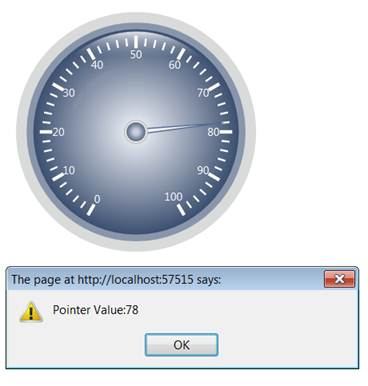
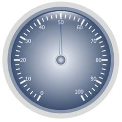

::: {style="DISPLAY: none"}
{#d2h_url_template}{#d2h_package_url style="WIDTH: 0px; DISPLAY: none; HEIGHT: 0px"}
:::

::::: {.d2h_secondary_topic style="PADDING-BOTTOM: 10pt; MARGIN: 0pt; PADDING-LEFT: 0pt; PADDING-RIGHT: 0pt; PADDING-TOP: 0pt"}
##### Interaction {#interaction style="tab-stops: 0pt"}

 

Essential Gauge supports business-oriented gauges, which use pointers and pointer animation to communicate data to the user. Interaction with the gauge can be enabled by setting the **EnablePointerInteraction** property to True.

 

**[]{style="FONT-FAMILY: 'Calibri','sans-serif'"}** 

::: {align="center"}
+--------------------------+------------------------------------+-----------------------------+------------------------------+--------------------------------------------------+
| Property                 | Description                        | Type of Property            | Value It Accepts             | Any other dependencies/Sub properties associated |
+--------------------------+------------------------------------+-----------------------------+------------------------------+--------------------------------------------------+
| EnablePointerInteraction | To enable interation with Pointer. | [bool]{style="COLOR: blue"} | [True]{style="COLOR: blue"}  | NA                                               |
|                          |                                    |                             |                              |                                                  |
|                          |                                    |                             | []{style="COLOR: blue"}      |                                                  |
|                          |                                    |                             |                              |                                                  |
|                          |                                    |                             | [false]{style="COLOR: blue"} |                                                  |
+--------------------------+------------------------------------+-----------------------------+------------------------------+--------------------------------------------------+
:::

[]{style="FONT-FAMILY: 'Calibri','sans-serif'"} 

ClientSide Events:

**[]{style="FONT-FAMILY: 'Calibri','sans-serif'"}** 

::: {align="center"}
  -------------------- ------------------------------------------------------------------------------------------------------------------------- -------------------------------------------------------------------------------
  Name                 Description                                                                                                               Arguments
  PointerValueChange   [The event can be triggered while the pointer value is changing during interaction or animation.]{style="COLOR: black"}   [(GaugeObject, PointerValue)]{style="COLOR: black"}[]{style="COLOR: #1f497d"}
  -------------------- ------------------------------------------------------------------------------------------------------------------------- -------------------------------------------------------------------------------
:::

[]{style="FONT-FAMILY: 'Calibri','sans-serif'"} 

###### 5.1.3.8.1.1 Through View Customization {#through-view-customization style="tab-stops: 0pt"}

 

Step 1:

View:

 

Add the below code in your Index.aspx file.

In the function **OnPointerValueChange(),** PointerValueChange event is handled.

 

+----------------------------------------------------------------------------------------------------------------------------------------------------------------------------------------------------------------------------------------------------------------------------------------------------------------------------------------------------------------------------------------------------------------------------------------------------------------------------------------------------------------------------------+
| [View\[ASPX\]]{style="FONT-FAMILY: 'Calibri','sans-serif'"}                                                                                                                                                                                                                                                                                                                                                                                                                                                                      |
|                                                                                                                                                                                                                                                                                                                                                                                                                                                                                                                                  |
| [\<%]{style="FONT-FAMILY: 'Calibri','sans-serif'; BACKGROUND: yellow"}[@]{style="FONT-FAMILY: 'Calibri','sans-serif'; COLOR: blue"}[ [Page]{style="COLOR: maroon"} [Language]{style="COLOR: red"}[=\"C#\"]{style="COLOR: blue"} [MasterPageFile]{style="COLOR: red"}[=\"\~/Views/Shared/Site.Master\"]{style="COLOR: blue"} [Inherits]{style="COLOR: red"}[=\"System.Web.Mvc.ViewPage\"]{style="COLOR: blue"} [%\>]{style="BACKGROUND: yellow"}]{style="FONT-FAMILY: 'Calibri','sans-serif'"}                                    |
|                                                                                                                                                                                                                                                                                                                                                                                                                                                                                                                                  |
| []{style="FONT-FAMILY: 'Calibri','sans-serif'"}                                                                                                                                                                                                                                                                                                                                                                                                                                                                                  |
|                                                                                                                                                                                                                                                                                                                                                                                                                                                                                                                                  |
| [\<]{style="FONT-FAMILY: 'Calibri','sans-serif'; COLOR: blue"}[asp]{style="FONT-FAMILY: 'Calibri','sans-serif'; COLOR: maroon"}[:]{style="FONT-FAMILY: 'Calibri','sans-serif'; COLOR: blue"}[Content]{style="FONT-FAMILY: 'Calibri','sans-serif'; COLOR: maroon"}[ [ID]{style="COLOR: red"}[=\"Content1\"]{style="COLOR: blue"} [ContentPlaceHolderID]{style="COLOR: red"}[=\"TitleContent\"]{style="COLOR: blue"} [runat]{style="COLOR: red"}[=\"server\"\>]{style="COLOR: blue"}]{style="FONT-FAMILY: 'Calibri','sans-serif'"} |
|                                                                                                                                                                                                                                                                                                                                                                                                                                                                                                                                  |
| [    Circular Gauge]{style="FONT-FAMILY: 'Calibri','sans-serif'"}                                                                                                                                                                                                                                                                                                                                                                                                                                                                |
|                                                                                                                                                                                                                                                                                                                                                                                                                                                                                                                                  |
| [\</]{style="FONT-FAMILY: 'Calibri','sans-serif'; COLOR: blue"}[asp]{style="FONT-FAMILY: 'Calibri','sans-serif'; COLOR: maroon"}[:]{style="FONT-FAMILY: 'Calibri','sans-serif'; COLOR: blue"}[Content]{style="FONT-FAMILY: 'Calibri','sans-serif'; COLOR: maroon"}[\>]{style="FONT-FAMILY: 'Calibri','sans-serif'; COLOR: blue"}[]{style="FONT-FAMILY: 'Calibri','sans-serif'"}                                                                                                                                                  |
|                                                                                                                                                                                                                                                                                                                                                                                                                                                                                                                                  |
| [\<]{style="FONT-FAMILY: 'Calibri','sans-serif'; COLOR: blue"}[asp]{style="FONT-FAMILY: 'Calibri','sans-serif'; COLOR: maroon"}[:]{style="FONT-FAMILY: 'Calibri','sans-serif'; COLOR: blue"}[Content]{style="FONT-FAMILY: 'Calibri','sans-serif'; COLOR: maroon"}[ [ID]{style="COLOR: red"}[=\"Content2\"]{style="COLOR: blue"} [ContentPlaceHolderID]{style="COLOR: red"}[=\"MainContent\"]{style="COLOR: blue"} [runat]{style="COLOR: red"}[=\"server\"\>]{style="COLOR: blue"}]{style="FONT-FAMILY: 'Calibri','sans-serif'"}  |
|                                                                                                                                                                                                                                                                                                                                                                                                                                                                                                                                  |
| []{style="FONT-FAMILY: 'Calibri','sans-serif'"}                                                                                                                                                                                                                                                                                                                                                                                                                                                                                  |
|                                                                                                                                                                                                                                                                                                                                                                                                                                                                                                                                  |
| [\<%]{style="FONT-FAMILY: 'Calibri','sans-serif'; BACKGROUND: yellow"}[\--Rendering the Circular Gauge, which is defined in the PartialView.ascx\--]{style="FONT-FAMILY: 'Calibri','sans-serif'; COLOR: darkgreen"}[%\>]{style="FONT-FAMILY: 'Calibri','sans-serif'; BACKGROUND: yellow"}[]{style="FONT-FAMILY: 'Calibri','sans-serif'"}                                                                                                                                                                                         |
|                                                                                                                                                                                                                                                                                                                                                                                                                                                                                                                                  |
| [    [\<%]{style="BACKGROUND: yellow"} Html.RenderPartial([\"PartialView\"]{style="COLOR: #a31515"}); [%\>]{style="BACKGROUND: yellow"}]{style="FONT-FAMILY: 'Calibri','sans-serif'"}                                                                                                                                                                                                                                                                                                                                            |
|                                                                                                                                                                                                                                                                                                                                                                                                                                                                                                                                  |
| []{style="FONT-FAMILY: 'Calibri','sans-serif'"}                                                                                                                                                                                                                                                                                                                                                                                                                                                                                  |
|                                                                                                                                                                                                                                                                                                                                                                                                                                                                                                                                  |
| [    [\<]{style="COLOR: blue"}[script]{style="COLOR: maroon"} [type]{style="COLOR: red"}[=\"text/javascript\"\>]{style="COLOR: blue"}]{style="FONT-FAMILY: 'Calibri','sans-serif'"}                                                                                                                                                                                                                                                                                                                                              |
|                                                                                                                                                                                                                                                                                                                                                                                                                                                                                                                                  |
| [        [//Handling the PointerValueChange  event.]{style="COLOR: darkgreen"}]{style="FONT-FAMILY: 'Calibri','sans-serif'"}                                                                                                                                                                                                                                                                                                                                                                                                     |
|                                                                                                                                                                                                                                                                                                                                                                                                                                                                                                                                  |
| [        [function]{style="COLOR: blue"} OnPointerValueChange(gauge, value) {]{style="FONT-FAMILY: 'Calibri','sans-serif'"}                                                                                                                                                                                                                                                                                                                                                                                                      |
|                                                                                                                                                                                                                                                                                                                                                                                                                                                                                                                                  |
| []{style="FONT-FAMILY: 'Calibri','sans-serif'"}                                                                                                                                                                                                                                                                                                                                                                                                                                                                                  |
|                                                                                                                                                                                                                                                                                                                                                                                                                                                                                                                                  |
| [            alert([\"Pointer Value:\"]{style="COLOR: maroon"} + value);]{style="FONT-FAMILY: 'Calibri','sans-serif'"}                                                                                                                                                                                                                                                                                                                                                                                                           |
|                                                                                                                                                                                                                                                                                                                                                                                                                                                                                                                                  |
| [        }]{style="FONT-FAMILY: 'Calibri','sans-serif'"}                                                                                                                                                                                                                                                                                                                                                                                                                                                                         |
|                                                                                                                                                                                                                                                                                                                                                                                                                                                                                                                                  |
| [    [\</]{style="COLOR: blue"}[script]{style="COLOR: maroon"}[\>]{style="COLOR: blue"}]{style="FONT-FAMILY: 'Calibri','sans-serif'"}                                                                                                                                                                                                                                                                                                                                                                                            |
|                                                                                                                                                                                                                                                                                                                                                                                                                                                                                                                                  |
| [\</]{style="FONT-FAMILY: 'Calibri','sans-serif'; COLOR: blue"}[asp]{style="FONT-FAMILY: 'Calibri','sans-serif'; COLOR: maroon"}[:]{style="FONT-FAMILY: 'Calibri','sans-serif'; COLOR: blue"}[Content]{style="FONT-FAMILY: 'Calibri','sans-serif'; COLOR: maroon"}[\>]{style="FONT-FAMILY: 'Calibri','sans-serif'; COLOR: blue"}[]{style="FONT-FAMILY: 'Calibri','sans-serif'"}                                                                                                                                                  |
+----------------------------------------------------------------------------------------------------------------------------------------------------------------------------------------------------------------------------------------------------------------------------------------------------------------------------------------------------------------------------------------------------------------------------------------------------------------------------------------------------------------------------------+

**[]{style="FONT-FAMILY: 'Calibri','sans-serif'"}** 

+-----------------------------------------------------------------------------------------------------------------------------------------------------------------------------------------------------------------------------------------------------------------------------------------------------------------------------------------+
| [View\[cshtml\]]{style="FONT-FAMILY: 'Calibri','sans-serif'"}                                                                                                                                                                                                                                                                           |
|                                                                                                                                                                                                                                                                                                                                         |
| [\<]{style="FONT-FAMILY: 'Calibri','sans-serif'; COLOR: blue"}[div]{style="FONT-FAMILY: 'Calibri','sans-serif'; COLOR: maroon"}[\>]{style="FONT-FAMILY: 'Calibri','sans-serif'; COLOR: blue"}[]{style="FONT-FAMILY: 'Calibri','sans-serif'"}                                                                                            |
|                                                                                                                                                                                                                                                                                                                                         |
| [@\*]{style="FONT-FAMILY: 'Calibri','sans-serif'; BACKGROUND: yellow"}[\--Rendering the Circular Gauge which is defined in the PartialView.ascx\--]{style="FONT-FAMILY: 'Calibri','sans-serif'; COLOR: darkgreen"}[\*@]{style="FONT-FAMILY: 'Calibri','sans-serif'; BACKGROUND: yellow"}[]{style="FONT-FAMILY: 'Calibri','sans-serif'"} |
|                                                                                                                                                                                                                                                                                                                                         |
| [    [@]{style="BACKGROUND: yellow"}Html.Partial([\"PartialView\"]{style="COLOR: #a31515"})]{style="FONT-FAMILY: 'Calibri','sans-serif'"}                                                                                                                                                                                               |
|                                                                                                                                                                                                                                                                                                                                         |
| []{style="FONT-FAMILY: 'Calibri','sans-serif'"}                                                                                                                                                                                                                                                                                         |
|                                                                                                                                                                                                                                                                                                                                         |
| [    [\<]{style="COLOR: blue"}[script]{style="COLOR: maroon"} [type]{style="COLOR: red"}[=\"text/javascript\"\>]{style="COLOR: blue"}]{style="FONT-FAMILY: 'Calibri','sans-serif'"}                                                                                                                                                     |
|                                                                                                                                                                                                                                                                                                                                         |
| [        [//Handling the PointerValueChange  event.]{style="COLOR: darkgreen"}]{style="FONT-FAMILY: 'Calibri','sans-serif'"}                                                                                                                                                                                                            |
|                                                                                                                                                                                                                                                                                                                                         |
| [        [function]{style="COLOR: blue"} OnPointerValueChange(gauge, value) {]{style="FONT-FAMILY: 'Calibri','sans-serif'"}                                                                                                                                                                                                             |
|                                                                                                                                                                                                                                                                                                                                         |
| []{style="FONT-FAMILY: 'Calibri','sans-serif'"}                                                                                                                                                                                                                                                                                         |
|                                                                                                                                                                                                                                                                                                                                         |
| [            alert([\"Pointer Value:\"]{style="COLOR: maroon"} + value);]{style="FONT-FAMILY: 'Calibri','sans-serif'"}                                                                                                                                                                                                                  |
|                                                                                                                                                                                                                                                                                                                                         |
| [        }]{style="FONT-FAMILY: 'Calibri','sans-serif'"}                                                                                                                                                                                                                                                                                |
|                                                                                                                                                                                                                                                                                                                                         |
| [    [\</]{style="COLOR: blue"}[script]{style="COLOR: maroon"}[\>]{style="COLOR: blue"}]{style="FONT-FAMILY: 'Calibri','sans-serif'"}                                                                                                                                                                                                   |
|                                                                                                                                                                                                                                                                                                                                         |
| [\</]{style="FONT-FAMILY: 'Calibri','sans-serif'; COLOR: blue"}[div]{style="FONT-FAMILY: 'Calibri','sans-serif'; COLOR: maroon"}[\>]{style="FONT-FAMILY: 'Calibri','sans-serif'; COLOR: blue"}[]{style="FONT-FAMILY: 'Calibri','sans-serif'"}                                                                                           |
+-----------------------------------------------------------------------------------------------------------------------------------------------------------------------------------------------------------------------------------------------------------------------------------------------------------------------------------------+

**[]{style="FONT-FAMILY: 'Calibri','sans-serif'"}** 

**[]{style="FONT-FAMILY: 'Calibri','sans-serif'"}** 

Step 2:

PartialView:

 

Add the below code in your Partial view.

 Interaction can be enabled by setting its **EnablePointerInteraction** property to True.

 

+-------------------------------------------------------------------------------------------------------------------------------------------------------------------------------------------------------------------------------------------------------------------------------------------------------------------------------------------------------------------------------------------------------------+
| [View\[ASPX\]]{style="FONT-FAMILY: 'Calibri','sans-serif'"}                                                                                                                                                                                                                                                                                                                                                 |
|                                                                                                                                                                                                                                                                                                                                                                                                             |
| [\<%]{style="FONT-FAMILY: 'Calibri','sans-serif'; BACKGROUND: yellow"}[@]{style="FONT-FAMILY: 'Calibri','sans-serif'; COLOR: blue"}[ [Control]{style="COLOR: maroon"} [Language]{style="COLOR: red"}[=\"C#\"]{style="COLOR: blue"} [Inherits]{style="COLOR: red"}[=\"System.Web.Mvc.ViewUserControl\"]{style="COLOR: blue"} [%\>]{style="BACKGROUND: yellow"}]{style="FONT-FAMILY: 'Calibri','sans-serif'"} |
|                                                                                                                                                                                                                                                                                                                                                                                                             |
| []{style="FONT-FAMILY: 'Calibri','sans-serif'"}                                                                                                                                                                                                                                                                                                                                                             |
|                                                                                                                                                                                                                                                                                                                                                                                                             |
| []{style="FONT-FAMILY: 'Calibri','sans-serif'"}                                                                                                                                                                                                                                                                                                                                                             |
|                                                                                                                                                                                                                                                                                                                                                                                                             |
| [\<%]{style="FONT-FAMILY: 'Calibri','sans-serif'; BACKGROUND: yellow"}[\--Rendering the Circular Gauge\--]{style="FONT-FAMILY: 'Calibri','sans-serif'; COLOR: darkgreen"}[%\>]{style="FONT-FAMILY: 'Calibri','sans-serif'; BACKGROUND: yellow"}[]{style="FONT-FAMILY: 'Calibri','sans-serif'"}                                                                                                              |
|                                                                                                                                                                                                                                                                                                                                                                                                             |
| [    [\<%]{style="BACKGROUND: yellow"}[=]{style="COLOR: blue"}Html.Syncfusion().CircularGauge([\"Gauge\"]{style="COLOR: #a31515"})]{style="FONT-FAMILY: 'Calibri','sans-serif'"}                                                                                                                                                                                                                            |
|                                                                                                                                                                                                                                                                                                                                                                                                             |
| [        .Radius(160).CircularGaugeParams(([CircularGaugeParams]{style="COLOR: #2b91af"})ViewData\[[\"GaugeParams\"]{style="COLOR: #a31515"}\])]{style="FONT-FAMILY: 'Calibri','sans-serif'"}                                                                                                                                                                                                               |
|                                                                                                                                                                                                                                                                                                                                                                                                             |
| [        .FrameType([GaugeFrameType]{style="COLOR: #2b91af"}.CircularWithInnerTopGradient)]{style="FONT-FAMILY: 'Calibri','sans-serif'"}                                                                                                                                                                                                                                                                    |
|                                                                                                                                                                                                                                                                                                                                                                                                             |
| [        .GaugeSkins([GaugeSkins]{style="COLOR: #2b91af"}.VS2010)]{style="FONT-FAMILY: 'Calibri','sans-serif'"}                                                                                                                                                                                                                                                                                             |
|                                                                                                                                                                                                                                                                                                                                                                                                             |
| []{style="FONT-FAMILY: 'Calibri','sans-serif'"}                                                                                                                                                                                                                                                                                                                                                             |
|                                                                                                                                                                                                                                                                                                                                                                                                             |
| [                  .Scales(scale =\>]{style="FONT-FAMILY: 'Calibri','sans-serif'"}                                                                                                                                                                                                                                                                                                                          |
|                                                                                                                                                                                                                                                                                                                                                                                                             |
| [                  {]{style="FONT-FAMILY: 'Calibri','sans-serif'"}                                                                                                                                                                                                                                                                                                                                          |
|                                                                                                                                                                                                                                                                                                                                                                                                             |
| [                      scale.Add()]{style="FONT-FAMILY: 'Calibri','sans-serif'"}                                                                                                                                                                                                                                                                                                                            |
|                                                                                                                                                                                                                                                                                                                                                                                                             |
| [                      .Radius(120)]{style="FONT-FAMILY: 'Calibri','sans-serif'"}                                                                                                                                                                                                                                                                                                                           |
|                                                                                                                                                                                                                                                                                                                                                                                                             |
| [                      .ScaleBarSize(4.5)]{style="FONT-FAMILY: 'Calibri','sans-serif'"}                                                                                                                                                                                                                                                                                                                     |
|                                                                                                                                                                                                                                                                                                                                                                                                             |
| [                      .PointerCapRadius(8)]{style="FONT-FAMILY: 'Calibri','sans-serif'"}                                                                                                                                                                                                                                                                                                                   |
|                                                                                                                                                                                                                                                                                                                                                                                                             |
| [                      .Maximum(100)]{style="FONT-FAMILY: 'Calibri','sans-serif'"}                                                                                                                                                                                                                                                                                                                          |
|                                                                                                                                                                                                                                                                                                                                                                                                             |
| [                      .Minimum(0)]{style="FONT-FAMILY: 'Calibri','sans-serif'"}                                                                                                                                                                                                                                                                                                                            |
|                                                                                                                                                                                                                                                                                                                                                                                                             |
| [                      .BackgroundBrush([Brushes]{style="COLOR: #2b91af"}.LightGray)]{style="FONT-FAMILY: 'Calibri','sans-serif'"}                                                                                                                                                                                                                                                                          |
|                                                                                                                                                                                                                                                                                                                                                                                                             |
| [                      .StartAngle(120)]{style="FONT-FAMILY: 'Calibri','sans-serif'"}                                                                                                                                                                                                                                                                                                                       |
|                                                                                                                                                                                                                                                                                                                                                                                                             |
| [                      .GapSweepAngle(300)]{style="FONT-FAMILY: 'Calibri','sans-serif'"}                                                                                                                                                                                                                                                                                                                    |
|                                                                                                                                                                                                                                                                                                                                                                                                             |
| [                      .MajorIntervalValue(10)]{style="FONT-FAMILY: 'Calibri','sans-serif'"}                                                                                                                                                                                                                                                                                                                |
|                                                                                                                                                                                                                                                                                                                                                                                                             |
| [                      .MinorIntervalValue(2)]{style="FONT-FAMILY: 'Calibri','sans-serif'"}                                                                                                                                                                                                                                                                                                                 |
|                                                                                                                                                                                                                                                                                                                                                                                                             |
| []{style="FONT-FAMILY: 'Calibri','sans-serif'"}                                                                                                                                                                                                                                                                                                                                                             |
|                                                                                                                                                                                                                                                                                                                                                                                                             |
| [                       .Labels(label =\>]{style="FONT-FAMILY: 'Calibri','sans-serif'"}                                                                                                                                                                                                                                                                                                                     |
|                                                                                                                                                                                                                                                                                                                                                                                                             |
| [                        {]{style="FONT-FAMILY: 'Calibri','sans-serif'"}                                                                                                                                                                                                                                                                                                                                    |
|                                                                                                                                                                                                                                                                                                                                                                                                             |
| [                            label.Add()]{style="FONT-FAMILY: 'Calibri','sans-serif'"}                                                                                                                                                                                                                                                                                                                      |
|                                                                                                                                                                                                                                                                                                                                                                                                             |
| [                                .TickStyle([TickStyle]{style="COLOR: #2b91af"}.MajorTick)]{style="FONT-FAMILY: 'Calibri','sans-serif'"}                                                                                                                                                                                                                                                                    |
|                                                                                                                                                                                                                                                                                                                                                                                                             |
| [                                .TickPlacement([ScalePlacement]{style="COLOR: #2b91af"}.Inside)]{style="FONT-FAMILY: 'Calibri','sans-serif'"}                                                                                                                                                                                                                                                              |
|                                                                                                                                                                                                                                                                                                                                                                                                             |
| [                                .BackgroundBrush([Brushes]{style="COLOR: #2b91af"}.White)]{style="FONT-FAMILY: 'Calibri','sans-serif'"}                                                                                                                                                                                                                                                                    |
|                                                                                                                                                                                                                                                                                                                                                                                                             |
| [                                .Angle(0)]{style="FONT-FAMILY: 'Calibri','sans-serif'"}                                                                                                                                                                                                                                                                                                                    |
|                                                                                                                                                                                                                                                                                                                                                                                                             |
| [                                .FontSize(16)]{style="FONT-FAMILY: 'Calibri','sans-serif'"}                                                                                                                                                                                                                                                                                                                |
|                                                                                                                                                                                                                                                                                                                                                                                                             |
| [                                .DistanceFromScale(5)]{style="FONT-FAMILY: 'Calibri','sans-serif'"}                                                                                                                                                                                                                                                                                                        |
|                                                                                                                                                                                                                                                                                                                                                                                                             |
| [                                .IncludeFirstValue([true]{style="COLOR: blue"});]{style="FONT-FAMILY: 'Calibri','sans-serif'"}                                                                                                                                                                                                                                                                             |
|                                                                                                                                                                                                                                                                                                                                                                                                             |
| []{style="FONT-FAMILY: 'Calibri','sans-serif'"}                                                                                                                                                                                                                                                                                                                                                             |
|                                                                                                                                                                                                                                                                                                                                                                                                             |
| []{style="FONT-FAMILY: 'Calibri','sans-serif'"}                                                                                                                                                                                                                                                                                                                                                             |
|                                                                                                                                                                                                                                                                                                                                                                                                             |
| [                        })]{style="FONT-FAMILY: 'Calibri','sans-serif'"}                                                                                                                                                                                                                                                                                                                                   |
|                                                                                                                                                                                                                                                                                                                                                                                                             |
| []{style="FONT-FAMILY: 'Calibri','sans-serif'"}                                                                                                                                                                                                                                                                                                                                                             |
|                                                                                                                                                                                                                                                                                                                                                                                                             |
| [                      .Ticks(tick =\>]{style="FONT-FAMILY: 'Calibri','sans-serif'"}                                                                                                                                                                                                                                                                                                                        |
|                                                                                                                                                                                                                                                                                                                                                                                                             |
| [                      {]{style="FONT-FAMILY: 'Calibri','sans-serif'"}                                                                                                                                                                                                                                                                                                                                      |
|                                                                                                                                                                                                                                                                                                                                                                                                             |
| [                          tick.Add()]{style="FONT-FAMILY: 'Calibri','sans-serif'"}                                                                                                                                                                                                                                                                                                                         |
|                                                                                                                                                                                                                                                                                                                                                                                                             |
| [                              .TickStyle([TickStyle]{style="COLOR: #2b91af"}.MajorTick)]{style="FONT-FAMILY: 'Calibri','sans-serif'"}                                                                                                                                                                                                                                                                      |
|                                                                                                                                                                                                                                                                                                                                                                                                             |
| [                              .TickWidth(7)]{style="FONT-FAMILY: 'Calibri','sans-serif'"}                                                                                                                                                                                                                                                                                                                  |
|                                                                                                                                                                                                                                                                                                                                                                                                             |
| [                              .TickHeight(14)]{style="FONT-FAMILY: 'Calibri','sans-serif'"}                                                                                                                                                                                                                                                                                                                |
|                                                                                                                                                                                                                                                                                                                                                                                                             |
| [                              .TickPlacement([ScalePlacement]{style="COLOR: #2b91af"}.Outside)]{style="FONT-FAMILY: 'Calibri','sans-serif'"}                                                                                                                                                                                                                                                               |
|                                                                                                                                                                                                                                                                                                                                                                                                             |
| [                              .TickShape([TickShape]{style="COLOR: #2b91af"}.Triangle)]{style="FONT-FAMILY: 'Calibri','sans-serif'"}                                                                                                                                                                                                                                                                       |
|                                                                                                                                                                                                                                                                                                                                                                                                             |
| [                              .BackgroundBrush([Brushes]{style="COLOR: #2b91af"}.White)]{style="FONT-FAMILY: 'Calibri','sans-serif'"}                                                                                                                                                                                                                                                                      |
|                                                                                                                                                                                                                                                                                                                                                                                                             |
| [                              .Angle(0);]{style="FONT-FAMILY: 'Calibri','sans-serif'"}                                                                                                                                                                                                                                                                                                                     |
|                                                                                                                                                                                                                                                                                                                                                                                                             |
| []{style="FONT-FAMILY: 'Calibri','sans-serif'"}                                                                                                                                                                                                                                                                                                                                                             |
|                                                                                                                                                                                                                                                                                                                                                                                                             |
| [                          tick.Add()]{style="FONT-FAMILY: 'Calibri','sans-serif'"}                                                                                                                                                                                                                                                                                                                         |
|                                                                                                                                                                                                                                                                                                                                                                                                             |
| [                              .TickStyle([TickStyle]{style="COLOR: #2b91af"}.MinorTick)]{style="FONT-FAMILY: 'Calibri','sans-serif'"}                                                                                                                                                                                                                                                                      |
|                                                                                                                                                                                                                                                                                                                                                                                                             |
| [                              .TickWidth(2)]{style="FONT-FAMILY: 'Calibri','sans-serif'"}                                                                                                                                                                                                                                                                                                                  |
|                                                                                                                                                                                                                                                                                                                                                                                                             |
| [                              .TickHeight(9)]{style="FONT-FAMILY: 'Calibri','sans-serif'"}                                                                                                                                                                                                                                                                                                                 |
|                                                                                                                                                                                                                                                                                                                                                                                                             |
| [                              .TickPlacement([ScalePlacement]{style="COLOR: #2b91af"}.Outside)]{style="FONT-FAMILY: 'Calibri','sans-serif'"}                                                                                                                                                                                                                                                               |
|                                                                                                                                                                                                                                                                                                                                                                                                             |
| [                              .TickShape([TickShape]{style="COLOR: #2b91af"}.Triangle)]{style="FONT-FAMILY: 'Calibri','sans-serif'"}                                                                                                                                                                                                                                                                       |
|                                                                                                                                                                                                                                                                                                                                                                                                             |
| [                              .BackgroundBrush([Brushes]{style="COLOR: #2b91af"}.White)]{style="FONT-FAMILY: 'Calibri','sans-serif'"}                                                                                                                                                                                                                                                                      |
|                                                                                                                                                                                                                                                                                                                                                                                                             |
| [                              .Angle(0);]{style="FONT-FAMILY: 'Calibri','sans-serif'"}                                                                                                                                                                                                                                                                                                                     |
|                                                                                                                                                                                                                                                                                                                                                                                                             |
| [                      })]{style="FONT-FAMILY: 'Calibri','sans-serif'"}                                                                                                                                                                                                                                                                                                                                     |
|                                                                                                                                                                                                                                                                                                                                                                                                             |
| [                      .Ranges(range =\>]{style="FONT-FAMILY: 'Calibri','sans-serif'"}                                                                                                                                                                                                                                                                                                                      |
|                                                                                                                                                                                                                                                                                                                                                                                                             |
| [                          {]{style="FONT-FAMILY: 'Calibri','sans-serif'"}                                                                                                                                                                                                                                                                                                                                  |
|                                                                                                                                                                                                                                                                                                                                                                                                             |
| [                              range.Add()]{style="FONT-FAMILY: 'Calibri','sans-serif'"}                                                                                                                                                                                                                                                                                                                    |
|                                                                                                                                                                                                                                                                                                                                                                                                             |
| [                                  .BackgroundBrush([Brushes]{style="COLOR: #2b91af"}.White)]{style="FONT-FAMILY: 'Calibri','sans-serif'"}                                                                                                                                                                                                                                                                  |
|                                                                                                                                                                                                                                                                                                                                                                                                             |
| [                                  .BorderBrush([Brushes]{style="COLOR: #2b91af"}.LightBlue)]{style="FONT-FAMILY: 'Calibri','sans-serif'"}                                                                                                                                                                                                                                                                  |
|                                                                                                                                                                                                                                                                                                                                                                                                             |
| [                                  .StartValue(55)]{style="FONT-FAMILY: 'Calibri','sans-serif'"}                                                                                                                                                                                                                                                                                                            |
|                                                                                                                                                                                                                                                                                                                                                                                                             |
| [                                  .EndValue(80)]{style="FONT-FAMILY: 'Calibri','sans-serif'"}                                                                                                                                                                                                                                                                                                              |
|                                                                                                                                                                                                                                                                                                                                                                                                             |
| [                                  .StartWidth(0)]{style="FONT-FAMILY: 'Calibri','sans-serif'"}                                                                                                                                                                                                                                                                                                             |
|                                                                                                                                                                                                                                                                                                                                                                                                             |
| [                                  .EndWidth(15)]{style="FONT-FAMILY: 'Calibri','sans-serif'"}                                                                                                                                                                                                                                                                                                              |
|                                                                                                                                                                                                                                                                                                                                                                                                             |
| [                                  .DistanceFromScale(25)]{style="FONT-FAMILY: 'Calibri','sans-serif'"}                                                                                                                                                                                                                                                                                                     |
|                                                                                                                                                                                                                                                                                                                                                                                                             |
| [                                  .RangePosition([ScalePlacement]{style="COLOR: #2b91af"}.Inside)]{style="FONT-FAMILY: 'Calibri','sans-serif'"}                                                                                                                                                                                                                                                            |
|                                                                                                                                                                                                                                                                                                                                                                                                             |
| [                                  .BorderWidth(2);]{style="FONT-FAMILY: 'Calibri','sans-serif'"}                                                                                                                                                                                                                                                                                                           |
|                                                                                                                                                                                                                                                                                                                                                                                                             |
| [                          })]{style="FONT-FAMILY: 'Calibri','sans-serif'"}                                                                                                                                                                                                                                                                                                                                 |
|                                                                                                                                                                                                                                                                                                                                                                                                             |
| [                       .Pointers(pointer =\>]{style="FONT-FAMILY: 'Calibri','sans-serif'"}                                                                                                                                                                                                                                                                                                                 |
|                                                                                                                                                                                                                                                                                                                                                                                                             |
| [                                  {]{style="FONT-FAMILY: 'Calibri','sans-serif'"}                                                                                                                                                                                                                                                                                                                          |
|                                                                                                                                                                                                                                                                                                                                                                                                             |
| [                                      pointer.Add()]{style="FONT-FAMILY: 'Calibri','sans-serif'"}                                                                                                                                                                                                                                                                                                          |
|                                                                                                                                                                                                                                                                                                                                                                                                             |
| [                                      .PointerLength(90)]{style="FONT-FAMILY: 'Calibri','sans-serif'"}                                                                                                                                                                                                                                                                                                     |
|                                                                                                                                                                                                                                                                                                                                                                                                             |
| [                                      .PointerWidth(12)]{style="FONT-FAMILY: 'Calibri','sans-serif'"}                                                                                                                                                                                                                                                                                                      |
|                                                                                                                                                                                                                                                                                                                                                                                                             |
| [                                      [//Enabling the Pointer Interaction.]{style="COLOR: green"}]{style="FONT-FAMILY: 'Calibri','sans-serif'"}                                                                                                                                                                                                                                                            |
|                                                                                                                                                                                                                                                                                                                                                                                                             |
| [                                      **.EnablePointerInteraction([true]{style="COLOR: blue"})**]{style="FONT-FAMILY: 'Calibri','sans-serif'"}                                                                                                                                                                                                                                                             |
|                                                                                                                                                                                                                                                                                                                                                                                                             |
| [                                          [//Defining the event to be handled after pointer value is changed. ]{style="COLOR: green"}]{style="FONT-FAMILY: 'Calibri','sans-serif'"}                                                                                                                                                                                                                        |
|                                                                                                                                                                                                                                                                                                                                                                                                             |
| [                                          [//OnPointerValueChange is a function used to handle the PointerValueChange event.]{style="COLOR: green"}]{style="FONT-FAMILY: 'Calibri','sans-serif'"}                                                                                                                                                                                                          |
|                                                                                                                                                                                                                                                                                                                                                                                                             |
| [                                      **.PointerValueChange([\"OnPointerValueChange\"]{style="COLOR: #a31515"})**]{style="FONT-FAMILY: 'Calibri','sans-serif'"}                                                                                                                                                                                                                                            |
|                                                                                                                                                                                                                                                                                                                                                                                                             |
| [                                      .PointerNeedleType([PointerNeedleType]{style="COLOR: #2b91af"}.Needle)]{style="FONT-FAMILY: 'Calibri','sans-serif'"}                                                                                                                                                                                                                                                 |
|                                                                                                                                                                                                                                                                                                                                                                                                             |
| [                                      .NeedleStyle([NeedleStyle]{style="COLOR: #2b91af"}.Triangle)]{style="FONT-FAMILY: 'Calibri','sans-serif'"}                                                                                                                                                                                                                                                           |
|                                                                                                                                                                                                                                                                                                                                                                                                             |
| [                                       .BorderWidth(2)]{style="FONT-FAMILY: 'Calibri','sans-serif'"}                                                                                                                                                                                                                                                                                                       |
|                                                                                                                                                                                                                                                                                                                                                                                                             |
| [                                      .Value(20);]{style="FONT-FAMILY: 'Calibri','sans-serif'"}                                                                                                                                                                                                                                                                                                            |
|                                                                                                                                                                                                                                                                                                                                                                                                             |
| [                                  });]{style="FONT-FAMILY: 'Calibri','sans-serif'"}                                                                                                                                                                                                                                                                                                                        |
|                                                                                                                                                                                                                                                                                                                                                                                                             |
| []{style="FONT-FAMILY: 'Calibri','sans-serif'"}                                                                                                                                                                                                                                                                                                                                                             |
|                                                                                                                                                                                                                                                                                                                                                                                                             |
| [                  })]{style="FONT-FAMILY: 'Calibri','sans-serif'"}                                                                                                                                                                                                                                                                                                                                         |
|                                                                                                                                                                                                                                                                                                                                                                                                             |
| []{style="FONT-FAMILY: 'Calibri','sans-serif'"}                                                                                                                                                                                                                                                                                                                                                             |
|                                                                                                                                                                                                                                                                                                                                                                                                             |
| [                 [%\>]{style="BACKGROUND: yellow"}]{style="FONT-FAMILY: 'Calibri','sans-serif'"}                                                                                                                                                                                                                                                                                                           |
+-------------------------------------------------------------------------------------------------------------------------------------------------------------------------------------------------------------------------------------------------------------------------------------------------------------------------------------------------------------------------------------------------------------+

[]{style="FONT-FAMILY: 'Calibri','sans-serif'"} 

 

+------------------------------------------------------------------------------------------------------------------------------------------------------------------------------------------------------------------------------------------------------------------------------------------------+
| [View\[cshtml\]]{style="FONT-FAMILY: 'Calibri','sans-serif'"}                                                                                                                                                                                                                                  |
|                                                                                                                                                                                                                                                                                                |
| [@\*]{style="FONT-FAMILY: 'Calibri','sans-serif'; BACKGROUND: yellow"}[\--Rendering the Circular Gauge\--]{style="FONT-FAMILY: 'Calibri','sans-serif'; COLOR: darkgreen"}[\*@]{style="FONT-FAMILY: 'Calibri','sans-serif'; BACKGROUND: yellow"}[]{style="FONT-FAMILY: 'Calibri','sans-serif'"} |
|                                                                                                                                                                                                                                                                                                |
| [    [\@{]{style="BACKGROUND: yellow"}[ ]{style="COLOR: blue"}Html.Syncfusion().CircularGauge([\"Gauge\"]{style="COLOR: #a31515"})]{style="FONT-FAMILY: 'Calibri','sans-serif'"}                                                                                                               |
|                                                                                                                                                                                                                                                                                                |
| [        .Radius(160).CircularGaugeParams(([CircularGaugeParams]{style="COLOR: #2b91af"})ViewData\[[\"GaugeParams\"]{style="COLOR: #a31515"}\])]{style="FONT-FAMILY: 'Calibri','sans-serif'"}                                                                                                  |
|                                                                                                                                                                                                                                                                                                |
| [        .FrameType([GaugeFrameType]{style="COLOR: #2b91af"}.CircularWithInnerTopGradient)]{style="FONT-FAMILY: 'Calibri','sans-serif'"}                                                                                                                                                       |
|                                                                                                                                                                                                                                                                                                |
| [        .GaugeSkins([GaugeSkins]{style="COLOR: #2b91af"}.VS2010)]{style="FONT-FAMILY: 'Calibri','sans-serif'"}                                                                                                                                                                                |
|                                                                                                                                                                                                                                                                                                |
| []{style="FONT-FAMILY: 'Calibri','sans-serif'"}                                                                                                                                                                                                                                                |
|                                                                                                                                                                                                                                                                                                |
| [                  .Scales(scale =\>]{style="FONT-FAMILY: 'Calibri','sans-serif'"}                                                                                                                                                                                                             |
|                                                                                                                                                                                                                                                                                                |
| [                  {]{style="FONT-FAMILY: 'Calibri','sans-serif'"}                                                                                                                                                                                                                             |
|                                                                                                                                                                                                                                                                                                |
| [                      scale.Add()]{style="FONT-FAMILY: 'Calibri','sans-serif'"}                                                                                                                                                                                                               |
|                                                                                                                                                                                                                                                                                                |
| [                      .Radius(120)]{style="FONT-FAMILY: 'Calibri','sans-serif'"}                                                                                                                                                                                                              |
|                                                                                                                                                                                                                                                                                                |
| [                      .ScaleBarSize(4.5)]{style="FONT-FAMILY: 'Calibri','sans-serif'"}                                                                                                                                                                                                        |
|                                                                                                                                                                                                                                                                                                |
| [                      .PointerCapRadius(8)]{style="FONT-FAMILY: 'Calibri','sans-serif'"}                                                                                                                                                                                                      |
|                                                                                                                                                                                                                                                                                                |
| [                      .Maximum(100)]{style="FONT-FAMILY: 'Calibri','sans-serif'"}                                                                                                                                                                                                             |
|                                                                                                                                                                                                                                                                                                |
| [                      .Minimum(0)]{style="FONT-FAMILY: 'Calibri','sans-serif'"}                                                                                                                                                                                                               |
|                                                                                                                                                                                                                                                                                                |
| [                      .BackgroundBrush([Brushes]{style="COLOR: #2b91af"}.LightGray)]{style="FONT-FAMILY: 'Calibri','sans-serif'"}                                                                                                                                                             |
|                                                                                                                                                                                                                                                                                                |
| [                      .StartAngle(120)]{style="FONT-FAMILY: 'Calibri','sans-serif'"}                                                                                                                                                                                                          |
|                                                                                                                                                                                                                                                                                                |
| [                      .GapSweepAngle(300)]{style="FONT-FAMILY: 'Calibri','sans-serif'"}                                                                                                                                                                                                       |
|                                                                                                                                                                                                                                                                                                |
| [                      .MajorIntervalValue(10)]{style="FONT-FAMILY: 'Calibri','sans-serif'"}                                                                                                                                                                                                   |
|                                                                                                                                                                                                                                                                                                |
| [                      .MinorIntervalValue(2)]{style="FONT-FAMILY: 'Calibri','sans-serif'"}                                                                                                                                                                                                    |
|                                                                                                                                                                                                                                                                                                |
| []{style="FONT-FAMILY: 'Calibri','sans-serif'"}                                                                                                                                                                                                                                                |
|                                                                                                                                                                                                                                                                                                |
| [                       .Labels(label =\>]{style="FONT-FAMILY: 'Calibri','sans-serif'"}                                                                                                                                                                                                        |
|                                                                                                                                                                                                                                                                                                |
| [                        {]{style="FONT-FAMILY: 'Calibri','sans-serif'"}                                                                                                                                                                                                                       |
|                                                                                                                                                                                                                                                                                                |
| [                            label.Add()]{style="FONT-FAMILY: 'Calibri','sans-serif'"}                                                                                                                                                                                                         |
|                                                                                                                                                                                                                                                                                                |
| [                                .TickStyle([TickStyle]{style="COLOR: #2b91af"}.MajorTick)]{style="FONT-FAMILY: 'Calibri','sans-serif'"}                                                                                                                                                       |
|                                                                                                                                                                                                                                                                                                |
| [                                .TickPlacement([ScalePlacement]{style="COLOR: #2b91af"}.Inside)]{style="FONT-FAMILY: 'Calibri','sans-serif'"}                                                                                                                                                 |
|                                                                                                                                                                                                                                                                                                |
| [                                .BackgroundBrush([Brushes]{style="COLOR: #2b91af"}.White)]{style="FONT-FAMILY: 'Calibri','sans-serif'"}                                                                                                                                                       |
|                                                                                                                                                                                                                                                                                                |
| [                                .Angle(0)]{style="FONT-FAMILY: 'Calibri','sans-serif'"}                                                                                                                                                                                                       |
|                                                                                                                                                                                                                                                                                                |
| [                                .FontSize(16)]{style="FONT-FAMILY: 'Calibri','sans-serif'"}                                                                                                                                                                                                   |
|                                                                                                                                                                                                                                                                                                |
| [                                .DistanceFromScale(5)]{style="FONT-FAMILY: 'Calibri','sans-serif'"}                                                                                                                                                                                           |
|                                                                                                                                                                                                                                                                                                |
| [                                .IncludeFirstValue([true]{style="COLOR: blue"});]{style="FONT-FAMILY: 'Calibri','sans-serif'"}                                                                                                                                                                |
|                                                                                                                                                                                                                                                                                                |
| [                        })]{style="FONT-FAMILY: 'Calibri','sans-serif'"}                                                                                                                                                                                                                      |
|                                                                                                                                                                                                                                                                                                |
| []{style="FONT-FAMILY: 'Calibri','sans-serif'"}                                                                                                                                                                                                                                                |
|                                                                                                                                                                                                                                                                                                |
| [                      .Ticks(tick =\>]{style="FONT-FAMILY: 'Calibri','sans-serif'"}                                                                                                                                                                                                           |
|                                                                                                                                                                                                                                                                                                |
| [                      {]{style="FONT-FAMILY: 'Calibri','sans-serif'"}                                                                                                                                                                                                                         |
|                                                                                                                                                                                                                                                                                                |
| [                          tick.Add()]{style="FONT-FAMILY: 'Calibri','sans-serif'"}                                                                                                                                                                                                            |
|                                                                                                                                                                                                                                                                                                |
| [                              .TickStyle([TickStyle]{style="COLOR: #2b91af"}.MajorTick)]{style="FONT-FAMILY: 'Calibri','sans-serif'"}                                                                                                                                                         |
|                                                                                                                                                                                                                                                                                                |
| [                              .TickWidth(7)]{style="FONT-FAMILY: 'Calibri','sans-serif'"}                                                                                                                                                                                                     |
|                                                                                                                                                                                                                                                                                                |
| [                              .TickHeight(14)]{style="FONT-FAMILY: 'Calibri','sans-serif'"}                                                                                                                                                                                                   |
|                                                                                                                                                                                                                                                                                                |
| [                              .TickPlacement([ScalePlacement]{style="COLOR: #2b91af"}.Outside)]{style="FONT-FAMILY: 'Calibri','sans-serif'"}                                                                                                                                                  |
|                                                                                                                                                                                                                                                                                                |
| [                              .TickShape([TickShape]{style="COLOR: #2b91af"}.Triangle)]{style="FONT-FAMILY: 'Calibri','sans-serif'"}                                                                                                                                                          |
|                                                                                                                                                                                                                                                                                                |
| [                              .BackgroundBrush([Brushes]{style="COLOR: #2b91af"}.White)]{style="FONT-FAMILY: 'Calibri','sans-serif'"}                                                                                                                                                         |
|                                                                                                                                                                                                                                                                                                |
| [                              .Angle(0);]{style="FONT-FAMILY: 'Calibri','sans-serif'"}                                                                                                                                                                                                        |
|                                                                                                                                                                                                                                                                                                |
| []{style="FONT-FAMILY: 'Calibri','sans-serif'"}                                                                                                                                                                                                                                                |
|                                                                                                                                                                                                                                                                                                |
| [                          tick.Add()]{style="FONT-FAMILY: 'Calibri','sans-serif'"}                                                                                                                                                                                                            |
|                                                                                                                                                                                                                                                                                                |
| [                              .TickStyle([TickStyle]{style="COLOR: #2b91af"}.MinorTick)]{style="FONT-FAMILY: 'Calibri','sans-serif'"}                                                                                                                                                         |
|                                                                                                                                                                                                                                                                                                |
| [                              .TickWidth(2)]{style="FONT-FAMILY: 'Calibri','sans-serif'"}                                                                                                                                                                                                     |
|                                                                                                                                                                                                                                                                                                |
| [                              .TickHeight(9)]{style="FONT-FAMILY: 'Calibri','sans-serif'"}                                                                                                                                                                                                    |
|                                                                                                                                                                                                                                                                                                |
| [                              .TickPlacement([ScalePlacement]{style="COLOR: #2b91af"}.Outside)]{style="FONT-FAMILY: 'Calibri','sans-serif'"}                                                                                                                                                  |
|                                                                                                                                                                                                                                                                                                |
| [                              .TickShape([TickShape]{style="COLOR: #2b91af"}.Triangle)]{style="FONT-FAMILY: 'Calibri','sans-serif'"}                                                                                                                                                          |
|                                                                                                                                                                                                                                                                                                |
| [                              .BackgroundBrush([Brushes]{style="COLOR: #2b91af"}.White)]{style="FONT-FAMILY: 'Calibri','sans-serif'"}                                                                                                                                                         |
|                                                                                                                                                                                                                                                                                                |
| [                              .Angle(0);]{style="FONT-FAMILY: 'Calibri','sans-serif'"}                                                                                                                                                                                                        |
|                                                                                                                                                                                                                                                                                                |
| [                      })]{style="FONT-FAMILY: 'Calibri','sans-serif'"}                                                                                                                                                                                                                        |
|                                                                                                                                                                                                                                                                                                |
| [                      .Ranges(range =\>]{style="FONT-FAMILY: 'Calibri','sans-serif'"}                                                                                                                                                                                                         |
|                                                                                                                                                                                                                                                                                                |
| [                          {]{style="FONT-FAMILY: 'Calibri','sans-serif'"}                                                                                                                                                                                                                     |
|                                                                                                                                                                                                                                                                                                |
| [                              range.Add()]{style="FONT-FAMILY: 'Calibri','sans-serif'"}                                                                                                                                                                                                       |
|                                                                                                                                                                                                                                                                                                |
| [                                  .BackgroundBrush([Brushes]{style="COLOR: #2b91af"}.White)]{style="FONT-FAMILY: 'Calibri','sans-serif'"}                                                                                                                                                     |
|                                                                                                                                                                                                                                                                                                |
| [                                  .BorderBrush([Brushes]{style="COLOR: #2b91af"}.LightBlue)]{style="FONT-FAMILY: 'Calibri','sans-serif'"}                                                                                                                                                     |
|                                                                                                                                                                                                                                                                                                |
| [                                  .StartValue(55)]{style="FONT-FAMILY: 'Calibri','sans-serif'"}                                                                                                                                                                                               |
|                                                                                                                                                                                                                                                                                                |
| [                                  .EndValue(80)]{style="FONT-FAMILY: 'Calibri','sans-serif'"}                                                                                                                                                                                                 |
|                                                                                                                                                                                                                                                                                                |
| [                                  .StartWidth(0)]{style="FONT-FAMILY: 'Calibri','sans-serif'"}                                                                                                                                                                                                |
|                                                                                                                                                                                                                                                                                                |
| [                                  .EndWidth(15)]{style="FONT-FAMILY: 'Calibri','sans-serif'"}                                                                                                                                                                                                 |
|                                                                                                                                                                                                                                                                                                |
| [                                  .DistanceFromScale(25)]{style="FONT-FAMILY: 'Calibri','sans-serif'"}                                                                                                                                                                                        |
|                                                                                                                                                                                                                                                                                                |
| [                                  .RangePosition([ScalePlacement]{style="COLOR: #2b91af"}.Inside)]{style="FONT-FAMILY: 'Calibri','sans-serif'"}                                                                                                                                               |
|                                                                                                                                                                                                                                                                                                |
| [                                  .BorderWidth(2);]{style="FONT-FAMILY: 'Calibri','sans-serif'"}                                                                                                                                                                                              |
|                                                                                                                                                                                                                                                                                                |
| [                          })]{style="FONT-FAMILY: 'Calibri','sans-serif'"}                                                                                                                                                                                                                    |
|                                                                                                                                                                                                                                                                                                |
| [                       .Pointers(pointer =\>]{style="FONT-FAMILY: 'Calibri','sans-serif'"}                                                                                                                                                                                                    |
|                                                                                                                                                                                                                                                                                                |
| [                                  {]{style="FONT-FAMILY: 'Calibri','sans-serif'"}                                                                                                                                                                                                             |
|                                                                                                                                                                                                                                                                                                |
| [                                      pointer.Add()]{style="FONT-FAMILY: 'Calibri','sans-serif'"}                                                                                                                                                                                             |
|                                                                                                                                                                                                                                                                                                |
| [                                      .PointerLength(90)]{style="FONT-FAMILY: 'Calibri','sans-serif'"}                                                                                                                                                                                        |
|                                                                                                                                                                                                                                                                                                |
| [                                      .PointerWidth(12)]{style="FONT-FAMILY: 'Calibri','sans-serif'"}                                                                                                                                                                                         |
|                                                                                                                                                                                                                                                                                                |
| [                                      [//Enabling the Pointer Interaction.]{style="COLOR: green"}]{style="FONT-FAMILY: 'Calibri','sans-serif'"}                                                                                                                                               |
|                                                                                                                                                                                                                                                                                                |
| [                                      **.EnablePointerInteraction([true]{style="COLOR: blue"})**]{style="FONT-FAMILY: 'Calibri','sans-serif'"}                                                                                                                                                |
|                                                                                                                                                                                                                                                                                                |
| [                                          [//Defining the event to be handled after pointer value is changed. ]{style="COLOR: green"}]{style="FONT-FAMILY: 'Calibri','sans-serif'"}                                                                                                           |
|                                                                                                                                                                                                                                                                                                |
| [                                          [//OnPointerValueChange is a function used to handle the PointerValueChange event.]{style="COLOR: green"}]{style="FONT-FAMILY: 'Calibri','sans-serif'"}                                                                                             |
|                                                                                                                                                                                                                                                                                                |
| [                                      **.PointerValueChange([\"OnPointerValueChange\"]{style="COLOR: #a31515"})**]{style="FONT-FAMILY: 'Calibri','sans-serif'"}                                                                                                                               |
|                                                                                                                                                                                                                                                                                                |
| [                                      .PointerNeedleType([PointerNeedleType]{style="COLOR: #2b91af"}.Needle)]{style="FONT-FAMILY: 'Calibri','sans-serif'"}                                                                                                                                    |
|                                                                                                                                                                                                                                                                                                |
| [                                      .NeedleStyle([NeedleStyle]{style="COLOR: #2b91af"}.Triangle)]{style="FONT-FAMILY: 'Calibri','sans-serif'"}                                                                                                                                              |
|                                                                                                                                                                                                                                                                                                |
| [                                       .BorderWidth(2)]{style="FONT-FAMILY: 'Calibri','sans-serif'"}                                                                                                                                                                                          |
|                                                                                                                                                                                                                                                                                                |
| [                                      .Value(20);]{style="FONT-FAMILY: 'Calibri','sans-serif'"}                                                                                                                                                                                               |
|                                                                                                                                                                                                                                                                                                |
| [                                  });]{style="FONT-FAMILY: 'Calibri','sans-serif'"}                                                                                                                                                                                                           |
|                                                                                                                                                                                                                                                                                                |
| [                  }) .Render();]{style="FONT-FAMILY: 'Calibri','sans-serif'"}                                                                                                                                                                                                                 |
|                                                                                                                                                                                                                                                                                                |
| [                [}]{style="BACKGROUND: yellow"}]{style="FONT-FAMILY: 'Calibri','sans-serif'"}                                                                                                                                                                                                 |
+------------------------------------------------------------------------------------------------------------------------------------------------------------------------------------------------------------------------------------------------------------------------------------------------+

[]{style="FONT-FAMILY: 'Calibri','sans-serif'"} 

Step 3:

Controller:

 

Add the below code in your controller. Using the **CircularGaugeParams** class, you can get the Post parameter values for the Interaction.

 

+--------------------------------------------------------------------------------------------------------------------------------------------------------------------------------------+
| []{style="FONT-FAMILY: 'Courier New'"}                                                                                                                                               |
|                                                                                                                                                                                      |
| [using]{style="FONT-FAMILY: 'Courier New'; COLOR: blue"}[ System;]{style="FONT-FAMILY: 'Courier New'"}                                                                               |
|                                                                                                                                                                                      |
| [using]{style="FONT-FAMILY: 'Courier New'; COLOR: blue"}[ System.Collections.Generic;]{style="FONT-FAMILY: 'Courier New'"}                                                           |
|                                                                                                                                                                                      |
| [using]{style="FONT-FAMILY: 'Courier New'; COLOR: blue"}[ System.Linq;]{style="FONT-FAMILY: 'Courier New'"}                                                                          |
|                                                                                                                                                                                      |
| [using]{style="FONT-FAMILY: 'Courier New'; COLOR: blue"}[ System.Web;]{style="FONT-FAMILY: 'Courier New'"}                                                                           |
|                                                                                                                                                                                      |
| [using]{style="FONT-FAMILY: 'Courier New'; COLOR: blue"}[ System.Web.Mvc;]{style="FONT-FAMILY: 'Courier New'"}                                                                       |
|                                                                                                                                                                                      |
| [using]{style="FONT-FAMILY: 'Courier New'; COLOR: blue"}[ Syncfusion.Mvc.Gauge;]{style="FONT-FAMILY: 'Courier New'"}                                                                 |
|                                                                                                                                                                                      |
| [using]{style="FONT-FAMILY: 'Courier New'; COLOR: blue"}[ Syncfusion.Mvc.Shared;]{style="FONT-FAMILY: 'Courier New'"}                                                                |
|                                                                                                                                                                                      |
| [using]{style="FONT-FAMILY: 'Courier New'; COLOR: blue"}[ System.Windows.Media;]{style="FONT-FAMILY: 'Courier New'"}                                                                 |
|                                                                                                                                                                                      |
| []{style="FONT-FAMILY: 'Courier New'"}                                                                                                                                               |
|                                                                                                                                                                                      |
| [namespace]{style="FONT-FAMILY: 'Courier New'; COLOR: blue"}[ CircularGauge.Controllers]{style="FONT-FAMILY: 'Courier New'"}                                                         |
|                                                                                                                                                                                      |
| [{]{style="FONT-FAMILY: 'Courier New'"}                                                                                                                                              |
|                                                                                                                                                                                      |
| [    \[[HandleError]{style="COLOR: #2b91af"}\]]{style="FONT-FAMILY: 'Courier New'"}                                                                                                  |
|                                                                                                                                                                                      |
| [    [public]{style="COLOR: blue"} [class]{style="COLOR: blue"} [HomeController]{style="COLOR: #2b91af"} : [Controller]{style="COLOR: #2b91af"}]{style="FONT-FAMILY: 'Courier New'"} |
|                                                                                                                                                                                      |
| [    {]{style="FONT-FAMILY: 'Courier New'"}                                                                                                                                          |
|                                                                                                                                                                                      |
| [        [public]{style="COLOR: blue"} [ActionResult]{style="COLOR: #2b91af"} Index()]{style="FONT-FAMILY: 'Courier New'"}                                                           |
|                                                                                                                                                                                      |
| [        {]{style="FONT-FAMILY: 'Courier New'"}                                                                                                                                      |
|                                                                                                                                                                                      |
| [            [return]{style="COLOR: blue"} View();]{style="FONT-FAMILY: 'Courier New'"}                                                                                              |
|                                                                                                                                                                                      |
| [        }]{style="FONT-FAMILY: 'Courier New'"}                                                                                                                                      |
|                                                                                                                                                                                      |
| []{style="FONT-FAMILY: 'Courier New'"}                                                                                                                                               |
|                                                                                                                                                                                      |
| [        \[[AcceptVerbs]{style="COLOR: #2b91af"}([HttpVerbs]{style="COLOR: #2b91af"}.Post)\]]{style="FONT-FAMILY: 'Courier New'"}                                                    |
|                                                                                                                                                                                      |
| [        [public]{style="COLOR: blue"} [ActionResult]{style="COLOR: #2b91af"} Index([CircularGaugeParams]{style="COLOR: #2b91af"} param)]{style="FONT-FAMILY: 'Courier New'"}        |
|                                                                                                                                                                                      |
| [        {]{style="FONT-FAMILY: 'Courier New'"}                                                                                                                                      |
|                                                                                                                                                                                      |
| [      [//Passing the CircularGaugeParams values to the view.]{style="COLOR: green"}]{style="FONT-FAMILY: 'Courier New'"}                                                            |
|                                                                                                                                                                                      |
| [            ViewData\[[\"GaugeParams\"]{style="COLOR: #a31515"}\] = param;]{style="FONT-FAMILY: 'Courier New'"}                                                                     |
|                                                                                                                                                                                      |
| [            [return]{style="COLOR: blue"} PartialView([\"PartialView\"]{style="COLOR: #a31515"}, [this]{style="COLOR: blue"}.ViewData);]{style="FONT-FAMILY: 'Courier New'"}        |
|                                                                                                                                                                                      |
| [        }]{style="FONT-FAMILY: 'Courier New'"}                                                                                                                                      |
|                                                                                                                                                                                      |
| [    }]{style="FONT-FAMILY: 'Courier New'"}                                                                                                                                          |
|                                                                                                                                                                                      |
| [}]{style="FONT-FAMILY: 'Courier New'"}                                                                                                                                              |
+--------------------------------------------------------------------------------------------------------------------------------------------------------------------------------------+

**[]{style="FONT-FAMILY: 'Calibri','sans-serif'"}** 

Step 3:

 

Run the code. You will get the below Output.

[]{style="FONT-FAMILY: 'Calibri','sans-serif'"} 

{border="0"}

Figure 77: Circular Gauge-Before Interaction**[]{style="FONT-FAMILY: 'Calibri','sans-serif'"}**

[                                  ]{style="FONT-FAMILY: 'Calibri','sans-serif'"}

[                                     ]{style="FONT-FAMILY: 'Calibri','sans-serif'"}

Step 4:

[]{style="FONT-FAMILY: 'Calibri','sans-serif'"} 

Click inside the Gauge to interact with pointer. Then you will get the below output.

[]{style="FONT-FAMILY: 'Calibri','sans-serif'"} 

{border="0"}

Figure 78: Circular Gauge-After Interaction**[]{style="FONT-FAMILY: 'Calibri','sans-serif'"}**

[                                                 ]{style="FONT-FAMILY: 'Calibri','sans-serif'"}

**[  ]{style="FONT-FAMILY: 'Calibri','sans-serif'"}**

###### 5.1.3.8.1.2 Through CircularGaugeModel {#through-circulargaugemodel style="tab-stops: 0pt"}

[]{style="FONT-FAMILY: 'Calibri','sans-serif'"} 

Step 1:

View:

 

Add the below code in your aspx file.

 

+-------------------------------------------------------------------------------------------------------------------------------------------------------------------------------------------------------------------------------------------------------------------------------------------------------------------------------------------------------------------------------------------------------------------------------------------------------------------------------------+
| [View\[ASPX\]]{style="FONT-FAMILY: 'Courier New'"}                                                                                                                                                                                                                                                                                                                                                                                                                                  |
|                                                                                                                                                                                                                                                                                                                                                                                                                                                                                     |
| [\<%]{style="FONT-FAMILY: 'Courier New'; BACKGROUND: yellow"}[@]{style="FONT-FAMILY: 'Courier New'; COLOR: blue"}[ [Page]{style="COLOR: maroon"} [Language]{style="COLOR: red"}[=\"C#\"]{style="COLOR: blue"} [MasterPageFile]{style="COLOR: red"}[=\"\~/Views/Shared/Site.Master\"]{style="COLOR: blue"} [Inherits]{style="COLOR: red"}[=\"System.Web.Mvc.ViewPage\"]{style="COLOR: blue"} [%\>]{style="BACKGROUND: yellow"}]{style="FONT-FAMILY: 'Courier New'"}                  |
|                                                                                                                                                                                                                                                                                                                                                                                                                                                                                     |
| []{style="FONT-FAMILY: 'Courier New'"}                                                                                                                                                                                                                                                                                                                                                                                                                                              |
|                                                                                                                                                                                                                                                                                                                                                                                                                                                                                     |
| [\<]{style="FONT-FAMILY: 'Courier New'; COLOR: blue"}[asp]{style="FONT-FAMILY: 'Courier New'; COLOR: maroon"}[:]{style="FONT-FAMILY: 'Courier New'; COLOR: blue"}[Content]{style="FONT-FAMILY: 'Courier New'; COLOR: maroon"}[ [ID]{style="COLOR: red"}[=\"Content1\"]{style="COLOR: blue"} [ContentPlaceHolderID]{style="COLOR: red"}[=\"TitleContent\"]{style="COLOR: blue"} [runat]{style="COLOR: red"}[=\"server\"\>]{style="COLOR: blue"}]{style="FONT-FAMILY: 'Courier New'"} |
|                                                                                                                                                                                                                                                                                                                                                                                                                                                                                     |
| [    Circular Gauge]{style="FONT-FAMILY: 'Courier New'"}                                                                                                                                                                                                                                                                                                                                                                                                                            |
|                                                                                                                                                                                                                                                                                                                                                                                                                                                                                     |
| [\</]{style="FONT-FAMILY: 'Courier New'; COLOR: blue"}[asp]{style="FONT-FAMILY: 'Courier New'; COLOR: maroon"}[:]{style="FONT-FAMILY: 'Courier New'; COLOR: blue"}[Content]{style="FONT-FAMILY: 'Courier New'; COLOR: maroon"}[\>]{style="FONT-FAMILY: 'Courier New'; COLOR: blue"}[]{style="FONT-FAMILY: 'Courier New'"}                                                                                                                                                           |
|                                                                                                                                                                                                                                                                                                                                                                                                                                                                                     |
| [\<]{style="FONT-FAMILY: 'Courier New'; COLOR: blue"}[asp]{style="FONT-FAMILY: 'Courier New'; COLOR: maroon"}[:]{style="FONT-FAMILY: 'Courier New'; COLOR: blue"}[Content]{style="FONT-FAMILY: 'Courier New'; COLOR: maroon"}[ [ID]{style="COLOR: red"}[=\"Content2\"]{style="COLOR: blue"} [ContentPlaceHolderID]{style="COLOR: red"}[=\"MainContent\"]{style="COLOR: blue"} [runat]{style="COLOR: red"}[=\"server\"\>]{style="COLOR: blue"}]{style="FONT-FAMILY: 'Courier New'"}  |
|                                                                                                                                                                                                                                                                                                                                                                                                                                                                                     |
| [\<%]{style="FONT-FAMILY: 'Courier New'; BACKGROUND: yellow"}[\--Rendering the Circular Gauge, which is defined in the PartialView.ascx\--]{style="FONT-FAMILY: 'Courier New'; COLOR: darkgreen"}[%\>]{style="FONT-FAMILY: 'Courier New'; BACKGROUND: yellow"}[]{style="FONT-FAMILY: 'Courier New'"}                                                                                                                                                                                |
|                                                                                                                                                                                                                                                                                                                                                                                                                                                                                     |
| []{style="FONT-FAMILY: 'Courier New'"}                                                                                                                                                                                                                                                                                                                                                                                                                                              |
|                                                                                                                                                                                                                                                                                                                                                                                                                                                                                     |
| [    [\<%]{style="BACKGROUND: yellow"}[=]{style="COLOR: blue"}Html.Syncfusion().CircularGauge([\"Gauge\"]{style="COLOR: #a31515"}, ([CircularGaugeModel]{style="COLOR: #2b91af"})ViewData\[[\"GaugeModel\"]{style="COLOR: #a31515"}\])[%\>]{style="BACKGROUND: yellow"}]{style="FONT-FAMILY: 'Courier New'"}                                                                                                                                                                        |
|                                                                                                                                                                                                                                                                                                                                                                                                                                                                                     |
| []{style="FONT-FAMILY: 'Courier New'"}                                                                                                                                                                                                                                                                                                                                                                                                                                              |
|                                                                                                                                                                                                                                                                                                                                                                                                                                                                                     |
| [    [\<]{style="COLOR: blue"}[script]{style="COLOR: maroon"} [type]{style="COLOR: red"}[=\"text/javascript\"\>]{style="COLOR: blue"}]{style="FONT-FAMILY: 'Courier New'"}                                                                                                                                                                                                                                                                                                          |
|                                                                                                                                                                                                                                                                                                                                                                                                                                                                                     |
| []{style="FONT-FAMILY: 'Courier New'"}                                                                                                                                                                                                                                                                                                                                                                                                                                              |
|                                                                                                                                                                                                                                                                                                                                                                                                                                                                                     |
| [//Handling the PointerValueChange  event.]{style="FONT-FAMILY: 'Courier New'; COLOR: darkgreen"}[]{style="FONT-FAMILY: 'Courier New'"}                                                                                                                                                                                                                                                                                                                                             |
|                                                                                                                                                                                                                                                                                                                                                                                                                                                                                     |
| [        [function]{style="COLOR: blue"} OnPointerValueChange(gauge, value) {]{style="FONT-FAMILY: 'Courier New'"}                                                                                                                                                                                                                                                                                                                                                                  |
|                                                                                                                                                                                                                                                                                                                                                                                                                                                                                     |
| []{style="FONT-FAMILY: 'Courier New'"}                                                                                                                                                                                                                                                                                                                                                                                                                                              |
|                                                                                                                                                                                                                                                                                                                                                                                                                                                                                     |
| [            alert([\"Pointer Value:\"]{style="COLOR: maroon"} + value);]{style="FONT-FAMILY: 'Courier New'"}                                                                                                                                                                                                                                                                                                                                                                       |
|                                                                                                                                                                                                                                                                                                                                                                                                                                                                                     |
| [        }]{style="FONT-FAMILY: 'Courier New'"}                                                                                                                                                                                                                                                                                                                                                                                                                                     |
|                                                                                                                                                                                                                                                                                                                                                                                                                                                                                     |
| [    [\</]{style="COLOR: blue"}[script]{style="COLOR: maroon"}[\>]{style="COLOR: blue"}]{style="FONT-FAMILY: 'Courier New'"}                                                                                                                                                                                                                                                                                                                                                        |
|                                                                                                                                                                                                                                                                                                                                                                                                                                                                                     |
| [\</]{style="FONT-FAMILY: 'Courier New'; COLOR: blue"}[asp]{style="FONT-FAMILY: 'Courier New'; COLOR: maroon"}[:]{style="FONT-FAMILY: 'Courier New'; COLOR: blue"}[Content]{style="FONT-FAMILY: 'Courier New'; COLOR: maroon"}[\>]{style="FONT-FAMILY: 'Courier New'; COLOR: blue"}[]{style="FONT-FAMILY: 'Courier New'"}                                                                                                                                                           |
+-------------------------------------------------------------------------------------------------------------------------------------------------------------------------------------------------------------------------------------------------------------------------------------------------------------------------------------------------------------------------------------------------------------------------------------------------------------------------------------+

[]{style="FONT-FAMILY: 'Calibri','sans-serif'"} 

 

+------------------------------------------------------------------------------------------------------------------------------------------------------------------------------------------------------------------------------------------------------------------------------------------------------+
| [View\[cshtml\]]{style="FONT-FAMILY: 'Courier New'"}                                                                                                                                                                                                                                                 |
|                                                                                                                                                                                                                                                                                                      |
| [\<]{style="FONT-FAMILY: 'Courier New'; COLOR: blue"}[div]{style="FONT-FAMILY: 'Courier New'; COLOR: maroon"}[\>]{style="FONT-FAMILY: 'Courier New'; COLOR: blue"}                                                                                                                                   |
|                                                                                                                                                                                                                                                                                                      |
| [@\*]{style="FONT-FAMILY: 'Courier New'; BACKGROUND: yellow"}[\--Rendering the Circular Gaug,e which is defined in the PartialView.ascx\--]{style="FONT-FAMILY: 'Courier New'; COLOR: darkgreen"}[\*@]{style="FONT-FAMILY: 'Courier New'; BACKGROUND: yellow"}[]{style="FONT-FAMILY: 'Courier New'"} |
|                                                                                                                                                                                                                                                                                                      |
| [@]{style="FONT-FAMILY: Consolas; BACKGROUND: yellow; FONT-SIZE: 9.5pt"}[Html.Syncfusion().CircularGauge([\"Gauge\"]{style="COLOR: #a31515"},([CircularGaugeModel]{style="COLOR: #2b91af"})ViewData\[[\"GaugeModel\"]{style="COLOR: #a31515"}\])]{style="FONT-FAMILY: Consolas; FONT-SIZE: 9.5pt"}   |
|                                                                                                                                                                                                                                                                                                      |
| []{style="FONT-FAMILY: 'Courier New'"}                                                                                                                                                                                                                                                               |
|                                                                                                                                                                                                                                                                                                      |
| [    [\<]{style="COLOR: blue"}[script]{style="COLOR: maroon"} [type]{style="COLOR: red"}[=\"text/javascript\"\>]{style="COLOR: blue"}]{style="FONT-FAMILY: 'Courier New'"}                                                                                                                           |
|                                                                                                                                                                                                                                                                                                      |
| []{style="FONT-FAMILY: 'Courier New'"}                                                                                                                                                                                                                                                               |
|                                                                                                                                                                                                                                                                                                      |
| [//Handling the PointerValueChange event.]{style="FONT-FAMILY: 'Courier New'; COLOR: darkgreen"}[]{style="FONT-FAMILY: 'Courier New'"}                                                                                                                                                               |
|                                                                                                                                                                                                                                                                                                      |
| [        [function]{style="COLOR: blue"} OnPointerValueChange(gauge, value) {]{style="FONT-FAMILY: 'Courier New'"}                                                                                                                                                                                   |
|                                                                                                                                                                                                                                                                                                      |
| []{style="FONT-FAMILY: 'Courier New'"}                                                                                                                                                                                                                                                               |
|                                                                                                                                                                                                                                                                                                      |
| [            alert([\"Pointer Value:\"]{style="COLOR: maroon"} + value);]{style="FONT-FAMILY: 'Courier New'"}                                                                                                                                                                                        |
|                                                                                                                                                                                                                                                                                                      |
| [        }]{style="FONT-FAMILY: 'Courier New'"}                                                                                                                                                                                                                                                      |
|                                                                                                                                                                                                                                                                                                      |
| [    [\</]{style="COLOR: blue"}[script]{style="COLOR: maroon"}[\>]{style="COLOR: blue"}]{style="FONT-FAMILY: 'Courier New'"}                                                                                                                                                                         |
|                                                                                                                                                                                                                                                                                                      |
| [\</]{style="FONT-FAMILY: 'Courier New'; COLOR: blue"}[div]{style="FONT-FAMILY: 'Courier New'; COLOR: maroon"}[\>]{style="FONT-FAMILY: 'Courier New'; COLOR: blue"}[]{style="FONT-FAMILY: 'Courier New'"}                                                                                            |
+------------------------------------------------------------------------------------------------------------------------------------------------------------------------------------------------------------------------------------------------------------------------------------------------------+

[]{style="FONT-FAMILY: 'Calibri','sans-serif'"} 

[]{style="FONT-FAMILY: 'Calibri','sans-serif'"} 

Step 2:

Controller:

 

Add the below code in your controller. In the **RenderCircularGauge()** function, CircularGauge is created.

+-----------------------------------------------------------------------------------------------------------------------------------------------------------------------------------------------+
| []{style="FONT-FAMILY: 'Calibri','sans-serif'"}                                                                                                                                               |
|                                                                                                                                                                                               |
| [using]{style="FONT-FAMILY: 'Calibri','sans-serif'; COLOR: blue"}[ System;]{style="FONT-FAMILY: 'Calibri','sans-serif'"}                                                                      |
|                                                                                                                                                                                               |
| [using]{style="FONT-FAMILY: 'Calibri','sans-serif'; COLOR: blue"}[ System.Collections.Generic;]{style="FONT-FAMILY: 'Calibri','sans-serif'"}                                                  |
|                                                                                                                                                                                               |
| [using]{style="FONT-FAMILY: 'Calibri','sans-serif'; COLOR: blue"}[ System.Linq;]{style="FONT-FAMILY: 'Calibri','sans-serif'"}                                                                 |
|                                                                                                                                                                                               |
| [using]{style="FONT-FAMILY: 'Calibri','sans-serif'; COLOR: blue"}[ System.Web;]{style="FONT-FAMILY: 'Calibri','sans-serif'"}                                                                  |
|                                                                                                                                                                                               |
| [using]{style="FONT-FAMILY: 'Calibri','sans-serif'; COLOR: blue"}[ System.Web.Mvc;]{style="FONT-FAMILY: 'Calibri','sans-serif'"}                                                              |
|                                                                                                                                                                                               |
| [using]{style="FONT-FAMILY: 'Calibri','sans-serif'; COLOR: blue"}[ Syncfusion.Mvc.Gauge;]{style="FONT-FAMILY: 'Calibri','sans-serif'"}                                                        |
|                                                                                                                                                                                               |
| [using]{style="FONT-FAMILY: 'Calibri','sans-serif'; COLOR: blue"}[ Syncfusion.Mvc.Shared;]{style="FONT-FAMILY: 'Calibri','sans-serif'"}                                                       |
|                                                                                                                                                                                               |
| [using]{style="FONT-FAMILY: 'Calibri','sans-serif'; COLOR: blue"}[ System.Windows.Media;]{style="FONT-FAMILY: 'Calibri','sans-serif'"}                                                        |
|                                                                                                                                                                                               |
| []{style="FONT-FAMILY: 'Calibri','sans-serif'"}                                                                                                                                               |
|                                                                                                                                                                                               |
| [namespace]{style="FONT-FAMILY: 'Calibri','sans-serif'; COLOR: blue"}[ CircularGauge.Controllers]{style="FONT-FAMILY: 'Calibri','sans-serif'"}                                                |
|                                                                                                                                                                                               |
| [{]{style="FONT-FAMILY: 'Calibri','sans-serif'"}                                                                                                                                              |
|                                                                                                                                                                                               |
| [    \[[HandleError]{style="COLOR: #2b91af"}\]]{style="FONT-FAMILY: 'Calibri','sans-serif'"}                                                                                                  |
|                                                                                                                                                                                               |
| [    [public]{style="COLOR: blue"} [class]{style="COLOR: blue"} [HomeController]{style="COLOR: #2b91af"} : [Controller]{style="COLOR: #2b91af"}]{style="FONT-FAMILY: 'Calibri','sans-serif'"} |
|                                                                                                                                                                                               |
| [    {]{style="FONT-FAMILY: 'Calibri','sans-serif'"}                                                                                                                                          |
|                                                                                                                                                                                               |
| [        [public]{style="COLOR: blue"} [ActionResult]{style="COLOR: #2b91af"} Index()]{style="FONT-FAMILY: 'Calibri','sans-serif'"}                                                           |
|                                                                                                                                                                                               |
| [        {]{style="FONT-FAMILY: 'Calibri','sans-serif'"}                                                                                                                                      |
|                                                                                                                                                                                               |
| [            [CircularGaugeModel]{style="COLOR: #2b91af"} gauge = RenderCircularGauge();]{style="FONT-FAMILY: 'Calibri','sans-serif'"}                                                        |
|                                                                                                                                                                                               |
| [            ViewData\[[\"GaugeModel\"]{style="COLOR: #a31515"}\] = gauge;]{style="FONT-FAMILY: 'Calibri','sans-serif'"}                                                                      |
|                                                                                                                                                                                               |
| [            [return]{style="COLOR: blue"} View();]{style="FONT-FAMILY: 'Calibri','sans-serif'"}                                                                                              |
|                                                                                                                                                                                               |
| [        }]{style="FONT-FAMILY: 'Calibri','sans-serif'"}                                                                                                                                      |
|                                                                                                                                                                                               |
| []{style="FONT-FAMILY: 'Calibri','sans-serif'"}                                                                                                                                               |
|                                                                                                                                                                                               |
| [        \[[AcceptVerbs]{style="COLOR: #2b91af"}([HttpVerbs]{style="COLOR: #2b91af"}.Post)\]]{style="FONT-FAMILY: 'Calibri','sans-serif'"}                                                    |
|                                                                                                                                                                                               |
| [        [public]{style="COLOR: blue"} [ActionResult]{style="COLOR: #2b91af"} Index([CircularGaugeParams]{style="COLOR: #2b91af"} param)]{style="FONT-FAMILY: 'Calibri','sans-serif'"}        |
|                                                                                                                                                                                               |
| [        {]{style="FONT-FAMILY: 'Calibri','sans-serif'"}                                                                                                                                      |
|                                                                                                                                                                                               |
| [            [if]{style="COLOR: blue"} (param.GaugeAction == [GaugeAction]{style="COLOR: #2b91af"}.Interaction)]{style="FONT-FAMILY: 'Calibri','sans-serif'"}                                 |
|                                                                                                                                                                                               |
| [            {]{style="FONT-FAMILY: 'Calibri','sans-serif'"}                                                                                                                                  |
|                                                                                                                                                                                               |
| [                [CircularGaugeModel]{style="COLOR: #2b91af"} c_model = RenderCircularGauge();]{style="FONT-FAMILY: 'Calibri','sans-serif'"}                                                  |
|                                                                                                                                                                                               |
| [//If gauge action is Interaction or Animation, then you have to pass the circular gauge post parameter values to]{style="FONT-FAMILY: 'Calibri','sans-serif'; COLOR: darkgreen"}             |
|                                                                                                                                                                                               |
| [//CircularGaugeActionResult class.]{style="FONT-FAMILY: 'Calibri','sans-serif'; COLOR: darkgreen"}[]{style="FONT-FAMILY: 'Calibri','sans-serif'"}                                            |
|                                                                                                                                                                                               |
| [                [return]{style="COLOR: blue"} c_model.CircularGaugeActionResult(param);]{style="FONT-FAMILY: 'Calibri','sans-serif'"}                                                        |
|                                                                                                                                                                                               |
| [            }]{style="FONT-FAMILY: 'Calibri','sans-serif'"}                                                                                                                                  |
|                                                                                                                                                                                               |
| [            [else]{style="COLOR: blue"}]{style="FONT-FAMILY: 'Calibri','sans-serif'"}                                                                                                        |
|                                                                                                                                                                                               |
| [                [return]{style="COLOR: blue"} View();]{style="FONT-FAMILY: 'Calibri','sans-serif'"}                                                                                          |
|                                                                                                                                                                                               |
| [        }]{style="FONT-FAMILY: 'Calibri','sans-serif'"}                                                                                                                                      |
|                                                                                                                                                                                               |
| []{style="FONT-FAMILY: 'Calibri','sans-serif'"}                                                                                                                                               |
|                                                                                                                                                                                               |
| [        [CircularGaugeModel]{style="COLOR: #2b91af"} RenderCircularGauge()]{style="FONT-FAMILY: 'Calibri','sans-serif'"}                                                                     |
|                                                                                                                                                                                               |
| [        {]{style="FONT-FAMILY: 'Calibri','sans-serif'"}                                                                                                                                      |
|                                                                                                                                                                                               |
| [            [CircularGaugeModel]{style="COLOR: #2b91af"} gauge = [new]{style="COLOR: blue"} [CircularGaugeModel]{style="COLOR: #2b91af"}();]{style="FONT-FAMILY: 'Calibri','sans-serif'"}    |
|                                                                                                                                                                                               |
| [            gauge.Radius = 160;]{style="FONT-FAMILY: 'Calibri','sans-serif'"}                                                                                                                |
|                                                                                                                                                                                               |
| [            gauge.GaugeSkins = [GaugeSkins]{style="COLOR: #2b91af"}.VS2010;]{style="FONT-FAMILY: 'Calibri','sans-serif'"}                                                                    |
|                                                                                                                                                                                               |
| [            [CircularScale]{style="COLOR: #2b91af"} c_Scale = [new]{style="COLOR: blue"} [CircularScale]{style="COLOR: #2b91af"}();]{style="FONT-FAMILY: 'Calibri','sans-serif'"}            |
|                                                                                                                                                                                               |
| [            c_Scale.Maximum = 100;]{style="FONT-FAMILY: 'Calibri','sans-serif'"}                                                                                                             |
|                                                                                                                                                                                               |
| [            c_Scale.Minimum = 0;]{style="FONT-FAMILY: 'Calibri','sans-serif'"}                                                                                                               |
|                                                                                                                                                                                               |
| [            c_Scale.MinorIntervalValue = 2;]{style="FONT-FAMILY: 'Calibri','sans-serif'"}                                                                                                    |
|                                                                                                                                                                                               |
| [            c_Scale.MajorIntervalValue = 10;]{style="FONT-FAMILY: 'Calibri','sans-serif'"}                                                                                                   |
|                                                                                                                                                                                               |
| [            c_Scale.GapSweepAngle = 300;]{style="FONT-FAMILY: 'Calibri','sans-serif'"}                                                                                                       |
|                                                                                                                                                                                               |
| [            c_Scale.Radius = 120;]{style="FONT-FAMILY: 'Calibri','sans-serif'"}                                                                                                              |
|                                                                                                                                                                                               |
| [            c_Scale.StartAngle = 120;]{style="FONT-FAMILY: 'Calibri','sans-serif'"}                                                                                                          |
|                                                                                                                                                                                               |
| []{style="FONT-FAMILY: 'Calibri','sans-serif'"}                                                                                                                                               |
|                                                                                                                                                                                               |
| []{style="FONT-FAMILY: 'Calibri','sans-serif'"}                                                                                                                                               |
|                                                                                                                                                                                               |
| [            [GaugeLabelTick]{style="COLOR: #2b91af"} c_LabelTick = [new]{style="COLOR: blue"} [GaugeLabelTick]{style="COLOR: #2b91af"}();]{style="FONT-FAMILY: 'Calibri','sans-serif'"}      |
|                                                                                                                                                                                               |
| [            c_LabelTick.TickStyle = [TickStyle]{style="COLOR: #2b91af"}.MajorTick;]{style="FONT-FAMILY: 'Calibri','sans-serif'"}                                                             |
|                                                                                                                                                                                               |
| [            c_LabelTick.FontSize = 15;]{style="FONT-FAMILY: 'Calibri','sans-serif'"}                                                                                                         |
|                                                                                                                                                                                               |
| [            c_LabelTick.DistanceFromScale = 8;]{style="FONT-FAMILY: 'Calibri','sans-serif'"}                                                                                                 |
|                                                                                                                                                                                               |
| [            c_LabelTick.TickPlacement = [ScalePlacement]{style="COLOR: #2b91af"}.Inside;]{style="FONT-FAMILY: 'Calibri','sans-serif'"}                                                       |
|                                                                                                                                                                                               |
| [            c_LabelTick.Angle = 0;]{style="FONT-FAMILY: 'Calibri','sans-serif'"}                                                                                                             |
|                                                                                                                                                                                               |
| []{style="FONT-FAMILY: 'Calibri','sans-serif'"}                                                                                                                                               |
|                                                                                                                                                                                               |
| [            [TickMark]{style="COLOR: #2b91af"} \_minor = [new]{style="COLOR: blue"} [TickMark]{style="COLOR: #2b91af"}();]{style="FONT-FAMILY: 'Calibri','sans-serif'"}                      |
|                                                                                                                                                                                               |
| [            \_minor.TickStyle = [TickStyle]{style="COLOR: #2b91af"}.MinorTick;]{style="FONT-FAMILY: 'Calibri','sans-serif'"}                                                                 |
|                                                                                                                                                                                               |
| [            \_minor.TickWidth = 1;]{style="FONT-FAMILY: 'Calibri','sans-serif'"}                                                                                                             |
|                                                                                                                                                                                               |
| [            \_minor.TickHeight = 9;]{style="FONT-FAMILY: 'Calibri','sans-serif'"}                                                                                                            |
|                                                                                                                                                                                               |
| []{style="FONT-FAMILY: 'Calibri','sans-serif'"}                                                                                                                                               |
|                                                                                                                                                                                               |
| [            [TickMark]{style="COLOR: #2b91af"} \_major = [new]{style="COLOR: blue"} [TickMark]{style="COLOR: #2b91af"}();]{style="FONT-FAMILY: 'Calibri','sans-serif'"}                      |
|                                                                                                                                                                                               |
| [            \_major.TickStyle = [TickStyle]{style="COLOR: #2b91af"}.MajorTick;]{style="FONT-FAMILY: 'Calibri','sans-serif'"}                                                                 |
|                                                                                                                                                                                               |
| [            \_major.TickWidth = 3;]{style="FONT-FAMILY: 'Calibri','sans-serif'"}                                                                                                             |
|                                                                                                                                                                                               |
| [            \_major.TickPlacement = [ScalePlacement]{style="COLOR: #2b91af"}.Cross;]{style="FONT-FAMILY: 'Calibri','sans-serif'"}                                                            |
|                                                                                                                                                                                               |
| [            \_major.Angle = 180;]{style="FONT-FAMILY: 'Calibri','sans-serif'"}                                                                                                               |
|                                                                                                                                                                                               |
| []{style="FONT-FAMILY: 'Calibri','sans-serif'"}                                                                                                                                               |
|                                                                                                                                                                                               |
| [            [CircularPointer]{style="COLOR: #2b91af"} c_Pointer = [new]{style="COLOR: blue"} [CircularPointer]{style="COLOR: #2b91af"}();]{style="FONT-FAMILY: 'Calibri','sans-serif'"}      |
|                                                                                                                                                                                               |
| [            c_Pointer.PointerPlacement = [ScalePlacement]{style="COLOR: #2b91af"}.Inside;]{style="FONT-FAMILY: 'Calibri','sans-serif'"}                                                      |
|                                                                                                                                                                                               |
| [            c_Pointer.Value = 50;]{style="FONT-FAMILY: 'Calibri','sans-serif'"}                                                                                                              |
|                                                                                                                                                                                               |
| [            c_Pointer.EnablePointerInteraction = [true]{style="COLOR: blue"};]{style="FONT-FAMILY: 'Calibri','sans-serif'"}                                                                  |
|                                                                                                                                                                                               |
| [            c_Pointer.PointerValueChange = [\"OnPointerValueChange\"]{style="COLOR: #a31515"};]{style="FONT-FAMILY: 'Calibri','sans-serif'"}                                                 |
|                                                                                                                                                                                               |
| [            c_Scale.Ticks.Add(\_minor);]{style="FONT-FAMILY: 'Calibri','sans-serif'"}                                                                                                        |
|                                                                                                                                                                                               |
| [            c_Scale.Ticks.Add(\_major);]{style="FONT-FAMILY: 'Calibri','sans-serif'"}                                                                                                        |
|                                                                                                                                                                                               |
| [            c_Scale.Pointers.Add(c_Pointer);]{style="FONT-FAMILY: 'Calibri','sans-serif'"}                                                                                                   |
|                                                                                                                                                                                               |
| [            c_Scale.Labels.Add(c_LabelTick);]{style="FONT-FAMILY: 'Calibri','sans-serif'"}                                                                                                   |
|                                                                                                                                                                                               |
| [            gauge.Scales.Add(c_Scale);]{style="FONT-FAMILY: 'Calibri','sans-serif'"}                                                                                                         |
|                                                                                                                                                                                               |
| []{style="FONT-FAMILY: 'Calibri','sans-serif'"}                                                                                                                                               |
|                                                                                                                                                                                               |
| [            [return]{style="COLOR: blue"} gauge;]{style="FONT-FAMILY: 'Calibri','sans-serif'"}                                                                                               |
|                                                                                                                                                                                               |
| [        }]{style="FONT-FAMILY: 'Calibri','sans-serif'"}                                                                                                                                      |
|                                                                                                                                                                                               |
| [    }]{style="FONT-FAMILY: 'Calibri','sans-serif'"}                                                                                                                                          |
|                                                                                                                                                                                               |
| [}]{style="FONT-FAMILY: 'Calibri','sans-serif'"}                                                                                                                                              |
+-----------------------------------------------------------------------------------------------------------------------------------------------------------------------------------------------+

[]{style="FONT-FAMILY: 'Calibri','sans-serif'"} 

Step 3:

 

Run the code. You will get the following output.

[]{style="FONT-FAMILY: 'Calibri','sans-serif'"} 

{border="0"}

Figure 79: Circular Gauge-Before Interaction**[]{style="FONT-FAMILY: 'Calibri','sans-serif'"}**

[]{style="FONT-FAMILY: 'Calibri','sans-serif'"} 

Step 4:

 

Click inside the Gauge to interact with pointer. Then you will get the below output.

[]{style="FONT-FAMILY: 'Calibri','sans-serif'"} 

{border="0"}

Figure 80: Circular Gauge-After Interaction**[]{style="FONT-FAMILY: 'Calibri','sans-serif'"}**

[                                                    ]{style="FONT-FAMILY: 'Calibri','sans-serif'"}

[]{#related-topics}
:::::
