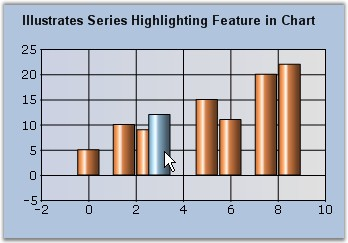
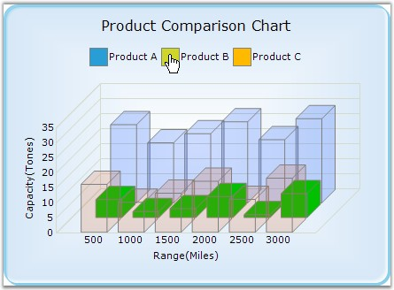

::: {style="DISPLAY: none"}
{#d2h_url_template}{#d2h_package_url style="WIDTH: 0px; DISPLAY: none; HEIGHT: 0px"}
:::

::::: {#nsbanner .d2h_main_nsbanner style="BORDER-BOTTOM: #999999 1px solid; POSITION: relative; PADDING-BOTTOM: 0px; BACKGROUND-COLOR: transparent; PADDING-LEFT: 0px; PADDING-RIGHT: 0px; DISPLAY: none; BORDER-TOP: #999999 1px solid; PADDING-TOP: 0px; LEFT: 0px"}
:::: {#TitleRow .d2h_main_titlerow style="PADDING-BOTTOM: 4px; BACKGROUND-COLOR: transparent; PADDING-LEFT: 22px; WIDTH: 100%; PADDING-RIGHT: 10px; DISPLAY: none; PADDING-TOP: 4px"}
::: {#ienav .d2h_main_ienav style="DISPLAY: none"}
{#D2HPrevious .D2HPreviousEnabled}  {#D2HNext .D2HNextEnabled}
:::
::::
:::::

:::::: {#nstext .d2h_main_nstext style="PADDING-BOTTOM: 10px; BACKGROUND-COLOR: transparent; PADDING-LEFT: 22px; PADDING-RIGHT: 10px; HEIGHT: 100%; OVERFLOW: auto; PADDING-TOP: 5px" hasuserbackground="true" valign="bottom"}
::: {#d2h_breadcrumbs .d2h_breadcrumbs}
[Essential Studio User Guide Documentation](ms-xhelp:///?Id=12457748-09e3-4d74-a240-8e049cedf030){.d2h_breadcrumbsNormal}[ \> ]{.d2h_breadcrumbsLinkSeparator}[User Interface Edition](ms-xhelp:///?Id=c29296b7-531c-413b-a0ec-488ca1f7f669){.d2h_breadcrumbsNormal}[ \> ]{.d2h_breadcrumbsLinkSeparator}[Essential Windows](ms-xhelp:///?Id=e60759d8-47a4-4570-9d7a-16a68d63f2ea){.d2h_breadcrumbsNormal}[ \> ]{.d2h_breadcrumbsLinkSeparator}[Essential Chart]{.d2h_breadcrumbsContentsOnly}[ \> ]{.d2h_breadcrumbsLinkSeparator}[Concepts and Features](ms-xhelp:///?Id=71321e9c-336c-4c1c-a127-be9f135ad4bb){.d2h_breadcrumbsNormal}[ \> ]{.d2h_breadcrumbsLinkSeparator}[Runtime Features](ms-xhelp:///?Id=90d48bbb-6229-484d-9d3e-31e26c59f1d3){.d2h_breadcrumbsNormal}
:::

### Interactive Features {#interactive-features style="tab-stops: 0pt"}

 

Interactive Cursor

 

This feature lets you position the mouse pointer at a specific data point in a series and hint you on it\'s x and y values via a horizontal and vertical line passing through the data point and intersecting the x and y axis. These lines can be dragged around in order to position them at specific data points.

 

Interactive Cursor can be implemented by creating an instance of **ChartInteractiveCursor** with the ChartSeries as its input. Then add the instance to the Interactive Cursors collection as shown below.

 

+----------------------------------------------------------------------------------------------------------------------------------------------------------------------------------------------------------------------------------------------------------------------------------------------------------------------------------------------------------------+
| **[\[C#\]]{style="FONT-FAMILY: 'Courier New'; COLOR: black"}**                                                                                                                                                                                                                                                                                                 |
|                                                                                                                                                                                                                                                                                                                                                                |
| **[]{style="FONT-FAMILY: 'Courier New'; COLOR: black"}**                                                                                                                                                                                                                                                                                                       |
|                                                                                                                                                                                                                                                                                                                                                                |
| [// Create a new instance of the ChartInteractiveCursor class and initialize chartseries into it.]{style="FONT-FAMILY: 'Courier New'; COLOR: green"}                                                                                                                                                                                                           |
|                                                                                                                                                                                                                                                                                                                                                                |
| [ChartInteractiveCursor cursor1 = ]{style="FONT-FAMILY: 'Courier New'; COLOR: black"}[new]{style="FONT-FAMILY: 'Courier New'; COLOR: blue"}[ ChartInteractiveCursor(]{style="FONT-FAMILY: 'Courier New'; COLOR: black"}[this]{style="FONT-FAMILY: 'Courier New'; COLOR: blue"}[.chartControl1.Series\[0\]);]{style="FONT-FAMILY: 'Courier New'; COLOR: black"} |
|                                                                                                                                                                                                                                                                                                                                                                |
| []{style="FONT-FAMILY: 'Courier New'; COLOR: black"}                                                                                                                                                                                                                                                                                                           |
|                                                                                                                                                                                                                                                                                                                                                                |
| [// Add the instance to the ChartInteractive Cursor collection.]{style="FONT-FAMILY: 'Courier New'; COLOR: green"}                                                                                                                                                                                                                                             |
|                                                                                                                                                                                                                                                                                                                                                                |
| [this]{style="FONT-FAMILY: 'Courier New'; COLOR: blue"}[.chartControl1.ChartArea.InteractiveCursors.Add(cursor1));]{style="FONT-FAMILY: 'Courier New'; COLOR: black"}                                                                                                                                                                                          |
|                                                                                                                                                                                                                                                                                                                                                                |
| []{style="FONT-FAMILY: 'Courier New'; COLOR: black"}                                                                                                                                                                                                                                                                                                           |
|                                                                                                                                                                                                                                                                                                                                                                |
| [//Color of the pointer]{style="FONT-FAMILY: 'Courier New'; COLOR: green"}                                                                                                                                                                                                                                                                                     |
|                                                                                                                                                                                                                                                                                                                                                                |
| [cursor1.Color = Color.Red;]{style="FONT-FAMILY: 'Courier New'; COLOR: black"}                                                                                                                                                                                                                                                                                 |
+----------------------------------------------------------------------------------------------------------------------------------------------------------------------------------------------------------------------------------------------------------------------------------------------------------------------------------------------------------------+

 

+-----------------------------------------------------------------------------------------------------------------------------------------------------------------------------------------------------------------------------------------------------------------------------------------------------------------------------------------------------------+
| **[\[VB]{style="FONT-FAMILY: 'Courier New'; COLOR: black"}[.NET]{style="FONT-FAMILY: 'Courier New'; COLOR: black"}[\]]{style="FONT-FAMILY: 'Courier New'; COLOR: black"}**                                                                                                                                                                                |
|                                                                                                                                                                                                                                                                                                                                                           |
| **[]{style="FONT-FAMILY: 'Courier New'; COLOR: black"}**                                                                                                                                                                                                                                                                                                  |
|                                                                                                                                                                                                                                                                                                                                                           |
| [\' Create a new instance of the ChartInteractiveCursor class and initialize chartseries into it.]{style="FONT-FAMILY: 'Courier New'; COLOR: green"}                                                                                                                                                                                                      |
|                                                                                                                                                                                                                                                                                                                                                           |
| [ChartInteractiveCursor cursor1 = ]{style="FONT-FAMILY: 'Courier New'; COLOR: black"}[New]{style="FONT-FAMILY: 'Courier New'; COLOR: blue"}[ ChartInteractiveCursor(]{style="FONT-FAMILY: 'Courier New'; COLOR: black"}[Me]{style="FONT-FAMILY: 'Courier New'; COLOR: blue"}[.chartControl1.Series(0))]{style="FONT-FAMILY: 'Courier New'; COLOR: black"} |
|                                                                                                                                                                                                                                                                                                                                                           |
| []{style="FONT-FAMILY: 'Courier New'; COLOR: black"}                                                                                                                                                                                                                                                                                                      |
|                                                                                                                                                                                                                                                                                                                                                           |
| [\' Add the instance to the ChartInteractive Cursor collection.]{style="FONT-FAMILY: 'Courier New'; COLOR: green"}                                                                                                                                                                                                                                        |
|                                                                                                                                                                                                                                                                                                                                                           |
| [Me]{style="FONT-FAMILY: 'Courier New'; COLOR: blue"}[.chartControl1.ChartArea.InteractiveCursors.Add(cursor1))]{style="FONT-FAMILY: 'Courier New'; COLOR: black"}                                                                                                                                                                                        |
|                                                                                                                                                                                                                                                                                                                                                           |
| []{style="FONT-FAMILY: 'Courier New'; COLOR: black"}                                                                                                                                                                                                                                                                                                      |
|                                                                                                                                                                                                                                                                                                                                                           |
| [\'Color of the pointer]{style="FONT-FAMILY: 'Courier New'; COLOR: green"}                                                                                                                                                                                                                                                                                |
|                                                                                                                                                                                                                                                                                                                                                           |
| [cursor1.Color = Color.Red]{style="FONT-FAMILY: 'Courier New'; COLOR: black"}                                                                                                                                                                                                                                                                             |
+-----------------------------------------------------------------------------------------------------------------------------------------------------------------------------------------------------------------------------------------------------------------------------------------------------------------------------------------------------------+

 

{border="0"}

 

Figure 304: Chart Interactive Cursor

 

Chart AutoHighlight

 

The points or the series of the chart can be highlighted when the mouse hovers over them. Use the **AutoHighlight** property to enable this feature.

 

{border="0"}

 

Figure 305: Column Highlighted on Mouse Hover

 

Chart Series Highlighting

 

You can also highlight a particular chart series alone while mouse hovering, and make the other series transparent. For this, you need to set **SeriesHighlight** property to ***true***. The series can also be highlighted by hovering the mouse over a legend item corresponding to a particular series.

 

The following table describes properties related to this feature.

 

::: {align="center"}
  ---------------------- --------------------------------------------------------------------------------------------------------------------------------------------------------------------------------
  Property               Description
  HighlightInterior      Sets the highlight color for the series.
  HiddenInterior         Controls the transparency of the non-highlighted series. While mouse hovering on a particular series, all other series will be set with the color, specified in this property.
  SeriesHighlightIndex   If you want to highlight only a particular series alone, you need to set the index value for this property. The default value is ***-1***.
  ---------------------- --------------------------------------------------------------------------------------------------------------------------------------------------------------------------------
:::

 

::: {style="BORDER-BOTTOM: windowtext 1pt solid; BORDER-LEFT: medium none; PADDING-BOTTOM: 1pt; MARGIN-TOP: 9pt; PADDING-LEFT: 0pt; PADDING-RIGHT: 0pt; MARGIN-BOTTOM: 9pt; BORDER-TOP: windowtext 1pt solid; BORDER-RIGHT: medium none; PADDING-TOP: 1pt"}
{border="0"}Note: The AutoHighlight property should be disabled to enable this chart series highlighting feature.
:::

 

+--------------------------------------------------------------------------------------------------------------------------------------------------------------------------------------------------------------------------------------------------------------------------------------------------------+
| **[\[C#\]]{style="FONT-FAMILY: 'Courier New'; COLOR: black"}**                                                                                                                                                                                                                                         |
|                                                                                                                                                                                                                                                                                                        |
| **[]{style="FONT-FAMILY: 'Courier New'; COLOR: black"}**                                                                                                                                                                                                                                               |
|                                                                                                                                                                                                                                                                                                        |
| [this]{style="FONT-FAMILY: 'Courier New'; COLOR: blue"}[.chartControl1.SeriesHighlight = [true]{style="COLOR: blue"};]{style="FONT-FAMILY: 'Courier New'"}                                                                                                                                             |
|                                                                                                                                                                                                                                                                                                        |
| [this]{style="FONT-FAMILY: 'Courier New'; COLOR: blue"}[.chartControl1.Series\[0\].Style.HighlightInterior = [new]{style="COLOR: blue"} BrushInfo([Color]{style="COLOR: #2b91af"}.Gold);]{style="FONT-FAMILY: 'Courier New'"}                                                                          |
|                                                                                                                                                                                                                                                                                                        |
| [BrushInfo]{style="FONT-FAMILY: 'Courier New'; COLOR: #2b91af"}[ bi = [new]{style="COLOR: blue"} [BrushInfo]{style="COLOR: #2b91af"}([GradientStyle]{style="COLOR: #2b91af"}.Vertical, [Color]{style="COLOR: #2b91af"}.Red, [Color]{style="COLOR: #2b91af"}.Red);]{style="FONT-FAMILY: 'Courier New'"} |
|                                                                                                                                                                                                                                                                                                        |
| [this]{style="FONT-FAMILY: 'Courier New'; COLOR: blue"}[.chartControl1.Series\[0\].Style.HiddenInterior = [new]{style="COLOR: blue"} [BrushInfo]{style="COLOR: #2b91af"}(0, bi); ]{style="FONT-FAMILY: 'Courier New'"}                                                                                 |
+--------------------------------------------------------------------------------------------------------------------------------------------------------------------------------------------------------------------------------------------------------------------------------------------------------+

 

+--------------------------------------------------------------------------------------------------------------------------------------------------------------------------------------------------------------+
| **[\[VB]{style="FONT-FAMILY: 'Courier New'; COLOR: black"}[.NET]{style="FONT-FAMILY: 'Courier New'; COLOR: black"}[\]]{style="FONT-FAMILY: 'Courier New'; COLOR: black"}**                                   |
|                                                                                                                                                                                                              |
| []{style="FONT-FAMILY: 'Courier New'; COLOR: black"}                                                                                                                                                         |
|                                                                                                                                                                                                              |
| [Me]{style="FONT-FAMILY: 'Courier New'; COLOR: blue"}[.chartControl1.SeriesHighlight = [True]{style="COLOR: blue"}]{style="FONT-FAMILY: 'Courier New'"}                                                      |
|                                                                                                                                                                                                              |
| [Me]{style="FONT-FAMILY: 'Courier New'; COLOR: blue"}[.chartControl1.Series(0).Style.HighlightInterior = [New]{style="COLOR: blue"} BrushInfo(Color.Gold)]{style="FONT-FAMILY: 'Courier New'"}               |
|                                                                                                                                                                                                              |
| [Dim]{style="FONT-FAMILY: 'Courier New'; COLOR: blue"}[ bi [As]{style="COLOR: blue"} [New]{style="COLOR: blue"} BrushInfo(GradientStyle.Vertical, Color.Red, Color.Red)]{style="FONT-FAMILY: 'Courier New'"} |
|                                                                                                                                                                                                              |
| [Me]{style="FONT-FAMILY: 'Courier New'; COLOR: blue"}[.chartControl1.Series(0).Style.HiddenInterior = [New]{style="COLOR: blue"} BrushInfo(0, bi)]{style="FONT-FAMILY: 'Courier New'"}                       |
+--------------------------------------------------------------------------------------------------------------------------------------------------------------------------------------------------------------+

 

{border="0"}

 

Figure 306: Product B Series being Highlighted

[]{#p203} 

 

 

 

More:

[ ]{#related-topics}

[{border="0" align="absMiddle"}Drawing Interactive Cursor Separately -- Either Horizontally or Vertically or Both](ms-xhelp:///?Id=fd12233f-53a2-494a-9ece-a1175de6686c){style="TEXT-DECORATION: none"}
::::::
