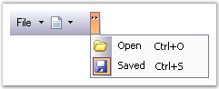

::: {style="DISPLAY: none"}
{#d2h_url_template}{#d2h_package_url style="WIDTH: 0px; DISPLAY: none; HEIGHT: 0px"}
:::

::::: {.d2h_secondary_topic style="PADDING-BOTTOM: 10pt; MARGIN: 0pt; PADDING-LEFT: 0pt; PADDING-RIGHT: 0pt; PADDING-TOP: 0pt"}
#### Interactive Features {#interactive-features style="tab-stops: 0pt"}

[]{style="COLOR: #15428b"} 

This section discusses the interactive features available in the CommandBar control.

[]{style="COLOR: #15428b"} 

Chevron

[]{style="COLOR: #15428b"} 

The term \"chevron\" is used for a menu that contains the toolbar icons that do not fit in the space available on the toolbar.

[]{style="FONT-SIZE: 8pt"} 

Table 10: Chevron

::: {align="center"}
  --------------------- ---------------------------------------------------------------------
  CommandBar Property   Description
  ChevronColor          Gets / sets the color of the chevron.
  HideChevron           Indicates whether the CommandBar should be drawn without a chevron.
  IsChevronVisible      Indicates whether the chevron is currently visible.
  --------------------- ---------------------------------------------------------------------
:::

[]{style="COLOR: #15428b"} 

+-----------------------------------------------------------------------------------------------------------------------------------------------------------------------------+
| **[\[C#\]]{style="FONT-FAMILY: 'Courier New'; COLOR: black"}**                                                                                                              |
|                                                                                                                                                                             |
| []{style="FONT-FAMILY: 'Courier New'; COLOR: black"}                                                                                                                        |
|                                                                                                                                                                             |
| [this]{style="FONT-FAMILY: 'Courier New'; COLOR: blue"}[.commandBar1.ChevronColor = System.Drawing.[Color]{style="COLOR: teal"}.Black;]{style="FONT-FAMILY: 'Courier New'"} |
|                                                                                                                                                                             |
| [this]{style="FONT-FAMILY: 'Courier New'; COLOR: blue"}[.commandBar1.HideChevron = [false]{style="COLOR: blue"};]{style="FONT-FAMILY: 'Courier New'"}                       |
|                                                                                                                                                                             |
| [this]{style="FONT-FAMILY: 'Courier New'; COLOR: blue"}[.CommandBar1.IsChevronVisible = [true]{style="COLOR: blue"}]{style="FONT-FAMILY: 'Courier New'"}                    |
+-----------------------------------------------------------------------------------------------------------------------------------------------------------------------------+

[]{style="COLOR: #15428b"} 

+--------------------------------------------------------------------------------------------------------------------------------------------------------+
| **[\[VB.NET\]]{style="FONT-FAMILY: 'Courier New'; COLOR: black"}**                                                                                     |
|                                                                                                                                                        |
| []{style="FONT-FAMILY: 'Courier New'; COLOR: black"}                                                                                                   |
|                                                                                                                                                        |
| [Me]{style="FONT-FAMILY: 'Courier New'; COLOR: blue"}[.commandBar1.ChevronColor = System.Drawing.Color.Black]{style="FONT-FAMILY: 'Courier New'"}      |
|                                                                                                                                                        |
| [Me]{style="FONT-FAMILY: 'Courier New'; COLOR: blue"}[.commandBar1.HideChevron = [False]{style="COLOR: blue"}]{style="FONT-FAMILY: 'Courier New'"}     |
|                                                                                                                                                        |
| [Me]{style="FONT-FAMILY: 'Courier New'; COLOR: blue"}[.CommandBar1.IsChevronVisible = [True]{style="COLOR: blue"}]{style="FONT-FAMILY: 'Courier New'"} |
+--------------------------------------------------------------------------------------------------------------------------------------------------------+

[]{style="COLOR: #15428b"} 

The following screen shot displays the chevron in the CommandBar.

[]{style="COLOR: #15428b"} 

{border="0"}

[]{style="COLOR: #15428b"} 

Figure 19: CommandBar with Chevron

[]{style="COLOR: #15428b"} 

::: {style="BORDER-BOTTOM: windowtext 1pt solid; BORDER-LEFT: medium none; PADDING-BOTTOM: 1pt; MARGIN-TOP: 9pt; PADDING-LEFT: 0pt; PADDING-RIGHT: 0pt; MARGIN-BOTTOM: 9pt; BORDER-TOP: windowtext 1pt solid; BORDER-RIGHT: medium none; PADDING-TOP: 1pt"}
{border="0"} Note:[ ]{style="COLOR: black; FONT-SIZE: 8pt"}The chevron will be visible only when the toolbar icons do not fit in the space available in the toolbar. Normally it will not be displayed.
:::

[]{style="COLOR: #15428b"} 

A sample which demonstrates the Chevron settings of the CommandBar control is available in the below sample installation path.

 

..My Documents\\Syncfusion\\EssentialStudio\\***Version Number***\\Windows\\Tools.Windows\\Samples\\2.0\\CommandBars Package\\CommandBars

[]{#related-topics}
:::::
