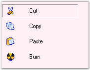
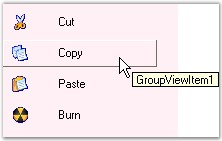

::: {style="DISPLAY: none"}
{#d2h_url_template}{#d2h_package_url style="WIDTH: 0px; DISPLAY: none; HEIGHT: 0px"}
:::

::::: {.d2h_secondary_topic style="PADDING-BOTTOM: 10pt; MARGIN: 0pt; PADDING-LEFT: 0pt; PADDING-RIGHT: 0pt; PADDING-TOP: 0pt"}
##### Interactive Features {#interactive-features style="MARGIN-LEFT: 18pt; tab-stops: 18.0pt"}

 

User can determine whether the particular GroupView Item is selected or not using the ButtonView and ClipSelectionBounds properties. ButtonView displays the selected GroupView Item in the pressed state.

 

ButtonView can be enabled in the GroupView control at design-time by setting the SelectedItem property to integer values which in turn represents the GroupView Item. ClipSelectionBounds displays a white border around the selected GroupView Item.

[]{style="COLOR: #4a5c8c; FONT-SIZE: 8pt"} 

::: {align="center"}
  --------------------- ------------------------------------------------------------------------------------------------------------------------------------------------------------------
  GroupView Property    Description
  ButtonView            Setting this property to \'True\' will make the GroupView Items behave like button objects with a distinct selection state that is retained between item clicks.
  ClipSelectionBounds   Specifies whether the selection bounds of the GroupView Item are clipped around it\'s image and text.
  --------------------- ------------------------------------------------------------------------------------------------------------------------------------------------------------------
:::

 

+-------------------------------------------------------------------------------------------------------------------------------------------------------------+
| **[\[C#\]]{style="FONT-FAMILY: 'Courier New'; COLOR: black"}**                                                                                              |
|                                                                                                                                                             |
|                                                                                                                                                             |
|                                                                                                                                                             |
| [this]{style="FONT-FAMILY: 'Courier New'; COLOR: blue"}[.groupView1.ButtonView = [true]{style="COLOR: blue"};]{style="FONT-FAMILY: 'Courier New'"}          |
|                                                                                                                                                             |
| [this]{style="FONT-FAMILY: 'Courier New'; COLOR: blue"}[.groupView1.ClipSelectionBounds = [true]{style="COLOR: blue"};]{style="FONT-FAMILY: 'Courier New'"} |
+-------------------------------------------------------------------------------------------------------------------------------------------------------------+

[]{style="COLOR: #4a5c8c; FONT-SIZE: 8pt"} 

+------------------------------------------------------------------------------------------------------------------------------------------------------------------------+
| **[\[VB.NET\]]{style="FONT-FAMILY: 'Courier New'; COLOR: black"}**                                                                                                     |
|                                                                                                                                                                        |
|                                                                                                                                                                        |
|                                                                                                                                                                        |
| [Me]{style="FONT-FAMILY: 'Courier New'; COLOR: blue"}[.groupView1.ButtonView = [True]{style="COLOR: blue"}]{style="FONT-FAMILY: 'Courier New'"}[]{style="COLOR: blue"} |
|                                                                                                                                                                        |
| [Me]{style="FONT-FAMILY: 'Courier New'; COLOR: blue"}[.groupView1.ClipSelectionBounds = [True]{style="COLOR: blue"}]{style="FONT-FAMILY: 'Courier New'"}               |
+------------------------------------------------------------------------------------------------------------------------------------------------------------------------+

 

 

{border="0"}

Figure 921: ButtonView of the \'Cut\' Item**[]{style="FONT-STYLE: normal"}**

 

[]{#p650} 

 

###### 3.6.2.4.5.1      ToolTips {#tooltips style="MARGIN-LEFT: 18pt; tab-stops: 18.0pt"}

[]{style="COLOR: #15428b"} 

The **ToolTipText** property of the GroupView control can be used to set the text of the tooltip. The **ShowToolTips** property must be set to \'True\' in order to make the tooltip visible.

[]{style="COLOR: #15428b"} 

::: {align="center"}
  -------------------- ----------------------------------------------------------------------------
  GroupView Property   Description
  ToolTipText          Gets / sets the text of the tooltip.
  ShowToolTips         Sets the visibility of the tooltip. The default value is set to \'False\'.
  -------------------- ----------------------------------------------------------------------------
:::

[]{style="COLOR: #15428b"} 

+-----------------------------------------------------------------------------------------------------------------------------------------------------------------------------------------+
| **[\[C#\]]{style="FONT-FAMILY: 'Courier New'; COLOR: black"}**                                                                                                                          |
|                                                                                                                                                                                         |
| []{style="FONT-FAMILY: 'Courier New'; COLOR: black"}                                                                                                                                    |
|                                                                                                                                                                                         |
| [// Set the tooltip text for the GroupView Item. ]{style="FONT-FAMILY: 'Courier New'; COLOR: green"}                                                                                    |
|                                                                                                                                                                                         |
| [this]{style="FONT-FAMILY: 'Courier New'; COLOR: blue"}[.groupView1.GroupViewItems\[0\].ToolTipText = [\"GroupViewItem1\"]{style="COLOR: maroon"};]{style="FONT-FAMILY: 'Courier New'"} |
|                                                                                                                                                                                         |
| [this]{style="FONT-FAMILY: 'Courier New'; COLOR: blue"}[.groupView1.ShowToolTips = [true]{style="COLOR: blue"};]{style="FONT-FAMILY: 'Courier New'"}                                    |
+-----------------------------------------------------------------------------------------------------------------------------------------------------------------------------------------+

[]{style="COLOR: #4a5c8c; FONT-SIZE: 8pt"} 

+------------------------------------------------------------------------------------------------------------------------------------------------------------------------------------+
| **[\[VB.NET\]]{style="FONT-FAMILY: 'Courier New'; COLOR: black"}**                                                                                                                 |
|                                                                                                                                                                                    |
| []{style="FONT-FAMILY: 'Courier New'; COLOR: black"}                                                                                                                               |
|                                                                                                                                                                                    |
| [\' Set the tooltip text for the GroupView Item. ]{style="FONT-FAMILY: 'Courier New'; COLOR: green"}                                                                               |
|                                                                                                                                                                                    |
| [Me]{style="FONT-FAMILY: 'Courier New'; COLOR: blue"}[.groupView1.GroupViewItems(0).ToolTipText = [\"GroupViewItem1\"]{style="COLOR: maroon"}]{style="FONT-FAMILY: 'Courier New'"} |
|                                                                                                                                                                                    |
| [Me]{style="FONT-FAMILY: 'Courier New'; COLOR: blue"}[.groupView1.ShowToolTips = [True]{style="COLOR: blue"}]{style="FONT-FAMILY: 'Courier New'"}                                  |
+------------------------------------------------------------------------------------------------------------------------------------------------------------------------------------+

[]{style="COLOR: #4a5c8c; FONT-SIZE: 8pt"} 

{border="0"}

[]{style="COLOR: #15428b"} 

Figure 922: ToolTip displayed for \"Copy\" Item

 

 

[]{#p651} 

 

[]{#related-topics}
:::::
