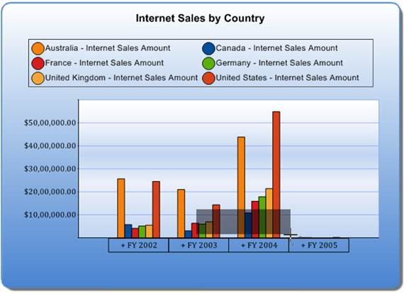
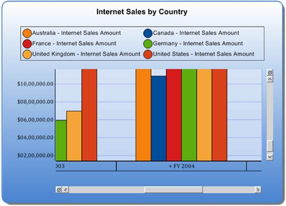

::: {style="DISPLAY: none"}
{#d2h_url_template}{#d2h_package_url style="WIDTH: 0px; DISPLAY: none; HEIGHT: 0px"}
:::

::::: {#nsbanner .d2h_main_nsbanner style="BORDER-BOTTOM: #999999 1px solid; POSITION: relative; PADDING-BOTTOM: 0px; BACKGROUND-COLOR: transparent; PADDING-LEFT: 0px; PADDING-RIGHT: 0px; DISPLAY: none; BORDER-TOP: #999999 1px solid; PADDING-TOP: 0px; LEFT: 0px"}
:::: {#TitleRow .d2h_main_titlerow style="PADDING-BOTTOM: 4px; BACKGROUND-COLOR: transparent; PADDING-LEFT: 22px; WIDTH: 100%; PADDING-RIGHT: 10px; DISPLAY: none; PADDING-TOP: 4px"}
::: {#ienav .d2h_main_ienav style="DISPLAY: none"}
{#D2HPrevious .D2HPreviousEnabled}  {#D2HNext .D2HNextEnabled}
:::
::::
:::::

::::: {#nstext .d2h_main_nstext style="PADDING-BOTTOM: 10px; BACKGROUND-COLOR: transparent; PADDING-LEFT: 22px; PADDING-RIGHT: 10px; HEIGHT: 100%; OVERFLOW: auto; PADDING-TOP: 5px" hasuserbackground="true" valign="bottom"}
::: {#d2h_breadcrumbs .d2h_breadcrumbs}
[Essential Studio User Guide Documentation](ms-xhelp:///?Id=12457748-09e3-4d74-a240-8e049cedf030){.d2h_breadcrumbsNormal}[ \> ]{.d2h_breadcrumbsLinkSeparator}[Business Intelligence Edition](ms-xhelp:///?Id=fdf33dd8-62b2-47b9-ad7b-fc50e590bca5){.d2h_breadcrumbsNormal}[ \> ]{.d2h_breadcrumbsLinkSeparator}[Essential BI ASP.NET](ms-xhelp:///?Id=99c6694e-59c3-4c59-abb5-ce9ce9a948bc){.d2h_breadcrumbsNormal}[ \> ]{.d2h_breadcrumbsLinkSeparator}[Essential BI Chart]{.d2h_breadcrumbsContentsOnly}[ \> ]{.d2h_breadcrumbsLinkSeparator}[Concepts and Features](ms-xhelp:///?Id=be4e11fe-e0a1-44d7-aa3a-05cf8b78bdb8){.d2h_breadcrumbsNormal}
:::

## Interactive Zooming and Scrolling {#interactive-zooming-and-scrolling style="tab-stops: 0pt"}

**[]{style="COLOR: black"}** 

**Essential BI Olap Chart** for Web, supports interactive zooming features along the x and y axis. During runtime, the user can simply select the range they want to zoom with the mouse, and the chart would accordingly zoom-in. Scrollbars are activated to browse the areas that become hidden on zooming-in.

 

Enable zooming via the **EnableXZooming** and **EnableYZooming** properties.

[]{style="COLOR: black"} 

[]{style="COLOR: black"} 

{border="0"}

 

Figure 50: Chart to be Zoomed

{border="0"}

 

Figure 51: Zooming and Scrolling

 

+------------------------------------------------------------------------------------------------------------------------------------------------------------------------------------------------------------+
| **[\[C#\]]{style="FONT-FAMILY: 'Courier New'"}**[]{style="FONT-FAMILY: 'Courier New'; COLOR: blue"}                                                                                                        |
|                                                                                                                                                                                                            |
| [this]{style="FONT-FAMILY: 'Courier New'; COLOR: blue"}[. olapChart1.EnableXZooming = [true]{style="COLOR: blue"};]{style="FONT-FAMILY: 'Courier New'"}                                                    |
|                                                                                                                                                                                                            |
| [this]{style="FONT-FAMILY: 'Courier New'; COLOR: blue"}[. olapChart1.EnableXZooming = [true]{style="COLOR: blue"};]{style="FONT-FAMILY: 'Courier New'"}                                                    |
|                                                                                                                                                                                                            |
| [this]{style="FONT-FAMILY: 'Courier New'; COLOR: blue"}[. olapChart1.PrimaryXAxis.ZoomFactor = 1.0;]{style="FONT-FAMILY: 'Courier New'"}                                                                   |
|                                                                                                                                                                                                            |
| [this]{style="FONT-FAMILY: 'Courier New'; COLOR: blue"}[. olapChart1.PrimaryYAxis.ZoomFactor = 1.0;]{style="FONT-FAMILY: 'Courier New'"}                                                                   |
|                                                                                                                                                                                                            |
| [this]{style="FONT-FAMILY: 'Courier New'; COLOR: blue"}[.olapChart1.ShowScrollBars = [true]{style="COLOR: blue"};]{style="FONT-FAMILY: 'Courier New'"}[]{style="FONT-FAMILY: 'Courier New'; COLOR: black"} |
+------------------------------------------------------------------------------------------------------------------------------------------------------------------------------------------------------------+

[]{style="FONT-FAMILY: 'Calibri','sans-serif'"} 

+---------------------------------------------------------------------------------------------------------------------------------------------------------------------------------------------------------+
| **[\[VB\]]{style="FONT-FAMILY: 'Courier New'"}**[]{style="FONT-FAMILY: 'Courier New'; COLOR: blue"}                                                                                                     |
|                                                                                                                                                                                                         |
| [Me]{style="FONT-FAMILY: 'Courier New'; COLOR: blue"}[.olapChart1.EnableXZooming = [True]{style="COLOR: blue"}]{style="FONT-FAMILY: 'Courier New'"}                                                     |
|                                                                                                                                                                                                         |
| [Me]{style="FONT-FAMILY: 'Courier New'; COLOR: blue"}[.olapChart1.EnableXZooming = [True]{style="COLOR: blue"}]{style="FONT-FAMILY: 'Courier New'"}                                                     |
|                                                                                                                                                                                                         |
| [Me]{style="FONT-FAMILY: 'Courier New'; COLOR: blue"}[.olapChart1.PrimaryXAxis.ZoomFactor = 1.0]{style="FONT-FAMILY: 'Courier New'"}                                                                    |
|                                                                                                                                                                                                         |
| [Me.]{style="FONT-FAMILY: 'Courier New'; COLOR: blue"}[olapChart1.PrimaryYAxis.ZoomFactor = 1.0]{style="FONT-FAMILY: 'Courier New'"}                                                                    |
|                                                                                                                                                                                                         |
| [Me]{style="FONT-FAMILY: 'Courier New'; COLOR: blue"}[.olapChart1.ShowScrollBars = [True]{style="COLOR: blue"}]{style="FONT-FAMILY: 'Courier New'"}[]{style="FONT-FAMILY: 'Courier New'; COLOR: black"} |
+---------------------------------------------------------------------------------------------------------------------------------------------------------------------------------------------------------+

 

 

 

Table 28: Zooming and Scrolling

 

::: {align="center"}
  ---------------- ----------------------------------------------------------------------- ------------------------------------ ------------------------------ -------------------------------------
  Methods          [Description]{style="COLOR: black"}                                     [Parameters]{style="COLOR: black"}   [Type]{style="COLOR: black"}   [Return Type]{style="COLOR: black"}
  EnableXZooming   Enables zooming on x-axis.                                              Server side                          boolean                        \-
  EnableXZooming   Enables zooming on y-axis.                                              Server side                          boolean                        \-
  ZoomingFactor    Sets a value to present a zooming effect accordingly on x and y axis.   Server side                          double                         \-
  ShowScrollBars   Enables\\disables the appearance of the scroll bar.                     Server side                          boolean                        \-
  ---------------- ----------------------------------------------------------------------- ------------------------------------ ------------------------------ -------------------------------------
:::

 

Sample Link

A sample demo is available at the following location:

 

..\\Syncfusion\\EssentialStudio\\\<Version Number\>\\BI\\Web\\OlapChart.Web\\Samples\\3.5\\ Zooming and Scrolling\\Zooming and Scrolling Demo\\[]{style="FONT-FAMILY: 'Cambria','serif'; COLOR: black; FONT-SIZE: 12pt"}

[]{#related-topics}
:::::
