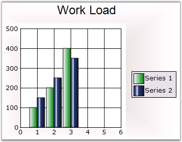
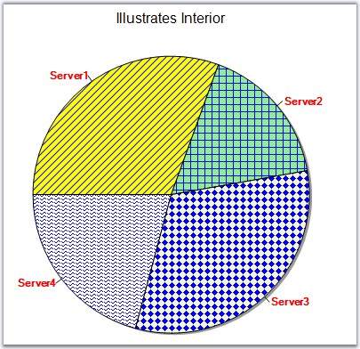

::: {style="DISPLAY: none"}
{#d2h_url_template}{#d2h_package_url style="WIDTH: 0px; DISPLAY: none; HEIGHT: 0px"}
:::

:::: {.d2h_secondary_topic style="PADDING-BOTTOM: 10pt; MARGIN: 0pt; PADDING-LEFT: 0pt; PADDING-RIGHT: 0pt; PADDING-TOP: 0pt"}
#### Interior {#interior style="tab-stops: 0pt"}

 

This property will allow the user to set a solid back color, gradient or pattern style for the data points.

 

::: {align="center"}
+-------------------------------------+-------------------------------------+
|                                                                           |
|                                                                           |
| Details                                                                   |
+-------------------------------------+-------------------------------------+
| **Possible Values**                 | A BrushInfo object                  |
+-------------------------------------+-------------------------------------+
| **Default Value    **               | **None**                            |
+-------------------------------------+-------------------------------------+
| **2D / 3D Limitations**             | No                                  |
+-------------------------------------+-------------------------------------+
| **Applies to Chart Element**        | All series and points               |
+-------------------------------------+-------------------------------------+
| **Applies to Chart Types**          | All Chart Types                     |
+-------------------------------------+-------------------------------------+
:::

 

Series Wide Setting

 

The spline area interior brush can be customized using the **ChartSeries.Style.Interior** property as shown below.

 

The interior color of the chart series can be customized by using the **Interior** property of the ChartStyleInfo class. The following code illustrates this.

 

+----------------------------------------------------------------------------------------------------------------------------------------------------------------------------------------------------------------------------------------+
| **[\[C#\]]{style="FONT-FAMILY: 'Courier New'; COLOR: black"}**                                                                                                                                                                         |
|                                                                                                                                                                                                                                        |
| **[]{style="FONT-FAMILY: 'Courier New'; COLOR: black"}**                                                                                                                                                                               |
|                                                                                                                                                                                                                                        |
| [// This sets the interior color for the series. This can be done for any number of series.]{style="FONT-FAMILY: 'Courier New'; COLOR: green"}                                                                                         |
|                                                                                                                                                                                                                                        |
| [this]{style="FONT-FAMILY: 'Courier New'; COLOR: blue"}[.chartControl1.Series\[0\].Style.Interior = [new]{style="COLOR: blue"} BrushInfo(GradientStyle.Horizontal ,Color.AliceBlue, Color.Green);]{style="FONT-FAMILY: 'Courier New'"} |
+----------------------------------------------------------------------------------------------------------------------------------------------------------------------------------------------------------------------------------------+

 

+----------------------------------------------------------------------------------------------------------------------------------------------------------------------------------------------------------------------------------+
| **[\[VB.NET\]]{style="FONT-FAMILY: 'Courier New'; COLOR: black"}**                                                                                                                                                               |
|                                                                                                                                                                                                                                  |
| **[]{style="FONT-FAMILY: 'Courier New'; COLOR: black"}**                                                                                                                                                                         |
|                                                                                                                                                                                                                                  |
| [\' This sets the interior color for the series. This can be done for any number of series.]{style="FONT-FAMILY: 'Courier New'; COLOR: green"}                                                                                   |
|                                                                                                                                                                                                                                  |
| [Me]{style="FONT-FAMILY: 'Courier New'; COLOR: blue"}[.chartControl1.Series(0).Style.Interior =[ New]{style="COLOR: blue"} BrushInfo(GradientStyle.Horizontal,Color.AliceBlue, Color.Green)]{style="FONT-FAMILY: 'Courier New'"} |
+----------------------------------------------------------------------------------------------------------------------------------------------------------------------------------------------------------------------------------+

 

{border="0"}

 

Figure 153: Chart control with Gradient Control

 

Specific Data Point Setting

 

You can also set interior color for individual data points using **Series.Styles\[0\].Interior** property.

 

+----------------------------------------------------------------------------------------------------------------------------------------------------------------------------------------------------------------------------------------------+
| **[\[C#\]]{style="FONT-FAMILY: 'Courier New'; COLOR: black"}**                                                                                                                                                                               |
|                                                                                                                                                                                                                                              |
| **[]{style="FONT-FAMILY: 'Courier New'; COLOR: black"}**                                                                                                                                                                                     |
|                                                                                                                                                                                                                                              |
| [this]{style="FONT-FAMILY: 'Courier New'; COLOR: blue"}[.chartControl1.Series\[0\].Styles\[0\].Interior = [new]{style="COLOR: blue"} BrushInfo(GradientStyle.Horizontal ,Color.AliceBlue, Color.Green);]{style="FONT-FAMILY: 'Courier New'"} |
|                                                                                                                                                                                                                                              |
| [this]{style="FONT-FAMILY: 'Courier New'; COLOR: blue"}[.chartControl1.Series\[0\].Styles\[1\].Interior = [new]{style="COLOR: blue"} BrushInfo(GradientStyle.Horizontal ,Color.Blue, Color.AliceBlue);]{style="FONT-FAMILY: 'Courier New'"}  |
+----------------------------------------------------------------------------------------------------------------------------------------------------------------------------------------------------------------------------------------------+

 

+----------------------------------------------------------------------------------------------------------------------------------------------------------------------------------------------------------------------------------------+
| **[\[VB.NET\]]{style="FONT-FAMILY: 'Courier New'; COLOR: black"}**                                                                                                                                                                     |
|                                                                                                                                                                                                                                        |
| **[]{style="FONT-FAMILY: 'Courier New'; COLOR: black"}**                                                                                                                                                                               |
|                                                                                                                                                                                                                                        |
| [Me]{style="FONT-FAMILY: 'Courier New'; COLOR: blue"}[.chartControl1.Series(0).Styles\[0\].Interior =[ New]{style="COLOR: blue"} BrushInfo(GradientStyle.Horizontal,Color.AliceBlue, Color.Green)]{style="FONT-FAMILY: 'Courier New'"} |
|                                                                                                                                                                                                                                        |
| [Me]{style="FONT-FAMILY: 'Courier New'; COLOR: blue"}[.chartControl1.Series(0).Styles\[1\].Interior =[ New]{style="COLOR: blue"} BrushInfo(GradientStyle.Horizontal,Color.Blue, Color.AliceBlue)]{style="FONT-FAMILY: 'Courier New'"}  |
+----------------------------------------------------------------------------------------------------------------------------------------------------------------------------------------------------------------------------------------+

 

PieChart Specific

 

When rendering pie charts, it\'s sometimes very helpful to render a patterned background for each slice, while printing the pie on a gray scale printer. You can do so easily as shown below. The code here is for a Pie Chart series with 4 points.

[]{style="COLOR: red; FONT-SIZE: 8pt"} 

+------------------------------------------------------------------------------------------------------------------------------------------------------------------------------------------------------------------------------------------------------------------------------------------------------------------------------------------------------------------------------------------------------------+
| **[\[C#\]]{style="FONT-FAMILY: 'Courier New'; COLOR: black"}**                                                                                                                                                                                                                                                                                                                                             |
|                                                                                                                                                                                                                                                                                                                                                                                                            |
| []{style="FONT-FAMILY: 'Courier New'"}                                                                                                                                                                                                                                                                                                                                                                     |
|                                                                                                                                                                                                                                                                                                                                                                                                            |
| [series1.Styles\[0\].Interior = [new]{style="COLOR: blue"} [BrushInfo]{style="COLOR: teal"}([PatternStyle]{style="COLOR: teal"}.BackwardDiagonal, [new]{style="COLOR: blue"} [BrushInfoColorArrayList]{style="COLOR: teal"}([new]{style="COLOR: blue"} [Color]{style="COLOR: teal"}\[\] { [Color]{style="COLOR: teal"}.Yellow, [Color]{style="COLOR: teal"}.Blue }));]{style="FONT-FAMILY: 'Courier New'"} |
|                                                                                                                                                                                                                                                                                                                                                                                                            |
| [series1.Styles\[1\].Interior = [new]{style="COLOR: blue"} [BrushInfo]{style="COLOR: teal"}([PatternStyle]{style="COLOR: teal"}.Cross, [new]{style="COLOR: blue"} [BrushInfoColorArrayList]{style="COLOR: teal"}([new]{style="COLOR: blue"} [Color]{style="COLOR: teal"}\[\] { [Color]{style="COLOR: teal"}.LightGreen, [Color]{style="COLOR: teal"}.Blue }));]{style="FONT-FAMILY: 'Courier New'"}        |
|                                                                                                                                                                                                                                                                                                                                                                                                            |
| [series1.Styles\[2\].Interior = [new]{style="COLOR: blue"} [BrushInfo]{style="COLOR: teal"}([PatternStyle]{style="COLOR: teal"}.SolidDiamond, [new]{style="COLOR: blue"} [BrushInfoColorArrayList]{style="COLOR: teal"}([new]{style="COLOR: blue"} [Color]{style="COLOR: teal"}\[\] { [Color]{style="COLOR: teal"}.Beige, [Color]{style="COLOR: teal"}.Blue }));]{style="FONT-FAMILY: 'Courier New'"}      |
|                                                                                                                                                                                                                                                                                                                                                                                                            |
| [series1.Styles\[3\].Interior = [new]{style="COLOR: blue"} [BrushInfo]{style="COLOR: teal"}([PatternStyle]{style="COLOR: teal"}.Wave, [new]{style="COLOR: blue"} [BrushInfoColorArrayList]{style="COLOR: teal"}([new]{style="COLOR: blue"} [Color]{style="COLOR: teal"}\[\] { [Color]{style="COLOR: teal"}.White, [Color]{style="COLOR: teal"}.Blue }));]{style="FONT-FAMILY: 'Courier New'"}              |
|                                                                                                                                                                                                                                                                                                                                                                                                            |
| [series1.Styles\[0\].Text = [\"Server1\"]{style="COLOR: maroon"};]{style="FONT-FAMILY: 'Courier New'"}                                                                                                                                                                                                                                                                                                     |
|                                                                                                                                                                                                                                                                                                                                                                                                            |
| [series1.Styles\[1\].Text = [\"Server2\"]{style="COLOR: maroon"};]{style="FONT-FAMILY: 'Courier New'"}                                                                                                                                                                                                                                                                                                     |
|                                                                                                                                                                                                                                                                                                                                                                                                            |
| [series1.Styles\[2\].Text = [\"Server3\"]{style="COLOR: maroon"};]{style="FONT-FAMILY: 'Courier New'"}                                                                                                                                                                                                                                                                                                     |
|                                                                                                                                                                                                                                                                                                                                                                                                            |
| [series1.Styles\[3\].Text = [\"Server4\"]{style="COLOR: maroon"};]{style="FONT-FAMILY: 'Courier New'"}                                                                                                                                                                                                                                                                                                     |
+------------------------------------------------------------------------------------------------------------------------------------------------------------------------------------------------------------------------------------------------------------------------------------------------------------------------------------------------------------------------------------------------------------+

 

+--------------------------------------------------------------------------------------------------------------------------------------------------------------------------------------------------------------------------------------------------------------------------------------------------------------------------------------------------------------------------------------------------+
| **[\[VB.NET\]]{style="FONT-FAMILY: 'Courier New'; COLOR: black"}**                                                                                                                                                                                                                                                                                                                               |
|                                                                                                                                                                                                                                                                                                                                                                                                  |
| **[]{style="FONT-FAMILY: 'Courier New'; COLOR: black"}**                                                                                                                                                                                                                                                                                                                                         |
|                                                                                                                                                                                                                                                                                                                                                                                                  |
| [series1.Styles(0).Interior = [New]{style="COLOR: blue"} [BrushInfo]{style="COLOR: teal"}([PatternStyle]{style="COLOR: teal"}.BackwardDiagonal, [New]{style="COLOR: blue"} [BrushInfoColorArrayList]{style="COLOR: teal"}([New]{style="COLOR: blue"} [Color]{style="COLOR: teal"}() { [Color]{style="COLOR: teal"}.Yellow, Color.Blue }))]{style="FONT-FAMILY: 'Courier New'"}                   |
|                                                                                                                                                                                                                                                                                                                                                                                                  |
| [series1.Styles(1).Interior = [New]{style="COLOR: blue"} [BrushInfo]{style="COLOR: teal"}([PatternStyle]{style="COLOR: teal"}.Cross, [New]{style="COLOR: blue"} [BrushInfoColorArrayList]{style="COLOR: teal"}([New]{style="COLOR: blue"} [Color]{style="COLOR: teal"}() { [Color]{style="COLOR: teal"}.LightGreen, [Color]{style="COLOR: teal"}.Blue }))]{style="FONT-FAMILY: 'Courier New'"}   |
|                                                                                                                                                                                                                                                                                                                                                                                                  |
| [series1.Styles(2).Interior = [New]{style="COLOR: blue"} [BrushInfo]{style="COLOR: teal"}([PatternStyle]{style="COLOR: teal"}.SolidDiamond, [New]{style="COLOR: blue"} [BrushInfoColorArrayList]{style="COLOR: teal"}([New]{style="COLOR: blue"} [Color]{style="COLOR: teal"}() { [Color]{style="COLOR: teal"}.Beige, [Color]{style="COLOR: teal"}.Blue }))]{style="FONT-FAMILY: 'Courier New'"} |
|                                                                                                                                                                                                                                                                                                                                                                                                  |
| [series1.Styles(3).Interior = [New]{style="COLOR: blue"} [BrushInfo]{style="COLOR: teal"}([PatternStyle]{style="COLOR: teal"}.Wave, [New]{style="COLOR: blue"} [BrushInfoColorArrayList]{style="COLOR: teal"}([New]{style="COLOR: blue"} [Color]{style="COLOR: teal"}() { [Color]{style="COLOR: teal"}.White, [Color]{style="COLOR: teal"}.Blue }))]{style="FONT-FAMILY: 'Courier New'"}         |
|                                                                                                                                                                                                                                                                                                                                                                                                  |
| [series1.Styles(0).Text = \"[Server1]{style="COLOR: maroon"}\"]{style="FONT-FAMILY: 'Courier New'"}                                                                                                                                                                                                                                                                                              |
|                                                                                                                                                                                                                                                                                                                                                                                                  |
| [series1.Styles(1).Text = \"[Server2]{style="COLOR: maroon"}\"]{style="FONT-FAMILY: 'Courier New'"}                                                                                                                                                                                                                                                                                              |
|                                                                                                                                                                                                                                                                                                                                                                                                  |
| [series1.Styles(2).Text = \"[Server3]{style="COLOR: maroon"}\"]{style="FONT-FAMILY: 'Courier New'"}                                                                                                                                                                                                                                                                                              |
|                                                                                                                                                                                                                                                                                                                                                                                                  |
| [series1.Styles(3).Text = \"[Server4]{style="COLOR: maroon"}\"]{style="FONT-FAMILY: 'Courier New'"}                                                                                                                                                                                                                                                                                              |
+--------------------------------------------------------------------------------------------------------------------------------------------------------------------------------------------------------------------------------------------------------------------------------------------------------------------------------------------------------------------------------------------------+

 

{border="0"}

 

Figure 154: Unique PatternStyle for each Slice in Pie Chart

 

See Also

 

[Chart Types]{.UGHyperlink}[]{.UGHyperlink}

[]{#p118} 

 

[]{#related-topics}
::::
