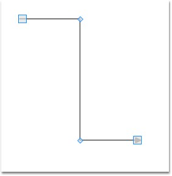
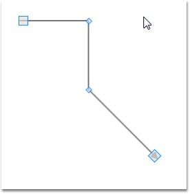
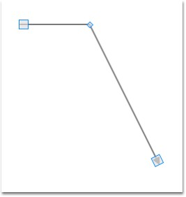

::: {style="DISPLAY: none"}
{#d2h_url_template}{#d2h_package_url style="WIDTH: 0px; DISPLAY: none; HEIGHT: 0px"}
:::

::: {.d2h_secondary_topic style="PADDING-BOTTOM: 10pt; MARGIN: 0pt; PADDING-LEFT: 0pt; PADDING-RIGHT: 0pt; PADDING-TOP: 0pt"}
#### Intermediate Points {#intermediate-points style="tab-stops: 0pt"}

**[]{style="FONT-FAMILY: 'Trebuchet MS','sans-serif'; COLOR: #15428b; FONT-SIZE: 9pt"}** 

Adding Intermediate Points

**[]{style="FONT-FAMILY: 'Trebuchet MS','sans-serif'; COLOR: #15428b; FONT-SIZE: 9pt"}** 

Intermediate points can be added in two ways:

[]{style="FONT-FAMILY: 'Trebuchet MS','sans-serif'; COLOR: #15428b; FONT-SIZE: 9pt"} 

[·      ]{style="FONT-FAMILY: Symbol"}Using Ctrl + Shift Key

[·      ]{style="FONT-FAMILY: Symbol"}Through Code Behind

[]{style="FONT-FAMILY: 'Trebuchet MS','sans-serif'; COLOR: #15428b; FONT-SIZE: 9pt"} 

Intermediate points can be added at run time by holding Ctrl + Shift and clicking on the line. Intermediate points can be added programmatically. The following code snippet illustrates addition of intermediate lines.

[]{style="FONT-FAMILY: 'Trebuchet MS','sans-serif'; COLOR: #15428b; FONT-SIZE: 9pt"} 

+--------------------------------------------------------------------------------------------------------------------------------------------------------------------------------------+
| **[\[C#\]]{style="FONT-FAMILY: 'Courier New'; COLOR: black"}**                                                                                                                       |
|                                                                                                                                                                                      |
|                                                                                                                                                                                      |
|                                                                                                                                                                                      |
| [LineConnector]{style="FONT-FAMILY: 'Courier New'; COLOR: #2b91af"}[ lc = [new]{style="COLOR: blue"} [LineConnector]{style="COLOR: #2b91af"}();]{style="FONT-FAMILY: 'Courier New'"} |
|                                                                                                                                                                                      |
| [lc.ConnectorType=[ConnectorType]{style="COLOR: #2b91af"}.Straight;]{style="FONT-FAMILY: 'Courier New'"}                                                                             |
|                                                                                                                                                                                      |
| [lc.StartPointPosition = [new]{style="COLOR: blue"} [Point]{style="COLOR: #2b91af"}(100, 100);]{style="FONT-FAMILY: 'Courier New'"}                                                  |
|                                                                                                                                                                                      |
| [lc.EndPointPosition = [new]{style="COLOR: blue"} [Point]{style="COLOR: #2b91af"}(300, 300);]{style="FONT-FAMILY: 'Courier New'"}                                                    |
|                                                                                                                                                                                      |
| [lc.IntermediatePoints.Add([new]{style="COLOR: blue"} [Point]{style="COLOR: #2b91af"}(200,100));]{style="FONT-FAMILY: 'Courier New'"}                                                |
|                                                                                                                                                                                      |
| [lc.IntermediatePoints.Add([new]{style="COLOR: blue"} [Point]{style="COLOR: #2b91af"}(200,300));]{style="FONT-FAMILY: 'Courier New'"}                                                |
|                                                                                                                                                                                      |
| []{style="FONT-FAMILY: 'Courier New'"}                                                                                                                                               |
+--------------------------------------------------------------------------------------------------------------------------------------------------------------------------------------+

[]{style="FONT-FAMILY: 'Trebuchet MS','sans-serif'; COLOR: #15428b; FONT-SIZE: 9pt"} 

+------------------------------------------------------------------------------------------------------------------------------------------------------------------------------------------------+
| **[\[VB\]]{style="FONT-FAMILY: 'Courier New'; COLOR: black"}**                                                                                                                                 |
|                                                                                                                                                                                                |
|                                                                                                                                                                                                |
|                                                                                                                                                                                                |
| [Dim]{style="FONT-FAMILY: 'Courier New'; COLOR: blue"}[ lc [As]{style="COLOR: blue"} [New]{style="COLOR: blue"} [LineConnector]{style="COLOR: #2b91af"}()]{style="FONT-FAMILY: 'Courier New'"} |
|                                                                                                                                                                                                |
| [lc.ConnectorType=ConnectorType.Straight]{style="FONT-FAMILY: 'Courier New'"}                                                                                                                  |
|                                                                                                                                                                                                |
| [lc.StartPointPosition = [New]{style="COLOR: blue"} Point(100, 100)]{style="FONT-FAMILY: 'Courier New'"}                                                                                       |
|                                                                                                                                                                                                |
| [lc.EndPointPosition = [New]{style="COLOR: blue"} Point(300, 300)]{style="FONT-FAMILY: 'Courier New'"}                                                                                         |
|                                                                                                                                                                                                |
| [lc.IntermediatePoints.Add(New Point(200,100))]{style="FONT-FAMILY: 'Courier New'"}                                                                                                            |
|                                                                                                                                                                                                |
| [lc.IntermediatePoints.Add(New Point(200,300))]{style="FONT-FAMILY: 'Courier New'"}                                                                                                            |
|                                                                                                                                                                                                |
| []{style="FONT-FAMILY: 'Courier New'"}                                                                                                                                                         |
+------------------------------------------------------------------------------------------------------------------------------------------------------------------------------------------------+

[]{style="FONT-FAMILY: 'Trebuchet MS','sans-serif'; COLOR: #15428b; FONT-SIZE: 9pt"} 

[]{style="FONT-FAMILY: 'Trebuchet MS','sans-serif'; COLOR: #15428b; FONT-SIZE: 9pt"} 

{border="0"}

Figure 58: Adding Intermediate Points

[]{style="FONT-FAMILY: 'Trebuchet MS','sans-serif'; COLOR: #15428b; FONT-SIZE: 9pt"} 

Modifying Intermediate Points

**[]{style="FONT-FAMILY: 'Trebuchet MS','sans-serif'; COLOR: #15428b; FONT-SIZE: 9pt"}** 

Intermediate Points can be modified in two ways:

[]{style="FONT-FAMILY: 'Trebuchet MS','sans-serif'; COLOR: #15428b; FONT-SIZE: 9pt"} 

[·      ]{style="FONT-FAMILY: Symbol"}Dragging the Vertex

[·      ]{style="FONT-FAMILY: Symbol"}Through Code Behind

[]{style="FONT-FAMILY: 'Trebuchet MS','sans-serif'; COLOR: #15428b; FONT-SIZE: 9pt"} 

Intermediate points can be modified at run time by clicking and dragging the vertex of the line connector. Intermediate points can be modified programmatically also. The following code snippet illustrates modification of intermediate lines.

[]{style="FONT-FAMILY: 'Trebuchet MS','sans-serif'; COLOR: #15428b; FONT-SIZE: 9pt"} 

+--------------------------------------------------------------------------------------------------------------------------------------------------------------------------------------+
| **[\[C#\]]{style="FONT-FAMILY: 'Courier New'; COLOR: black"}**                                                                                                                       |
|                                                                                                                                                                                      |
|                                                                                                                                                                                      |
|                                                                                                                                                                                      |
| [LineConnector]{style="FONT-FAMILY: 'Courier New'; COLOR: #2b91af"}[ lc = [new]{style="COLOR: blue"} [LineConnector]{style="COLOR: #2b91af"}();]{style="FONT-FAMILY: 'Courier New'"} |
|                                                                                                                                                                                      |
| [lc.ConnectorType=[ConnectorType]{style="COLOR: #2b91af"}.Straight;]{style="FONT-FAMILY: 'Courier New'"}                                                                             |
|                                                                                                                                                                                      |
| [lc.StartPointPosition = [new]{style="COLOR: blue"} [Point]{style="COLOR: #2b91af"}(100, 100);]{style="FONT-FAMILY: 'Courier New'"}                                                  |
|                                                                                                                                                                                      |
| [lc.EndPointPosition = [new]{style="COLOR: blue"} [Point]{style="COLOR: #2b91af"}(300, 300);]{style="FONT-FAMILY: 'Courier New'"}                                                    |
|                                                                                                                                                                                      |
| [lc.IntermediatePoints.Add([new]{style="COLOR: blue"} [Point]{style="COLOR: #2b91af"}(200,100));]{style="FONT-FAMILY: 'Courier New'"}                                                |
|                                                                                                                                                                                      |
| [lc.IntermediatePoints.Add([new]{style="COLOR: blue"} [Point]{style="COLOR: #2b91af"}(200,300));]{style="FONT-FAMILY: 'Courier New'"}                                                |
|                                                                                                                                                                                      |
| [lc.IntermediatePoints\[1\] = [new]{style="COLOR: blue"} [Point]{style="COLOR: #2b91af"}(200,200));]{style="FONT-FAMILY: 'Courier New'"}                                             |
|                                                                                                                                                                                      |
| []{style="FONT-FAMILY: 'Courier New'"}                                                                                                                                               |
+--------------------------------------------------------------------------------------------------------------------------------------------------------------------------------------+

***[]{style="FONT-FAMILY: 'Trebuchet MS','sans-serif'; COLOR: #15428b; FONT-SIZE: 9pt"}*** 

+------------------------------------------------------------------------------------------------------------------------------------------------------------------------------------------------+
| **[\[VB\]]{style="FONT-FAMILY: 'Courier New'; COLOR: black"}**                                                                                                                                 |
|                                                                                                                                                                                                |
|                                                                                                                                                                                                |
|                                                                                                                                                                                                |
| [Dim]{style="FONT-FAMILY: 'Courier New'; COLOR: blue"}[ lc [As]{style="COLOR: blue"} [New]{style="COLOR: blue"} [LineConnector]{style="COLOR: #2b91af"}()]{style="FONT-FAMILY: 'Courier New'"} |
|                                                                                                                                                                                                |
| [lc.ConnectorType=ConnectorType.Straight]{style="FONT-FAMILY: 'Courier New'"}                                                                                                                  |
|                                                                                                                                                                                                |
| [lc.StartPointPosition = [New]{style="COLOR: blue"} Point(100, 100)]{style="FONT-FAMILY: 'Courier New'"}                                                                                       |
|                                                                                                                                                                                                |
| [lc.EndPointPosition = [New]{style="COLOR: blue"} Point(300, 300)]{style="FONT-FAMILY: 'Courier New'"}                                                                                         |
|                                                                                                                                                                                                |
| [lc.IntermediatePoints.Add(New Point(200,100))]{style="FONT-FAMILY: 'Courier New'"}                                                                                                            |
|                                                                                                                                                                                                |
| [lc.IntermediatePoints.Add(New Point(200,300))]{style="FONT-FAMILY: 'Courier New'"}                                                                                                            |
|                                                                                                                                                                                                |
| [lc.IntermediatePoints(1) = [New]{style="COLOR: blue"} Point(200,200))]{style="FONT-FAMILY: 'Courier New'"}                                                                                    |
|                                                                                                                                                                                                |
| []{style="FONT-FAMILY: 'Courier New'"}                                                                                                                                                         |
+------------------------------------------------------------------------------------------------------------------------------------------------------------------------------------------------+

***[]{style="FONT-FAMILY: 'Trebuchet MS','sans-serif'; COLOR: #15428b; FONT-SIZE: 9pt"}*** 

{border="0"}

Figure 59: Modifying Intermediate Points

[]{style="FONT-FAMILY: 'Trebuchet MS','sans-serif'; COLOR: #15428b; FONT-SIZE: 9pt"} 

 

Delete Intermediate Points

**[]{style="FONT-FAMILY: 'Trebuchet MS','sans-serif'; COLOR: #15428b; FONT-SIZE: 9pt"}** 

Intermediate points can be deleted in two ways:

[]{style="FONT-FAMILY: 'Trebuchet MS','sans-serif'; COLOR: #15428b; FONT-SIZE: 9pt"} 

[·      ]{style="FONT-FAMILY: Symbol"}Using Ctrl + Shift Key

[·      ]{style="FONT-FAMILY: Symbol"}Through Code Behind

[]{style="FONT-FAMILY: 'Trebuchet MS','sans-serif'; COLOR: #15428b; FONT-SIZE: 9pt"} 

Intermediate points can be deleted by holding Ctrl + Shift and clicking on the vertex that represents intermediate point to be deleted. Intermediate points can be deleted programmatically also. The following code snippet illustrates deletion of intermediate lines.

[]{style="FONT-FAMILY: 'Trebuchet MS','sans-serif'; COLOR: #15428b; FONT-SIZE: 9pt"} 

+--------------------------------------------------------------------------------------------------------------------------------------------------------------------------------------+
| **[\[C#\]]{style="FONT-FAMILY: 'Courier New'; COLOR: black"}**                                                                                                                       |
|                                                                                                                                                                                      |
|                                                                                                                                                                                      |
|                                                                                                                                                                                      |
| [LineConnector]{style="FONT-FAMILY: 'Courier New'; COLOR: #2b91af"}[ lc = [new]{style="COLOR: blue"} [LineConnector]{style="COLOR: #2b91af"}();]{style="FONT-FAMILY: 'Courier New'"} |
|                                                                                                                                                                                      |
| [lc.ConnectorType=[ConnectorType]{style="COLOR: #2b91af"}.Straight;]{style="FONT-FAMILY: 'Courier New'"}                                                                             |
|                                                                                                                                                                                      |
| [lc.StartPointPosition = [new]{style="COLOR: blue"} [Point]{style="COLOR: #2b91af"}(100, 100);]{style="FONT-FAMILY: 'Courier New'"}                                                  |
|                                                                                                                                                                                      |
| [lc.EndPointPosition = [new]{style="COLOR: blue"} [Point]{style="COLOR: #2b91af"}(300, 300);]{style="FONT-FAMILY: 'Courier New'"}                                                    |
|                                                                                                                                                                                      |
| [lc.IntermediatePoints.Add([new]{style="COLOR: blue"} [Point]{style="COLOR: #2b91af"}(200,100));]{style="FONT-FAMILY: 'Courier New'"}                                                |
|                                                                                                                                                                                      |
| [lc.IntermediatePoints.Add([new]{style="COLOR: blue"} [Point]{style="COLOR: #2b91af"}(200,300));]{style="FONT-FAMILY: 'Courier New'"}                                                |
|                                                                                                                                                                                      |
| [lc.IntermediatePoints.RemoveAt(1);]{style="FONT-FAMILY: 'Courier New'"}                                                                                                             |
|                                                                                                                                                                                      |
| []{style="FONT-FAMILY: 'Courier New'"}                                                                                                                                               |
+--------------------------------------------------------------------------------------------------------------------------------------------------------------------------------------+

***[]{style="FONT-FAMILY: 'Trebuchet MS','sans-serif'; COLOR: #15428b; FONT-SIZE: 9pt"}*** 

+------------------------------------------------------------------------------------------------------------------------------------------------------------------------------------------------+
| **[\[VB\]]{style="FONT-FAMILY: 'Courier New'; COLOR: black"}**                                                                                                                                 |
|                                                                                                                                                                                                |
|                                                                                                                                                                                                |
|                                                                                                                                                                                                |
| [Dim]{style="FONT-FAMILY: 'Courier New'; COLOR: blue"}[ lc [As]{style="COLOR: blue"} [New]{style="COLOR: blue"} [LineConnector]{style="COLOR: #2b91af"}()]{style="FONT-FAMILY: 'Courier New'"} |
|                                                                                                                                                                                                |
| [lc.ConnectorType=ConnectorType.Straight]{style="FONT-FAMILY: 'Courier New'"}                                                                                                                  |
|                                                                                                                                                                                                |
| [lc.StartPointPosition = [New]{style="COLOR: blue"} Point(100, 100)]{style="FONT-FAMILY: 'Courier New'"}                                                                                       |
|                                                                                                                                                                                                |
| [lc.EndPointPosition = [New]{style="COLOR: blue"} Point(300, 300)]{style="FONT-FAMILY: 'Courier New'"}                                                                                         |
|                                                                                                                                                                                                |
| [lc.IntermediatePoints.Add(New Point(200,100))]{style="FONT-FAMILY: 'Courier New'"}                                                                                                            |
|                                                                                                                                                                                                |
| [lc.IntermediatePoints.Add(New Point(200,300))]{style="FONT-FAMILY: 'Courier New'"}                                                                                                            |
|                                                                                                                                                                                                |
| [lc.IntermediatePoints.RemoveAt(1)]{style="FONT-FAMILY: 'Courier New'"}                                                                                                                        |
|                                                                                                                                                                                                |
| []{style="FONT-FAMILY: 'Courier New'"}                                                                                                                                                         |
+------------------------------------------------------------------------------------------------------------------------------------------------------------------------------------------------+

***[]{style="FONT-FAMILY: 'Trebuchet MS','sans-serif'; COLOR: #15428b; FONT-SIZE: 9pt"}*** 

{border="0"}

Figure 60: Deleting Intermediate Points

[]{style="FONT-FAMILY: 'Trebuchet MS','sans-serif'; COLOR: #15428b; FONT-SIZE: 9pt"} 

[]{#related-topics}
:::
