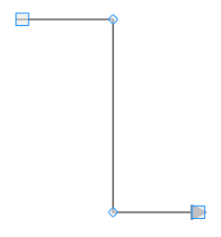
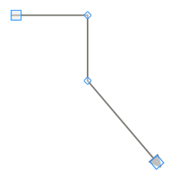
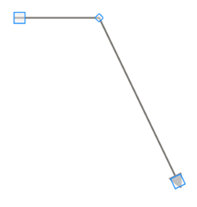

::: {style="DISPLAY: none"}
{#d2h_url_template}{#d2h_package_url style="WIDTH: 0px; DISPLAY: none; HEIGHT: 0px"}
:::

::: {.d2h_secondary_topic style="PADDING-BOTTOM: 10pt; MARGIN: 0pt; PADDING-LEFT: 0pt; PADDING-RIGHT: 0pt; PADDING-TOP: 0pt"}
##### Intermediate Points {#intermediate-points style="tab-stops: 0pt"}

Adding Intermediate Points

Intermediate points can be added in two ways:

[·    ]{style="FONT-FAMILY: Symbol"}Using CTRL + SHIFT keys

[·    ]{style="FONT-FAMILY: Symbol"}Through code behind

Intermediate points can be added at run time by holding CTRL + SHIFT and clicking on the line. Intermediate points can be added programmatically. The following code snippet illustrates the addition of intermediate lines.

+-----------------------------------------------------------------------------------------------------------------------------------------------------------------+
| **[Controller]{style="FONT-FAMILY: 'Courier New'"}**                                                                                                            |
|                                                                                                                                                                 |
|                                                                                                                                                                 |
|                                                                                                                                                                 |
| [            [LineConnector]{style="COLOR: #2b91af"} lc = [new]{style="COLOR: blue"} [LineConnector]{style="COLOR: #2b91af"}();]{style="FONT-FAMILY: Consolas"} |
|                                                                                                                                                                 |
| [            lc.ConnectorType = [ConnectorType]{style="COLOR: #2b91af"}.Straight;]{style="FONT-FAMILY: Consolas"}                                               |
|                                                                                                                                                                 |
| [            lc.StartPoint = [new]{style="COLOR: blue"} [DiagramPoint]{style="COLOR: #2b91af"}(100, 100);]{style="FONT-FAMILY: Consolas"}                       |
|                                                                                                                                                                 |
| [            lc.EndPoint = [new]{style="COLOR: blue"} [DiagramPoint]{style="COLOR: #2b91af"}(300, 300);]{style="FONT-FAMILY: Consolas"}                         |
|                                                                                                                                                                 |
| [            lc.IntermediatePoints.Add([new]{style="COLOR: blue"} [DiagramPoint]{style="COLOR: #2b91af"}(200, 100));]{style="FONT-FAMILY: Consolas"}            |
|                                                                                                                                                                 |
| [            lc.IntermediatePoints.Add([new]{style="COLOR: blue"} [DiagramPoint]{style="COLOR: #2b91af"}(200, 300));]{style="FONT-FAMILY: Consolas"}            |
+-----------------------------------------------------------------------------------------------------------------------------------------------------------------+

 

{border="0"}[]{style="FONT-FAMILY: 'Calibri','sans-serif'; FONT-SIZE: 11pt"}

Figure 67: Adding Intermediate Points

[]{style="FONT-FAMILY: 'Calibri','sans-serif'; FONT-SIZE: 11pt"} 

Modifying Intermediate Points

Intermediate points can be modified in two ways:

[·      ]{style="FONT-FAMILY: Symbol; FONT-SIZE: 10pt"}[Dragging the vertex]{style="FONT-FAMILY: 'Arial','sans-serif'; FONT-SIZE: 10pt"}

[·      ]{style="FONT-FAMILY: Symbol; FONT-SIZE: 10pt"}[Through code behind]{style="FONT-FAMILY: 'Arial','sans-serif'; FONT-SIZE: 10pt"}

Intermediate points can be modified at run time by clicking and dragging the vertex of the line connector. Intermediate points can be modified programmatically also. The following code snippet illustrates the modification of intermediate lines.

+-----------------------------------------------------------------------------------------------------------------------------------------------------------------+
| **[Controller]{style="FONT-FAMILY: 'Courier New'"}**                                                                                                            |
|                                                                                                                                                                 |
|                                                                                                                                                                 |
|                                                                                                                                                                 |
| [            [LineConnector]{style="COLOR: #2b91af"} lc = [new]{style="COLOR: blue"} [LineConnector]{style="COLOR: #2b91af"}();]{style="FONT-FAMILY: Consolas"} |
|                                                                                                                                                                 |
| [            lc.ConnectorType = [ConnectorType]{style="COLOR: #2b91af"}.Straight;]{style="FONT-FAMILY: Consolas"}                                               |
|                                                                                                                                                                 |
| [            lc.StartPoint = [new]{style="COLOR: blue"} [DiagramPoint]{style="COLOR: #2b91af"}(100, 100);]{style="FONT-FAMILY: Consolas"}                       |
|                                                                                                                                                                 |
| [            lc.EndPoint = [new]{style="COLOR: blue"} [DiagramPoint]{style="COLOR: #2b91af"}(300, 300);]{style="FONT-FAMILY: Consolas"}                         |
|                                                                                                                                                                 |
| [            lc.IntermediatePoints.Add([new]{style="COLOR: blue"} [DiagramPoint]{style="COLOR: #2b91af"}(200, 100));]{style="FONT-FAMILY: Consolas"}            |
|                                                                                                                                                                 |
| [            lc.IntermediatePoints.Add([new]{style="COLOR: blue"} [DiagramPoint]{style="COLOR: #2b91af"}(200, 300));]{style="FONT-FAMILY: Consolas"}            |
|                                                                                                                                                                 |
| [            lc.IntermediatePoints\[1\] = [new]{style="COLOR: blue"} [DiagramPoint]{style="COLOR: #2b91af"}(200, 200);]{style="FONT-FAMILY: Consolas"}          |
+-----------------------------------------------------------------------------------------------------------------------------------------------------------------+

[]{style="FONT-FAMILY: 'Calibri','sans-serif'; FONT-SIZE: 11pt"} 

{border="0"}[]{style="FONT-FAMILY: 'Calibri','sans-serif'; FONT-SIZE: 11pt"}

Figure 68: Modifying Intermediate Points

[]{style="FONT-FAMILY: 'Calibri','sans-serif'; FONT-SIZE: 11pt"} 

Delete Intermediate Points

Intermediate points can be deleted in two ways:

[·      ]{style="FONT-FAMILY: Symbol; FONT-SIZE: 10pt"}[Using CTRL + SHIFT keys]{style="FONT-FAMILY: 'Arial','sans-serif'; FONT-SIZE: 10pt"}

[·      ]{style="FONT-FAMILY: Symbol; FONT-SIZE: 10pt"}[Through code behind]{style="FONT-FAMILY: 'Arial','sans-serif'; FONT-SIZE: 10pt"}

Intermediate points can be deleted by holding CTRL + SHIFT and clicking on the vertex that represents the intermediate point to be deleted. Intermediate points can be deleted programmatically also. The following code snippet illustrates deletion of intermediate lines.

+-----------------------------------------------------------------------------------------------------------------------------------------------------------------+
| **[Controller]{style="FONT-FAMILY: 'Courier New'"}**                                                                                                            |
|                                                                                                                                                                 |
|                                                                                                                                                                 |
|                                                                                                                                                                 |
| [            [LineConnector]{style="COLOR: #2b91af"} lc = [new]{style="COLOR: blue"} [LineConnector]{style="COLOR: #2b91af"}();]{style="FONT-FAMILY: Consolas"} |
|                                                                                                                                                                 |
| [            lc.ConnectorType = [ConnectorType]{style="COLOR: #2b91af"}.Straight;]{style="FONT-FAMILY: Consolas"}                                               |
|                                                                                                                                                                 |
| [            lc.StartPoint = [new]{style="COLOR: blue"} [DiagramPoint]{style="COLOR: #2b91af"}(100, 100);]{style="FONT-FAMILY: Consolas"}                       |
|                                                                                                                                                                 |
| [            lc.EndPoint = [new]{style="COLOR: blue"} [DiagramPoint]{style="COLOR: #2b91af"}(300, 300);]{style="FONT-FAMILY: Consolas"}                         |
|                                                                                                                                                                 |
| [            lc.IntermediatePoints.Add([new]{style="COLOR: blue"} [DiagramPoint]{style="COLOR: #2b91af"}(200, 100));]{style="FONT-FAMILY: Consolas"}            |
|                                                                                                                                                                 |
| [            lc.IntermediatePoints.Add([new]{style="COLOR: blue"} [DiagramPoint]{style="COLOR: #2b91af"}(200, 300));]{style="FONT-FAMILY: Consolas"}            |
|                                                                                                                                                                 |
| [            lc.IntermediatePoints.RemoveAt(1);]{style="FONT-FAMILY: Consolas"}                                                                                 |
+-----------------------------------------------------------------------------------------------------------------------------------------------------------------+

 

{border="0"}

Figure 69: Deleting Intermediate Points

 

 

[]{#related-topics}
:::
