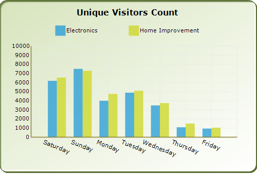

::: {style="DISPLAY: none"}
{#d2h_url_template}{#d2h_package_url style="WIDTH: 0px; DISPLAY: none; HEIGHT: 0px"}
:::

:::: {.d2h_secondary_topic style="PADDING-BOTTOM: 10pt; MARGIN: 0pt; PADDING-LEFT: 0pt; PADDING-RIGHT: 0pt; PADDING-TOP: 0pt"}
#### Intersecting Labels {#intersecting-labels style="tab-stops: 0pt"}

**[]{style="FONT-FAMILY: 'Trebuchet MS','sans-serif'"}** 

Sometimes the chart dimensions could cause the labels to intersect. The chart will, by default, render those texts one over the other. But, it also has some built-in capabilities to workaround this overlap and lets you dictate the technique to follow. Refer to the properties below.

[]{style="FONT-FAMILY: 'Trebuchet MS','sans-serif'; FONT-SIZE: 9pt"} 

::: {align="center"}
+-----------------------------------+-----------------------------------------------------------------------------------------------------------------------------------------------------------------------------------------------------------------------------+
| ChartAxis Properties              | Description                                                                                                                                                                                                                 |
+-----------------------------------+-----------------------------------------------------------------------------------------------------------------------------------------------------------------------------------------------------------------------------+
| LabelIntersectAction              | Specifies the action to take when labels texts intersect.                                                                                                                                                                   |
|                                   |                                                                                                                                                                                                                             |
|                                   | **MultipleRows** - Will render the labels in multiple rows.                                                                                                                                                                 |
|                                   |                                                                                                                                                                                                                             |
|                                   | **None** - Do nothing (default value)                                                                                                                                                                                       |
|                                   |                                                                                                                                                                                                                             |
|                                   | **Rotate** - Rotates text so as to avoid overlap                                                                                                                                                                            |
|                                   |                                                                                                                                                                                                                             |
|                                   | **Wrap** - wraps text.                                                                                                                                                                                                      |
+-----------------------------------+-----------------------------------------------------------------------------------------------------------------------------------------------------------------------------------------------------------------------------+
| EdgeLabelsDrawingMode             | Affects the labels that get rendered at the edges of the axis. Possible values:                                                                                                                                             |
|                                   |                                                                                                                                                                                                                             |
|                                   | Center - Centers the label at the interval. Default setting.                                                                                                                                                                |
|                                   |                                                                                                                                                                                                                             |
|                                   | Shift - Shifts the labels so that it\'s within the interval boundaries                                                                                                                                                      |
|                                   |                                                                                                                                                                                                                             |
|                                   | ClippingProtection - Uses some intelligent logic to avoid clipping.                                                                                                                                                         |
+-----------------------------------+-----------------------------------------------------------------------------------------------------------------------------------------------------------------------------------------------------------------------------+
| HidePartialLabels                 | When this property is set to true and when label overlap occurs, the chart will selectively hide certain labels (usually the min and max labels to begin with) to keep the rest of labels readable. Default value is false. |
+-----------------------------------+-----------------------------------------------------------------------------------------------------------------------------------------------------------------------------------------------------------------------------+
:::

[]{style="FONT-FAMILY: 'Trebuchet MS','sans-serif'; FONT-SIZE: 9pt"} 

+-------------------------------------------------------------------------------------------------------------------------------------------------------------------------------------------------------------+
| **[\[C#\]]{style="FONT-FAMILY: 'Courier New'; COLOR: black"}**                                                                                                                                              |
|                                                                                                                                                                                                             |
| **[]{style="FONT-FAMILY: 'Courier New'; COLOR: black"}**                                                                                                                                                    |
|                                                                                                                                                                                                             |
| [this]{style="FONT-FAMILY: 'Courier New'; COLOR: blue"}[.ChartWebControl1.PrimaryXAxis.HidePartialLabels = [true]{style="COLOR: blue"};]{style="FONT-FAMILY: 'Courier New'"}                                |
|                                                                                                                                                                                                             |
| [this]{style="FONT-FAMILY: 'Courier New'; COLOR: blue"}[.ChartWebControl1.PrimaryXAxis.LabelIntersectAction = [ChartLabelIntersectAction]{style="COLOR: teal"}.Rotate;]{style="FONT-FAMILY: 'Courier New'"} |
+-------------------------------------------------------------------------------------------------------------------------------------------------------------------------------------------------------------+

[]{style="FONT-FAMILY: 'Trebuchet MS','sans-serif'; FONT-SIZE: 9pt"} 

+----------------------------------------------------------------------------------------------------------------------------------------------------------------------------------------------------------+
| **[\[VB\]]{style="FONT-FAMILY: 'Courier New'"}**                                                                                                                                                         |
|                                                                                                                                                                                                          |
| **[]{style="FONT-FAMILY: 'Courier New'"}**                                                                                                                                                               |
|                                                                                                                                                                                                          |
| [Me]{style="FONT-FAMILY: 'Courier New'; COLOR: blue"}[.ChartWebControl1.PrimaryXAxis.HidePartialLabels = [True]{style="COLOR: blue"}]{style="FONT-FAMILY: 'Courier New'"}                                |
|                                                                                                                                                                                                          |
| [Me]{style="FONT-FAMILY: 'Courier New'; COLOR: blue"}[.ChartWebControl1.PrimaryXAxis.LabelIntersectAction = [ChartLabelIntersectAction]{style="COLOR: teal"}.Rotate]{style="FONT-FAMILY: 'Courier New'"} |
+----------------------------------------------------------------------------------------------------------------------------------------------------------------------------------------------------------+

[]{style="FONT-FAMILY: 'Trebuchet MS','sans-serif'; FONT-SIZE: 9pt"} 

 

{border="0"}**[]{style="FONT-FAMILY: 'Trebuchet MS','sans-serif'; FONT-SIZE: 9pt"}**

Figure 255: Intersecting Labels

 

 

[]{#p186} 

[]{#related-topics}
::::
