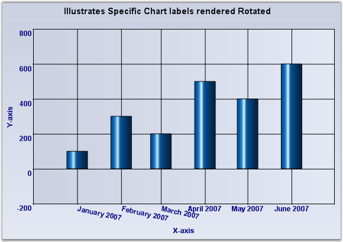

::: {style="DISPLAY: none"}
{#d2h_url_template}{#d2h_package_url style="WIDTH: 0px; DISPLAY: none; HEIGHT: 0px"}
:::

:::: {.d2h_secondary_topic style="PADDING-BOTTOM: 10pt; MARGIN: 0pt; PADDING-LEFT: 0pt; PADDING-RIGHT: 0pt; PADDING-TOP: 0pt"}
#### Intersecting Labels {#intersecting-labels style="tab-stops: 0pt"}

Sometimes the chart dimensions could cause the labels to intersect. The chart will, by default, render the texts one over the other. But, it also has some built-in capabilities to workaround this overlap and allows you to dictate the technique to follow. Refer to the properties displayed below:

 

::: {align="center"}
+-----------------------------------+-----------------------------------------------------------------------------------------------------------------------------------------------------------------------------------------------------------------------------------------+
| ChartAxis Property                | Description                                                                                                                                                                                                                             |
+-----------------------------------+-----------------------------------------------------------------------------------------------------------------------------------------------------------------------------------------------------------------------------------------+
| LabelIntersectAction              | Specifies the action to take when the labels text intersect.                                                                                                                                                                            |
|                                   |                                                                                                                                                                                                                                         |
|                                   | **MultipleRows** - Will render the labels in multiple rows.                                                                                                                                                                             |
|                                   |                                                                                                                                                                                                                                         |
|                                   | **None** - Do nothing. This is the default value.                                                                                                                                                                                       |
|                                   |                                                                                                                                                                                                                                         |
|                                   | **Rotate** - Rotates the text to avoid overlap.                                                                                                                                                                                         |
|                                   |                                                                                                                                                                                                                                         |
|                                   | **Wrap** - Wraps the text.                                                                                                                                                                                                              |
+-----------------------------------+-----------------------------------------------------------------------------------------------------------------------------------------------------------------------------------------------------------------------------------------+
| LabelIntersectActionEffect        | Specifies if the LabelIntersectAction should be applied on all the labels (for consistency) or just the affected labels.                                                                                                                |
|                                   |                                                                                                                                                                                                                                         |
|                                   | **All** - Apply on all the labels. This is the default value.                                                                                                                                                                           |
|                                   |                                                                                                                                                                                                                                         |
|                                   | **Specific** - Apply only on the affected labels.                                                                                                                                                                                       |
+-----------------------------------+-----------------------------------------------------------------------------------------------------------------------------------------------------------------------------------------------------------------------------------------+
| EdgeLabelsDrawingMode             | Affects the labels that get rendered at the edges of the axis. The possible values are the following:                                                                                                                                   |
|                                   |                                                                                                                                                                                                                                         |
|                                   | **Center** - Centers the label at the interval. This is the default setting.                                                                                                                                                            |
|                                   |                                                                                                                                                                                                                                         |
|                                   | **Shift** - Shifts the labels so that it\'s within the interval boundaries.                                                                                                                                                             |
|                                   |                                                                                                                                                                                                                                         |
|                                   | **ClippingProtection** - Uses some intelligent logic to avoid clipping.                                                                                                                                                                 |
+-----------------------------------+-----------------------------------------------------------------------------------------------------------------------------------------------------------------------------------------------------------------------------------------+
| HidePartialLabels                 | When this property is set to true and when the label overlap occurs, the chart will selectively hide certain labels (usually the min and max labels to begin with) to keep the rest of the labels readable. The default value is false. |
+-----------------------------------+-----------------------------------------------------------------------------------------------------------------------------------------------------------------------------------------------------------------------------------------+
:::

[]{style="FONT-FAMILY: 'Times New Roman','serif'; FONT-SIZE: 12pt"} 

{border="0"}

Figure 275: Intersecting labels

[]{#related-topics}
::::
