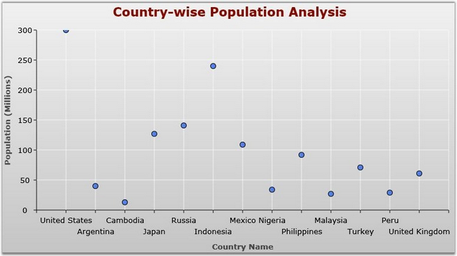
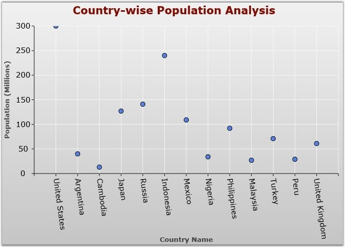
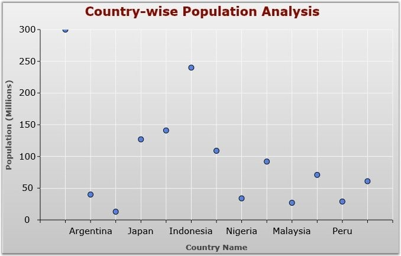
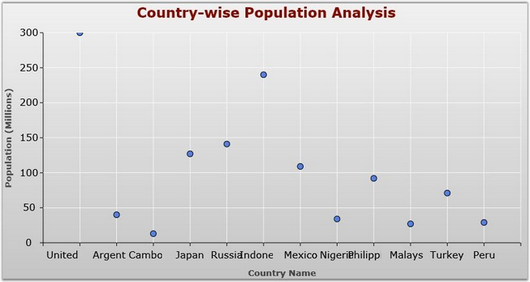

::: {style="DISPLAY: none"}
{#d2h_url_template}{#d2h_package_url style="WIDTH: 0px; DISPLAY: none; HEIGHT: 0px"}
:::

:::: {.d2h_secondary_topic style="PADDING-BOTTOM: 10pt; MARGIN: 0pt; PADDING-LEFT: 0pt; PADDING-RIGHT: 0pt; PADDING-TOP: 0pt"}
##### Intersecting Labels {#intersecting-labels style="tab-stops: 0pt"}

[]{#p93}[]{style="COLOR: #15428b"} 

Chart Axis labels may intersect with one another due to the chart dimensions. The charts will, by default render those texts one over the other. The IntersectAction property has some set of actions to avoid this overlapping between axis labels. This also helps to improve the readability. 

 

The ChartLabelIntersectAction type has the five intersect actions such as MultipleRows, Rotate, Hide, Wrap and None. The below table describes the usage of those actions to avoid the overlapping between labels.

 

::: {align="center"}
  ----------------- ---------------------------------------------------------------------
  IntersectAction   Usage
  MultipleRows      Wrap the chart label content to multiple rows to avoid the overlap.
  Rotate            Rotate the axis label on the specific angle to avoid intersection.
  Hide              Hide the axis label to avoid intersection.
  Wrap              Wrap the contents into small portions to avoid intersection.
  None              No action. Axis labels will intersect if this option is set.
  ----------------- ---------------------------------------------------------------------
:::

 

The following are the part of XAML and CS code to set the IntersectAction property.

[]{style="COLOR: #15428b"} 

+-----------------------------------------------------------------------------------------------------------------------------------------------------------------------------------------------------------------------------------------------------------------------------------------------------------------------------------------------------------------------------------------------------------------------------------------------------------------------------------------------------------------------------------------+
| [\[XAML\]]{style="FONT-FAMILY: 'Courier New'"}                                                                                                                                                                                                                                                                                                                                                                                                                                                                                          |
|                                                                                                                                                                                                                                                                                                                                                                                                                                                                                                                                         |
| **[]{style="FONT-FAMILY: 'Courier New'"}**                                                                                                                                                                                                                                                                                                                                                                                                                                                                                              |
|                                                                                                                                                                                                                                                                                                                                                                                                                                                                                                                                         |
| [\<]{style="FONT-FAMILY: 'Courier New'; COLOR: blue"}[syncfusion:ChartArea.PrimaryAxis]{style="FONT-FAMILY: 'Courier New'; COLOR: #a31515"}[\>]{style="FONT-FAMILY: 'Courier New'; COLOR: blue"}                                                                                                                                                                                                                                                                                                                                        |
|                                                                                                                                                                                                                                                                                                                                                                                                                                                                                                                                         |
| [     \<]{style="FONT-FAMILY: 'Courier New'; COLOR: blue"}[syncfusion:ChartAxis]{style="FONT-FAMILY: 'Courier New'; COLOR: #a31515"}[ ]{style="FONT-FAMILY: 'Courier New'; COLOR: blue"}[IntersectAction]{style="FONT-FAMILY: 'Courier New'; COLOR: red"}[=]{style="FONT-FAMILY: 'Courier New'; COLOR: blue"}[\"[MultipleRows]{style="COLOR: blue"}\"[ ]{style="COLOR: blue"}[Header]{style="COLOR: red"}[=]{style="COLOR: blue"}\"[Country Name]{style="COLOR: blue"}\"[/\>]{style="COLOR: blue"}]{style="FONT-FAMILY: 'Courier New'"} |
|                                                                                                                                                                                                                                                                                                                                                                                                                                                                                                                                         |
| [ \</]{style="FONT-FAMILY: 'Courier New'; COLOR: blue"}[syncfusion:ChartArea.PrimaryAxis]{style="FONT-FAMILY: 'Courier New'; COLOR: #a31515"}[\>]{style="FONT-FAMILY: 'Courier New'; COLOR: blue"}                                                                                                                                                                                                                                                                                                                                      |
+-----------------------------------------------------------------------------------------------------------------------------------------------------------------------------------------------------------------------------------------------------------------------------------------------------------------------------------------------------------------------------------------------------------------------------------------------------------------------------------------------------------------------------------------+

[]{style="COLOR: #15428b"} 

+--------------------------------------------------------------------------------------------------------------------------------------------------------------------------+
| [\[C#\]]{style="FONT-FAMILY: 'Courier New'"}                                                                                                                             |
|                                                                                                                                                                          |
| []{style="FONT-FAMILY: 'Courier New'"}                                                                                                                                   |
|                                                                                                                                                                          |
| [ChartArea]{style="FONT-FAMILY: 'Courier New'; COLOR: teal"}[ area = [new]{style="COLOR: blue"} [ChartArea]{style="COLOR: teal"}();]{style="FONT-FAMILY: 'Courier New'"} |
|                                                                                                                                                                          |
| [ChartAxis]{style="FONT-FAMILY: 'Courier New'; COLOR: teal"}[ axis = [new]{style="COLOR: blue"} [ChartAxis]{style="COLOR: teal"}();]{style="FONT-FAMILY: 'Courier New'"} |
|                                                                                                                                                                          |
| [axis.Header = [\"Country Name\"]{style="COLOR: #a31515"};]{style="FONT-FAMILY: 'Courier New'"}                                                                          |
|                                                                                                                                                                          |
| [axis.IntersectAction = ChartLabelIntersectAction.MultipleRows;]{style="FONT-FAMILY: 'Courier New'"}                                                                     |
|                                                                                                                                                                          |
| [area.PrimaryAxis = axis]{style="FONT-FAMILY: 'Courier New'"}[;]{style="FONT-FAMILY: 'Courier New'"}                                                                     |
+--------------------------------------------------------------------------------------------------------------------------------------------------------------------------+

[]{style="COLOR: #15428b"} 

The following images as the result of various options in IntersectAction property

[]{style="COLOR: #15428b"} 

{border="0"}

Figure 91: IntersectAction = \"MultipleRows\"

**[]{style="COLOR: #15428b"}** 

{border="0"}

Figure 92: IntersectAction = \"Rotate\"

**[]{style="COLOR: #15428b"}** 

{border="0"}

Figure 93: IntersectAction = \"Hide\"

**[]{style="COLOR: #15428b"}** 

{border="0"}

Figure 94: IntersectAction = \"Wrap\"

 

[]{#p94} 

[]{#related-topics}
::::
