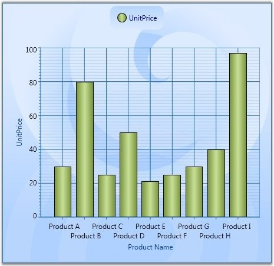
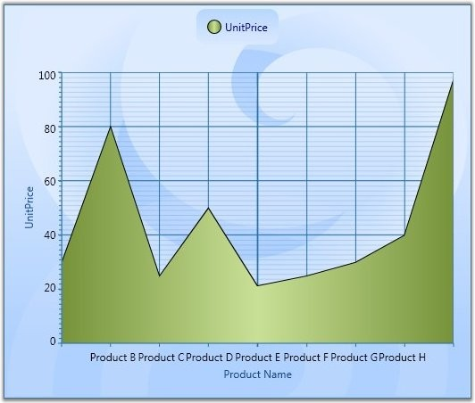
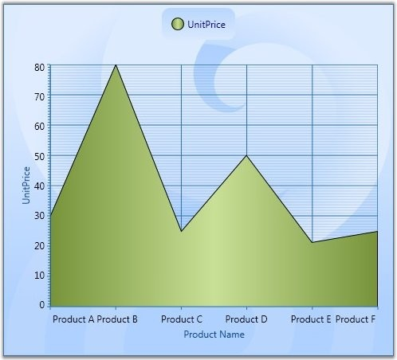

::: {style="DISPLAY: none"}
{#d2h_url_template}{#d2h_package_url style="WIDTH: 0px; DISPLAY: none; HEIGHT: 0px"}
:::

:::: {.d2h_secondary_topic style="PADDING-BOTTOM: 10pt; MARGIN: 0pt; PADDING-LEFT: 0pt; PADDING-RIGHT: 0pt; PADDING-TOP: 0pt"}
##### Intersecting Labels {#intersecting-labels style="tab-stops: 0pt"}

Sometimes the chart dimensions could cause the labels to intersect. The chart will, by default, render those texts one over the other. But, it also has some built-in capabilities to work around this overlap and lets you dictate the technique to follow. Refer to the properties below.

[]{style="FONT-FAMILY: 'Trebuchet MS','sans-serif'; COLOR: #15428b; FONT-SIZE: 9pt"} 

Table 144: ChartAxis Property

::: {align="center"}
+-----------------------------------+------------------------------------------------------------------------------------------------------------------------------+
| ChartAxis Property                | Description                                                                                                                  |
+-----------------------------------+------------------------------------------------------------------------------------------------------------------------------+
| IntersectAction                   | *Hide* -- labels are hidden to avoid intersection                                                                            |
|                                   |                                                                                                                              |
|                                   | *MultipleRows* -- labels are wrapped into multiple rows to avoid intersection                                                |
|                                   |                                                                                                                              |
|                                   | *None* -- no special action                                                                                                  |
|                                   |                                                                                                                              |
|                                   | Labels may intersect                                                                                                         |
|                                   |                                                                                                                              |
|                                   | *Rotate* -- labels are rotated to avoid intersection                                                                         |
|                                   |                                                                                                                              |
|                                   | *Wrap* -- labels are wrapped to avoid intersection                                                                           |
+-----------------------------------+------------------------------------------------------------------------------------------------------------------------------+
| HidePartialLabel                  | *True* -- hides the labels that appear partially                                                                             |
|                                   |                                                                                                                              |
|                                   | Usually the labels in the edges will be affected.                                                                            |
|                                   |                                                                                                                              |
|                                   | *False* - labels are drawn as such                                                                                           |
|                                   |                                                                                                                              |
|                                   | No action will be taken.                                                                                                     |
+-----------------------------------+------------------------------------------------------------------------------------------------------------------------------+
| EdgeLabelsDrawingMode             | *Center* -- draws the edge labels at the center of the GridLines                                                             |
|                                   |                                                                                                                              |
|                                   | *Shift* -- value indicating that edge label should be shifted to either left or right so that it comes within the Chart Area |
+-----------------------------------+------------------------------------------------------------------------------------------------------------------------------+
:::

[]{style="FONT-FAMILY: 'Trebuchet MS','sans-serif'; COLOR: #15428b"} 

+-------------------------------------------------------------------------------------------------------------------------------+
| **[\[C#\]]{style="FONT-FAMILY: 'Courier New'"}**                                                                              |
|                                                                                                                               |
| []{style="FONT-FAMILY: 'Courier New'"}                                                                                        |
|                                                                                                                               |
| [Chart1.Areas\[0\].PrimaryAxis.IntersectAction = ChartLabelIntersectAction.MultipleRows;]{style="FONT-FAMILY: 'Courier New'"} |
|                                                                                                                               |
| [Chart1.Areas\[0\].PrimaryAxis.HidePartialLabel = [true]{style="COLOR: blue"};]{style="FONT-FAMILY: 'Courier New'"}           |
|                                                                                                                               |
| [Chart1.Areas\[0\].PrimaryAxis.EdgeLabelsDrawingMode = EdgeLabelsDrawingMode.Shift;]{style="FONT-FAMILY: 'Courier New'"}      |
+-------------------------------------------------------------------------------------------------------------------------------+

[]{style="FONT-FAMILY: 'Trebuchet MS','sans-serif'; COLOR: #15428b"} 

+---------------------------------------------------------------------------------------------------------------------------------------------------------------------------------------------------------------------------------------------------------------------------------------------------------------------------------------------------------------------------------------------------------------------------------------------------------------------------------------------------------------------------------------------------------------------------------------------------------------------------------------------------------------------------------------------------------------------------------------------------------------------------------------+
| **[\[XAML\]]{style="FONT-FAMILY: 'Courier New'"}**                                                                                                                                                                                                                                                                                                                                                                                                                                                                                                                                                                                                                                                                                                                                    |
|                                                                                                                                                                                                                                                                                                                                                                                                                                                                                                                                                                                                                                                                                                                                                                                       |
| []{style="FONT-FAMILY: 'Courier New'"}                                                                                                                                                                                                                                                                                                                                                                                                                                                                                                                                                                                                                                                                                                                                                |
|                                                                                                                                                                                                                                                                                                                                                                                                                                                                                                                                                                                                                                                                                                                                                                                       |
| [\<]{style="FONT-FAMILY: 'Courier New'; COLOR: blue"}[syncfusion:ChartArea.PrimaryAxis]{style="FONT-FAMILY: 'Courier New'; COLOR: #a31515"}[\>]{style="FONT-FAMILY: 'Courier New'; COLOR: blue"}                                                                                                                                                                                                                                                                                                                                                                                                                                                                                                                                                                                      |
|                                                                                                                                                                                                                                                                                                                                                                                                                                                                                                                                                                                                                                                                                                                                                                                       |
| [\<]{style="FONT-FAMILY: 'Courier New'; COLOR: blue"}[syncfusion:ChartAxis]{style="FONT-FAMILY: 'Courier New'; COLOR: #a31515"}[ ]{style="FONT-FAMILY: 'Courier New'; COLOR: blue"}[Header]{style="FONT-FAMILY: 'Courier New'; COLOR: red"}[=]{style="FONT-FAMILY: 'Courier New'; COLOR: blue"}[\"[Product Name]{style="COLOR: blue"}\"[  ]{style="COLOR: blue"}[IntersectAction]{style="COLOR: red"}[=]{style="COLOR: blue"}\"[MultipleRows]{style="COLOR: blue"}\"[ ]{style="COLOR: blue"}[HidePartialLabel]{style="COLOR: red"}[=]{style="COLOR: blue"}\"[True]{style="COLOR: blue"}\"[ ]{style="COLOR: blue"}[EdgeLabelsDrawingMode]{style="COLOR: red"}[=]{style="COLOR: blue"}\"[Shift]{style="COLOR: blue"}\"[  /\>]{style="COLOR: blue"}]{style="FONT-FAMILY: 'Courier New'"} |
|                                                                                                                                                                                                                                                                                                                                                                                                                                                                                                                                                                                                                                                                                                                                                                                       |
| [\</]{style="FONT-FAMILY: 'Courier New'; COLOR: blue"}[syncfusion:ChartArea.PrimaryAxis]{style="FONT-FAMILY: 'Courier New'; COLOR: #a31515"}[\>]{style="FONT-FAMILY: 'Courier New'; COLOR: blue"}                                                                                                                                                                                                                                                                                                                                                                                                                                                                                                                                                                                     |
+---------------------------------------------------------------------------------------------------------------------------------------------------------------------------------------------------------------------------------------------------------------------------------------------------------------------------------------------------------------------------------------------------------------------------------------------------------------------------------------------------------------------------------------------------------------------------------------------------------------------------------------------------------------------------------------------------------------------------------------------------------------------------------------+

 

Below given screenshot illustrates various techniques for avoiding the Label intersection.

 

{border="0"}

Figure 212: IntersectAction = \"MultipleRows\"

[]{style="FONT-FAMILY: 'Trebuchet MS','sans-serif'; COLOR: #15428b; FONT-SIZE: 9pt"} 

{border="0"}

Figure 213: HidePartialLabel = \"True\"

[]{style="FONT-FAMILY: 'Trebuchet MS','sans-serif'; COLOR: #15428b; FONT-SIZE: 9pt"} 

{border="0"}

Figure 214: EdgeLabelsDrawingMode = \"Shift\"

[]{style="FONT-FAMILY: 'Trebuchet MS','sans-serif'; COLOR: #15428b; FONT-SIZE: 9pt"} 

See Also

[[Axis Label Rotate]{.UGHyperlink}](ms-xhelp:///?Id=3e15d284-e006-429f-9d73-fc5793f6a033)[,]{.UGHyperlink}[ ]{style="FONT-FAMILY: 'Trebuchet MS','sans-serif'; COLOR: #15428b; FONT-SIZE: 9pt"}[[Chart Font Settings]{.UGHyperlink}](ms-xhelp:///?Id=6ba27249-bfb3-42fd-912d-18988d20491f)[,]{.UGHyperlink}[ ]{style="FONT-FAMILY: 'Trebuchet MS','sans-serif'; COLOR: #15428b; FONT-SIZE: 9pt"}[[Chart Axis Label]{.UGHyperlink}](ms-xhelp:///?Id=48ebfdae-67dc-4fce-a339-96b687590276)[,]{.UGHyperlink}[ ]{style="FONT-FAMILY: 'Trebuchet MS','sans-serif'; COLOR: #15428b; FONT-SIZE: 9pt"}

[]{style="FONT-FAMILY: 'Trebuchet MS','sans-serif'; COLOR: #15428b; FONT-SIZE: 9pt"} 

[]{#related-topics}
::::
