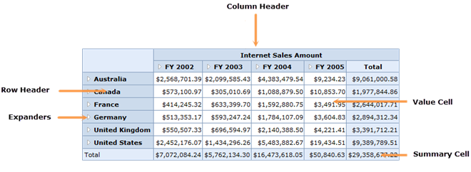

::: {style="DISPLAY: none"}
{#d2h_url_template}{#d2h_package_url style="WIDTH: 0px; DISPLAY: none; HEIGHT: 0px"}
:::

::::: {#nsbanner .d2h_main_nsbanner style="BORDER-BOTTOM: #999999 1px solid; POSITION: relative; PADDING-BOTTOM: 0px; BACKGROUND-COLOR: transparent; PADDING-LEFT: 0px; PADDING-RIGHT: 0px; DISPLAY: none; BORDER-TOP: #999999 1px solid; PADDING-TOP: 0px; LEFT: 0px"}
:::: {#TitleRow .d2h_main_titlerow style="PADDING-BOTTOM: 4px; BACKGROUND-COLOR: transparent; PADDING-LEFT: 22px; WIDTH: 100%; PADDING-RIGHT: 10px; DISPLAY: none; PADDING-TOP: 4px"}
::: {#ienav .d2h_main_ienav style="DISPLAY: none"}
{#D2HPrevious .D2HPreviousEnabled}  {#D2HNext .D2HNextEnabled}
:::
::::
:::::

:::: {#nstext .d2h_main_nstext style="PADDING-BOTTOM: 10px; BACKGROUND-COLOR: transparent; PADDING-LEFT: 22px; PADDING-RIGHT: 10px; HEIGHT: 100%; OVERFLOW: auto; PADDING-TOP: 5px" hasuserbackground="true" valign="bottom"}
## Introduction to Essential BI Grid for the Web[]{style="FONT-WEIGHT: normal"} {#introduction-to-essential-bi-grid-for-the-web style="tab-stops: 0pt"}

The OlapGrid control is a tool which is used to represent multidimensional data.

The main functionality of the OLAP grid is as follows:

[·      ]{style="FONT-FAMILY: Symbol"}Summarizes a large amount of information and represents it in a cross-tabulated form.

[·      ]{style="FONT-FAMILY: Symbol"}Automatically displays the retrieved OLAP data by data binding to an OlapDataManager.

[·      ]{style="FONT-FAMILY: Symbol"}Renders the results of an OLAP query in a cross-tabulated UI.

[·      ]{style="FONT-FAMILY: Symbol"}Provides drill-down and drill-up functionality.

 

Figure 1: OlapGrid Control

Key Features

The important features of the OlapGrid control are as follows:

[·      ]{style="FONT-FAMILY: Symbol"}[[Drill Up/Down]{.UGHyperlink}](ms-xhelp:///?Id=50d00010-5da2-4983-af07-95d85eb0d4df)---Provides multi-level drill-up/down capability for both column and row headers.

[·      ]{style="FONT-FAMILY: Symbol"}[[Layouts]{.UGHyperlink}](ms-xhelp:///?Id=4f8f3829-61cb-4d1c-99e7-f2ec789e0c2d)---Supports different grid layouts (normal layout, Excel-like layout, Excel-like layout with member properties, normal top summary, and no summaries layout).

[·      ]{style="FONT-FAMILY: Symbol"}[[Relational Data Binding]{.UGHyperlink}](ms-xhelp:///?Id=e0591325-6508-4065-a711-d1e66a9a980d)---Supports binding IList and DataTable-type data sources.

[·      ]{style="FONT-FAMILY: Symbol"}[[Conditional Formatting]{.UGHyperlink}](ms-xhelp:///?Id=c2a87032-02c2-4eb2-86c4-96ac668d0412)---Conditionally format grid cells.

[·      ]{style="FONT-FAMILY: Symbol"}[[Export]{.UGHyperlink}](ms-xhelp:///?Id=c2a87032-02c2-4eb2-86c4-96ac668d0412)---Export the grid to Excel, PDF, and Word formats.

[]{style="COLOR: black"} 

User Guide Organization

[]{#_Introduction_to_Essential}The product comes with numerous samples as well as an extensive documentation to guide you. This user guide provides detailed information on the features and functionalities of the OlapGrid control. It is organized into the following sections:

[·      ]{style="FONT-FAMILY: Symbol"}Overview---This section gives a brief introduction to our product and its key features.

[·      ]{style="FONT-FAMILY: Symbol"}Deployment---This section elaborates on the install location of the samples, license, and so on.

[·      ]{style="FONT-FAMILY: Symbol"}Getting Started---This section guides you on getting started with BI applications, the OlapGrid control, and so on.

[·      ]{style="FONT-FAMILY: Symbol; COLOR: #002060"}Concepts and Features---The features of OlapGrid control are illustrated with use case scenarios, code examples, and screenshots.[]{style="COLOR: #002060"}

 

Document Conventions

The following conventions will help you to quickly identify the important sections of information while using the content.

Table 1: Document Conventions

::: {align="center"}
  ------------------------ ------------------------------------------------------------------ ---------------------------------------------------------------------------
  Convention               Icon                                                               Description
  Note                     {border="0"}***Note:***                Represents important information
  Example                  **Example**                                                        Represents an example
  Tip                      {border="0"}           Represents useful hints that will help you in using the controls/features
  Additional Information   {border="0"}   Represents additional information on the topic
  ------------------------ ------------------------------------------------------------------ ---------------------------------------------------------------------------
:::

[]{#related-topics}
::::
