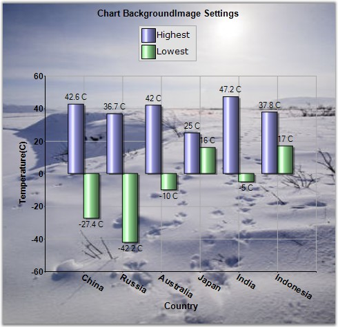

::: {style="DISPLAY: none"}
{#d2h_url_template}{#d2h_package_url style="WIDTH: 0px; DISPLAY: none; HEIGHT: 0px"}
:::

::::: {#nsbanner .d2h_main_nsbanner style="BORDER-BOTTOM: #999999 1px solid; POSITION: relative; PADDING-BOTTOM: 0px; BACKGROUND-COLOR: transparent; PADDING-LEFT: 0px; PADDING-RIGHT: 0px; DISPLAY: none; BORDER-TOP: #999999 1px solid; PADDING-TOP: 0px; LEFT: 0px"}
:::: {#TitleRow .d2h_main_titlerow style="PADDING-BOTTOM: 4px; BACKGROUND-COLOR: transparent; PADDING-LEFT: 22px; WIDTH: 100%; PADDING-RIGHT: 10px; DISPLAY: none; PADDING-TOP: 4px"}
::: {#ienav .d2h_main_ienav style="DISPLAY: none"}
{#D2HPrevious .D2HPreviousEnabled}  {#D2HNext .D2HNextEnabled}
:::
::::
:::::

::::: {#nstext .d2h_main_nstext style="PADDING-BOTTOM: 10px; BACKGROUND-COLOR: transparent; PADDING-LEFT: 22px; PADDING-RIGHT: 10px; HEIGHT: 100%; OVERFLOW: auto; PADDING-TOP: 5px" hasuserbackground="true" valign="bottom"}
::: {#d2h_breadcrumbs .d2h_breadcrumbs}
[Essential Studio User Guide Documentation](ms-xhelp:///?Id=12457748-09e3-4d74-a240-8e049cedf030){.d2h_breadcrumbsNormal}[ \> ]{.d2h_breadcrumbsLinkSeparator}[User Interface Edition](ms-xhelp:///?Id=c29296b7-531c-413b-a0ec-488ca1f7f669){.d2h_breadcrumbsNormal}[ \> ]{.d2h_breadcrumbsLinkSeparator}[Essential Windows](ms-xhelp:///?Id=e60759d8-47a4-4570-9d7a-16a68d63f2ea){.d2h_breadcrumbsNormal}[ \> ]{.d2h_breadcrumbsLinkSeparator}[Essential Chart]{.d2h_breadcrumbsContentsOnly}[ \> ]{.d2h_breadcrumbsLinkSeparator}[Overview](ms-xhelp:///?Id=704594f1-d608-4379-b594-f9cf77439c3a){.d2h_breadcrumbsNormal}
:::

## Introduction to Essential Chart {#introduction-to-essential-chart style="tab-stops: 0pt"}

 

Essential Chart is an easily configurable, presentation quality business chart control. A unique point based Styles Architecture, easily extendable Data Model, easily extendable rendering model, native Date Handling and a unique Shared Data Model are the features that distinguish Essential chart. This control has been created using C#, which means that it is a fully-managed .NET component, and  has been specifically designed for use with Microsoft\'s Visual Studio .NET.

 

Essential Chart for Windows Forms is a perfect solution for developers looking to add advanced, feature rich, visually appealing charts to their Windows Forms applications. The product comes with numerous samples as well as an extensive documentation to guide you every step of the way.

 

Chart is used as a means to show the graphical representation of two values. For Example, a Line Chart can be used in health Statistic reports, in which it can show the rates over time or for a series of values, such as age-specific death rates. Logarithmic charts can be used in Share price charts where we plot between price and time. In logarithmic chart, we can identify the \'Proportional change in price\' with respect to the \'Change in time\'. We use \'Proportional change in price\' to observe market sentiment. Market participants move share prices either up or down proportionally depending on how bullish or bearish they feel.

 

Figure 1: Chart BackgroundImage Settings

 

    

 

Key Features

 

Some of the key features of Essential Chart are listed below.

 

[·      ]{style="FONT-FAMILY: Symbol"}The control provides complete support for customization of the Chart control through Chart Wizard at design time and also at run time. Chart Wizard comes with new Office look and feel.

[·      ]{style="FONT-FAMILY: Symbol"}Chart Data Model is an innovative data object model which makes it easy to populate the chart with any kind of data source.

[·      ]{style="FONT-FAMILY: Symbol"}Essential Chart features built in support for dates. The data type of any series that is plotted on the chart can be set to DateTime.

[·      ]{style="FONT-FAMILY: Symbol"}Essential Chart offers automatic interval calculation capabilities for any range of numbers or dates. This calculation can be overridden by explicit allocation of ranges and intervals to be used and also with settings that control how \'nice\' numbers are calculated for display.

[·      ]{style="FONT-FAMILY: Symbol"}Essential Chart offers extensive customization possibilities of the legend. The position of the legend on the chart area as well as its representation aspects can all be completely customized. Essential Chart also features modification of legend items using events. It also supports custom legend items that are not tied to series of data.

[·      ]{style="FONT-FAMILY: Symbol"}Statistical formula Mean, Standard Deviation, Variance, Distributions, t-test, f-test and Z-test etc., support.

[·      ]{style="FONT-FAMILY: Symbol"}Exporting Chart to PDF, to Excel and to Doc etc., are available for the chart control. Importing is also supported.

[·      ]{style="FONT-FAMILY: Symbol"}Users can create custom palettes for their Charts using CustomPalette property. Also, create non-gradient palettes for the Charts using this custom palettes feature.

[·      ]{style="FONT-FAMILY: Symbol"}Multiple Chart Titles and Multiple Legends can be provided with abilities to format the Title text.

[·      ]{style="FONT-FAMILY: Symbol"}Chart Breaks are introduced in this version. Breaks are very useful when you use series points with large difference.

 

User Guide Structure

 

The product comes with numerous samples as well as an extensive documentation to guide you. This User Guide provides detailed information on the features and functionalities of the Tools controls. It is organized into the following sections:

 

[·      ]{style="FONT-FAMILY: Symbol"}**Overview**-This section gives a brief introduction to our product and its key features.

[·      ]{style="FONT-FAMILY: Symbol"}**Installation and Deployment**-This section elaborates on the install location of the samples, license etc.

[·      ]{style="FONT-FAMILY: Symbol"}**What\'s New**-This section lists the new features implemented for every release.

[·      ]{style="FONT-FAMILY: Symbol"}**Getting Started**-This section guides you on getting started with Windows application, controls etc.

[·      ]{style="FONT-FAMILY: Symbol"}**Concepts and Features**-The features of Essential Chart are illustrated with use case scenarios, code examples and screen shots under this section.

 

Document Conventions

 

The conventions listed below will help you to quickly identify the important sections of information, while using the content:

 

::: {align="center"}
  ---------------- ------------------------------------- ---------------------------------------------------------------------------
  Convention       ICON                                  Description
  Note             *Note:*   Represents important information
  Example          Example                               Represents an example
  Tip                        Represents useful hints that will help you in using the controls/features
  Important Note             Represents additional information on the topic
  ---------------- ------------------------------------- ---------------------------------------------------------------------------
:::

[]{#p2} 

 

[]{#related-topics}
:::::
