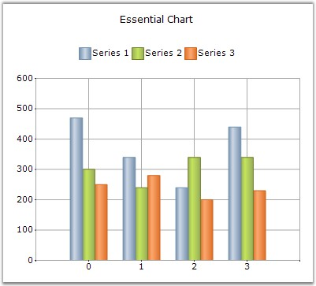

::: {style="DISPLAY: none"}
{#d2h_url_template}{#d2h_package_url style="WIDTH: 0px; DISPLAY: none; HEIGHT: 0px"}
:::

::::: {#nsbanner .d2h_main_nsbanner style="BORDER-BOTTOM: #999999 1px solid; POSITION: relative; PADDING-BOTTOM: 0px; BACKGROUND-COLOR: transparent; PADDING-LEFT: 0px; PADDING-RIGHT: 0px; DISPLAY: none; BORDER-TOP: #999999 1px solid; PADDING-TOP: 0px; LEFT: 0px"}
:::: {#TitleRow .d2h_main_titlerow style="PADDING-BOTTOM: 4px; BACKGROUND-COLOR: transparent; PADDING-LEFT: 22px; WIDTH: 100%; PADDING-RIGHT: 10px; DISPLAY: none; PADDING-TOP: 4px"}
::: {#ienav .d2h_main_ienav style="DISPLAY: none"}
{#D2HPrevious .D2HPreviousEnabled}  {#D2HNext .D2HNextEnabled}
:::
::::
:::::

:::: {#nstext .d2h_main_nstext style="PADDING-BOTTOM: 10px; BACKGROUND-COLOR: transparent; PADDING-LEFT: 22px; PADDING-RIGHT: 10px; HEIGHT: 100%; OVERFLOW: auto; PADDING-TOP: 5px" hasuserbackground="true" valign="bottom"}
::: {#d2h_breadcrumbs .d2h_breadcrumbs}
[Essential Studio User Guide Documentation](ms-xhelp:///?Id=12457748-09e3-4d74-a240-8e049cedf030){.d2h_breadcrumbsNormal}[ \> ]{.d2h_breadcrumbsLinkSeparator}[User Interface Edition](ms-xhelp:///?Id=c29296b7-531c-413b-a0ec-488ca1f7f669){.d2h_breadcrumbsNormal}[ \> ]{.d2h_breadcrumbsLinkSeparator}[Essential ASP.NET](ms-xhelp:///?Id=25c35330-c127-4dad-9a92-ed79dc7261a6){.d2h_breadcrumbsNormal}[ \> ]{.d2h_breadcrumbsLinkSeparator}[Essential Chart]{.d2h_breadcrumbsContentsOnly}[ \> ]{.d2h_breadcrumbsLinkSeparator}[Overview](ms-xhelp:///?Id=ed5a75d7-66ec-4f9a-b76d-4ca8ef330296){.d2h_breadcrumbsNormal}
:::

## Introduction to Essential Chart for ASP.NET {#introduction-to-essential-chart-for-asp.net style="tab-stops: 0pt"}

[]{style="FONT-FAMILY: 'Trebuchet MS','sans-serif'; FONT-SIZE: 9pt"} 

Essential Chart is an easily configurable, presentation quality business chart control. A unique point based Styles Architecture, easily extendable Data Model, easily extendable rendering model native Date Handling and a unique Shared Data Model are the features that distinguish Essential Chart. This control has been created using C#, which means that it is a fully-managed .NET component, and  has been specifically designed for use with Microsoft\'s Visual Studio .NET.

 

Essential Chart for ASP.NET is a perfect solution for developers looking to add advanced, feature rich, visually appealing charts to their Web Forms applications. The product comes with numerous samples as well as an extensive documentation to guide you every step of the way.

 

Chart is used as a means to show the graphical representation of two values. For example, a Line Chart can be used in Health Statistic reports, in which it can show the rates over time or for a series of values, such as age-specific death rates.

 

Logarithmic charts can be used in Share price charts where we plot between price and time. In logarithmic chart, we can identify the \'Proportional change in price\' with respect to the \'Change in time\'. We use \'Proportional change in price\' to observe market sentiment. Market participants move share prices either up or down proportionally depending on how bullish or bearish they feel.

[]{style="FONT-FAMILY: 'Trebuchet MS','sans-serif'; FONT-SIZE: 9pt"} 

[]{style="FONT-FAMILY: 'Trebuchet MS','sans-serif'; FONT-SIZE: 9pt"} 

Figure 1: Chart Web Control

**[]{style="FONT-FAMILY: 'Trebuchet MS','sans-serif'; FONT-SIZE: 9pt"}** 

Key Features

**[]{style="FONT-FAMILY: 'Trebuchet MS','sans-serif'; FONT-SIZE: 9pt"}** 

Important features of Chart Web control are listed below.

[]{style="FONT-FAMILY: 'Trebuchet MS','sans-serif'; FONT-SIZE: 9pt"} 

[·      ]{style="FONT-FAMILY: Symbol"}Chart Web control provides complete support for customization of the Chart control through Chart Wizard at design time and also at run time. Chart Wizard comes with new Office look and feel.

[·      ]{style="FONT-FAMILY: Symbol"}Chart Data Model makes it easy to populate the chart with any kind of data source.

[·      ]{style="FONT-FAMILY: Symbol"}Essential Chart features built in support for dates. The data type of any series that is plotted on the chart can be set to DateTime.

[·      ]{style="FONT-FAMILY: Symbol"}Essential Chart offers automatic interval calculation capabilities for any range of numbers or dates.

[·      ]{style="FONT-FAMILY: Symbol"}Essential Chart offers extensive customization support for Chart Legends.

[·      ]{style="FONT-FAMILY: Symbol"}Support for 2D or 3D appearance of the Chart.

[·      ]{style="FONT-FAMILY: Symbol"}Chart can be easily bound with IEnumerable based collections like ArrayList. This extends chart to be easily used with LINQ.

[·      ]{style="FONT-FAMILY: Symbol"}Essential Chart for ASP.NET is compatible with all major browsers on Windows, Macintosh and Linux.

[·      ]{style="FONT-FAMILY: Symbol"}Support for Statistical formulas such as Mean, Standard Deviation, Variance, Distributions, T-Test, F-Test, Z-Test, and so on.

[·      ]{style="FONT-FAMILY: Symbol"}Support to export Chart to PDF, Excel and Doc formats.

[·      ]{style="FONT-FAMILY: Symbol"}Users can create custom palettes for their Charts by using CustomPalette property. Also, you can create non-gradient palettes for the Charts by using this Custom Palettes feature.

[·      ]{style="FONT-FAMILY: Symbol"}Multiple Chart Titles and Multiple Legends can be provided with abilities to format the Title text.

[·      ]{style="FONT-FAMILY: Symbol"}Smart Tag feature with sophisticated options.

[·      ]{style="FONT-FAMILY: Symbol"}Chart Web control can now display tooltips for specific areas like in Chart Windows.

[]{style="FONT-FAMILY: 'Trebuchet MS','sans-serif'; FONT-SIZE: 9pt"} 

User Guide Structure

[]{style="FONT-FAMILY: 'Trebuchet MS','sans-serif'; FONT-SIZE: 9pt"} 

The product comes with numerous samples as well as an extensive documentation to guide you. This User Guide provides detailed information on the features and functionalities of Chart Web control. It is organized into the following sections:

[]{style="FONT-FAMILY: 'Trebuchet MS','sans-serif'; FONT-SIZE: 9pt"} 

[·      ]{style="FONT-FAMILY: Symbol"}**Overview**-This section gives a brief introduction to our product and its key features.

[·      ]{style="FONT-FAMILY: Symbol"}**Installation and Deployment**-This section elaborates on the install location of the samples, license, and so on.

[·      ]{style="FONT-FAMILY: Symbol"}**Getting Started**-This section guides you on getting started with ASP.NET application, Chart Web control, and so on.

[·      ]{style="FONT-FAMILY: Symbol"}**Concepts and Features**-The features of Chart Web control are illustrated with use case scenarios, code examples and screen shots under this section.

[·      ]{style="FONT-FAMILY: Symbol"}**Frequently Asked Questions**-This section illustrates the solutions for various task-based queries about Essential Chart.

[]{style="FONT-FAMILY: 'Trebuchet MS','sans-serif'; FONT-SIZE: 9pt"} 

Document Conventions

[]{style="FONT-FAMILY: 'Trebuchet MS','sans-serif'; FONT-SIZE: 9pt"} 

The following conventions will help you to quickly identify the important sections of information while using the content.

[]{style="FONT-FAMILY: 'Trebuchet MS','sans-serif'; FONT-SIZE: 9pt"} 

[]{#p2} 

+------------------------+-------------------------------------------------------------------------------------------------------------------------------------------------------------------------------------------------------------------------------------------------------------+---------------------------------------------------------------------------+
| Convention             | Icon                                                                                                                                                                                                                                                        | Description of the Icon                                                   |
+------------------------+-------------------------------------------------------------------------------------------------------------------------------------------------------------------------------------------------------------------------------------------------------------+---------------------------------------------------------------------------+
| Note                   | ::: {style="BORDER-BOTTOM: windowtext 1pt solid; BORDER-LEFT: medium none; PADDING-BOTTOM: 1pt; MARGIN-TOP: 9pt; PADDING-LEFT: 0pt; PADDING-RIGHT: 0pt; MARGIN-BOTTOM: 9pt; BORDER-TOP: windowtext 1pt solid; BORDER-RIGHT: medium none; PADDING-TOP: 1pt"} | Represents important information                                          |
|                        | Note:                                                                                                                                                                                                                           |                                                                           |
|                        | :::                                                                                                                                                                                                                                                         |                                                                           |
+------------------------+-------------------------------------------------------------------------------------------------------------------------------------------------------------------------------------------------------------------------------------------------------------+---------------------------------------------------------------------------+
| Example                | **Example**                                                                                                                                                                                                                                                 | Represents an example                                                     |
+------------------------+-------------------------------------------------------------------------------------------------------------------------------------------------------------------------------------------------------------------------------------------------------------+---------------------------------------------------------------------------+
| Tip                    |                                                                                                                                                                                                                                 | Represents useful hints that will help you in using the controls/features |
+------------------------+-------------------------------------------------------------------------------------------------------------------------------------------------------------------------------------------------------------------------------------------------------------+---------------------------------------------------------------------------+
| Additional Information |                                                                                                                                                                                                                                 | Represents additional information on the topic                            |
+------------------------+-------------------------------------------------------------------------------------------------------------------------------------------------------------------------------------------------------------------------------------------------------------+---------------------------------------------------------------------------+

 

[]{#related-topics}
::::
