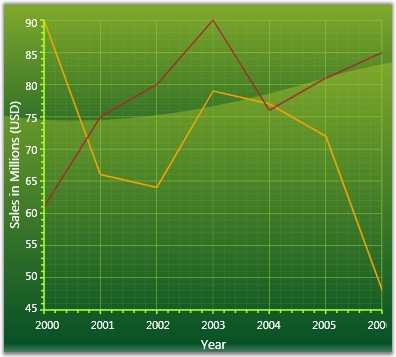

::: {style="DISPLAY: none"}
{#d2h_url_template}{#d2h_package_url style="WIDTH: 0px; DISPLAY: none; HEIGHT: 0px"}
:::

::::: {#nsbanner .d2h_main_nsbanner style="BORDER-BOTTOM: #999999 1px solid; POSITION: relative; PADDING-BOTTOM: 0px; BACKGROUND-COLOR: transparent; PADDING-LEFT: 0px; PADDING-RIGHT: 0px; DISPLAY: none; BORDER-TOP: #999999 1px solid; PADDING-TOP: 0px; LEFT: 0px"}
:::: {#TitleRow .d2h_main_titlerow style="PADDING-BOTTOM: 4px; BACKGROUND-COLOR: transparent; PADDING-LEFT: 22px; WIDTH: 100%; PADDING-RIGHT: 10px; DISPLAY: none; PADDING-TOP: 4px"}
::: {#ienav .d2h_main_ienav style="DISPLAY: none"}
{#D2HPrevious .D2HPreviousEnabled}  {#D2HNext .D2HNextEnabled}
:::
::::
:::::

::::: {#nstext .d2h_main_nstext style="PADDING-BOTTOM: 10px; BACKGROUND-COLOR: transparent; PADDING-LEFT: 22px; PADDING-RIGHT: 10px; HEIGHT: 100%; OVERFLOW: auto; PADDING-TOP: 5px" hasuserbackground="true" valign="bottom"}
::: {#d2h_breadcrumbs .d2h_breadcrumbs}
[Essential Studio User Guide Documentation](ms-xhelp:///?Id=12457748-09e3-4d74-a240-8e049cedf030){.d2h_breadcrumbsNormal}[ \> ]{.d2h_breadcrumbsLinkSeparator}[User Interface Edition](ms-xhelp:///?Id=c29296b7-531c-413b-a0ec-488ca1f7f669){.d2h_breadcrumbsNormal}[ \> ]{.d2h_breadcrumbsLinkSeparator}[Essential WPF](ms-xhelp:///?Id=7f4f82c5-151c-4262-94d0-75c4626c77bc){.d2h_breadcrumbsNormal}[ \> ]{.d2h_breadcrumbsLinkSeparator}[Essential Chart]{.d2h_breadcrumbsContentsOnly}[ \> ]{.d2h_breadcrumbsLinkSeparator}[Overview](ms-xhelp:///?Id=0729ccc0-f704-41db-ab26-3c76c3ae8f26){.d2h_breadcrumbsNormal}
:::

## Introduction to Essential Chart for WPF {#introduction-to-essential-chart-for-wpf style="tab-stops: 0pt"}

Essential Chart for WPF is a feature rich, highly customizable and presentable business Chart control. It can be used for easy understanding of large quantities of data and relationship between the data. Essential Chart enhances the readability and understandability of the raw data. With pre-built support for all kinds of list-based data sources and a very flexible template model, the control offers maximum flexibility with a very simple and straight-forward object model. The Chart control allows you to implement animations and user-interactions easily.

 

Essential Chart for WPF is intended for developers looking to add advanced, feature rich, visually appealing charts to the WPF applications.

 

The following image shows an example of a Chart control (Line chart):

[]{style="FONT-FAMILY: 'Trebuchet MS','sans-serif'; COLOR: #15428b; FONT-SIZE: 9pt"} 

Figure 1: Line Chart

Real World Scenarios

[]{style="FONT-FAMILY: 'Trebuchet MS','sans-serif'; COLOR: #15428b; FONT-SIZE: 9pt"} 

Chart is used to show the graphical representation of two values. For example, a Line Chart can be used to depict the variation of sales in the recent years as shown in Figure 1.

 

Logarithmic charts can be used in Share Price charts where you plot between price and time. In logarithmic chart, you can identify the proportional change in price with respect to the change in time. Proportional change in price is used to observe the market sentiment.

[]{style="FONT-FAMILY: 'Trebuchet MS','sans-serif'; COLOR: #15428b; FONT-SIZE: 9pt"} 

Key Features

[]{style="FONT-FAMILY: 'Trebuchet MS','sans-serif'; COLOR: #15428b; FONT-SIZE: 9pt"} 

The following are the key features of Essential Chart for WPF:

[]{style="FONT-FAMILY: 'Trebuchet MS','sans-serif'; COLOR: #15428b; FONT-SIZE: 9pt"} 

[·      ]{style="FONT-FAMILY: Symbol"}**Chart customization**-Essential Chart provides easy customization for each and every unit of chart such as Chart, Chart Area, Chart Series and Chart Legend

[·      ]{style="FONT-FAMILY: Symbol"}**Chart Data Binding**-Essential Chart allows you to populate the chart with any kind of data source

[·      ]{style="FONT-FAMILY: Symbol"}**Chart Animation**-Essential Chart supports various animation effects for good visualization

[·      ]{style="FONT-FAMILY: Symbol"}**Chart Templates**-Chart control uses the benefits of WPF template concept, and enables to customize all parts of Chart with the templates customization option

[·      ]{style="FONT-FAMILY: Symbol"}**Chart Area**-Multiple Chart Areas can be added to perform comparison of data at single view. Chart Area also comes with high layout customization.

[·      ]{style="FONT-FAMILY: Symbol"}**Chart Series**-Highly customizable and interactive chart series can be added to Chart control

[·      ]{style="FONT-FAMILY: Symbol"}**Chart Types**-Essential Chart supports more than 33 chart types

[·      ]{style="FONT-FAMILY: Symbol"}**2-D and 3-D Appearance**-Essential Chart supports 2-D and 3-D appearance of the Chart

[·      ]{style="FONT-FAMILY: Symbol"}**Chart Axis**-Essential Chart allows to customizing the Chart Axis. Chart control also provides support of multiple axes

[·      ]{style="FONT-FAMILY: Symbol"}**Chart Legends**-Essential Chart allows extensive customization of the legend. The position of the legend on the chart area as well as its representation aspects can be customized. Essential Chart also features modification of legend items using events. It also supports custom legend items that are not tied to any series of data.

[·      ]{style="FONT-FAMILY: Symbol"}**Chart Export, Import and Print**-Essential Chart supports exporting, importing and printing functionalities

[]{style="FONT-FAMILY: 'Trebuchet MS','sans-serif'; COLOR: #15428b; FONT-SIZE: 9pt"} 

User Guide Organization

**[]{style="FONT-FAMILY: 'Trebuchet MS','sans-serif'; COLOR: #15428b"}** 

The product comes with numerous samples as well as an extensive documentation to guide you. This User Guide provides detailed information on the features and functionalities of the Essential Chart for WPF. It is organized into the following sections:

[]{style="FONT-FAMILY: 'Trebuchet MS','sans-serif'; COLOR: #15428b; FONT-SIZE: 9pt"} 

[·      ]{style="FONT-FAMILY: Symbol"}**Overview**-This section gives a brief introduction to the product and its key features.

[·      ]{style="FONT-FAMILY: Symbol"}**Installation and Deployment**-This section elaborates on the install location of the samples, license etc.

[·      ]{style="FONT-FAMILY: Symbol"}**What\'s New**-This section lists the new features implemented for the latest release.

[·      ]{style="FONT-FAMILY: Symbol"}**Getting Started**-This section guides you on getting started with WPF application and deploying Chart control etc.

[·      ]{style="FONT-FAMILY: Symbol"}**Concepts and Features**-The features of the chart are illustrated with use case scenarios, code examples and screen shots under this section.

[]{style="FONT-FAMILY: 'Trebuchet MS','sans-serif'; COLOR: #15428b; FONT-SIZE: 9pt"} 

Document Conventions[ ]{style="FONT-SIZE: 9pt"}

[]{style="FONT-FAMILY: 'Trebuchet MS','sans-serif'; COLOR: #15428b; FONT-SIZE: 9pt"} 

The conventions below will help you to quickly identify the important sections of information, while using the content:

[]{style="FONT-FAMILY: 'Trebuchet MS','sans-serif'; COLOR: #15428b; FONT-SIZE: 9pt"} 

Table 1: Document Convention

::: {align="center"}
+------------------------+-------------------------------------+---------------------------------------------------------------------------------+
| Convention             | Icon                                | Description                                                                     |
+------------------------+-------------------------------------+---------------------------------------------------------------------------------+
| Note                   |                                     | Represents important information.                                               |
|                        |                                     |                                                                                 |
|                        | *Note:* |                                                                                 |
+------------------------+-------------------------------------+---------------------------------------------------------------------------------+
| Example                | Example:                            | Represents an example.                                                          |
+------------------------+-------------------------------------+---------------------------------------------------------------------------------+
| Tip                    |         | Represents useful hints, that will help you in using the controls and features. |
+------------------------+-------------------------------------+---------------------------------------------------------------------------------+
| Additional information |         | Represents additional information on the corresponding topic.                   |
+------------------------+-------------------------------------+---------------------------------------------------------------------------------+
:::

 

[]{#p2} 

 

[]{#related-topics}
:::::
