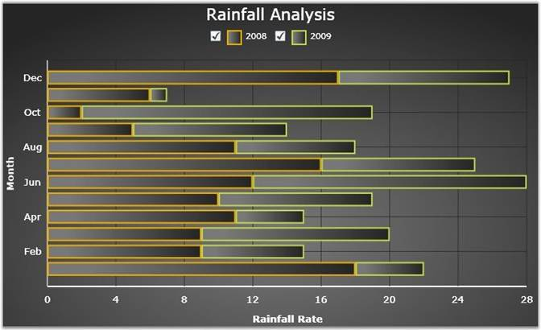

::: {style="DISPLAY: none"}
{#d2h_url_template}{#d2h_package_url style="WIDTH: 0px; DISPLAY: none; HEIGHT: 0px"}
:::

::::: {#nsbanner .d2h_main_nsbanner style="BORDER-BOTTOM: #999999 1px solid; POSITION: relative; PADDING-BOTTOM: 0px; BACKGROUND-COLOR: transparent; PADDING-LEFT: 0px; PADDING-RIGHT: 0px; DISPLAY: none; BORDER-TOP: #999999 1px solid; PADDING-TOP: 0px; LEFT: 0px"}
:::: {#TitleRow .d2h_main_titlerow style="PADDING-BOTTOM: 4px; BACKGROUND-COLOR: transparent; PADDING-LEFT: 22px; WIDTH: 100%; PADDING-RIGHT: 10px; DISPLAY: none; PADDING-TOP: 4px"}
::: {#ienav .d2h_main_ienav style="DISPLAY: none"}
{#D2HPrevious .D2HPreviousEnabled}  {#D2HNext .D2HNextEnabled}
:::
::::
:::::

::::: {#nstext .d2h_main_nstext style="PADDING-BOTTOM: 10px; BACKGROUND-COLOR: transparent; PADDING-LEFT: 22px; PADDING-RIGHT: 10px; HEIGHT: 100%; OVERFLOW: auto; PADDING-TOP: 5px" hasuserbackground="true" valign="bottom"}
::: {#d2h_breadcrumbs .d2h_breadcrumbs}
[Essential Studio User Guide Documentation](ms-xhelp:///?Id=12457748-09e3-4d74-a240-8e049cedf030){.d2h_breadcrumbsNormal}[ \> ]{.d2h_breadcrumbsLinkSeparator}[User Interface Edition](ms-xhelp:///?Id=c29296b7-531c-413b-a0ec-488ca1f7f669){.d2h_breadcrumbsNormal}[ \> ]{.d2h_breadcrumbsLinkSeparator}[Essential Silverlight](ms-xhelp:///?Id=66221bd1-ba2e-43c2-94a7-618f50e01d24){.d2h_breadcrumbsNormal}[ \> ]{.d2h_breadcrumbsLinkSeparator}[Essential Chart]{.d2h_breadcrumbsContentsOnly}[ \> ]{.d2h_breadcrumbsLinkSeparator}[Overview](ms-xhelp:///?Id=c904ce63-54bd-4ca4-b693-b655fab218ad){.d2h_breadcrumbsNormal}
:::

## Introduction to Essential Chart Silverlight {#introduction-to-essential-chart-silverlight style="tab-stops: 0pt"}

[]{style="COLOR: #15428b"} 

Essential Chart Silverlight is a feature rich, highly customizable and presentable business Chart control. It can be used for easy understanding of large quantities of data and relationship between the data. Essential Chart enhances the readability and understandability of the raw data. With pre-built support for all kinds of list-based data sources and a very flexible template model, the control offers maximum flexibility with a very simple and straight-forward object model. The Chart control allows you to implement animations and user-interactions easily. 

 

Essential Chart for Silverlight is intended for developers looking to add advanced, feature rich, visually appealing charts to the Silverlight applications.

[]{style="COLOR: #15428b"} 

Real World Scenario

[·      ]{style="FONT-FAMILY: Symbol"}Chart is used as a means to show the graphical representation of two values. For example, a chart can display the rainfall comparison for the two years, month-wise as shown below.

[]{style="COLOR: #15428b"} 

Figure 1: Chart control showing rainfall analysis

***[]{style="COLOR: #15428b"}*** 

Key Features

[]{style="COLOR: #15428b"} 

The following are the key features of Essential Chart Silverlight:

[]{style="COLOR: #15428b"} 

[·      ]{style="FONT-FAMILY: Symbol"}Chart customization: Essential Chart provides easy customization for each and every unit of chart such as Chart, Chart Area, Chart Series and Chart Legend

[·      ]{style="FONT-FAMILY: Symbol"}Chart Data Binding: Essential Chart allows you to populate the chart with any kind of data source

[·      ]{style="FONT-FAMILY: Symbol"}Chart Area: Multiple Chart Areas can be added to perform comparison of data at single view. Chart Area also comes with high layout customization.

[·      ]{style="FONT-FAMILY: Symbol"}Chart Series: Highly customizable and interactive chart series can be added to Chart control

[·      ]{style="FONT-FAMILY: Symbol"}Chart Types: Essential Chart supports various chart types

[·      ]{style="FONT-FAMILY: Symbol"}Chart Axis: Essential Chart allows to customize the Chart Axis. Chart control also provides support of multiple axes

[·      ]{style="FONT-FAMILY: Symbol"}Chart Labels: Essential Chart allows you to customize the chart labels. The labels can be fetched from various data sources

[·      ]{style="FONT-FAMILY: Symbol"}Chart Legends: Essential Chart allows extensive customization of the legend. The position of the legend on the chart area as well as its representation aspects can be customized. Essential Chart also features modification of legend items using events. It also supports custom legend items that are not tied to any series of data.

[·      ]{style="FONT-FAMILY: Symbol"}User Interaction: Essential Chart supports zooming to enhance the user interaction

[]{style="COLOR: #15428b"} 

User Guide Structure

The product comes with numerous samples as well as an extensive documentation to guide you. This User Guide provides detailed information on the features and functionalities of the Essential Chart for Silverlight. It is organized into the following sections:

[]{style="COLOR: #15428b"} 

[·      ]{style="FONT-FAMILY: Symbol"}Overview-This section gives a brief introduction to the product and its key features.

[·      ]{style="FONT-FAMILY: Symbol"}Installation and Deployment-This section elaborates on the install location of the samples, license etc.

[·      ]{style="FONT-FAMILY: Symbol"}What\'s New-This section lists the new features implemented for every release.

[·      ]{style="FONT-FAMILY: Symbol"}Getting Started-This section guides you on getting started with Silverlight application, controls etc.

[·      ]{style="FONT-FAMILY: Symbol"}Concepts and Features-The features of Chart control are illustrated with use case scenarios, code examples and screen shots under this section.

[]{style="COLOR: #15428b"} 

Document Conventions

[]{style="COLOR: #15428b"} 

The conventions below will help you to quickly identify the important sections of information, while using the content:

[]{style="COLOR: #15428b"} 

::: {align="center"}
  ------------------------ ------------------------------------- ---------------------------------------------------------------------------------
  Convention               Icon                                  Description
  Note                     *Note:*   Represents important information.
  Example                  Example                               Represents an example.
  Tip                                Represents useful hints, that will help you in using the controls and features.
  Additional information             Represents additional information on the corresponding topic.
  ------------------------ ------------------------------------- ---------------------------------------------------------------------------------
:::

[]{#related-topics}
:::::
