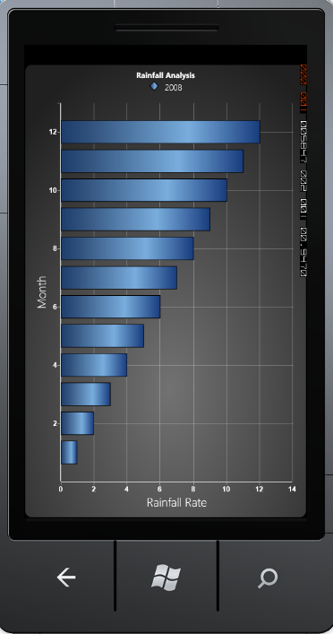

::: {style="DISPLAY: none"}
{#d2h_url_template}{#d2h_package_url style="WIDTH: 0px; DISPLAY: none; HEIGHT: 0px"}
:::

::::: {#nsbanner .d2h_main_nsbanner style="BORDER-BOTTOM: #999999 1px solid; POSITION: relative; PADDING-BOTTOM: 0px; BACKGROUND-COLOR: transparent; PADDING-LEFT: 0px; PADDING-RIGHT: 0px; DISPLAY: none; BORDER-TOP: #999999 1px solid; PADDING-TOP: 0px; LEFT: 0px"}
:::: {#TitleRow .d2h_main_titlerow style="PADDING-BOTTOM: 4px; BACKGROUND-COLOR: transparent; PADDING-LEFT: 22px; WIDTH: 100%; PADDING-RIGHT: 10px; DISPLAY: none; PADDING-TOP: 4px"}
::: {#ienav .d2h_main_ienav style="DISPLAY: none"}
{#D2HPrevious .D2HPreviousEnabled}  {#D2HNext .D2HNextEnabled}
:::
::::
:::::

::::: {#nstext .d2h_main_nstext style="PADDING-BOTTOM: 10px; BACKGROUND-COLOR: transparent; PADDING-LEFT: 22px; PADDING-RIGHT: 10px; HEIGHT: 100%; OVERFLOW: auto; PADDING-TOP: 5px" hasuserbackground="true" valign="bottom"}
::: {#d2h_breadcrumbs .d2h_breadcrumbs}
[Essential Studio User Guide Documentation](ms-xhelp:///?Id=12457748-09e3-4d74-a240-8e049cedf030){.d2h_breadcrumbsNormal}[ \> ]{.d2h_breadcrumbsLinkSeparator}[User Interface Edition](ms-xhelp:///?Id=c29296b7-531c-413b-a0ec-488ca1f7f669){.d2h_breadcrumbsNormal}[ \> ]{.d2h_breadcrumbsLinkSeparator}[Essential Windows Phone](ms-xhelp:///?Id=5ea1999c-4eff-4775-b84e-407dc825f555){.d2h_breadcrumbsNormal}[ \> ]{.d2h_breadcrumbsLinkSeparator}[Essential Chart]{.d2h_breadcrumbsContentsOnly}[ \> ]{.d2h_breadcrumbsLinkSeparator}[Overview](ms-xhelp:///?Id=b2ed5382-73e5-4acc-9c73-c48ecaad1300){.d2h_breadcrumbsNormal}
:::

## Introduction to Essential Chart Windows Phone {#introduction-to-essential-chart-windows-phone style="tab-stops: 0pt"}

[]{style="COLOR: #15428b"} 

Essential Chart WindowsPhone is a feature rich, highly customizable and presentable business Chart control. It can be used to understand easily, large quantities of data and their relationships. Essential Chart enhances the reading and understandingof raw data. With pre-built support for all kinds of list-based data sources and a very flexible template model, the control offers maximum flexibility with a very simple and straight-forward object model. The Chart control allows you to implement animations and user-interactions easily. 

 

Essential Chart for WindowsPhone is intended for developers who aim to add advanced, feature rich, and visually appealing charts to the Windows Phone applications.

[]{style="COLOR: #15428b"} 

Essential Chart supports Mango edition of the Windows Phone operating system. Windows Phone 7.5 (codenamed Mango) provides support for more than five hundred features compared to the Windows Phone 7.0 version. Some of the major features include multitasking and Silverlight 4 support. Essential Studio controls for Windows Phone now support Mango edition, enabling you to utilize these advanced features.

 

[]{style="COLOR: #15428b"} 

Use Case Scenario

Chart shows the graphical representation of two values. For example, a chart can display the rainfall comparison for two years or two months as shown in the following screenshot.

[]{style="COLOR: #15428b"} 

 

Figure 1 : Chart Control Showing Rainfall Analysis

[]{style="COLOR: #15428b"} 

Key Features

[]{style="COLOR: #15428b"} 

The following are the key features of Essential Chart Windows Phone:

[]{style="COLOR: #15428b"} 

[·      ]{style="FONT-FAMILY: Symbol"}Chart customization: Essential Chart provides easy customization for each and every unit of chart such as Chart, Chart Area, Chart Series and Chart Legend.

[·      ]{style="FONT-FAMILY: Symbol"}Chart Data Binding: Essential Chart allows you to populate the chart with any kind of data source.

[·      ]{style="FONT-FAMILY: Symbol"}Chart Area: Multiple Chart Areas can be added to perform comparison of data in a  single view. Chart Area also comes with high layout customization.

[·      ]{style="FONT-FAMILY: Symbol"}Chart Series: Highly customizable and interactive chart series can be added to Chart control.

[·      ]{style="FONT-FAMILY: Symbol"}Chart Types: Essential Chart supports various chart types.

[·      ]{style="FONT-FAMILY: Symbol"}Chart Axis: Essential Chart allows customizing the Chart Axis. The Chart control also provides support for multiple axes.

[·      ]{style="FONT-FAMILY: Symbol"}Chart Labels: Essential Chart allows you to customize the chart labels. The labels can be fetched from various data sources.

[·      ]{style="FONT-FAMILY: Symbol"}Chart Legends: Essential Chart allows extensive customization of the legend. The position of the legend on the chart area as well as its representation aspects can be customized. Essential Chart also features modification of legend items using events. It also supports custom legend items that are not tied to any series of data.

[]{style="COLOR: #15428b"} 

User Guide Structure

The product comes with numerous samples as well as an extensive documentation to guide you. This User Guide provides detailed information on the features and functionalities of the Essential Chart for Phone. It is organized into the following sections:

[]{style="COLOR: #15428b"} 

[·      ]{style="FONT-FAMILY: Symbol"}Overview-This section gives a brief overview of the product and its key features.

[·      ]{style="FONT-FAMILY: Symbol"}Installation and Deployment-This section elaborates on the install location of the samples, license and so on.

[·      ]{style="FONT-FAMILY: Symbol"}What\'s New-This section lists the new features implemented for every release.

[·      ]{style="FONT-FAMILY: Symbol"}Getting Started-This section guides you on getting started with Windows Phone application, controls and so on.

[·      ]{style="FONT-FAMILY: Symbol"}Concepts and Features-In this section, the features of Chart control are illustrated with use case scenarios, code examples and screen shots.

[]{style="COLOR: #15428b"} 

Document Conventions

[]{style="COLOR: #15428b"} 

The tabulated conventions will help you to quickly identify the important sections of information, while using the content:

[]{style="COLOR: #15428b"} 

::: {align="center"}
+------------------------+-------------------------------------------------------------------------------------------------------------------------------------------------------------------------------------------------------------------------------------------------------------+--------------------------------------------------------------------------------+
| Convention             | Icon                                                                                                                                                                                                                                                        | Description                                                                    |
+------------------------+-------------------------------------------------------------------------------------------------------------------------------------------------------------------------------------------------------------------------------------------------------------+--------------------------------------------------------------------------------+
| Note                   | ::: {style="BORDER-BOTTOM: windowtext 1pt solid; BORDER-LEFT: medium none; PADDING-BOTTOM: 1pt; MARGIN-TOP: 9pt; PADDING-LEFT: 0pt; PADDING-RIGHT: 0pt; MARGIN-BOTTOM: 9pt; BORDER-TOP: windowtext 1pt solid; BORDER-RIGHT: medium none; PADDING-TOP: 1pt"} | Represents important information.                                              |
|                        | Note:                                                                                                                                                                                                                           |                                                                                |
|                        | :::                                                                                                                                                                                                                                                         |                                                                                |
+------------------------+-------------------------------------------------------------------------------------------------------------------------------------------------------------------------------------------------------------------------------------------------------------+--------------------------------------------------------------------------------+
| Example                | Example                                                                                                                                                                                                                                                     | Represents an example.                                                         |
+------------------------+-------------------------------------------------------------------------------------------------------------------------------------------------------------------------------------------------------------------------------------------------------------+--------------------------------------------------------------------------------+
| Tip                    |                                                                                                                                                                                                                                 | Represents useful hints that will help you in using the controls and features. |
+------------------------+-------------------------------------------------------------------------------------------------------------------------------------------------------------------------------------------------------------------------------------------------------------+--------------------------------------------------------------------------------+
| Additional information |                                                                                                                                                                                                                                 | Represents additional information on the corresponding topic.                  |
+------------------------+-------------------------------------------------------------------------------------------------------------------------------------------------------------------------------------------------------------------------------------------------------------+--------------------------------------------------------------------------------+
:::

[]{#related-topics}
:::::
