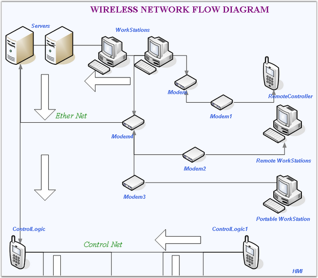

::: {style="DISPLAY: none"}
{#d2h_url_template}{#d2h_package_url style="WIDTH: 0px; DISPLAY: none; HEIGHT: 0px"}
:::

::::: {#nsbanner .d2h_main_nsbanner style="BORDER-BOTTOM: #999999 1px solid; POSITION: relative; PADDING-BOTTOM: 0px; BACKGROUND-COLOR: transparent; PADDING-LEFT: 0px; PADDING-RIGHT: 0px; DISPLAY: none; BORDER-TOP: #999999 1px solid; PADDING-TOP: 0px; LEFT: 0px"}
:::: {#TitleRow .d2h_main_titlerow style="PADDING-BOTTOM: 4px; BACKGROUND-COLOR: transparent; PADDING-LEFT: 22px; WIDTH: 100%; PADDING-RIGHT: 10px; DISPLAY: none; PADDING-TOP: 4px"}
::: {#ienav .d2h_main_ienav style="DISPLAY: none"}
{#D2HPrevious .D2HPreviousEnabled}  {#D2HNext .D2HNextEnabled}
:::
::::
:::::

::::: {#nstext .d2h_main_nstext style="PADDING-BOTTOM: 10px; BACKGROUND-COLOR: transparent; PADDING-LEFT: 22px; PADDING-RIGHT: 10px; HEIGHT: 100%; OVERFLOW: auto; PADDING-TOP: 5px" hasuserbackground="true" valign="bottom"}
::: {#d2h_breadcrumbs .d2h_breadcrumbs}
[Essential Studio User Guide Documentation](ms-xhelp:///?Id=12457748-09e3-4d74-a240-8e049cedf030){.d2h_breadcrumbsNormal}[ \> ]{.d2h_breadcrumbsLinkSeparator}[User Interface Edition](ms-xhelp:///?Id=c29296b7-531c-413b-a0ec-488ca1f7f669){.d2h_breadcrumbsNormal}[ \> ]{.d2h_breadcrumbsLinkSeparator}[Essential Windows](ms-xhelp:///?Id=e60759d8-47a4-4570-9d7a-16a68d63f2ea){.d2h_breadcrumbsNormal}[ \> ]{.d2h_breadcrumbsLinkSeparator}[Essential Diagram]{.d2h_breadcrumbsContentsOnly}[ \> ]{.d2h_breadcrumbsLinkSeparator}[Overview](ms-xhelp:///?Id=2bcace6f-176c-4938-b6d9-3ef64ef90230){.d2h_breadcrumbsNormal}
:::

## Introduction To Essential Diagram {#introduction-to-essential-diagram style="tab-stops: 0pt"}

[]{style="FONT-FAMILY: 'Trebuchet MS','sans-serif'; COLOR: #15428b; FONT-SIZE: 9pt"} 

Essential Diagram is an extensible and high-performance .NET diagramming framework for Windows Applications. It can be used for developing Microsoft Visio-like interactive graphics and diagramming applications. It stores graphical objects in a node graph and renders those objects onto the screen. Essential Diagram supports both vector and raster graphics on the drawing surface.

 

Essential Diagram lets the users to create interactive diagrams easily using the Diagram Builder utility included with the Diagram. It explicitly lays out diagram objects, or allows our built-in layout managers to handle the job, making complex layout diagrams a snap. Using the Symbol Designer utility, you can create domain or business specific symbols by using custom shapes and images.\
\

Figure 1: Wireless Network flow

[]{style="FONT-FAMILY: 'Trebuchet MS','sans-serif'; COLOR: #15428b; FONT-SIZE: 9pt"} 

Key Features

[]{style="FONT-FAMILY: 'Trebuchet MS','sans-serif'; COLOR: #15428b; FONT-SIZE: 9pt"} 

Some of the key features of Essential Diagram are listed below.

[]{style="FONT-FAMILY: 'Trebuchet MS','sans-serif'; COLOR: #15428b; FONT-SIZE: 9pt"} 

[·      ]{style="FONT-FAMILY: Symbol"}Essential Diagram supports Matrix Transformations like Translate (Move), Rotate and Scale.

[·      ]{style="FONT-FAMILY: Symbol"}Shape nodes are the graphical objects that can be drawn on the diagram area by activating one of several drawing tools such as the RectangleTool, RoundRectTool, EllipseTool, LineTool, PolylineTool, OrthogonallineTool, BezierTool, CurveTool, ArcTool and PolygonTool.

[·      ]{style="FONT-FAMILY: Symbol"}DecoratorShape can be added at the head and tail of Connectors. The shapes include arrows, circles, diamonds, crosses, squares and custom decorators.

[·      ]{style="FONT-FAMILY: Symbol"}Essential Diagram supports rendering Textnodes and RichTextnodes, and offers full text formatting through sufficient properties. Text editing and text rotation are also supported.

[·      ]{style="FONT-FAMILY: Symbol"}Zooming, scrolling, and panning are supported and can be achieved using sufficient interactive diagram tools.

[·      ]{style="FONT-FAMILY: Symbol"}Automatic Line Routing and Line Bridging: while a link is drawn between two nodes and if any other node is found in between them, the line will be automatically re-routed around those nodes.

[·      ]{style="FONT-FAMILY: Symbol"}The PrintDialog class enables the user to set the printer to be used, and allows to define the pages and the number of copies to be printed.

[·      ]{style="FONT-FAMILY: Symbol"}The PrintPreviewDialog class provides an overview of how the document will appear when printed, which is invoked using the ShowDialog method.

[·      ]{style="FONT-FAMILY: Symbol"}PaletteGroupBar[ ]{style="FONT-FAMILY: 'Verdana','sans-serif'; COLOR: black; FONT-SIZE: 8pt"}control is a WinForm control that can be added to the Visual Studio .NET toolbox. It has the following capabilities:

[]{style="FONT-FAMILY: 'Trebuchet MS','sans-serif'; COLOR: #15428b; FONT-SIZE: 9pt"} 

[·                ]{style="FONT-FAMILY: Symbol"}It displays list of symbols in a symbol palette as icons

[·                ]{style="FONT-FAMILY: Symbol"}It allows user to drag symbols onto diagrams

[·                ]{style="FONT-FAMILY: Symbol"}It supports multiple symbol palettes at a time

[·                ]{style="FONT-FAMILY: Symbol"}It has a user interface similar to Microsoft Outlook bar

[·                ]{style="FONT-FAMILY: Symbol"}It is implemented based on the Syncfusion GroupBar and GroupView controls

[]{style="FONT-FAMILY: 'Trebuchet MS','sans-serif'; COLOR: #15428b; FONT-SIZE: 9pt"} 

User Guide Organization

[]{style="FONT-FAMILY: 'Trebuchet MS','sans-serif'; COLOR: #15428b; FONT-SIZE: 9pt"} 

The product comes with numerous samples as well as an extensive documentation to guide you. This User Guide provides detailed information on the features and functionalities of the Tools controls. It is organized into the following sections:

[]{style="FONT-FAMILY: 'Trebuchet MS','sans-serif'; COLOR: #15428b; FONT-SIZE: 9pt"} 

[·      ]{style="FONT-FAMILY: Symbol"}**Overview**-This section gives a brief introduction to our product and its key features.

[·      ]{style="FONT-FAMILY: Symbol"}**Installation and Deployment**-This section elaborates on the install location of the samples, license etc.

[·      ]{style="FONT-FAMILY: Symbol"}**What\'s New**-This section lists the new features implemented for every release.

[·      ]{style="FONT-FAMILY: Symbol"}**Getting Started**-This section guides you on getting started with Windows application, controls etc.

[·      ]{style="FONT-FAMILY: Symbol"}**Concepts and Features**-The features of Essential Diagram are illustrated with use case scenarios, code examples and screen shots under this section.

[]{style="FONT-FAMILY: 'Trebuchet MS','sans-serif'; COLOR: #15428b; FONT-SIZE: 9pt"} 

Document Conventions

[]{style="FONT-FAMILY: 'Trebuchet MS','sans-serif'; COLOR: #15428b; FONT-SIZE: 9pt"} 

The conventions listed below will help you to quickly identify the important sections of information, while using the content:

[]{style="FONT-FAMILY: 'Trebuchet MS','sans-serif'; COLOR: #15428b; FONT-SIZE: 9pt"} 

::: {align="center"}
+------------------------+-----------------------------------------+---------------------------------------------------------------------------+
| Convention             | Icon                                    | Description                                                               |
+------------------------+-----------------------------------------+---------------------------------------------------------------------------+
| Note                   | ***Note:*** | Represents important information                                          |
+------------------------+-----------------------------------------+---------------------------------------------------------------------------+
| Example                | **Example**                             | Represents an example                                                     |
+------------------------+-----------------------------------------+---------------------------------------------------------------------------+
|                        |                                         | Represents useful hints that will help you in using the controls/features |
|                        |                                         |                                                                           |
| Tip                    |             |                                                                           |
+------------------------+-----------------------------------------+---------------------------------------------------------------------------+
| Additional Information |             | Represents additional information on the topic                            |
+------------------------+-----------------------------------------+---------------------------------------------------------------------------+
:::

 

[]{#p2} 

 

 

[]{#related-topics}
:::::
