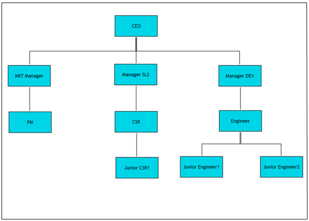
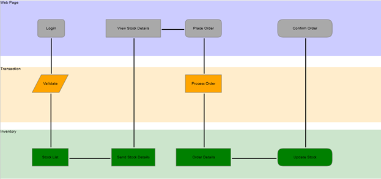

::: {style="DISPLAY: none"}
{#d2h_url_template}{#d2h_package_url style="WIDTH: 0px; DISPLAY: none; HEIGHT: 0px"}
:::

::::: {#nsbanner .d2h_main_nsbanner style="BORDER-BOTTOM: #999999 1px solid; POSITION: relative; PADDING-BOTTOM: 0px; BACKGROUND-COLOR: transparent; PADDING-LEFT: 0px; PADDING-RIGHT: 0px; DISPLAY: none; BORDER-TOP: #999999 1px solid; PADDING-TOP: 0px; LEFT: 0px"}
:::: {#TitleRow .d2h_main_titlerow style="PADDING-BOTTOM: 4px; BACKGROUND-COLOR: transparent; PADDING-LEFT: 22px; WIDTH: 100%; PADDING-RIGHT: 10px; DISPLAY: none; PADDING-TOP: 4px"}
::: {#ienav .d2h_main_ienav style="DISPLAY: none"}
{#D2HPrevious .D2HPreviousEnabled}  {#D2HNext .D2HNextEnabled}
:::
::::
:::::

:::: {#nstext .d2h_main_nstext style="PADDING-BOTTOM: 10px; BACKGROUND-COLOR: transparent; PADDING-LEFT: 22px; PADDING-RIGHT: 10px; HEIGHT: 100%; OVERFLOW: auto; PADDING-TOP: 5px" hasuserbackground="true" valign="bottom"}
::: {#d2h_breadcrumbs .d2h_breadcrumbs}
[Essential Studio User Guide Documentation](ms-xhelp:///?Id=12457748-09e3-4d74-a240-8e049cedf030){.d2h_breadcrumbsNormal}[ \> ]{.d2h_breadcrumbsLinkSeparator}[User Interface Edition](ms-xhelp:///?Id=c29296b7-531c-413b-a0ec-488ca1f7f669){.d2h_breadcrumbsNormal}[ \> ]{.d2h_breadcrumbsLinkSeparator}[Essential ASP.NET MVC](ms-xhelp:///?Id=4b14e7d1-65c4-4f67-b1aa-2c37709905a5){.d2h_breadcrumbsNormal}[ \> ]{.d2h_breadcrumbsLinkSeparator}[Essential Diagram]{.d2h_breadcrumbsContentsOnly}[ \> ]{.d2h_breadcrumbsLinkSeparator}[Overview](ms-xhelp:///?Id=a3da34c6-868c-4232-bc8d-304025be1de5){.d2h_breadcrumbsNormal}
:::

## Introduction to Essential Diagram for ASP.NET MVC {#introduction-to-essential-diagram-for-asp.net-mvc style="tab-stops: 0pt"}

Essential Diagram is an extensible and high-performance .NET diagramming framework for MVC applications that uses HTML 5. It stores graphical objects in a node graph and renders those objects onto the screen.  

Users can either lay out diagram objects explicitly, or allow our built-in layout managers to handle the job, making complex layout diagrams a snap.

Use Case Scenarios[]{style="FONT-FAMILY: 'Times New Roman','serif'; FONT-SIZE: 12pt"}

Essential Diagram for MVC finds its application in various fields. Some of them are listed below: 

[·      ]{style="FONT-FAMILY: Symbol"}Essential Diagram MVC employs automatic layout algorithms to lay out the nodes automatically in a tree structure. This kind of setting is typically useful in creating organizational layouts and for data binding purposes.

 

Figure 1: Organizational Layout

 

[·      ]{style="FONT-FAMILY: Symbol"}Essential Diagram for MVC allows users to create swim-lane diagrams, which group a set of sub-processes in a visual manner by arranging them in lanes. Nodes can be manually placed to create swim lanes.The process in each lane may then be described using the nodes and the flow can be depicted using the connections as illustrated in the following diagram.

 

Figure 2: Swim-Lane Diagram

Key Features

The following are the key features of Essential Diagram for MVC: 

[·      ]{style="FONT-FAMILY: Symbol"}**Modes**---Essential Diagram for MVC supports both SVG and Canvas modes. This is implemented using the HTML 5 elements.

[·      ]{style="FONT-FAMILY: Symbol"}**Nodes---**Nodes are graphical objects that can be drawn on the page by selecting them from the symbol palette and dropping them on the page.

[·      ]{style="FONT-FAMILY: Symbol"}**Transformations**---The following transformations are provided:

[o  ]{style="FONT-FAMILY: 'Courier New'"}Translate: Ability to move the nodes

[o  ]{style="FONT-FAMILY: 'Courier New'"}Scale: Ability to resize the nodes

[o  ]{style="FONT-FAMILY: 'Courier New'"}Remove: Ability to delete the nodes and their connectors

[·      ]{style="FONT-FAMILY: Symbol"}**Connectors**---Connectors are objects that are used to create a link between two nodes. Three types of connectors provided are as follows:

[o  ]{style="FONT-FAMILY: 'Courier New'"}Orthogonal

[o  ]{style="FONT-FAMILY: 'Courier New'"}Bezier

[o  ]{style="FONT-FAMILY: 'Courier New'"}Straight  

[·      ]{style="FONT-FAMILY: Symbol"}**Decorator Shapes---**Decorator shapes can be added to the head and tail of the connectors. Three types of decorator shapes provided are as follows:

[o  ]{style="FONT-FAMILY: 'Courier New'"}Arrow

[o  ]{style="FONT-FAMILY: 'Courier New'"}Diamond

[o  ]{style="FONT-FAMILY: 'Courier New'"}Circle  

[·      ]{style="FONT-FAMILY: Symbol"}**Symbol Palette---**The SymbolPalette control displays the node shapes and connector shapes, and allows dragging the symbols and connectors onto the diagram.

[·      ]{style="FONT-FAMILY: Symbol"}**Label Editor---**A label editor is provided for each node and connector. It enables the user to edit labels at run time.

[·      ]{style="FONT-FAMILY: Symbol"}**Automatic Layout Management**---Essential Diagram MVC provides the ability to set automatic layout the nodes. Several layout types have been provided. They are:

[·      ]{style="FONT-FAMILY: Symbol"}**Directed Tree Layout**---The directed tree layout arranges nodes in a tree-like structure. This layout can be applied to any diagram that is composed of a directed tree graph with unique root and child nodes. []{style="FONT-FAMILY: 'Calibri','sans-serif'"}

[·      ]{style="FONT-FAMILY: Symbol"}**Hierarchical Tree Layout**---The hierarchical tree layout also arranges nodes in a tree-like structure; however, unlike the directed tree layout, the nodes in a hierarchical layout may have multiple parents thereby avoiding the need to specify the root.

[·      ]{style="FONT-FAMILY: Symbol"}**Table Layout**---The table layout arranges the nodes in a tabular structure based on specified intervals between them. The layout depends upon the number of nodes in each row and column specified. The nodes are assigned rows and columns based on the order in which they are added to the model and based on the maximum nodes allowed in that row and column.

[·      ]{style="FONT-FAMILY: Symbol"}**Serialization---**The diagram page can be saved in XML and stream formats for future use. The user can then load the saved page into the current view and start editing the page.[]{style="FONT-FAMILY: 'Calibri','sans-serif'"}

[]{#related-topics}
::::
