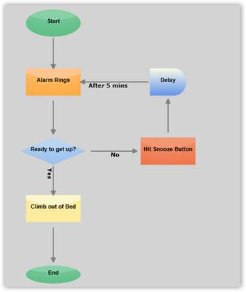
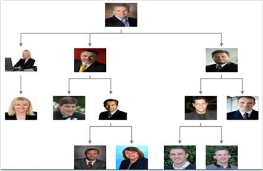
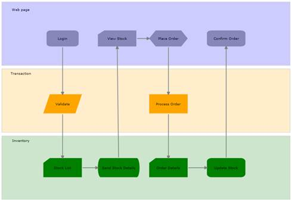
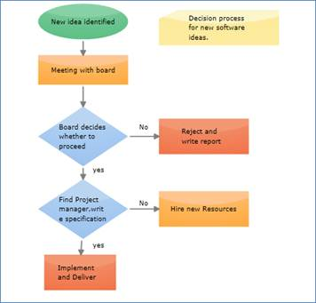

::: {style="DISPLAY: none"}
{#d2h_url_template}{#d2h_package_url style="WIDTH: 0px; DISPLAY: none; HEIGHT: 0px"}
:::

::::: {#nsbanner .d2h_main_nsbanner style="BORDER-BOTTOM: #999999 1px solid; POSITION: relative; PADDING-BOTTOM: 0px; BACKGROUND-COLOR: transparent; PADDING-LEFT: 0px; PADDING-RIGHT: 0px; DISPLAY: none; BORDER-TOP: #999999 1px solid; PADDING-TOP: 0px; LEFT: 0px"}
:::: {#TitleRow .d2h_main_titlerow style="PADDING-BOTTOM: 4px; BACKGROUND-COLOR: transparent; PADDING-LEFT: 22px; WIDTH: 100%; PADDING-RIGHT: 10px; DISPLAY: none; PADDING-TOP: 4px"}
::: {#ienav .d2h_main_ienav style="DISPLAY: none"}
{#D2HPrevious .D2HPreviousEnabled}  {#D2HNext .D2HNextEnabled}
:::
::::
:::::

::::: {#nstext .d2h_main_nstext style="PADDING-BOTTOM: 10px; BACKGROUND-COLOR: transparent; PADDING-LEFT: 22px; PADDING-RIGHT: 10px; HEIGHT: 100%; OVERFLOW: auto; PADDING-TOP: 5px" hasuserbackground="true" valign="bottom"}
::: {#d2h_breadcrumbs .d2h_breadcrumbs}
[Essential Studio User Guide Documentation](ms-xhelp:///?Id=12457748-09e3-4d74-a240-8e049cedf030){.d2h_breadcrumbsNormal}[ \> ]{.d2h_breadcrumbsLinkSeparator}[User Interface Edition](ms-xhelp:///?Id=c29296b7-531c-413b-a0ec-488ca1f7f669){.d2h_breadcrumbsNormal}[ \> ]{.d2h_breadcrumbsLinkSeparator}[Essential Silverlight](ms-xhelp:///?Id=66221bd1-ba2e-43c2-94a7-618f50e01d24){.d2h_breadcrumbsNormal}[ \> ]{.d2h_breadcrumbsLinkSeparator}[Essential Diagram]{.d2h_breadcrumbsContentsOnly}[ \> ]{.d2h_breadcrumbsLinkSeparator}[Overview](ms-xhelp:///?Id=f1d5a770-8850-4b97-887b-3d0865e8c02e){.d2h_breadcrumbsNormal}
:::

## Introduction to Essential Diagram Silverlight {#introduction-to-essential-diagram-silverlight style="tab-stops: 0pt"}

Essential Diagram Silverlight is an extensible and high-performance diagramming framework for Silverlight applications. It can be used by the developers who want to develop Microsoft Visio-like interactive graphics and diagramming applications. It stores graphical objects in a node graph and renders those objects on the screen. 

 

*** ***A node graph is a structure consisting of nodes connected to each other by lines referred to as edges.

 

Essential Diagram supports both vector and raster graphics on the drawing surface.

****** A raster (bitmap) image uses a grid of individual pixels where each pixel can be a different color or shade. Bitmaps are composed of pixels.

Vector graphics use mathematical relationships between points and the paths connecting them to describe an image. Vector graphics are composed of paths.

 

Essential Diagram Silverlight lets the user to create interactive diagrams easily. 

 

Real World Scenarios

[]{style="FONT-FAMILY: 'Trebuchet MS','sans-serif'; COLOR: #15428b; FONT-SIZE: 9pt"} 

Essential Diagram Silverlight finds its application in various fields; some of them are listed below:

[]{style="FONT-FAMILY: 'Trebuchet MS','sans-serif'; COLOR: #15428b; FONT-SIZE: 9pt"} 

[·      ]{style="FONT-FAMILY: Symbol"}Essential Diagram Silverlight can be effectively used to create process flow diagrams and flow charts. The connectors with a label depict the process flow from one level to another.

 

Figure 1: Flow Chart[]{style="FONT-FAMILY: 'Trebuchet MS','sans-serif'; COLOR: #15428b"}

[]{style="FONT-FAMILY: 'Trebuchet MS','sans-serif'; COLOR: #15428b; FONT-SIZE: 9pt"} 

[·      ]{style="FONT-FAMILY: Symbol"}Essential Diagram Silverlight employs automatic layout algorithms to layout the nodes automatically in a tree structure. This kind of setting is typically useful in creating Organizational Layout and for data binding purposes.

[]{style="FONT-FAMILY: 'Trebuchet MS','sans-serif'; COLOR: #15428b; FONT-SIZE: 9pt"} 

Figure 2: Organizational Layout[]{style="FONT-FAMILY: 'Trebuchet MS','sans-serif'; COLOR: #15428b"}

[]{style="FONT-FAMILY: 'Trebuchet MS','sans-serif'; COLOR: #15428b; FONT-SIZE: 9pt"} 

[·      ]{style="FONT-FAMILY: Symbol"}Essential Diagram Silverlight allows the user to create Swim lane diagrams, which groups a set of sub processes in a visual manner, by arranging them in lanes. Nodes can be manually placed to create swim lanes.The process in each lane may then be described using the nodes and the flow can be depicted using the connections as illustrated in the following diagram.

[]{style="FONT-FAMILY: 'Trebuchet MS','sans-serif'; COLOR: #15428b; FONT-SIZE: 9pt"} 

Figure 3: Swin Lane Diagram[]{style="FONT-FAMILY: 'Trebuchet MS','sans-serif'; COLOR: #15428b"}

[]{style="FONT-FAMILY: 'Trebuchet MS','sans-serif'; COLOR: #15428b; FONT-SIZE: 9pt"} 

[·      ]{style="FONT-FAMILY: Symbol"}Essential Diagram Silverlight allows creating a Data Flow Diagram (DFD), which is a graphical representation of the \"flow\" of data through an information system. DFDs can also be used for the visualization of data processing

[]{style="FONT-FAMILY: 'Trebuchet MS','sans-serif'; COLOR: #15428b; FONT-SIZE: 9pt"} 

Figure 4: Data Flow Diagram[]{style="FONT-FAMILY: 'Trebuchet MS','sans-serif'; COLOR: #15428b"}

***[]{style="FONT-FAMILY: 'Trebuchet MS','sans-serif'; COLOR: #15428b; FONT-SIZE: 9pt"}*** 

[]{style="FONT-FAMILY: 'Trebuchet MS','sans-serif'; COLOR: #15428b; FONT-SIZE: 9pt"} 

Key Features

[]{style="FONT-FAMILY: 'Trebuchet MS','sans-serif'; COLOR: #15428b; FONT-SIZE: 9pt"} 

The following are the key features of Essential Diagram Silverlight:

[]{style="FONT-FAMILY: 'Trebuchet MS','sans-serif'; COLOR: #15428b; FONT-SIZE: 9pt"} 

[·      ]{style="FONT-FAMILY: Symbol"}**Nodes -** Nodes are graphical objects that can be drawn on the page by selecting them from the Symbol Palette and dropping them on the page.

[]{style="FONT-FAMILY: 'Trebuchet MS','sans-serif'; COLOR: #15428b; FONT-SIZE: 9pt"} 

[·      ]{style="FONT-FAMILY: Symbol"}**Transformations** - The following transformations are provided:

[·    ]{style="FONT-FAMILY: Symbol"}Translate: Ability to move the nodes.

[·    ]{style="FONT-FAMILY: Symbol"}Rotate: Ability to rotate the nodes.

[·    ]{style="FONT-FAMILY: Symbol"}Scale: Ability to resize the nodes.

 

[·      ]{style="FONT-FAMILY: Symbol"}**Groups and Ungroup -** Essential Diagram Silverlight provides support to group and ungroup nodes. The Grouping feature comes in handy when you want to apply the same edits to a number of objects and yet retain their individuality. All the operations performed on the group also affect the individual items in the group. However any item in the group can also be edited individually. On ungrouping, the items in the group again act as individual entities.

[]{style="FONT-FAMILY: 'Trebuchet MS','sans-serif'; COLOR: #15428b; FONT-SIZE: 9pt"} 

[·      ]{style="FONT-FAMILY: Symbol"}**Connectors -** Connectors are the objects that are used to create a link between two nodes. Three types of connectors provided are as follows:

[·      ]{style="FONT-FAMILY: Symbol"}Orthogonal

[·      ]{style="FONT-FAMILY: Symbol"}Bezier

[·      ]{style="FONT-FAMILY: Symbol"}Straight**\
\**

[·      ]{style="FONT-FAMILY: Symbol"}**Custom Ports -** Essential Diagram Silverlight provides the ability to define custom ports for making connections. The **ConnectionPort** class can be used for defining custom ports on the nodes. Any number of ports can be defined on a node. The user can define a port on any part of the node and make connection to that port. The port\'s visibility can also be controlled. Several customizable properties have been provided for the port.

 

[·      ]{style="FONT-FAMILY: Symbol"}**Decorator Shapes -** Decorator shapes can be added to the head and tail of the connectors. Three types of decorator shapes provided are as follows:

[·      ]{style="FONT-FAMILY: Symbol"}Arrow

[·      ]{style="FONT-FAMILY: Symbol"}Diamond

[·      ]{style="FONT-FAMILY: Symbol"}Circle

 

[·      ]{style="FONT-FAMILY: Symbol"}**Rulers -** Horizontal and vertical rulers are provided to indicate the coordinates of the mouse position with respect to the view.

 

[·      ]{style="FONT-FAMILY: Symbol"}**Symbol Palette -** The Symbol Palette control displays the node shapes and allows a user to drag the symbols onto the diagram. It supports grouping and filtering of symbols, and it is implemented based on the Syncfusion\'s Gallery control. Also, custom shapes can be added to the Symbol Palette.

 

[·      ]{style="FONT-FAMILY: Symbol"}**Label Editor -** A label editor is provided for each node and connector. It enables the user to edit labels at run time if **IsLabelEditable** property is set to true for the corresponding object.

 

[·      ]{style="FONT-FAMILY: Symbol"}**Customizable -** The control is highly customizable and extensible. Customization is easy, and custom UI tools can be easily created and registered.

 

[·      ]{style="FONT-FAMILY: Symbol"}**Automatic Layout Management -** Essential Diagram Silverlight provides the ability to set automatic layout the nodes. Several layout types have been provided. They are:

[]{style="COLOR: black"} 

[·      ]{style="FONT-FAMILY: Symbol"}**DirectedTree Layout** - The DirectedTree layout arranges nodes in a tree-like structure. This layout can be applied to any diagram that is composed of a directed tree graph with unique root and child nodes.

[]{style="COLOR: black"} 

[·      ]{style="FONT-FAMILY: Symbol"}**HierarchicalTree Layout** - The HierarchicalTree layout also arranges nodes in a tree-like structure; however, unlike the directed tree layout, the nodes in hierarchical layout may have multiple parents thereby avoiding the need to specify the root.

 

[·      ]{style="FONT-FAMILY: Symbol"}**RadialTree Layout -** The Radial Tree Layout Manager is a specialization of the Directed Tree Layout Manager that employs a circular layout algorithm for locating the diagram nodes. The RadialTreeLayoutManager arranges nodes in a circular layout, positioning the root node at the center of the graph and the child nodes in a circular fashion around the root. Sub-trees formed by the branching of child nodes are located radially around the child nodes. This arrangement results in an ever-expanding concentric arrangement with radial proximity to the root node indicating the node level in the hierarchy.

 

[·      ]{style="FONT-FAMILY: Symbol"}**Table Layout** - The Table layout arranges the nodes in a tabular structure based on specified intervals between them. The layout depends upon the number of nodes in each row and column specified. The nodes are assigned rows and columns based on the order in which they are added to the model and based on the maximum nodes allowed in that row and column.

 

**Serialization -** The Diagram Page can be saved in XAML format for future use. The user can then load the saved page into the current view and start editing the page.

**[]{style="FONT-FAMILY: 'Trebuchet MS','sans-serif'; COLOR: #15428b; FONT-SIZE: 9pt"}** 

User Guide Organization

**[]{style="FONT-FAMILY: 'Trebuchet MS','sans-serif'; COLOR: #15428b"}** 

The product comes with numerous samples as well as an extensive documentation to guide you. This User Guide provides detailed information on the features and functionalities of the Essential Diagram for Silverlight. It is organized into the following sections:

[·      ]{style="FONT-FAMILY: Symbol"}**Overview**-This section gives a brief introduction to the product and its key features.

[·      ]{style="FONT-FAMILY: Symbol"}**Installation and Deployment**-This section elaborates on the install location of the samples, license and so on.

[·      ]{style="FONT-FAMILY: Symbol"}**What\'s New**-This section lists the new features implemented for every release.

[·      ]{style="FONT-FAMILY: Symbol"}**Getting Started**-This section guides you on getting started with Silverlight application, controls and so on.

[·      ]{style="FONT-FAMILY: Symbol"}**Concepts and Features**-The features of individual controls are illustrated with use case scenarios, code examples and screen shots under this section.

[]{style="FONT-FAMILY: 'Trebuchet MS','sans-serif'; COLOR: #15428b; FONT-SIZE: 9pt"} 

Document Conventions[ ]{style="FONT-SIZE: 9pt"}

The conventions below will help you to quickly identify the important sections of information, while using the content:

[]{style="FONT-FAMILY: 'Trebuchet MS','sans-serif'; COLOR: #15428b; FONT-SIZE: 9pt"} 

::: {align="center"}
  ------------------------ ------------------------------------------------------------------------------ --------------------------------------------------------------------------------
  Convention               Icon                                                                           Description of the Icon
  Note                      ***Note:***                                       Represents important information.
  Example                  **Example:**                                                                   Represents an example.
  Tip                                                                         Represents useful hints that will help you in using the controls and features.
  Additional information      Represents additional information on the corresponding topic.
  ------------------------ ------------------------------------------------------------------------------ --------------------------------------------------------------------------------
:::

[]{style="FONT-FAMILY: 'Trebuchet MS','sans-serif'; COLOR: red; FONT-SIZE: 9pt"} 

[]{#related-topics}
:::::
