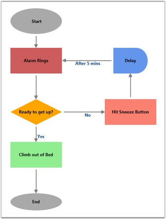
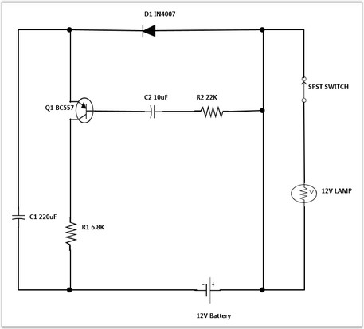
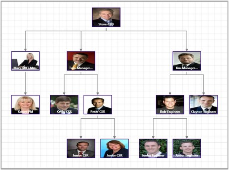
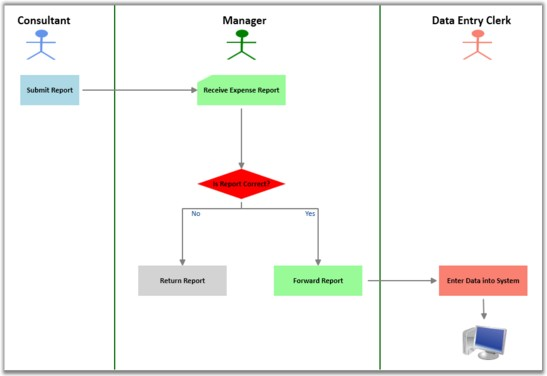
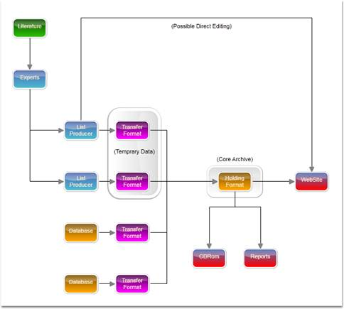
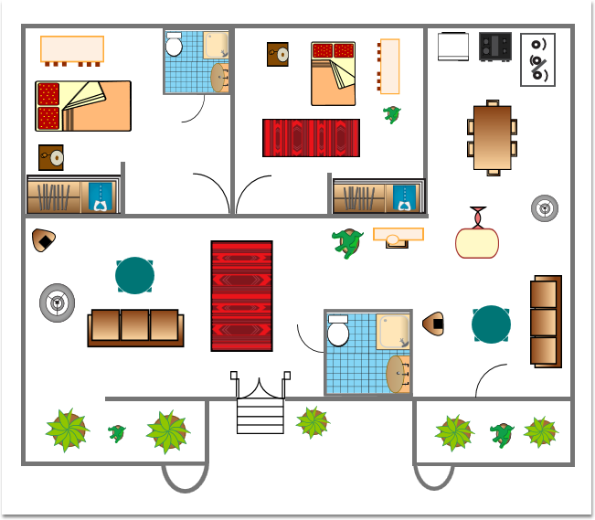

::: {style="DISPLAY: none"}
{#d2h_url_template}{#d2h_package_url style="WIDTH: 0px; DISPLAY: none; HEIGHT: 0px"}
:::

::::: {#nsbanner .d2h_main_nsbanner style="BORDER-BOTTOM: #999999 1px solid; POSITION: relative; PADDING-BOTTOM: 0px; BACKGROUND-COLOR: transparent; PADDING-LEFT: 0px; PADDING-RIGHT: 0px; DISPLAY: none; BORDER-TOP: #999999 1px solid; PADDING-TOP: 0px; LEFT: 0px"}
:::: {#TitleRow .d2h_main_titlerow style="PADDING-BOTTOM: 4px; BACKGROUND-COLOR: transparent; PADDING-LEFT: 22px; WIDTH: 100%; PADDING-RIGHT: 10px; DISPLAY: none; PADDING-TOP: 4px"}
::: {#ienav .d2h_main_ienav style="DISPLAY: none"}
{#D2HPrevious .D2HPreviousEnabled}  {#D2HNext .D2HNextEnabled}
:::
::::
:::::

::::: {#nstext .d2h_main_nstext style="PADDING-BOTTOM: 10px; BACKGROUND-COLOR: transparent; PADDING-LEFT: 22px; PADDING-RIGHT: 10px; HEIGHT: 100%; OVERFLOW: auto; PADDING-TOP: 5px" hasuserbackground="true" valign="bottom"}
::: {#d2h_breadcrumbs .d2h_breadcrumbs}
[Essential Studio User Guide Documentation](ms-xhelp:///?Id=12457748-09e3-4d74-a240-8e049cedf030){.d2h_breadcrumbsNormal}[ \> ]{.d2h_breadcrumbsLinkSeparator}[User Interface Edition](ms-xhelp:///?Id=c29296b7-531c-413b-a0ec-488ca1f7f669){.d2h_breadcrumbsNormal}[ \> ]{.d2h_breadcrumbsLinkSeparator}[Essential WPF](ms-xhelp:///?Id=7f4f82c5-151c-4262-94d0-75c4626c77bc){.d2h_breadcrumbsNormal}[ \> ]{.d2h_breadcrumbsLinkSeparator}[Essential Diagram]{.d2h_breadcrumbsContentsOnly}[ \> ]{.d2h_breadcrumbsLinkSeparator}[Overview](ms-xhelp:///?Id=11ed3a5b-f606-4e27-b232-e6e7ff6df7d7){.d2h_breadcrumbsNormal}
:::

## Introduction to Essential Diagram WPF {#introduction-to-essential-diagram-wpf style="tab-stops: 0pt"}

[]{style="FONT-FAMILY: 'Trebuchet MS','sans-serif'; COLOR: #15428b; FONT-SIZE: 9pt"} 

Essential Diagram WPF is an extensible and high-performance diagramming framework for WPF applications. It can be used by the developers who want to develop Microsoft Visio-like interactive graphics and diagramming applications. It stores graphical objects in a node graph and renders those objects on the screen. 

[]{style="FONT-FAMILY: 'Trebuchet MS','sans-serif'; COLOR: #15428b; FONT-SIZE: 9pt"} 

*** ***A node graph is a structure consisting of nodes connected to each other by lines referred to as edges.

[]{style="FONT-FAMILY: 'Trebuchet MS','sans-serif'; COLOR: #15428b; FONT-SIZE: 9pt"} 

Essential Diagram supports both vector and raster graphics on the drawing surface.

[]{style="FONT-FAMILY: 'Trebuchet MS','sans-serif'; COLOR: #15428b; FONT-SIZE: 9pt"} 

 A raster (bitmap) image uses a grid of individual pixels where each pixel can be a different color or shade. Bitmaps are composed of pixels.

Vector graphics use mathematical relationships between points and the paths connecting them to describe an image. Vector graphics are composed of paths.

[]{style="FONT-FAMILY: 'Trebuchet MS','sans-serif'; COLOR: #15428b; FONT-SIZE: 9pt"} 

Essential Diagram WPF lets the user to create interactive diagrams easily. 

[]{style="FONT-FAMILY: 'Trebuchet MS','sans-serif'; COLOR: #15428b; FONT-SIZE: 9pt"} 

Real World Scenarios

[]{style="FONT-FAMILY: 'Trebuchet MS','sans-serif'; COLOR: #15428b; FONT-SIZE: 9pt"} 

Essential Diagram WPF finds its application in various fields; some of them are listed below.

[]{style="FONT-FAMILY: 'Trebuchet MS','sans-serif'; COLOR: #15428b; FONT-SIZE: 9pt"} 

[·      ]{style="FONT-FAMILY: Symbol"}Essential Diagram WPF can be effectively used to create process flow diagrams and flow charts. The connectors with a label depict the process flow from one level to another.

[]{style="FONT-FAMILY: 'Trebuchet MS','sans-serif'; COLOR: #15428b; FONT-SIZE: 9pt"} 

Figure 1: Flow Chart

[]{style="FONT-FAMILY: 'Trebuchet MS','sans-serif'; COLOR: #15428b; FONT-SIZE: 9pt"} 

[·      ]{style="FONT-FAMILY: Symbol"}Essential Diagram WPF can be used to create electrical diagrams. The electrical shapes can be loaded to the SymbolPalette and can be dragged to the drawing surface. Connections can then be made as desired and the circuit diagrams can be created.

[]{style="FONT-FAMILY: 'Trebuchet MS','sans-serif'; COLOR: #15428b; FONT-SIZE: 9pt"} 

Figure 2: Electrical Diagram[]{style="FONT-FAMILY: 'Trebuchet MS','sans-serif'; COLOR: #15428b"}

[]{style="FONT-FAMILY: 'Trebuchet MS','sans-serif'; COLOR: #15428b; FONT-SIZE: 9pt"} 

[·      ]{style="FONT-FAMILY: Symbol"}Essential Diagram WPF employs automatic layout algorithms to layout the nodes automatically in a tree structure. This kind of setting is typically useful in creating Organizational Layout and for data binding purposes.

[]{style="FONT-FAMILY: 'Trebuchet MS','sans-serif'; COLOR: #15428b; FONT-SIZE: 9pt"} 

Figure 3: Organizational Layout[]{style="FONT-FAMILY: 'Trebuchet MS','sans-serif'; COLOR: #15428b"}

[]{style="FONT-FAMILY: 'Trebuchet MS','sans-serif'; COLOR: #15428b; FONT-SIZE: 9pt"} 

[·      ]{style="FONT-FAMILY: Symbol"}Essential Diagram WPF allows the user to create Swim lane diagrams, which groups a set of sub processes in a visual manner, by arranging them in lanes. Nodes can be manually placed to create swim lanes. The process in each lane may then be described using the nodes and the flow can be depicted using the connections as illustrated in the following diagram.

[]{style="FONT-FAMILY: 'Trebuchet MS','sans-serif'; COLOR: #15428b; FONT-SIZE: 9pt"} 

Figure 4: Swim Lane Diagram[]{style="FONT-FAMILY: 'Trebuchet MS','sans-serif'; COLOR: #15428b"}

[]{style="FONT-FAMILY: 'Trebuchet MS','sans-serif'; COLOR: #15428b; FONT-SIZE: 9pt"} 

[·      ]{style="FONT-FAMILY: Symbol"}Essential Diagram WPF allows creating a Data Flow Diagram, A data-flow diagram (DFD) is a graphical representation of the \"flow\" of data through an information system. DFDs can also be used for the visualization of data processing.

[]{style="FONT-FAMILY: 'Trebuchet MS','sans-serif'; COLOR: #15428b; FONT-SIZE: 9pt"} 

Figure 5: Data Flow Diagram[]{style="FONT-FAMILY: 'Trebuchet MS','sans-serif'; COLOR: #15428b"}

[]{style="FONT-FAMILY: 'Trebuchet MS','sans-serif'; COLOR: #15428b; FONT-SIZE: 9pt"} 

[·      ]{style="FONT-FAMILY: Symbol"}Essential Diagram WPF allows to create a Floor Plan,

Figure 6: Floor Plan[]{style="FONT-FAMILY: 'Trebuchet MS','sans-serif'; COLOR: #15428b"}

[]{style="FONT-FAMILY: 'Trebuchet MS','sans-serif'; COLOR: #15428b; FONT-SIZE: 9pt"} 

Key Features

[]{style="FONT-FAMILY: 'Trebuchet MS','sans-serif'; COLOR: #15428b; FONT-SIZE: 9pt"} 

The following are the key features of Essential Diagram WPF:

[]{style="FONT-FAMILY: 'Trebuchet MS','sans-serif'; COLOR: #15428b; FONT-SIZE: 9pt"} 

[·      ]{style="FONT-FAMILY: Symbol"}**Nodes -** Nodes are graphical objects that can be drawn on the page by selecting them from the SymbolPalette and dropping them on the page.

[·      ]{style="FONT-FAMILY: Symbol"}**Transformations** - The following transformations are provided:

[o  ]{style="FONT-FAMILY: 'Courier New'"}Translate: Ability to move the nodes.

[o  ]{style="FONT-FAMILY: 'Courier New'"}Rotate: Ability to rotate the nodes.

[o  ]{style="FONT-FAMILY: 'Courier New'"}Scale: Ability to resize the nodes.

[·      ]{style="FONT-FAMILY: Symbol"}**Groups and Ungroup -** Essential Diagram WPF provides support to group and ungroup nodes. Grouping feature comes in handy when you want to apply the same edits to a number of objects and yet retain their individuality. All the operations performed on the group also affects the individual items in the group. However any item in the group can also be edited individually. On ungrouping, the items in the group again act as individual entities.

[·      ]{style="FONT-FAMILY: Symbol"}**Layers -** Essential Diagram for WPF supports layer display. Numerous nodes and line connectors can be added to a layer and the visible property of its contents can be hidden by changing the visible property of the layer. A node or line connector can be added to any number of layers, and the node is visible only if the all layers to which this node or line connector belongs to are visible.

[·      ]{style="FONT-FAMILY: Symbol"}**Connectors -** Connectors are the objects that are used to create a link between two nodes. Three types of connectors provided are as follows:

[o  ]{style="FONT-FAMILY: 'Courier New'"}Orthogonal

[o  ]{style="FONT-FAMILY: 'Courier New'"}Bezier

[o  ]{style="FONT-FAMILY: 'Courier New'"}Straight**\
\**

[·      ]{style="FONT-FAMILY: Symbol"}LineBridging - Line Bridging creates a bridge for lines to smartly cross over other line at points of intersection.

When two line connectors meets each other, line with higher z-order will draw an arc over the line with lower z-order.

Only Straight and Orthogonal Connector type supports line bridging.

[]{style="FONT-FAMILY: 'Trebuchet MS','sans-serif'; COLOR: #15428b; FONT-SIZE: 9pt"} 

[·      ]{style="FONT-FAMILY: Symbol"}**Custom Ports -** Essential Diagram WPF provides the ability to define custom ports for making connections. The **ConnectionPort** class can be used for defining custom ports on the nodes. Any number of ports can be defined on a node. The user can define a port on any part of the node and make connection to that port. The port\'s visibility can also be controlled. Several customizable properties have been provided for the port.

[]{style="FONT-FAMILY: 'Trebuchet MS','sans-serif'; COLOR: #15428b; FONT-SIZE: 9pt"} 

[·      ]{style="FONT-FAMILY: Symbol"}**Decorator Shapes -** Decorator shapes can be added to the head and tail of the connectors. Three types of decorator shapes provided are as follows:

[o  ]{style="FONT-FAMILY: 'Courier New'"}Arrow

[o  ]{style="FONT-FAMILY: 'Courier New'"}Diamond

[o  ]{style="FONT-FAMILY: 'Courier New'"}Circle

[]{style="FONT-FAMILY: 'Trebuchet MS','sans-serif'; COLOR: #15428b; FONT-SIZE: 9pt"} 

[·      ]{style="FONT-FAMILY: Symbol"}**Export -** Essential Diagram for WPF offers capabilities to export a diagram representation into various formats. The formats include JPEG, BMP, PNG, TIFF, GIF, WDP and XAML.

[]{style="FONT-FAMILY: 'Trebuchet MS','sans-serif'; COLOR: #15428b; FONT-SIZE: 9pt"} 

[·      ]{style="FONT-FAMILY: Symbol"}**Command Architecture -** Essential Diagram for WPF provides several commands. They are:

[o  ]{style="FONT-FAMILY: 'Courier New'"}Zoom Commands

[o  ]{style="FONT-FAMILY: 'Courier New'"}Alignment Commands

[o  ]{style="FONT-FAMILY: 'Courier New'"}Spacing and Sizing Commands

[o  ]{style="FONT-FAMILY: 'Courier New'"}Group and Ungroup Commands

[o  ]{style="FONT-FAMILY: 'Courier New'"}Undo and Redo Commands

[o  ]{style="FONT-FAMILY: 'Courier New'"}Z-order Commands

[o  ]{style="FONT-FAMILY: 'Courier New'"}Nudge Commands

[o  ]{style="FONT-FAMILY: 'Courier New'"}Clipboard Commands

[o  ]{style="FONT-FAMILY: 'Courier New'"}Delete Command

[]{style="FONT-FAMILY: 'Trebuchet MS','sans-serif'; COLOR: #15428b; FONT-SIZE: 9pt"} 

[·      ]{style="FONT-FAMILY: Symbol"}**Zooming, Scrolling and Panning -** Zooming, scrolling, and panning are supported and can be achieved using sufficient interactive diagram tools.

[·      ]{style="FONT-FAMILY: Symbol"}

[·      ]{style="FONT-FAMILY: Symbol"}**Grid Lines -** The drawing area of the Diagram control can be rendered with horizontal and vertical Grid lines.

[·      ]{style="FONT-FAMILY: Symbol"}

[·      ]{style="FONT-FAMILY: Symbol"}**Rulers -** Horizontal and vertical rulers are provided to indicate the coordinates of the mouse position with respect to the view.

[·      ]{style="FONT-FAMILY: Symbol"}

[·      ]{style="FONT-FAMILY: Symbol"}**Measurement Units -** As different fields require different units of measure, several measurement units are provided such that the end-users can choose the unit that is most comfortable and suitable for their use.

[·      ]{style="FONT-FAMILY: Symbol"}

[·      ]{style="FONT-FAMILY: Symbol"}**SymbolPalette -** The SymbolPalette control displays the node shapes and allows a user to drag the symbols onto the diagram. It supports grouping and filtering of symbols, and it is implemented based on the Syncfusion\'s Gallery control. Also, custom shapes can be added to the SymbolPalette.

[·      ]{style="FONT-FAMILY: Symbol"}

[·      ]{style="FONT-FAMILY: Symbol"}**Label Editor -** A label editor is provided for each node and connector; it enables the user to edit labels at run time if **IsLabelEditable** property is set to true for the corresponding object.

[·      ]{style="FONT-FAMILY: Symbol"}

[·      ]{style="FONT-FAMILY: Symbol"}**Customizable -** The control is highly customizable and extensible. Customization is easy, and custom UI tools can be easily created and registered.

[·      ]{style="FONT-FAMILY: Symbol"}

[·      ]{style="FONT-FAMILY: Symbol"}**Automatic Layout Management -** Essential Diagram WPF provides the ability to set automatic layout for the nodes. Several layout types have been provided. They are:

[]{style="COLOR: black"} 

[o  ]{style="FONT-FAMILY: 'Courier New'"}**DirectedTree Layout** - The DirectedTree layout arranges nodes in a tree-like structure. This layout can be applied to any diagram that is composed of a directed tree graph with unique root and child nodes.

[o  ]{style="FONT-FAMILY: 'Courier New'; COLOR: black"}[]{style="COLOR: black"}

[o  ]{style="FONT-FAMILY: 'Courier New'"}**HierarchicalTree Layout** - The HierarchicalTree layout also arranges nodes in a tree-like structure; however, unlike the directed tree layout, the nodes in hierarchical layout may have multiple parents hence avoiding the need to specify the root.

[o  ]{style="FONT-FAMILY: 'Courier New'"}

[o  ]{style="FONT-FAMILY: 'Courier New'"}**RadialTree Layout -** The Radial-TreeLayoutis a specialization of the Directed Tree Layout Manager that employs a circular layout algorithm for locating the diagram nodes. The RadialTreeLayoutManager arranges nodes in a circular layout, positioning the root node at the center of the graph and the child nodes in a circular fashion around the root. Sub-trees formed by the branching of child nodes are located radially around the child nodes. This arrangement results in an ever-expanding concentric arrangement with radial proximity to the root node indicating the node level in the hierarchy.

 

[o  ]{style="FONT-FAMILY: 'Courier New'"}**Table Layout** - The Table layout arranges the nodes in a tabular structure based on specified intervals between them. The layout depends upon the number of nodes in each row and column specified. The nodes are assigned rows and columns based on the order in which they are added to the model and based on the maximum nodes allowed in that row and column.

[·      ]{style="FONT-FAMILY: Symbol"}**Serialization -** The Diagram Page can be saved in XAML format for future use. The user can then load the saved page into the current view and start editing the page.

[]{style="FONT-FAMILY: 'Trebuchet MS','sans-serif'; COLOR: #15428b; FONT-SIZE: 9pt"} 

[·      ]{style="FONT-FAMILY: Symbol"}**Event Mechanisms -** Several events have been provided for nodes and connections.

[]{style="FONT-FAMILY: 'Trebuchet MS','sans-serif'; COLOR: #15428b; FONT-SIZE: 9pt"} 

[·      ]{style="FONT-FAMILY: Symbol"}**Print and Print Preview -** This feature enables the user to set a printer to be used, and it allows the user to define the pages and the number of copies that should be printed. It also provides an overview of the document, showing how the document will appear when printed.

[]{style="FONT-FAMILY: 'Trebuchet MS','sans-serif'; COLOR: #15428b; FONT-SIZE: 9pt"} 

[]{style="FONT-FAMILY: 'Trebuchet MS','sans-serif'; COLOR: #15428b; FONT-SIZE: 9pt"} 

User Guide Organization

**[]{style="FONT-FAMILY: 'Trebuchet MS','sans-serif'; COLOR: #15428b"}** 

The product comes with numerous samples as well as an extensive documentation to guide you. This User Guide provides detailed information on the features and functionalities of the Essential Diagram for WPF. It is organized into the following sections:\
\

[·      ]{style="FONT-FAMILY: Symbol"}**Overview**-This section gives a brief introduction to the product and its key features.

[·      ]{style="FONT-FAMILY: Symbol"}**Installation and Deployment**-This section elaborates on the install location of the samples, license etc.

[·      ]{style="FONT-FAMILY: Symbol"}**What\'s New**-This section lists the new features implemented for every release.

[·      ]{style="FONT-FAMILY: Symbol"}**Getting Started**-This section guides you on getting started with WPF application, controls etc.

[·      ]{style="FONT-FAMILY: Symbol"}**Concepts and Features**-The features of individual controls are illustrated with use case scenarios, code examples and screen shots under this section.

[]{style="FONT-FAMILY: 'Trebuchet MS','sans-serif'; COLOR: #15428b; FONT-SIZE: 9pt"} 

Document Conventions[ ]{style="FONT-SIZE: 9pt"}

[]{style="FONT-FAMILY: 'Trebuchet MS','sans-serif'; COLOR: #15428b; FONT-SIZE: 9pt"} 

The conventions below will help you to quickly identify the important sections of information, while using the content:

[]{style="FONT-FAMILY: 'Trebuchet MS','sans-serif'; COLOR: #15428b; FONT-SIZE: 9pt"} 

::: {align="center"}
+------------------------+--------------------------------------------------------------------------------------------------------------------------------------------------------------------------------------------------------------------------------------------------------------+---------------------------------------------------------------------------------+
| Convention             | Icon                                                                                                                                                                                                                                                         | Description of the Icon                                                         |
+------------------------+--------------------------------------------------------------------------------------------------------------------------------------------------------------------------------------------------------------------------------------------------------------+---------------------------------------------------------------------------------+
| Note                   | ::: {style="BORDER-BOTTOM: windowtext 1pt solid; BORDER-LEFT: medium none; PADDING-BOTTOM: 1pt; MARGIN-TOP: 12pt; PADDING-LEFT: 0pt; PADDING-RIGHT: 0pt; MARGIN-BOTTOM: 0pt; BORDER-TOP: windowtext 1pt solid; BORDER-RIGHT: medium none; PADDING-TOP: 1pt"} | Represents important information.                                               |
|                        |  Note:                                                                                                                                                                                                                           |                                                                                 |
|                        | :::                                                                                                                                                                                                                                                          |                                                                                 |
+------------------------+--------------------------------------------------------------------------------------------------------------------------------------------------------------------------------------------------------------------------------------------------------------+---------------------------------------------------------------------------------+
| Example                | **Example:**                                                                                                                                                                                                                                                 | Represents an example.                                                          |
+------------------------+--------------------------------------------------------------------------------------------------------------------------------------------------------------------------------------------------------------------------------------------------------------+---------------------------------------------------------------------------------+
| Tip                    |                                                                                                                                                                                                                                  | Represents useful hints, that will help you in using the controls and features. |
+------------------------+--------------------------------------------------------------------------------------------------------------------------------------------------------------------------------------------------------------------------------------------------------------+---------------------------------------------------------------------------------+
| Additional information |                                                                                                                                                                                                                                 | Represents additional information on the corresponding topic.                   |
+------------------------+--------------------------------------------------------------------------------------------------------------------------------------------------------------------------------------------------------------------------------------------------------------+---------------------------------------------------------------------------------+
:::

[]{style="FONT-FAMILY: 'Trebuchet MS','sans-serif'; COLOR: red; FONT-SIZE: 9pt"} 

[]{#related-topics}
:::::
