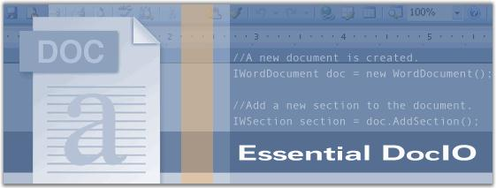

::: {style="DISPLAY: none"}
{#d2h_url_template}{#d2h_package_url style="WIDTH: 0px; DISPLAY: none; HEIGHT: 0px"}
:::

::::: {#nsbanner .d2h_main_nsbanner style="BORDER-BOTTOM: #999999 1px solid; POSITION: relative; PADDING-BOTTOM: 0px; BACKGROUND-COLOR: transparent; PADDING-LEFT: 0px; PADDING-RIGHT: 0px; DISPLAY: none; BORDER-TOP: #999999 1px solid; PADDING-TOP: 0px; LEFT: 0px"}
:::: {#TitleRow .d2h_main_titlerow style="PADDING-BOTTOM: 4px; BACKGROUND-COLOR: transparent; PADDING-LEFT: 22px; WIDTH: 100%; PADDING-RIGHT: 10px; DISPLAY: none; PADDING-TOP: 4px"}
::: {#ienav .d2h_main_ienav style="DISPLAY: none"}
{#D2HPrevious .D2HPreviousEnabled}  {#D2HNext .D2HNextEnabled}
:::
::::
:::::

::::: {#nstext .d2h_main_nstext style="PADDING-BOTTOM: 10px; BACKGROUND-COLOR: transparent; PADDING-LEFT: 22px; PADDING-RIGHT: 10px; HEIGHT: 100%; OVERFLOW: auto; PADDING-TOP: 5px" hasuserbackground="true" valign="bottom"}
::: {#d2h_breadcrumbs .d2h_breadcrumbs}
[Essential Studio User Guide Documentation](ms-xhelp:///?Id=12457748-09e3-4d74-a240-8e049cedf030){.d2h_breadcrumbsNormal}[ \> ]{.d2h_breadcrumbsLinkSeparator}[Reporting Edition](ms-xhelp:///?Id=027aa5b6-6676-4f93-ad23-c20e8c45792e){.d2h_breadcrumbsNormal}[ \> ]{.d2h_breadcrumbsLinkSeparator}[Essential DocIO](ms-xhelp:///?Id=b88d77b3-4c51-460f-a761-d2ef6d5b0ca6){.d2h_breadcrumbsNormal}[ \> ]{.d2h_breadcrumbsLinkSeparator}[Overview](ms-xhelp:///?Id=24c2adb3-7d10-46d5-b7fc-a0200cca1764){.d2h_breadcrumbsNormal}
:::

## Introduction to Essential DocIO {#introduction-to-essential-docio style="tab-stops: 0pt"}

 

Essential DocIO is a 100% native .NET library that generates fully functional Microsoft Word documents in native Word format. Essential DocIO is used to read and write Microsoft Word files. It features a full-fledged object model similar to the Microsoft Office COM libraries. It does not use COM interop and is built from scratch in C#. The DocIO library can be used in any .NET environment including C#, VB.NET and managed C++. It is a Non-UI component that is used on Windows Forms, WPF, Silverlight, ASP.NET and ASP.NET MVC applications.

 

Use Case Scenario

 

Essential DocIO is used by companies to generate Newsletters to provide information of interest to their members. It is also used to generate Envelopes, Resumes, Newsletters, Invoice and Letter Creations.

 

Figure 1: Essential DocIO

 

Key Features

 

Important features of Essential DocIO are listed below.

 

[·      ]{style="FONT-FAMILY: Symbol"}Support to create and edit a new document.

[·      ]{style="FONT-FAMILY: Symbol"}Support to modify existing MS Word documents.

[·      ]{style="FONT-FAMILY: Symbol"}Support to read and write Built-In and Custom Document Properties.

[·      ]{style="FONT-FAMILY: Symbol"}Advanced support to Find and Replace text with its original formatting.

[·      ]{style="FONT-FAMILY: Symbol"}Support to insert Bookmarks.

[·      ]{style="FONT-FAMILY: Symbol"}Advanced Mail Merge support with different data sources.

[·      ]{style="FONT-FAMILY: Symbol"}DocIO lets you to encrypt and decrypt Word documents.

[·      ]{style="FONT-FAMILY: Symbol"}Support to deploy applications with DocIO in medium trust.

[·      ]{style="FONT-FAMILY: Symbol"}Support to insert and extract Ole objects.

[·      ]{style="FONT-FAMILY: Symbol"}Support to import HTML contents.

[·      ]{style="FONT-FAMILY: Symbol"}Support to export as PDF, RTF or HTML documents.

 

User Guide Organization

 

The product comes with numerous samples as well as an extensive documentation to guide you. This User Guide provides detailed information on the features and functionalities of Essential DocIO. It is organized into the following sections:

 

[·      ]{style="FONT-FAMILY: Symbol"}**Overview**-This section gives a brief introduction to our product and its key features.

[·      ]{style="FONT-FAMILY: Symbol"}**Installation and Deployment**-This section elaborates on the install location of the samples, license, and so on.

[·      ]{style="FONT-FAMILY: Symbol"}**Getting Started**-This section guides you on getting started with Essential DocIO.

[·      ]{style="FONT-FAMILY: Symbol"}**Concepts and Features**-The features of Essential DocIO are illustrated with use case scenarios, code examples and screen shots under this section.

[·      ]{style="FONT-FAMILY: Symbol"}**Frequently Asked Questions-**This section covers the list of questions with expert solutions.

 

Document Conventions

 

The following conventions will help you to quickly identify the important sections of information while using the content.

 

Table 1: Document Conventions

::: {align="center"}
  ------------------------ ----------------------------------- ---------------------------------------------------------------------------
  Convention               Icon                                Description
  Note                     Note:   Represents important information
  Example                  **Example**                         Represents an example
  Tip                              Represents useful hints that will help you in using the controls/features
  Additional Information           Represents additional information on the topic
  ------------------------ ----------------------------------- ---------------------------------------------------------------------------
:::

[]{#_Prerequisites_and_Compatibility} 

[]{#related-topics}
:::::
