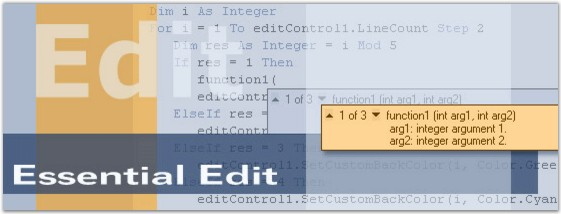

::: {style="DISPLAY: none"}
{#d2h_url_template}{#d2h_package_url style="WIDTH: 0px; DISPLAY: none; HEIGHT: 0px"}
:::

::::: {#nsbanner .d2h_main_nsbanner style="BORDER-BOTTOM: #999999 1px solid; POSITION: relative; PADDING-BOTTOM: 0px; BACKGROUND-COLOR: transparent; PADDING-LEFT: 0px; PADDING-RIGHT: 0px; DISPLAY: none; BORDER-TOP: #999999 1px solid; PADDING-TOP: 0px; LEFT: 0px"}
:::: {#TitleRow .d2h_main_titlerow style="PADDING-BOTTOM: 4px; BACKGROUND-COLOR: transparent; PADDING-LEFT: 22px; WIDTH: 100%; PADDING-RIGHT: 10px; DISPLAY: none; PADDING-TOP: 4px"}
::: {#ienav .d2h_main_ienav style="DISPLAY: none"}
{#D2HPrevious .D2HPreviousEnabled}  {#D2HNext .D2HNextEnabled}
:::
::::
:::::

::::: {#nstext .d2h_main_nstext style="PADDING-BOTTOM: 10px; BACKGROUND-COLOR: transparent; PADDING-LEFT: 22px; PADDING-RIGHT: 10px; HEIGHT: 100%; OVERFLOW: auto; PADDING-TOP: 5px" hasuserbackground="true" valign="bottom"}
::: {#d2h_breadcrumbs .d2h_breadcrumbs}
[Essential Studio User Guide Documentation](ms-xhelp:///?Id=12457748-09e3-4d74-a240-8e049cedf030){.d2h_breadcrumbsNormal}[ \> ]{.d2h_breadcrumbsLinkSeparator}[User Interface Edition](ms-xhelp:///?Id=c29296b7-531c-413b-a0ec-488ca1f7f669){.d2h_breadcrumbsNormal}[ \> ]{.d2h_breadcrumbsLinkSeparator}[Essential Windows](ms-xhelp:///?Id=e60759d8-47a4-4570-9d7a-16a68d63f2ea){.d2h_breadcrumbsNormal}[ \> ]{.d2h_breadcrumbsLinkSeparator}[Essential Edit]{.d2h_breadcrumbsContentsOnly}[ \> ]{.d2h_breadcrumbsLinkSeparator}[Overview](ms-xhelp:///?Id=96917226-23c2-4b07-af1f-9aed5b1cef90){.d2h_breadcrumbsNormal}
:::

## Introduction To Essential Edit {#introduction-to-essential-edit style="tab-stops: 0pt"}

[]{style="FONT-FAMILY: 'Trebuchet MS','sans-serif'; COLOR: #15428b; FONT-SIZE: 9pt"} 

Essential Edit is a 100% Native .NET UI library that provides a powerful syntax coloring UI for building modern Windows applications using the Microsoft .NET framework. Our control and framework packages can be used in any .NET environment including C#, VB.NET and managed C++.

 

Essential Edit will greatly benefit those end users who wants to build a .NET application with syntax highlighting and code coloring for general text editing purposes.

 

Our Edit control can be used in the Visual Studio Editor as it is featured with syntax coloring, code grouping, outlining tooltips etc., similar to Visual Studio.

[]{style="FONT-FAMILY: 'Trebuchet MS','sans-serif'; COLOR: #15428b; FONT-SIZE: 9pt"} 

Figure 1: Essential Edit[]{style="FONT-FAMILY: 'Trebuchet MS','sans-serif'; COLOR: #15428b"}

[]{style="FONT-FAMILY: 'Trebuchet MS','sans-serif'; COLOR: #15428b; FONT-SIZE: 9pt"} 

Key Features

**[]{style="FONT-FAMILY: 'Trebuchet MS','sans-serif'; COLOR: #15428b; FONT-SIZE: 9pt"}** 

Some of the key features are listed below.

[]{style="FONT-FAMILY: 'Trebuchet MS','sans-serif'; COLOR: #15428b; FONT-SIZE: 9pt"} 

[·      ]{style="FONT-FAMILY: Symbol"}Essential Edit offers fully configurable syntax highlighting and code coloring for general text editing purposes which greatly improves the readability of any text.

[·      ]{style="FONT-FAMILY: Symbol"}Essential Edit offers advanced text indentation support which can be customized to suit the requirements of the user.

[·      ]{style="FONT-FAMILY: Symbol"}Essential Edit supports multiple levels of Undo / Redo, whereas the default Edit control in Windows Forms supports just one level of Undo / Redo.

[·      ]{style="FONT-FAMILY: Symbol"}Autocomplete feature auto-completes the rest of the member name once the user has entered enough characters to distinguish it, and AutoReplace Trigger feature automatically corrects some of the known predefined typing errors.

[·      ]{style="FONT-FAMILY: Symbol"}Edit supports clipboard operations for editing the text.

[·      ]{style="FONT-FAMILY: Symbol"}Essential Edit enables users to locate a section or a line of a document, using the Bookmarks and Custom Indicators features like in Visual Studio.

[·      ]{style="FONT-FAMILY: Symbol"}Edit provides support for Word Wrap. You can also set images for Line and Point Wrapping.

[·      ]{style="FONT-FAMILY: Symbol"}Essential Edit provides Visual Studio like support for collapsing and expanding blocks of code through the use of collapsers (plus-minus buttons).

[·      ]{style="FONT-FAMILY: Symbol"}Sections of code which form the outlining blocks can be specified using the Configuration Settings. Edit control defines different brackets for highlighting different languages.

[·      ]{style="FONT-FAMILY: Symbol"}Essential Edit provides Printing support. It includes printing options to print a page, print a selection, print an entire document, print a current page and print only a selected set of pages.

[·      ]{style="FONT-FAMILY: Symbol"}In the age of globalization the markets for all goods become more and more internationalized, enforcing the need to provide information in a variety of languages. The edit control supports complete localization to any desired language of all the dialogs and strings associated with it.

[·      ]{style="FONT-FAMILY: Symbol"}Edit control offers support for text navigation at character, word, line, page or entire document levels. It also offers support for text manipulation operations and multiline insertion operations.

[·      ]{style="FONT-FAMILY: Symbol"}Edit supports interactive features like outlining ToolTip, which is built-in and appears automatically when the mouse pointer is placed over the collapsed block of text.

[]{style="FONT-FAMILY: 'Trebuchet MS','sans-serif'; COLOR: #15428b; FONT-SIZE: 9pt"} 

User Guide Organization

[]{style="FONT-FAMILY: 'Trebuchet MS','sans-serif'; COLOR: #15428b; FONT-SIZE: 9pt"} 

The product comes with numerous samples as well as an extensive documentation to guide you. This User Guide provides detailed information on the features and functionalities of the Edit control. It is organized into the following sections:

[]{style="FONT-FAMILY: 'Trebuchet MS','sans-serif'; COLOR: #15428b; FONT-SIZE: 9pt"} 

[·      ]{style="FONT-FAMILY: Symbol"}**Overview**-This section gives a brief introduction to our product and its key features.

[·      ]{style="FONT-FAMILY: Symbol"}**Installation and Deployment**-This section elaborates on the install location of the samples, license etc.

[·      ]{style="FONT-FAMILY: Symbol"}**What\'s New**-This section lists the new features implemented for every release.

[·      ]{style="FONT-FAMILY: Symbol"}**Getting Started**-This section guides you on getting started with Windows application, controls etc.

[·      ]{style="FONT-FAMILY: Symbol"}**Concepts and Features**-The features of the Edit control is illustrated with use case scenarios, code examples and screen shots under this section.

[·      ]{style="FONT-FAMILY: Symbol"}**Frequently Asked Questions**-This section illustrates the solutions for various task-based queries about Essential Edit.

[]{style="FONT-FAMILY: 'Trebuchet MS','sans-serif'; COLOR: #15428b; FONT-SIZE: 9pt"} 

Document Conventions

[]{style="FONT-FAMILY: 'Trebuchet MS','sans-serif'; COLOR: #15428b; FONT-SIZE: 9pt"} 

The conventions listed below will help you to quickly identify the important sections of information, while using the content:

[]{style="FONT-FAMILY: 'Trebuchet MS','sans-serif'; COLOR: #15428b"} 

::: {align="center"}
  ------------------------ ------------------------------------- ---------------------------------------------------------------------------
  Convention               Icon                                  Description
  Note                     *Note:*   Represents important information
  Example                  Example                               Represents an example
  Tip                                Represents useful hints that will help you in using the controls/features
  Additional Information             Represents additional information on the topic
  ------------------------ ------------------------------------- ---------------------------------------------------------------------------
:::

 

[]{#p2} 

[]{#related-topics}
:::::
