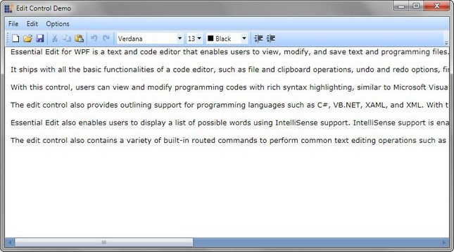

::: {style="DISPLAY: none"}
{#d2h_url_template}{#d2h_package_url style="WIDTH: 0px; DISPLAY: none; HEIGHT: 0px"}
:::

::::: {#nsbanner .d2h_main_nsbanner style="BORDER-BOTTOM: #999999 1px solid; POSITION: relative; PADDING-BOTTOM: 0px; BACKGROUND-COLOR: transparent; PADDING-LEFT: 0px; PADDING-RIGHT: 0px; DISPLAY: none; BORDER-TOP: #999999 1px solid; PADDING-TOP: 0px; LEFT: 0px"}
:::: {#TitleRow .d2h_main_titlerow style="PADDING-BOTTOM: 4px; BACKGROUND-COLOR: transparent; PADDING-LEFT: 22px; WIDTH: 100%; PADDING-RIGHT: 10px; DISPLAY: none; PADDING-TOP: 4px"}
::: {#ienav .d2h_main_ienav style="DISPLAY: none"}
{#D2HPrevious .D2HPreviousEnabled}  {#D2HNext .D2HNextEnabled}
:::
::::
:::::

::::: {#nstext .d2h_main_nstext style="PADDING-BOTTOM: 10px; BACKGROUND-COLOR: transparent; PADDING-LEFT: 22px; PADDING-RIGHT: 10px; HEIGHT: 100%; OVERFLOW: auto; PADDING-TOP: 5px" hasuserbackground="true" valign="bottom"}
::: {#d2h_breadcrumbs .d2h_breadcrumbs}
[Essential Studio User Guide Documentation](ms-xhelp:///?Id=12457748-09e3-4d74-a240-8e049cedf030){.d2h_breadcrumbsNormal}[ \> ]{.d2h_breadcrumbsLinkSeparator}[User Interface Edition](ms-xhelp:///?Id=c29296b7-531c-413b-a0ec-488ca1f7f669){.d2h_breadcrumbsNormal}[ \> ]{.d2h_breadcrumbsLinkSeparator}[Essential WPF](ms-xhelp:///?Id=7f4f82c5-151c-4262-94d0-75c4626c77bc){.d2h_breadcrumbsNormal}[ \> ]{.d2h_breadcrumbsLinkSeparator}[Essential Edit]{.d2h_breadcrumbsContentsOnly}[ \> ]{.d2h_breadcrumbsLinkSeparator}[Overview](ms-xhelp:///?Id=4187848f-d253-476a-b4f1-669f8d55fffd){.d2h_breadcrumbsNormal}
:::

## Introduction to Essential Edit WPF {#introduction-to-essential-edit-wpf style="tab-stops: 0pt"}

Essential Edit WPF is an easy to use and extensible control that can be viewed as an advanced notepad with formatting, code editing and some more additional features. It serves the users who want to view, edit and save the following-

[·      ]{style="FONT-FAMILY: Symbol"}Large formatted text

[·      ]{style="FONT-FAMILY: Symbol"}Code

[·      ]{style="FONT-FAMILY: Symbol"}Data from the database

[]{style="FONT-FAMILY: 'Trebuchet MS','sans-serif'; COLOR: #15428b; FONT-SIZE: 9pt"} 

Essential Edit WPF lets the users to create interactive code editor applications with its unique feature set. It\'s fully functional context menu can be used to perform all basic editing operations such as select all, cut, copy, paste, undo, redo and so on.

[]{style="FONT-FAMILY: 'Trebuchet MS','sans-serif'; COLOR: #15428b; FONT-SIZE: 9pt"} 

The following image shows an example of Essential Edit control:

[]{style="FONT-FAMILY: 'Trebuchet MS','sans-serif'; COLOR: #15428b; FONT-SIZE: 9pt"} 

Figure 1: Text Editor

[]{style="FONT-FAMILY: 'Trebuchet MS','sans-serif'; COLOR: #15428b; FONT-SIZE: 9pt"} 

Real World Scenarios

The Essential Edit WPF control is a high performance control for creating Text and Language Editors. User can customize their page with the font, font color, background and size properties. It has more features like context menu, expand and collapse functionality, and syntax highlight functionality for C#, XAML and XML language patterns. Some of the real world scenarios of Essential Edit control for WPF are as follows:

[]{style="FONT-FAMILY: 'Trebuchet MS','sans-serif'; COLOR: #15428b; FONT-SIZE: 9pt"} 

[·      ]{style="FONT-FAMILY: Symbol"}Text editor application like **Notepad**.

[·      ]{style="FONT-FAMILY: Symbol"}Code Editor applications like **Visual Studio 2008 IDE**.

[]{style="FONT-FAMILY: 'Trebuchet MS','sans-serif'; COLOR: #15428b; FONT-SIZE: 9pt"} 

Key Features

The following are the key features of Essential Edit WPF:

[]{style="FONT-FAMILY: 'Trebuchet MS','sans-serif'; COLOR: #15428b; FONT-SIZE: 9pt"} 

[·      ]{style="FONT-FAMILY: Symbol"}**Basic Editing**---Essential Edit WPF enables the users to modify edit text documents and source code files. It facilitates the users to perform all edit operations such as Select, Cut, Copy, Paste, Select All, Delete and so on.

[·      ]{style="FONT-FAMILY: Symbol"}**File Support**---With the File support, users will be able to open supported file types and make necessary changes and save them back to the same or different file types. It supports all file operations like create new, open or save files.

[·      ]{style="FONT-FAMILY: Symbol"}**Syntax highlighting support**---Syntax highlighting feature highlights the content in the edit control based on the language selected. Essential Edit provides built-in support for programming languages like C#, Visual Basic, XAML and XML.

[·      ]{style="FONT-FAMILY: Symbol"}**Custom Language support**---Essential Edit WPF extends support for user defined language configurations. Custom language configurations can be created easily and applied to the content in the edit control.

[·      ]{style="FONT-FAMILY: Symbol"}**Undo and Redo support**---With the undo and redo support, users can cancel or apply the changes done to the content in the order in which they were performed (LIFO). Undo and Redo can be performed using the built-in context menu or using keyboard shortcuts.

[·      ]{style="FONT-FAMILY: Symbol"}**Line Number Support**---Line numbers for the text in the edit control can be displayed for easy reference with the ability to enable or disable this feature.

[·      ]{style="FONT-FAMILY: Symbol"}**Expand or Collapse support**---Expand or collapse support facilitates the users to outline the programming codes and enables the users to expand or collapse the text within region or module to enhance the readability of the text in the control.

[·      ]{style="FONT-FAMILY: Symbol"}**Read Only mode**---Essential Edit WPF can be used to display contents of a text or source codes files and prevent the users from editing the contents of the file.

[·      ]{style="FONT-FAMILY: Symbol"}**Editing Commands**---Essential Edit WPF ships with built-in RoutedUICommands for performing various operations in the edit control externally using command bindings.

[·      ]{style="FONT-FAMILY: Symbol"}**Fully functional Context menu**---Edit WPF contains a built-in context menu with options to perform editing operations like Undo, Redo, Cut, Copy, Paste, Select All and so on. It also enables the users to enable or disable the built-in context menu.

[]{style="FONT-FAMILY: 'Trebuchet MS','sans-serif'; COLOR: #15428b; FONT-SIZE: 9pt"} 

User Guide Organization

The product comes with numerous samples as well as an extensive documentation to guide you. This User Guide provides detailed information on the features and functionalities of the Essential Diagram for WPF. It is organized into the following sections:

[·      ]{style="FONT-FAMILY: Symbol"}**Overview**---This section gives a brief introduction to the product and its key features.

[·      ]{style="FONT-FAMILY: Symbol"}**Installation and Deployment**---This section elaborates on the install location of the samples, license etc.

[·      ]{style="FONT-FAMILY: Symbol"}**What\'s New**---This section lists the new features implemented for every release.

[·      ]{style="FONT-FAMILY: Symbol"}**Getting Started**---This section guides you on getting started with WPF application, controls etc.

[·      ]{style="FONT-FAMILY: Symbol"}**Concepts and Features**---The features of individual controls are illustrated with use case scenarios, code examples and screen shots under this section.

[]{style="FONT-FAMILY: 'Trebuchet MS','sans-serif'; COLOR: #15428b; FONT-SIZE: 9pt"} 

Document Conventions[ ]{style="FONT-SIZE: 9pt"}

The conventions below will help you to quickly identify the important sections of information, while using the content:

[]{style="FONT-FAMILY: 'Trebuchet MS','sans-serif'; COLOR: #15428b; FONT-SIZE: 9pt"} 

Table 1: Document Conventions

::: {align="center"}
  ------------------------ ------------------------------------------ ---------------------------------------------------------------------------------
  Convention               Icon                                       Description of the Icon
  Note                      ***Note:***   Represents important information.
  Example                  **Example:**                               Represents an example.
  Tip                                     Represents useful hints, that will help you in using the controls and features.
  Additional information                  Represents additional information on the corresponding topic.
  ------------------------ ------------------------------------------ ---------------------------------------------------------------------------------
:::

[]{style="FONT-FAMILY: 'Trebuchet MS','sans-serif'; COLOR: red; FONT-SIZE: 9pt"} 

 

[]{#related-topics}
:::::
