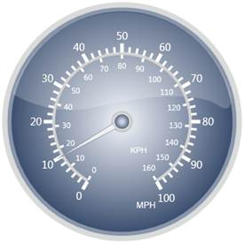
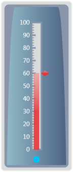
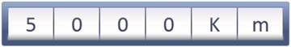

::: {style="DISPLAY: none"}
{#d2h_url_template}{#d2h_package_url style="WIDTH: 0px; DISPLAY: none; HEIGHT: 0px"}
:::

::::: {#nsbanner .d2h_main_nsbanner style="BORDER-BOTTOM: #999999 1px solid; POSITION: relative; PADDING-BOTTOM: 0px; BACKGROUND-COLOR: transparent; PADDING-LEFT: 0px; PADDING-RIGHT: 0px; DISPLAY: none; BORDER-TOP: #999999 1px solid; PADDING-TOP: 0px; LEFT: 0px"}
:::: {#TitleRow .d2h_main_titlerow style="PADDING-BOTTOM: 4px; BACKGROUND-COLOR: transparent; PADDING-LEFT: 22px; WIDTH: 100%; PADDING-RIGHT: 10px; DISPLAY: none; PADDING-TOP: 4px"}
::: {#ienav .d2h_main_ienav style="DISPLAY: none"}
{#D2HPrevious .D2HPreviousEnabled}  {#D2HNext .D2HNextEnabled}
:::
::::
:::::

:::: {#nstext .d2h_main_nstext style="PADDING-BOTTOM: 10px; BACKGROUND-COLOR: transparent; PADDING-LEFT: 22px; PADDING-RIGHT: 10px; HEIGHT: 100%; OVERFLOW: auto; PADDING-TOP: 5px" hasuserbackground="true" valign="bottom"}
::: {#d2h_breadcrumbs .d2h_breadcrumbs}
[Essential Studio User Guide Documentation](ms-xhelp:///?Id=12457748-09e3-4d74-a240-8e049cedf030){.d2h_breadcrumbsNormal}[ \> ]{.d2h_breadcrumbsLinkSeparator}[User Interface Edition](ms-xhelp:///?Id=c29296b7-531c-413b-a0ec-488ca1f7f669){.d2h_breadcrumbsNormal}[ \> ]{.d2h_breadcrumbsLinkSeparator}[Essential ASP.NET MVC](ms-xhelp:///?Id=4b14e7d1-65c4-4f67-b1aa-2c37709905a5){.d2h_breadcrumbsNormal}[ \> ]{.d2h_breadcrumbsLinkSeparator}[Essential Gauge]{.d2h_breadcrumbsContentsOnly}[ \> ]{.d2h_breadcrumbsLinkSeparator}[Overview](ms-xhelp:///?Id=628d8c5a-8055-4e92-933b-86f1f75b727f){.d2h_breadcrumbsNormal}
:::

## Introduction to Essential Gauge for ASP.NET MVC {#introduction-to-essential-gauge-for-asp.net-mvc style="tab-stops: 0pt"}

 

Essential  MVC is a data visualization tool that can be used to display several data points or data ranges in a concise, precise and compact area. The data displayed by the control can be quickly understood. Syncfusion MVC library enables you to configure MVC  through C# codes and through .aspx codes. The  control comes with sophisticated customization support. Essential  MVC is intended for developers who would want to use it in their MVC applications. It helps indicate the current value from a range of values. It can be used to create sophisticated dashboards, clocks, industrial equipment, medical equipment and so on. It evaluates the values of the scales and presents it on a  scale. It enables you to quickly build high quality dashboards, process controls, gadgets and clocks. 

 

Use Case Scenario

 

The following are a few examples of where Essential Gauge can be applied and used.

1.   Circular Gauge

Circular Gauge can be used in many different ways in an application. The best and familiar example of a circular gauge  is a Speedometer. The speedometer can be designed to be placed in a racing game application, denoting the speed of a vehicle.

 

Figure 1: Speedometer

**[]{style="FONT-FAMILY: 'Calibri','sans-serif'"}** 

The above image illustrates the design of a simple Speedometer. Circular Gauge can even accommodate multiple scales and multiple pointers at the same time. A more complex Speedometer can also be designed by using Circular Gauge.

 

2.   Linear Gauge

Linear Gauge can be imagined as a linear form of Circular Gauge. There are various applications in which Linear Gauge can be used. One such real world application of Linear Gauge is Volume control, which is shown below.

 

Figure 2: Linear Gauge

3.   Digital Gauge

Digital Gauges are used to display alpha-numeric values in a virtual digital display. It can be used in many ways depending on the requirements. Digital Gauge can be used to display the current time in a virtual digital clock. The digital clock preceded by a text, which reads \"8:30 pm\" is shown in the following figure:

 

*[]{style="FONT-FAMILY: 'Verdana','sans-serif'"}*

Figure 3: Digital Gauge

**[]{style="FONT-FAMILY: 'Calibri','sans-serif'; FONT-SIZE: 11pt"}** 

4.   Rolling Gauge

Rolling Gauges are used to display values in segments with rolling effect. There are various applications in which Rolling Gauge can be used. One such real world application of Rolling Gauge is in Speedometer to display the number of kilometers travelled.

 

[]{style="FONT-FAMILY: 'Calibri','sans-serif'"}

Figure 4: Rolling Gauge

[                                                                                                                                                ]{style="FONT-FAMILY: 'Calibri','sans-serif'; FONT-SIZE: 11pt"}

Key Features

Some important features of Gauge MVC are listed below:

[]{style="FONT-FAMILY: 'Calibri','sans-serif'; COLOR: black"} 

[·      ]{style="FONT-FAMILY: Symbol"}Multiple Scales and Pointers for Circular and Linear Gauge

[·      ]{style="FONT-FAMILY: Symbol"}Multiple Ranges support for Circular gauge

[·      ]{style="FONT-FAMILY: Symbol"}Labels and ticks support for Circular and Linear Gauge

[·      ]{style="FONT-FAMILY: Symbol"}State Indicators  for Circular and Linear Gauge

[·      ]{style="FONT-FAMILY: Symbol"}Interaction support and Animations for Circular and Linear gauge

[·      ]{style="FONT-FAMILY: Symbol"}14 Built-in Skins for all gauge types

[·      ]{style="FONT-FAMILY: Symbol"}Vertical and Horizontal orientations for Linear Gauge

[·      ]{style="FONT-FAMILY: Symbol"}Clockwise and Anticlockwise rolling animations for Rolling Gauge

[·      ]{style="FONT-FAMILY: Symbol"}Server and Client Side export functionality for all gauge types

[·      ]{style="FONT-FAMILY: Symbol"}Easy segment customization in Digital and Rolling Gauge to specify segment width, spacing between segments and so on

[·      ]{style="FONT-FAMILY: Symbol"}Complete View customization support

 

List of Controls:

 

The following are the list of Essential Gauge MVC controls:

[]{style="FONT-FAMILY: 'Calibri','sans-serif'"} 

[·      ]{style="FONT-FAMILY: Symbol"}Circular Gauge

[·      ]{style="FONT-FAMILY: Symbol"}Linear Gauge

[·      ]{style="FONT-FAMILY: Symbol"}Digital Gauge

[·      ]{style="FONT-FAMILY: Symbol"}Rolling Gauge

[]{#related-topics}
::::
